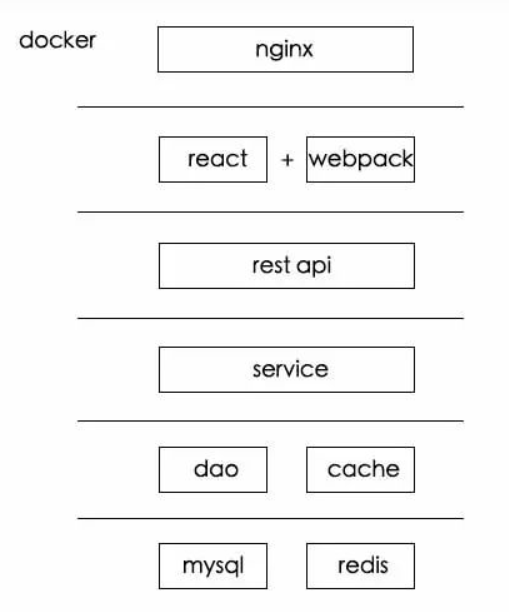

# B+树 帅地
# 一般的项目的技术栈，或者说项目结构

docker：项目容器 加 部署；
react + webpack：前端框架和打包工具
rest api: rest风格的api用来中转请求到后端
Service：业务逻辑
dao和cache：mysql和cache的控制层

**MySQL发现查询比较慢，是什么原因？**
1. 没有索引
1. 因为事务冲突MySQL的优化器选错了索引；
1. 当前流量大，本身就慢

我只能想到这三个

# 树的数据结构相关
平衡二叉树有很多文章都是为了他的平衡性做的文章

B树是一种**多路搜索树（可以拥有大于二个孩子结点）**
有N路的B树都多能有N个孩子结点。

**设计成多路的原因**
降低树的高度，增加效率。

路的条数过多会退化成**有序数组**

B树的应用场景：文件的索引系统
为什么？
> 文件系统和数据库的索引都是存在硬盘上的，并且如果数据量大的话，不一定能一次性加载到内存中。
> 如果使用B+树的话，**每次载入一个结点到内存就可以**

B+树：
B+树在B树的基础上改造，**数据都在叶子结点上**，并且**叶子结点直接加上了链表指针**

B+树通常作为数据库的索引结构，这是因为：
数据库的多条查询的请求比较多；
> 如果是多条的话，B树需要做局部的中序遍历，可能要跨层访问。而B+树由于**所有数据都在叶子结点**，不用跨层，同时由于**有链表结构**，只需要找到首尾，通过链表就能把所有数据取出来了。

**为什么不用hash而是B+树？**
> 这和业务场景有关。如果只选一个数据，那确实是hash更快。但是数据库中经常会选择多条，这时候由于B+树索引有序，并且又有链表相连，它的查询效率比hash就快很多了。
> 而且数据库中的索引一般是在磁盘上，数据量大的情况可能无法一次装入内存，B+树的设计可以允许数据分批加载，同时树的高度较低，提高查找效率。

清晰明了，不复杂，最重要的是不啰嗦，写的很好：
[为什么要使用B+树作为数据库的索引结构？](https://www.iamshuaidi.com/139.html)