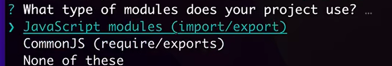

# BilibiliEvolve开发
ESlint是用于检查JavaScript的工具，相当于错误检查。
它的检查一般分为 **语法检查**和 **发现错误** 和**代码风格**三种。
第三种最为严格，所以一般不会使用。


# JS的模块化方式
似乎就是导包和引包的方式，有一些区别。


上面这个就是使用yarn初始化一个项目的时候，选择模块话管理的方式；
第一个是在浏览器环境下；
第二个是在nodejs的环境下；
第三个不使用。

# 整个项目的可以成为油猴脚本的实现原理
首先油猴脚本是直接运行js代码；
所以这里实际上是模块化开发，然后编译成js代码；

实际上你开发的功能，最终都会变成油猴的js的代码。

其实就是对下面这一段话的解释：

> 需要说明的是, 脚本本体和功能是分开的两个项目. 本体的代码在 src/ 下, 开发时产生 dist/bilibili-evolved.dev.user.js 文件. 功能的代码位于 registry/ 下, 开发时在 registry/dist/ 下产生文件.


# 调试功能
chrome和firefox的不一样。方式不一样，代码不用变。

vscode可以根据脚本执行任务。实际应该就是执行cmd命令。
在.vscode文件夹里面，有一个task.json文件中包含这些任务的信息。

应该就是对这句话的解释：
VS Code 中运行 启动开发服务 dev-server 任务, 会在项目的 dist/ 文件夹下生成一个开发用的脚本 dist/bilibili-evolved.dev.user.js.

```json
"tasks": [
    {
      "type": "shell",
      "command": "pnpm ts-node ./dev-tools/dev-server/index.ts",
      "group": "build",
      "problemMatcher": [],
      "label": "启动开发服务 dev-server"
    },
]
```
执行这个command里面的内容就可以。
搞完上面这些步骤之后就会显示已经连接。

就是按照文档里面的怎么去调试来操作。


