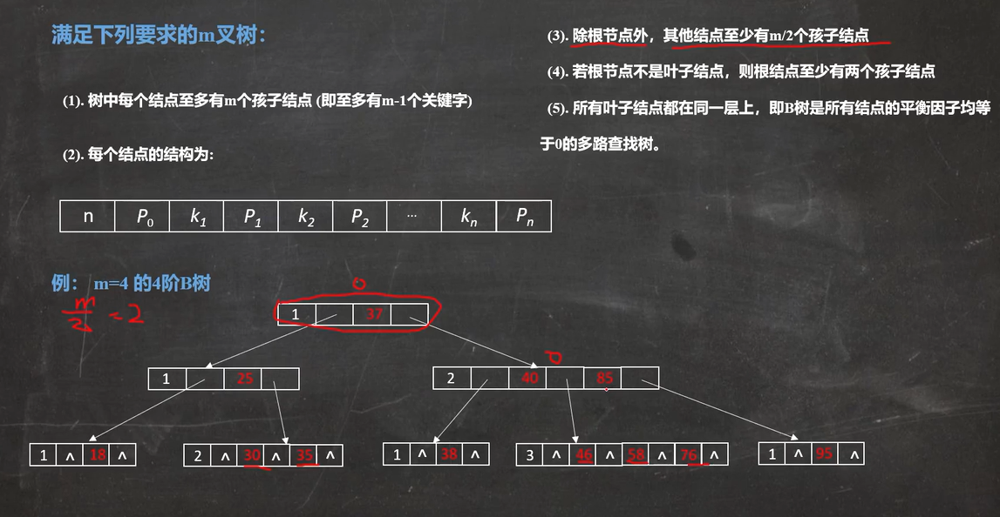

# B树和文件系统索引的设计
# 引入
## 各类数据结构做索引的优缺点
1. 顺序存储（数组），可以做**范围查询**，而且实现简单；
1. 使用hash：哈希函数的特性使得他做**等值查询**的性能优秀，但是因为无序所以**不能做范围查询**，而且因为存在hash冲突，极端会退化成顺序；
1. 树相关的结构：使用平衡搜索树可以有效的提升查询速度（logn），但是如果数据量大的时候它维护平衡的代价会变得很高（因为平衡因子，叶子节点的差值不能大于1）
1. 所以这个时候使用 红黑树会更好。 红黑树还有许多其他的特性；
1. 二叉树在面对大数据量的时候会力不从心，因为二叉的原因所以**深度会变得很高**
1. 由此引出**B树**：多路查询树

# B树的基本特性
满足一下条件的树是 B树：

## 引出B+树
查找。
因为B树是基于 AVL（平衡搜索树）进行优化的，所以在查找方面的**原理其实是一样的。**

但是如果去回顾一次在 磁盘中，使用B树进行索引定位到文件的过程可以得出一个结论：
**非叶子结点因为携带数据会占用大量的空间，而查找的时候因为你不需要这些数据所以效率不高**

因此引出 B+树：
只用叶子结点存储数据，非叶子结点只存储 指针和主键的信息。
换句话说：B+树可以存储的数据 比B树的多得多。

# B树的删除
**首先说一个**
我之前看过 [木子喵](https://space.bilibili.com/27735697/)的红黑树的视频，里面首先介绍的就是四阶B树;
通过今天系统的学习我知道为什么 四阶B树其实是这个样子了。

**B树 Val的删除和 二叉树的完全不同！**
因为 二叉树的结点只有一个 Val，所以**删除数据就等于删除结点**
但是B树一个结点有多个数据

待补完，因为B树的删除有点复杂，**情况比较多**
