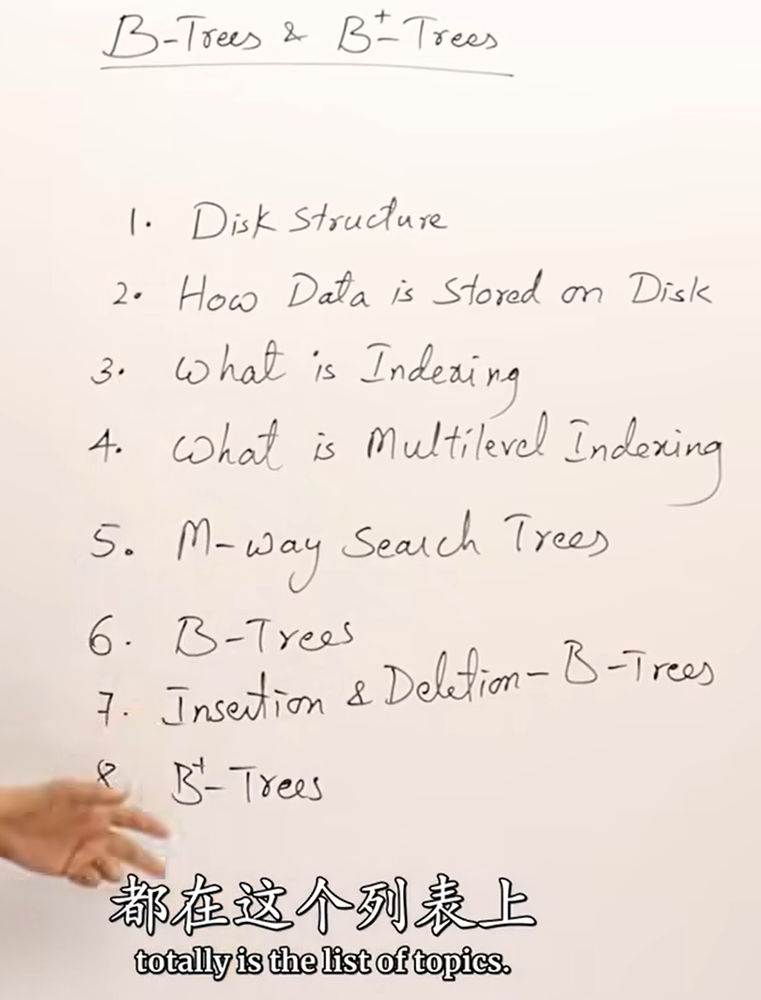
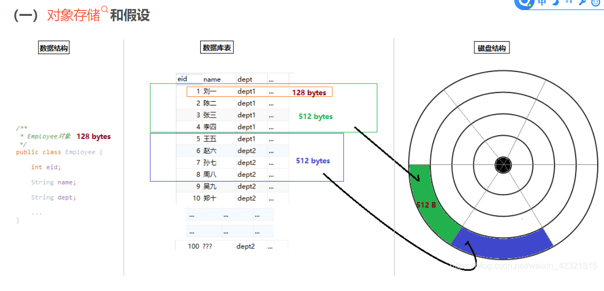
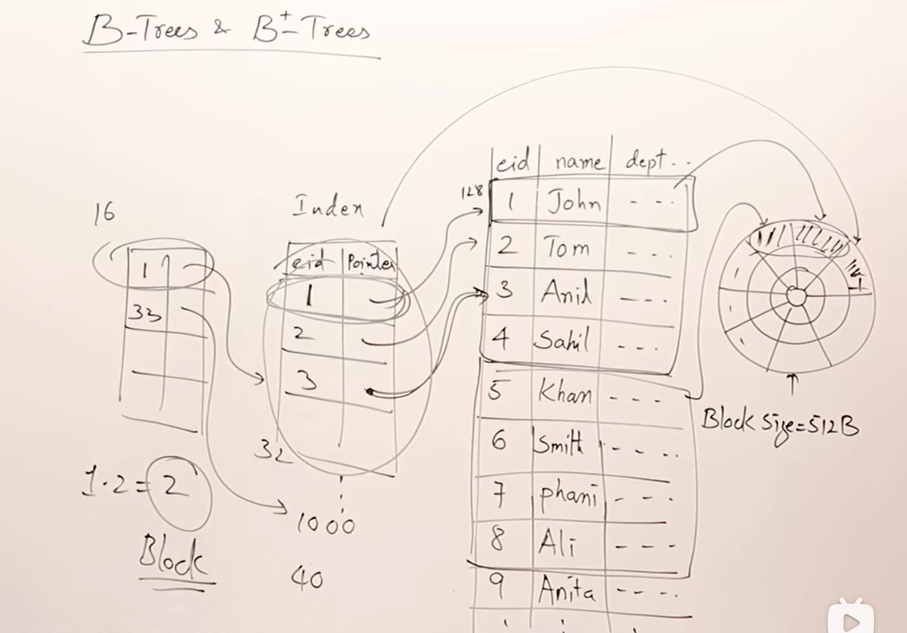

# B树系列 油管视频
想要学好B+树就要了解一下的知识

这个是别人的笔记，如果写的不清楚，直接去看这个的
[B树和B+树](https://blog.csdn.net/weixin_42321815/article/details/116887483)
那既然如此别人整理的很清楚了那我就写我得到的结论吧；

# Disk Structure （硬盘结构）
这里应该是**机械硬盘的结构**
**轨道**和**扇形区域**就好比地球的经度和维度，通过这两个，你可以确认一个**扇区**；
在内部，通过偏移量，就可以得到具体到**字节单位**的内存地址
这个可能很重要，cpp是不是这种粒度的操作内存我不清楚了

如果上面三个重要的概念你看懂了的话：
通过旋转，可以切换扇区；
通过磁头的移动，可以切换轨道

# How Data is Stored on Disk（数据怎么被存储在磁盘中）
你的数据库表的行数据一般是这么存储的：

# What is Indexing（索引）
一般如果你进行查询操作；那么在物理的层面上你要实际的把这些物理块都遍历一遍；
如果，你建立索引，只存储一个字段的数据和他对应记录的位置（通常就是主键），这样**一个内存块可以包含的条目数目就增多**，你就可以**减少遍历内存块的次数**（效率和读取多少个内存块有关）
这样你再次进行查询操作的时候，需要花费的代价就是： 遍历索引加一个块，这就是索引加快速度的秘密。

这里有一个概念叫做**密集索引**，后面细说

# What is Multilered Indexing（多级索引）
随着你的表的扩大，你的**索引也必定会扩大**，那么，**可不可以在索引上加索引呢？**
答案是可以，这就是所谓的多级索引。

但是！你想想，我们之前索引是怎么提速的？ 因为索引只记录一部分你要查找的数据，然后根据指针去找；
现在索引已经已经够短了，你要怎么做索引的索引？
所以现在多级索引提速的方式不一样了：一个索引指向一片索引，然后加上一个对应的地址；

现在我可以和你说：密集索引和稀疏索引了；
前者的索引和记录是一一对应的，而后面的则是一条对应多条记录。
- 缩小字段达到缩减大小的目的：密集索引
- 一个索引指向多个记录：稀疏索引

怕你忘了，**索引是通过记录指针来完成提速的**
本质就是空间换时间

然后是你看看这个多级索引，他像什么？

猜对咯！一颗M叉树。

通常我们需要索引可以随着数据的变化进行自动更新，所以这种数据结构就用来**组织索引**了。

# M-ways Search Trees
现在我算是知道 key的意思了；
就是在m叉树里面进行查询的时候 根据key决定去找哪个子节点

这样，一个初步的索引的数据结构就完成了。根据key去查找对应数据块；

不过他有一个问题，他不会自动维护，所以有可能 退化成**线性搜索** （就是所谓的平衡树的问题）

因此，如果对多叉树进行改造，现在就可以形成所谓的B树。

# B树
B树满足这几个要求：
1. 因为要控制m叉树的高度，所以**结点至少有（M➗2）个key了才能去添加新的结点**。就是这样来控制高度的
1. 但是root不能这样，所以对root做特殊处理： root至少得有一个key，也就是两个结点
1. 第三，所有的叶子结点必须在同一层；**虽然我不知道为什么**
1. 创造一个B树必须**自底向上**创建；我个人的理解是：现有数据，后有索引，再有多级索引，他们的顺序是自底向上的。

那么B树到底怎么实现呢？
我没有完全搞懂这个过程，所以只大概说一遍，妮可以看这个网站对应的数据结构一般是怎么crud的：[Data Structure Visualizations 数据结构可视化](https://www.cs.usfca.edu/~galles/visualization/Algorithms.html)

1. 如果有结点里面有空位置，那就直接存进去；
1. 如果位置不够， 那就把结点拆分成两个，把原先的结点重新排序， 中间位置的一个结点上升至父节点，然后左边的去一个结点，右边去另一个结点
1. 记得每一个结点里面**要有记录指针**
删除应该也差不多，不过我不懂

总结： 一个B树的结点通常要有： 
Key, ChildPointer and RecordPointer

# B plus Trees
对于B树，现在**记录指针**全在叶子结点上，并且形成一个链表（构成密集索引）
也就是我越来非叶子结点上的记录指针现在都在叶子结点上。
