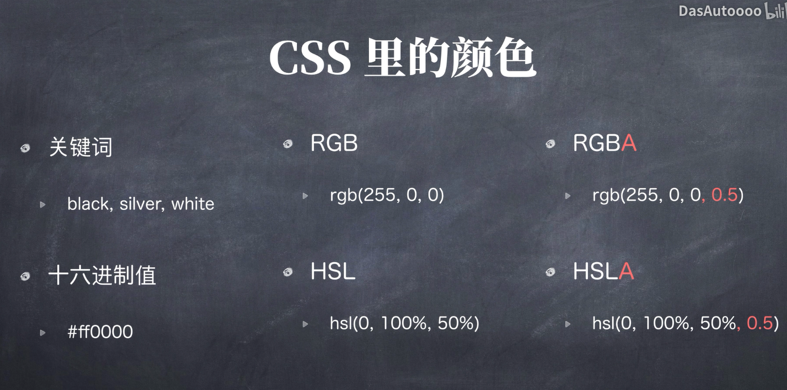
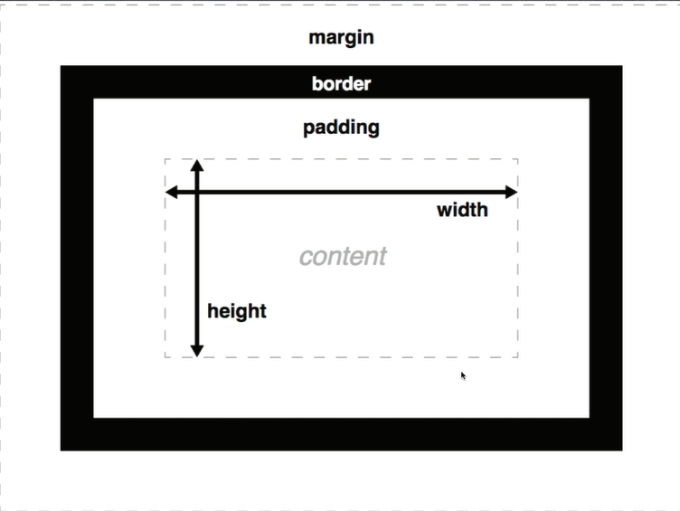

# CSS课程
来自一个哔站的教程。
# 添加CSS的方式
1. 引入外部样式表：通过link标签引入css文件；
1. 内部：写在style标签中；
1. 内联：仅仅影响一个元素，在标签内部的style属性内部添加。不推荐使用这种方式；不好维护而且

学习web可以通过网站（Mozilla的官方教程）
[Mozilla的官方教程](https://developer.mozilla.org/zh-CN/docs/Learn/CSS/Introduction_to_CSS/Selectors)
来学习Web开发的相关内容。

css中指定颜色包含多种方式：


其中HSL是缩写（类似RGB）：色相、饱和度、亮度
H色差：范围在[0, 360]之间，似乎是在一个颜色的图谱里面选择颜色；
S饱和度：就是说的那个饱和度。饱和度越高色彩越鲜艳。
L亮度：亮度越高越接近白色。

# 字体
字体的内容可以衍生得非常的广，具体的看Mozilla的那个教程。
这里知道设置字体以及相关的属性就行；

具体的：
font-family可以设置字体族；一个字体**包含多个单词**的时候需要用**双引号**包住

# 盒子模型
这里是理解布局和定位最重要的前置知识之一，所以需要好好学这里



另外外边距和其他的盒子是**共享**的，不要忘记了这一点。举例子就是：两个盒子共用一个外边距，它的值是两个盒子设置的**外边距中较大的那个**。
除了外边距之外的东西是共享，这个没有问题。

通过margin可以指定外边距

```css
p {
    margin: 10px, 5px;
}
```

# 浮动float
指定float之后，对应的元素会按照你的要求浮动在一起，**但是如果元素溢出范围**，浮动就会失效

在一个div内使用完浮动之后，需要用额外一个div（一般为.clearfix），设置清除浮动：`clear: both;`

# 子选择器
一个具体的： li:nth-chile(even) 这个就是选中奇数的子元素；

# 定位
重要的部分：
（应该是块元素）可以设置定位：
static：不使用定位，默认文档流
relative：默认文档流，但是支持定位，不脱离文档流
absolute：定位，根据非static的最近的父元素进行定位；
fixed：和absolute一样，但是根据body还是什么进行定位；并且脱离文档流
sticky：
