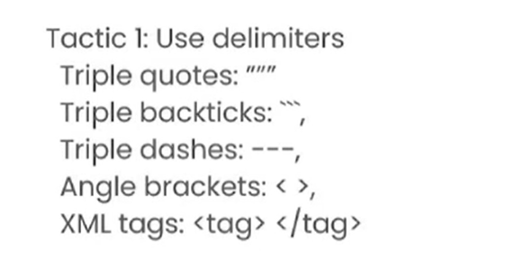

# ChatGPT提示工程师课程

# 大纲
许多人通常都是用 “大语言模型”做一些一次性的任务，例如充当搜索引擎之类的。
但是gpt的发明者似乎并不这么想。

总结就是杀鸡用牛刀。 那么AI究竟可以做些什么？

并且这些就是他们要介绍的内容：
关于 “软件开发” 的提示词的 **最佳实践**（我就是看中这四个字，所以我标记成了重点。）

LLM就是大语言模型的首字母缩写（Large Language Model）
Base LLM就是我们认知中的文字接龙的概念。

而指令集的LLM则是由基础的LLM训练出来的。
他们最明显的区别是：

提问： 巴黎的首都在哪里？

大概其实就是这么一个效果。

经过调教后的AI，才能够更好的满♂足你。

并且，ai的输出原则是：Helpful, Harmless, Honest。

我使用AI时必须要加上一系列的限定条件。

Base的LLM接近传统的搜索引擎，而现在，你更加倾向于使用更加有效的instruction LLM。

所以整个课程就是介绍 ILLM的最佳实践。

# 指南
文本是你唯一的输入。所以清晰的表达你的问题是一个非常重要的因素。

使用gpt模型的两个原则：
1. 清晰而准确的提问；
1. 给予模型时间去思考。

关于第一点，实际上大多数的时候，你都需要给ai一个尽可能详细的问题，首先 clear != short， 然后清晰而详细的输入能够带来更多清晰度和丰富的上下文。

比如说：你可以通过设置分隔符，来清除的指示不同的部分具体的作用：

分隔符可以帮助ai大概了解哪些部分是他应该知道的内容；哪些部分是你下达的指令。这很有用，在生成代码的时候。

我这里插一嘴：
这里是不是更像是使用openai提供的api的用法？更像这个。