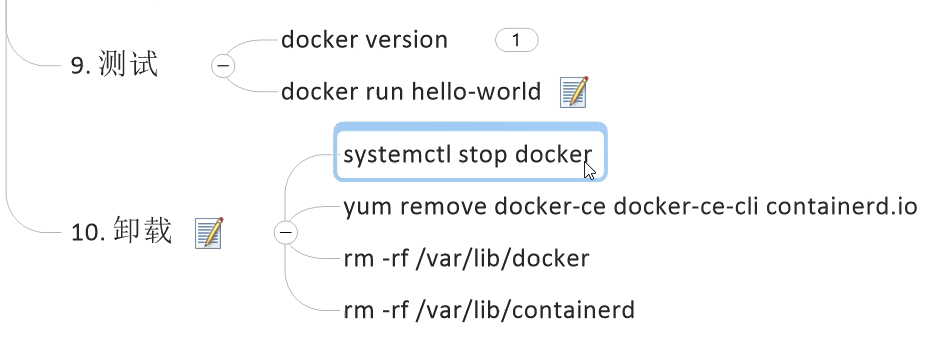

# Docker尚硅谷版本
需要的前置知识是不是有点多，本身docker是一个容器其实...
算了，那不管太多了。

# Docker的作用
Docker提供**带环境安装**，核心也是懒，为了方便。解决开发与运维的交互以及运维扩容之类的问题，都变得方便了起来。
Docker的虚拟技术是**内核级别的虚拟技术**，效率其实**也不低。**

Docker分为软件的官网以及仓库（安装docker镜像的仓库）的官网(DockerHub)

# Docker的三要素
Docker分为三个要素： 容器、镜像、仓库。
镜像是模板（镜像可以用来创建Docker容器）， 容器是实例， 仓库是存储镜像的。 
概念本身不难理解， 所以需要的时候再做笔记

Docker本身是个容器系统， 所以做得就是容器系统做的事：
有 server来处理cli的请求； engine负责具体的工作； 有net driver来负责对应的网络通信； 等等等

# Docker安装
Docker依赖于Linux内核（听说），所以我决定在我的个人服务器上安装docker。

etc目录下的redhat可以显示centos的系统版本；

uname可以打印linux的系统信息； 通过man uname查看帮助；

然后这里提一下怎么删除对应的docker的旧版本：
yum remove命令， 具体可以去视频里面或者官方文档去看；

然后通过yum安装gcc（很多软件的安装都需要这个c++依赖）

然后需要安装 yum utils：`yum install -y yum-utils`
这个软件好像是添加yum仓库用的东西； 那安装完之后就用下面的指令添加一下：
`yum-config-manager --add-repo http://mirrors.aliyun.com/docker-ce/linux/centos/docker-ce.repo`

这里没有用doc官方的，因为官方的网站在国外，所以，这里用的是国内可用的镜像地址（阿里云）；
这一步叫做设置stable镜像仓库；

安装docker引擎：
只要上面的步骤没有出现问题， 那么就可以通过下面这个命令安装docker了：

之后docker就算完成。

# 安装阿里云的镜像加速器
这个东西是一个，可以加速docker获取镜像速度的加速器，由阿里云提供；
不写其他东西了， 直接写步骤：

1. 阿里云首页
1. 控制台
1. 产品大全： 容器镜像服务
1. 镜像加速器链接
1. 根据提示拷贝到你的里面去

# Docker这种轻便的虚拟技术对比传统的虚拟机技术为什么速度更快
主要是两点原因： 
第一、传统虚拟机需要物理硬件虚拟化，而 docker可以直接调用物理机的硬件资源；

第二、传统虚拟机需要加载自己的操作系统内核， 而docker一样可以复用；

# Docker的主要命令
## 帮助启动类命令
启动、重启、关闭 docker的系统服务： systemctl start/restart/stop/status docker
设置开机启动docker服务： systemctl enable docker
docker info：查看docker信息
查看docker的帮助信息： docker --help
查看docker的具体的帮助的信息： docker command --help

## 镜像有关
images 显示所有的镜像， 通过输出一个表格； 其中比较重要的属性是 tag，表示镜像的标签版本号， 同一个仓库源**可以有多个不同的tag版本源**，比如以mysql为例， 有latest、5.7之类的；
我们默认通过仓库名：版本号来定义不同的镜像；
option：-a 列出本地所有的镜像；-q 只显示镜像的id

search 在远程库搜索， 结果也是以表头的方式展示的； automated表示是否是****自动构建的**
可以通过选项 --limit来限制镜像的数量，默认25个

pull 拉取镜像，例如 docker pull 镜像名字:tag 不带tag就是 latest。

linux可以通过命令 df -h来查看对应的空间使用情况；
对应的，docker也可以通过`docker system df`指令查看数据卷所占据的空间；

docker rmi 镜像的id 可以移除对应的镜像

docker命令的结果可以作为另一个docker命令参数的： 通过美元符号和括号可以这么使用；
例如： docker rmi -f $(docker images -q)

**docker的虚悬镜像（dangling image）是什么**：
就是仓库名和tag都是none的镜像， 是不是类似悬垂引用？ 这种**没什么用，直接删除即可**

## 容器相关命令
首先有docker pull ubuntu，拿到一个Ubuntu镜像来；

docker run 参数 镜像名称 命令 以及其他的参数；
常用的选项： 
--name= 给容器指定一个名字；
-d 以守护模式（daemon）运行容器，并返回容器的id

交互式容器：
-i 以交互模式启动，与t配合使用；
-t 分配一个伪终端，与i配合使用

例如启动docker下的Ubuntu：
docker run -it ubuntu /bin/bash

小写p指定端口映射； 大写P随机端口映射；
比如 -p 8080:80 总之是 host_port:container_port

docker ps 罗列所有**正在运行的容器** 可以带其它选项
-a 列出所有运行过的容器
-l 列出所有最近创建的容器
-n 显示最近创建过的n个容器 后面带数字参数
-q 静默模式，只显示容器的编号

退出容器：
exit命令可以退出容器； ctrl+p+q退出而不关闭；

后面有docker start、restart、stop等命令，和其他的是一样的；

kill可以强制停止容器；

rm可以删除已经停止的容器，和默认的rm一样
-f force强制删除；

xargs可以把前面命令的结果作为后面指令的参数

重新进入活动状态的容器： 
在大部分场景下， 我们的docker都是为了配置环境而存在的，是**后台运行的**
通过-d选项可以后台启动；

养成习惯， run一个之后，用ps查看下；

默认如果Ubuntu用-d进入， docker会后台运行，没有前台进程，docker会把它杀死；

启动redis可以用docker run -d redis

logs命令可以查看软件启动后的日志； 

linux中：top命令可以查看性能；
类似的， docker也可以有top命令；

docker inspect可以查看容器的内部细节；

**进入正在运行的容器**
exec命令或者attach命令都可以；

前者可以启动新的进程，不会导致容器的停止；
后者不会启动新的进程， exit会导致容器的退出；
所以前者更加常用；一个后台服务通常结合 -d和exec来使用；

docker cp命令可以从容器内复制指定路径文件到主机的指定路径，相当于传输文件

export和import可以对应导出和导入tar文件； 导出命令要用 右箭头符号来
export个人认为相当于重新制作了一个容器了；

**重新回顾下镜像是什么**
本质是一个整合好的环境，包含要运行一个软件所需要的所有的内容（代码；运行需要的库；配置文件等），打包好就称为一个镜像；

Docker的底层是**联合文件系统**，相当于一个多层的文件系统， 底层是**多个文件系统叠加**。对外暴露一个容器系统。
回顾下，一个容器其实就可以看成是一个**小的linux环境**，分为BootLoader和kernel

docker的内容是共享资源， 方便复用。

docker的镜像层是**只读的**，容器层在镜像层之上加载，所谓的顶部。 容器层下面的都叫镜像层。
**所有的修改都只会发生在容器层**

commit 将**经过改变的容器内容**重新持久化成一个新的镜像。
> 提交容器副本使之成为一个新的容器镜像。相当于Java扩展一个base为一个新的class

不过commit复杂了很难看到提交信息， 后面应该会用docker file吧
docker的镜像是加层的总之；
docker commit 选项 容器id 可选的仓库名和tag名字；

通过pull和push可以将镜像拉取或者发布云上。

在对应的云服务器上获取命令之后，就可以在管理页面获得自动生成的命令；

通过pull命令就可以推送镜像；

tag命令可以给镜像打标签；

# 容器数据卷
首先记得加一个参数： 
--privileged=true， 这是一个权限的问题，简单的说容器里面的root不是真正的root， 总之加上， 怕出现**权限不够的问题**

回忆下linux的挂载的概念： 相当于u盘

这个容器卷的作用可以理解成**对容器内文件进行映射，并进行持久化。**
可以把docker容器内的数据保存进宿主机的磁盘中；
换句话说这个容器卷是**不属于联合文件系统的。** 独立于容器的生命周期。

`docker run -it --privileged=true -v /宿主机绝对路径目录:/容器内目录 镜像名`
类似于共享文件夹吗？
那和docker cp的那个本质的两个文件就不一样了。

