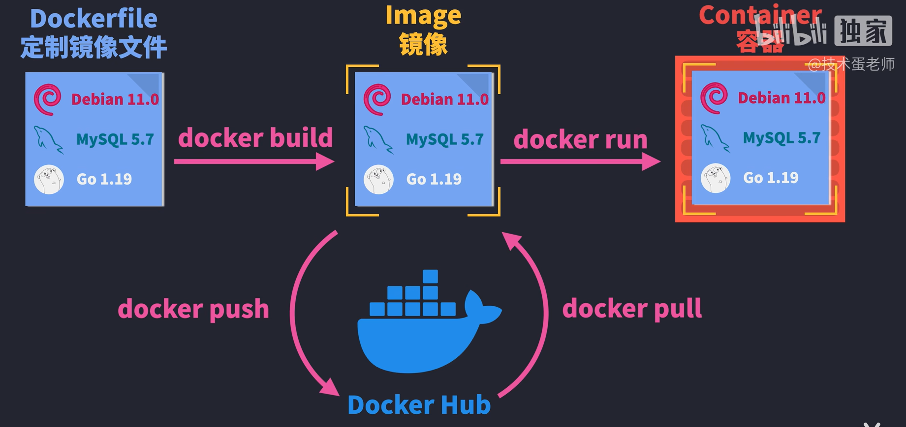

# Docker快速入门
教程来自[技术蛋老师的](https://space.bilibili.com/327247876)视频：
[🐳Docker概念，工作流和实践 - 入门必懂](https://www.bilibili.com/video/BV1MR4y1Q738/)

顺便过一下 Nodejs的一些命令，虽然，我从来没用过...

# 核心概念
首先，这是基于我知道Docker这个名词这么久了，一下是我基于它的理解：
Docker是一个虚拟沙箱系统。它能够将**软件和软件所需要的运行环境一同打包**成一个镜像（这个也是Docker的核心概念），这样一来软件就可以进行快速交付。

要**使用**Docker，最重要的就是知道它工作的三个核心的概念：
1. Container(容器)：它是镜像运行的容器；
1. Image(镜像)：它就是打包好的软件和运行环境；
1. Dockerfile(镜像定制文件)：方便通过代码使用和生成镜像环境的命令。

# 工作流
看图

