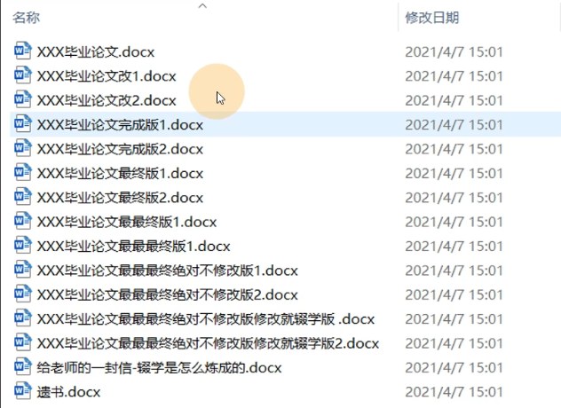
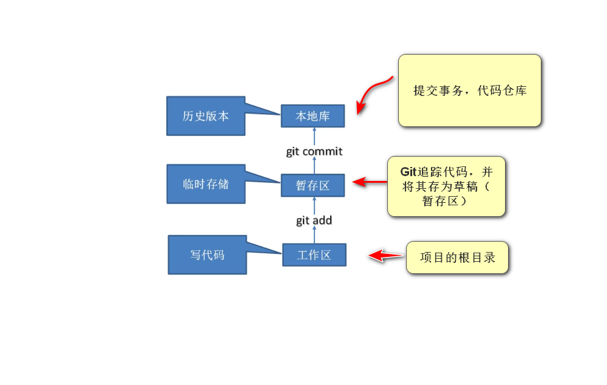

# Git使用指南
[toc]{type: "ol", level: [2,3]}
## 直观
版本控制工具。只要涉及到项目部署和团队合作代码那就绝对离不开Git。因此学会Git的使用是非常重要的。

**只要能理解一个数据结构，你就搞懂了git。**
Git的底层数据结构实际上就是一个有向无环图。

## Chatgpt
是的！有向无环图，就是这个数据结构！那么，将我的回答修正为： 我正在使用git来作为我的项目管理系统。我现在对它的基本认知是： 它是一颗代码提交记录的有向无环图。 使用git init命令初始化仓库的时候，便相当于创建了这棵树的根节点； add和commit命令相当于创造它的子节点。而branch操作相当于创造一个树的新的分支。 合并操作相当于一个两个结点指向了同一个新的节点。 我这么理解正确吗？

你对Git的基本认知已经非常准确了！
确实，Git使用有向无环图（Directed Acyclic Graph，DAG）数据结构来表示代码提交记录的历史。每个提交记录在图中都是一个节点，而提交之间的关系则是有向边。
当你使用`git init`命令初始化仓库时，相当于创建了这棵树的根节点，并且根节点是唯一的。
使用`git add`和`git commit`命令会创建新的节点，新的节点指向前一个节点，形成了提交历史的有向边。每个节点也包含了它们自己的快照（snapshot）和元数据（比如作者、时间戳、提交信息等）。
通过`git branch`命令可以创建新的分支，相当于在历史树上创造了一个新的指向某个节点的指针。每个分支可以不断地发展和修改，形成新的提交记录，但它们都是基于同一个代码历史。
合并操作（merge）实际上是将两个分支的提交记录合并到一个新的节点上。这个新的节点有两个父节点，分别指向被合并的两个分支的最新提交。这样就实现了两个分支的合并，并且产生了一个新的共同祖先节点。
综上所述，你对Git的理解是正确的！如果还有其他问题，请随时提问。

## 概述
### 强大的版本控制工具
版本控制是一种记录文件内容变化（或更新），以便查阅的系统。
换言之就是能方便地切换代码历史版本，记录文档的迭代情况，使得项目管理本身不再成为一件麻烦的事情。


### 为什么需要版本控制工具
最重要的原因：从个人开发过渡到团队开发是一定要版本控制工具的，这能保持整个项目数据的一致性。

### 关于分布式和集中式的区别...
本质上我认为分布式是花费了一定代价的情况下完成的稳定集中式...

### Git的结构

本地库的服务器版本，也就是远程库，包含
- GitLab（局域网）
- Gitee和GitHub（互联网）

### Git和GitHub 扫盲
这是两个东西。
- Git是一个项目历史管理系统，方便你切换项目的版本用的。
- GitHub则是一个代码托管中心，你可以提交你的代码，也能让别人修改你的代码，是代码的仓库。
## Git的安装
### Git的安装选项

一路点击下一步。
等待安装完成。

## Git快速入门
### Git使用流程
1. 更新用户的签名来识别身份：git config --global user.name
2. 初始化工作区目录：git init
3. 工作区写代码
4. 提交代码到暂存区：git add filename 移除缓存区中的数据：git rm --cached filename
5. 提交事务到本地仓库：git commit -m logMessage filename
6. 切换代码版本：git reset --hard version
### 常用命令

- git rm --cached FileName 命令撤销添加到暂存区的操作。
- git log 查看版本历史的详细信息。 
- 最重要的命令：git reset --hard Version 回溯版本
### 注意事项
 - 用户名和邮箱可以自定义，但是**必须要有**，否则提交代码时会报错。作用是区分不同操作者的身份。
 - Git本地的用户配置和代码托管GitHub的账户**没有任何关系**。
 - 在使用任何目录作为你的本地库之前，你需要指令git init 来执行初始化操作。（成功后会带有master提示）
 - 在Vim中yy是复制，i是粘贴。
 - Git对版本的控制是通过**版本快照实现**的，而非副本。使用一个**Head指针**来实现版本的切换。

# Git指令详细
## git reset
这个指令可以和 reverse 区分，之后再说
git reset 命令用于**回退版本**（或者叫版本穿梭），可以指定退回某一次提交的版本。
他只清空 track（已追踪的文件）
完全回到之前的状态使用 git clean 指令。

语法格式：
`git reset [--soft | --mixed | --hard] [HEAD] [filename]`

`git reset --hard HEAD` 撤销工作区中所有未提交的修改内容，将暂存区与工作区都回到上一次版本，并删除之前的所有信息提交。
谨慎使用。

## git clean
清除 未被追踪的文件。配合 reset使用可以回到上一个 commit的最初状态。
`git clean -n` 是一次clean的演习, 告诉你哪些文件会被删除. 记住他不会真正的删除文件, 只是一个提醒

`git clean -f` 删除当前目录下所有没有track过的**文件**. 他不会删除.gitignore文件里面指定的文件夹和文件, 不管这些文件有没有被track过

`git clean -df` 删除当前目录下没有被track过的文件和文件夹

## git rebase
> 把我的修改先扔在一边，先合并这两个分支的代码（一般不会出错），然后再尝试更新我的代码

上面是我之前学习`github工作流`时提到的一个特殊情况：当你在修改代码的时候，远程的主分支有了一个新的提交，此时你就需要将你的代码合并到最新的分支上去；

**一般来说**：会经过这样一个步骤：
首先你会先pull最新的分支到你的本地，使得**经过你修改前**的版本和remote的内容一致，然后你再去merge你的代码；
而 rebase相当于一键帮你完成这个步骤。

**我暂时只能这个说**，具体去看 这个视频吧。
[十分钟学会正确的github工作流，和开源作者们使用同一套流程](https://www.bilibili.com/video/BV19e4y1q7JJ/)
# Git分支
分支是Git最重要的特性，是区别于其他版本控制软件的核心特征。
切换分支的本质是切换指针。和切换版本是一样的。
### 分支概述
- 官方描述：好比从树的主干部分延伸出来的枝干，程序员可以从主分支上拉取代码作为自己的独立分支，并且该分支可以提交到主分支。
- 分支的好处：
并行开发，提高效率
分支间在合并之前互不影响(基于分布式的特性)，有利于项目的稳定。
在合并分支之前，分支的内容不会影响到其他分支。

### 分支相关的命令
- git branch 创造一个新的分支
- git branch -v 查看当前分支(Head指针指向)
- git checkout branch_name 切换分支
- git merge branch_name 合并指定分支到当前分支

### 冲突合并
冲突合并是Git为分支间相冲突时所提供的一种解决方式。
#### 什么是冲突？
如果两个分支，在相同的位置有着不同的内容，那么Git无法判断哪个版本才是你想保留（或提交）的内容，Git会提示你合并失败。
#### 解决方法
Git 会在你被合并的分支（Head指向的分支）的位置，将双版本的不同之处提示出来。你需要手动修改这些内容。
此时重新提交请求便可以合并成功。注意这次git commit命令**不可以带文件名**，否则Git会报错。
我的理解是带文件名就是一次新的提交，然而之前的合并冲突还未得到解决，因此会失败。
而不带文件名相当于继续合并。

## 使用Git来进行团队协作开发
前面的操作都是本地库中的操作。进行团队协作时，需要借助**代码托管中心**来实现代码分发。
从Git的原理来看，本地库实际上就是代码托管处的**分支**。
这种树状结构，很类似Linux的文件系统。
### 团队协作
#### 团队内协作
原理同本地库，代码的主分支就是GitHub仓库的代码。
只有团队内的成员才能对远程库中的代码进行push和pull操作。
需要仓库的管理员邀请用户才能成员成员。
#### 跨团队协作
团队与团队之间的协作有一定的约束。本质上跨团队协作已经采用的是副本系统了。
跨团队协作时的pull操作会被替换成pull request操作。
在远程仓库中，fork就是clone代码到自己账号的仓库中，区别于git的clone操作是拷贝到自己的本地。
当你作为团队外的成员需要提交代码时，需要提交pull request允许原团队来**拉取你的代码**。 
### 远程仓库的相关操作(以GitHub为例)
#### 创建仓库
- 这就好比团队的本地库。这里是所有代码的主分支。
- 必须创建仓库，你才能进行团队协作。这是Git的思想。

#### 给远程仓库创建别名
给你的远程仓库**创建别名**！git的推送是基于协议链接的，https和ssh为主流。但是你一定不想每次都在bash里面敲入那段又臭又长的链接地址，所以起一个清晰并且优雅的名字！使用命令"git remote add 别名 远程仓库链接" 来给远程仓库创建别名。
#### 推送本地分支到你的远程仓库
使用命令git push aliasname/links branch_name。这是项目成员才能做得事情，需要权限许可，所以你需要登录账号。
#### 拉取远程库到本地库
git pull aliasname/links branch_name。拉取远程库的数据到本地使其与远程库数据同步。所谓的保持本地版本最新。
#### 克隆远程仓库到本地
"git clone 远程仓库的地址"
克隆(clone)和拉取(pull)是两个事情。它们的底层原理也不一样。
- 拉取是为了保持自己的代码与仓库的项目分支同步。底层原理为先取得(fetch)分支副本，然后将分支合并(merge)。
- 克隆是将项目的副本拷贝到自己的本地库中来。底层操作是：1. 拉取代码；2. 初始化本地仓库；3. 创建别名。
#### 注意事项
### SSH免密登录
#### SSH简介
SSH是一种安全传输模式，全程Secure Shell，是一种保证安全的措施。
在GitHub中使用Https协议和SSH两种协议来协助Git的操作。由于GitHub需要保证用户每次上传的代码合法，因此在你使用Https链接的时候会要求你输入密码，这固然保障了安全，但是也为程序员带来了不便。
所以有了SSH这一种更方便的模式。在你的本地生成SSH的keys，而GitHub就匹配你的keys，这样就免去了输入密码的繁琐步骤。相当于GitHub与你保持了一种协议，这个协议就是SSH。
#### 本地生成你的SSH公钥
在C盘的用户目录(来源请求)中bash here，使用命令ssh-keygen -t rsa -C 你的用户邮箱配置来生成公钥和私钥。
参数：
- -keygen 表示我要生成公钥
- -t 选择加密的算法
- -C 添加相关描述

## IDEA集成Git
纯命令行操作较为原始。我们用IDE集成Git来进行开发。
### 配置Git的忽略文件
#### 为什么要配置忽略文件？
在你项目中有一些文件是个性化的、与你的本地环境有关的文件（例如配置文件），并且，最重要的是它们不参与项目的实际功能以及相关部署，而且每次pull与push的时候都要扫描这些文件也是不必要的事情。因此，Git便有了"忽略"这个功能：为了屏蔽掉这些无关的细节。
#### 忽略的配置
git是通过配置文件来执行具体忽略的对象的。
在你的C盘用户目录下，有一个.gitconfig文件。这是git的配置文件，如果想让你的忽略配置文件生效，你需要在.gitconfig中添加你的引用。
通常，为了方便引用（相对路径引用），git.ignore文件会跟配置文件放在一起。
配置文件中的格式：
```
[core]
    excludesfile = 写上ignore文件的路径
```
文件分隔符需要使用正斜杠'/'。

### IDEA定位Git程序
在Settings - Version Control中的Git下选择自己本地Git的安装目录下的git.exe即可。

### IDEA中的Git本地操作
在IDEA中，命令行的内容都变成了图形化操作（终端依旧可用）。
在IDEA中的步骤和bash中是一样的。
这里很直观所以自己去试试吧？

### IDEA使用Git管理项目的一次流程。
你尝试完了是吧，来让我们看看确实的正确流程是什么。
#### 初始化本地库
菜单栏 - VSC(版本控制系统) - Create Git Repository - 选择项目路径。
初始化完成。等同于命令行中的Git Init命令。
你的IDE会出现一些变化（以IDEA为例）：
- 红色：未被添加到暂存区的文件；
- 绿色：已被添加到暂存区，未提交；
- 蓝色：Git追踪到此文件被修改，但是未提交到暂存区。
- 黑色：所有文件与本地库保持最新。恭喜！

右键可以执行Git的相关操作。

#### 版本切换
当你使用了Git后，idea右下角会出现Version Control，在log（相当于Git log命令）中选择版本进行切换（本质为Git checkout 分支名）。

#### 分支管理
Git - Branchs
创建完分支后你也可以看右下角直接切换。

#### 合并分支
正常分支直接合并，轻松愉快。
冲突合并傻瓜式操作，我也不想写在文档里面了。

## 常见问题解决
1. 我先在gitee里面创建了一个仓库，然后在本地的git bash里面尝试push我的本地库存分支时提示报错...
[来源请求：异步初始化导致git无法推送到远程仓库](https://blog.csdn.net/qq_45893999/article/details/106273214)

**根本原因**：
我们在创建仓库的时候，勾选了“使用Reamdme文件初始化这个仓库”。若执行这个操作，远程仓库会初始化一个README文件并配置添加了忽略文件。当点击创建仓库时，**它会帮我们做一次初始提交**。于是我们的仓库就有了README.md和.gitignore文件，然后我们把本地项目关联到这个仓库，并把项目推送到仓库时，我们在关联本地与远程时，两端都是有内容的，但是这两份内容并没有联系，当我们推送到远程或者从远程拉取内容时，都会有没有被跟踪的内容，于是你看git报的详细错误中总是会让你先拉取再推送，但是拉取总是失败...

**解决方案**
1. 方法一
    1. 使用如下命令进行拉取
    ```properties
    git pull --rebase origin master
    ```
    2. 然后再进行上传
   ```properties
   git push -u origin master
   ```
   
此时便可推送成功。

2. 方法二
想要避免这种问题，就要保持创建的仓库是一个空仓库，什么都没有。
就是创建仓库的时候不要勾选“使用Readme文件初始化这个仓库”。
这样，初始化的操作就是git帮你做的，也就不会产生冲突了。

# Git命令
```shell
# M强制给当前分支重命名
git branch -M main
```

git将暂存区里面的文件移除：
git restore --staged *
这个星号可以替换成你想移出暂存区的文件。


# 设置gitignore
通过在git仓库下设置gitignore可以设置git在扫描时要忽略哪些文件。
git扫描时以当前目录为根目录。

**直接忽略根目录的某个文件夹**
```gitignore
/target
```

```gitignore

```


**忽略文件夹除了xx文件**
```gitignore
**/cache/*
!**/cache/index.html
# 感叹号应该就是取反的意思
```

**忽略以指定后缀文件如：xxx.php  xxx.html**
```gitignore
*.html
*.txt
*.php
```

**忽略指定文件夹下的指定后缀文件**
```gitignore
sender/vendor/workerman/*.log
sender/vendor/workerman/*.txt
```

****

# Linux环境配置GitHub的相关环境
wait editing...