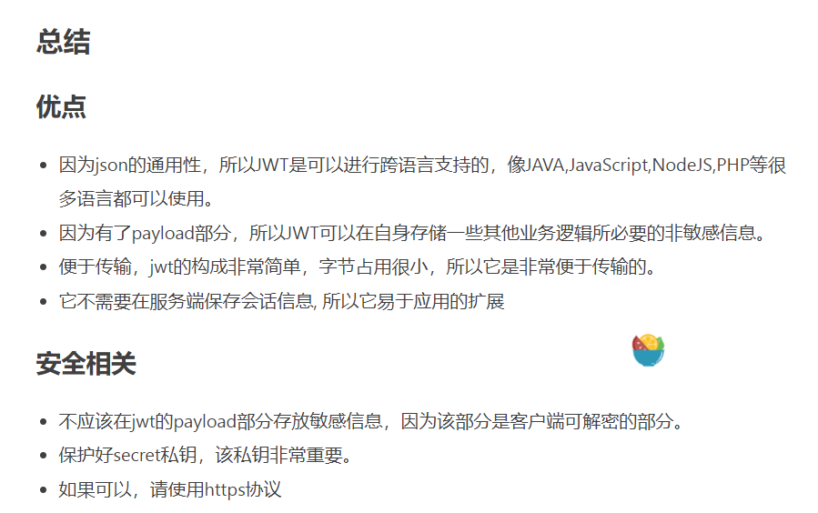

## Go Gin + Vue 实战
这个项目本身很简单，重点是怎么用来做 gin + vue的**前后端分离**。

# 安装额外的go的版本
首先通过命令`` 在 gopath（我现在go的高版本应该已经不再使用gopath了）生成一个可执行文件；
然后切换到该目录，通过对应的download下载go的环境；
不过说起来这个视频是不是有点过期了来着...

最后通过这个额外的可以用来编译go的代码；

## go的环境变量
通过`go env`可以查看go自身的环境变量；

通过`go env help`可以查看环境变量的可选指令；

w和u选项可以对go的环境变量进行对应的**修改和还原**。

# 搭建注册模块
首先快速搭建一个gin的项目：
1. 创建 GoEssential项目，并用`go mod init` 初始化项目的依赖文件
1. 如果你用的是goland， 记得要在设置 -> go modules中开启自动导入，很方便
1. 通过`go get -u github.com/gin-gonic/gin` 下载gin
1. 导入实例代码并执行
1. 浏览器查看效果

# gin的基本用法
通过Default获取默认路由；
r.(请求方式)（这里可以说实现了RESTful风格？）+ 资源路径 + 对应的handler
`r.GET("/ping", func(c *gin.Context) {...}`
在handler里面如果要返回json的话一般是使用 c.JSON返回状态码和json格式的数据。

这个就是一个类似redis测试的ping-pong的工具：
请看实例代码：
```go
package main

import (
	"fmt"
	"github.com/gin-gonic/gin"
)

func main() {
	// 这个应该是获取默认的路由，
	r := gin.Default()
	fmt.Println()

	// 我已经不记得RESTfulApi是啥东西了，不过我推测是：
	r.GET("/ping", func(c *gin.Context) {
		c.JSON(200, gin.H{
			"message": "Hello there",
		})
	})

	panic(r.Run())
}

```

然后下面这个部分应该是：页面传递数据给这个后端接口的时候，应该做的逻辑：看实例代码：
```go
// 几个重要的函数
ctx.PostForm()，应该是拿post的表单数据；
对应在apipost里面是这个：Body这个标签页下面的内容。
gin.H本质是一个map[string]any的结构；
Query用来拿get请求的数据，就这些啊

```

# 用的gorm做的数据库框架
暂时不看这部分。

与db的连接使用gorm框架，导入的用法和前面一致。
一个快速入门的案例，我按照我曾经写过一次的那个说：
gorm里有一个迁移的概念：
orm框架，基本上（mybatis不是完全的orm框架，拥抱底层的sql语句）是会屏蔽底层的sql的细节的；
迁移的意思是： 把 go struct（你可以当成表的结构来理解）**迁移到数据库中去。**
AutoMirage()这个函数是用来初始化数据库中的表的。

通用的过程是：获取数据库的连接；拿到对应数据库的引用；crud

总之需要的时候再具体总结去吧。


# 重构代码的架构
不能把代码都放在一个文件里面。所以：
1. table struct 放在model包里面；
1. 诸如`r.POST`等方法都放在Controller里面，怎么我看的是用的
1. 诸如随机字符串的方法放在 util包里面
1. 一些通用的代码放在common包里面，例如**数据库初始化的代码**
1. 对于gin框架来说， 路由是一个重要的概念（或者go的标准库里面就有这个概念，甚至web里面就有这个概念，而我不知道。） 不过route暂时只把代码提取到`route.go`里面去，**暂时不用考虑放在包**里面。

# 注册模块
和注册模块非常类似。

不过这里有一个新的概念：
就是登录成功之后服务器会返回一个token。
token是 服务器生成的一段string，本质是用来验证身份的，
我个人感觉像是对session的一种补充。

我暂时只知道这么多，所以就先写到这里。

# jwt入门
首先普及一下jwt的基本概念：
首先是结论：
jwt用于实现**用户认证**和**位置登录状态**。
> JWT 用于认证、加密，是一种基于json的token。
> 是什么不重要，你只需要知道它是做什么用的就好。

jwt是为了改善传统的session方式而推出的：
> http是一种无状态协议，如果如采取任何措施，用户甚至每次刷新的时候都要重新输入用户名和密码，巨塔喵麻烦。
> session是server端存储信息的一种方式：
> 具体的过程是：
> 1. 服务器生成和 客户端有关的session的信息；
> 2. session向客户端发送消息，让其生成对应的cookie；
> 3. 客户端凭借cookie实现免登陆；
> 本质上还是cookie

这种方式的问题：

**基于session认证所显露的问题**
Session: 每个用户经过我们的应用认证之后，我们的应用都要在服务端做一次记录，以方便用户下次请求的鉴别，通常而言session都是保存在内存中，而随着认证用户的增多，服务端的开销会明显增大。

扩展性: 用户认证之后，服务端做认证记录，如果认证的记录被保存在内存中的话，这意味着用户下次请求还必须要请求在这台服务器上,这样才能拿到授权的资源，这样在分布式的应用上，相应的限制了负载均衡器的能力。这也意味着限制了应用的扩展能力。

CSRF: 因为是基于cookie来进行用户识别的, cookie如果被截获，用户就会很容易受到跨站请求伪造的攻击。

token和上面那种方式相比，最大的区别是：
token**不存储在服务器中**。

## token的原理
token的物理本质是一个string，从内容上说，他有三个部分组成：
header, payload, signature

前两个都是jwt的信息：header是jwt本身的信息，和Request的头是一样的；
payload这个词语来源于**飞机上承载的货品**，是消息发送双方防止的消息；可以认为是明文的，因为**base64本身是可以对称解密的**。

第三部分是最重要的：
由 header和 payload 加盐之后加密之后得到的第三部分。
以代码为例：
```javascript
// javascript
var encodedString = base64UrlEncode(header) + '.' + base64UrlEncode(payload);

var signature = HMACSHA256(encodedString, 'secret'); // TJVA95OrM7E2cBab30RMHrHDcEfxjoYZgeFONFh7HgQ
```
> 注意：secret是保存在服务器端的，jwt的签发生成也是在服务器端的，secret就是用来进行jwt的签发和jwt的验证，所以，它就是你服务端的私钥，在任何场景都不应该流露出去。一旦客户端得知这个secret, 那就意味着客户端是可以自我签发jwt了。


jwt的流程其实相当简单：


总结：



## go jwt包
jwt.go文件放到common包里面。
`go get github.com/dgrijalva/jwt-go`

之前提到Payload部分是用来存储信息的。每一组信息就是一个 Claims声明，它用来表示一组有效的信息

在 jwt.go这个文件中：
jwtKey是 signature部分要用到私钥，自定义。

Claims是要在 Payload部分定义的 info，不过你需要对应的把标准的 Claims也加进去。

其实只要就是两个部分：
定义好一个jwt的规范：
1. header里面定义好加密方式；
1. 自定义的claims你自己把它定义好；

接下来用函数 `NewWithClaims`生成 Token就行。
然后把它转换成字符串。

## jwt配合中间件完成用户认证
我准备重新看一下视频，总之这里是配合进行身份验证的。
并且可以去看一下gin关于中间件的文档

## 统一响应格式
和我在学ssm的时候是一样的。
这里返回的相应对象缩写是DTO（Data Transfer Object），注意区分之前了解过 VO（View Object）
它们虽然可以当做同一个东西来使用，但是本质上是两个东西；
详细的可以看这个博客：[dto和vo](https://www.cnblogs.com/JerryMouseLi/p/11069237.html)

具体在代码中，定义一个struct，然后提供一个函数用来构造它就行。

# 前端的部分
## 环境搭建
通过 nvm（Node版本管理器）同时安装多个 Nodejs的版本。
Windows的：[github](https://github.com/coreybutler/nvm-windows)

这玩意我一用就有bug，你还是直接用官网的内容去下载吧。
只安装一个版本的nodejs就可以了。

### 关于nvm
nvm这个东西似乎是专门用来管理 nodejs多版本的。
常用命令是：
ls-remote
install
use 切换node版本


安装yarn， 它是nodejs的包管理工具

安装vue-cli，通过yarn进行安装全局的vue-cli即可
需要添加到环境变量才能使用，到处都是坑，草你妈的

# eslint
这个小玩意有两个作用： 一是发现语法错误；二是规范你的代码；
我不用来规范我的代码，而且听说这东西有数不尽的麻烦；
如果想要修改他的配置的话，在你的vue项目的根目录里面的.eslintrc文件里面修改，怎么修改去看视频

# 页面
是基于bootstrap搭建的页面样式风格。
首先安装的话，似乎是在一个官网名字叫bootstrap-vue的页面，推测这是b为vue做的一个整合，类似于spring对mybatis的整合；
可以在官网找到对应的文档： [INDEX](https://bootstrap-vue.org/)

若是用yarn来进行管理的话，使用指令来安装：
`yarn add vue bootstrap-vue bootstrap`

再往后面看的话需要一部分前端的基础知识了，至少暂时对我来说是没必要了。

这里以后有需要的时候更新。


我这里主要是看前后端分离中前端和后端具体交互的过程，看来是这个axios是核心，如果不这样的话，那一般就是后端语言的模板引擎来负责渲染，比如java已经被淘汰的jsp，go的模板引擎，rust使用的tera；

首先安装 axios
`yarn add axios`

`yarn add vue-axios`

使用 axios一般分为两步：
首先前端就验证数据，判断是否出现错误；如果没有就再给后端服务器发送请求；

