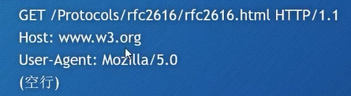
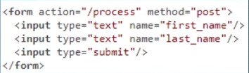
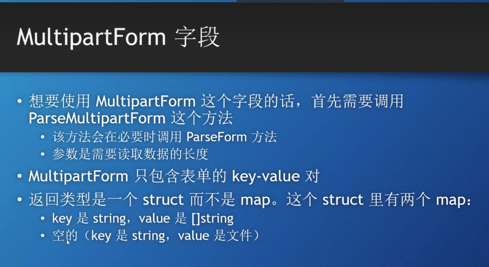
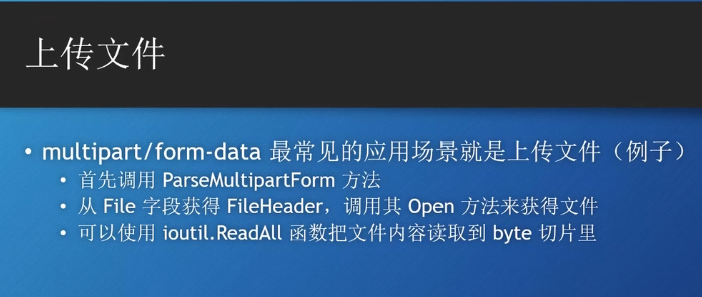
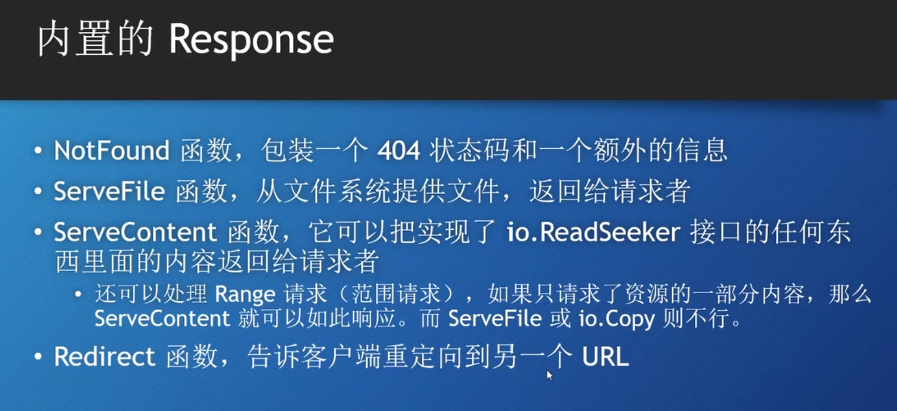
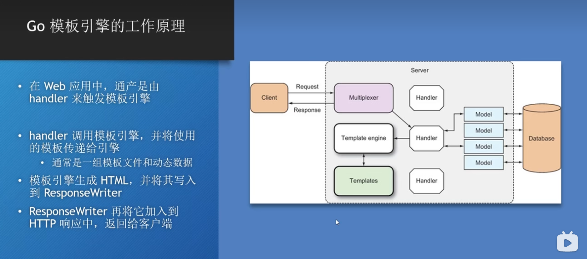
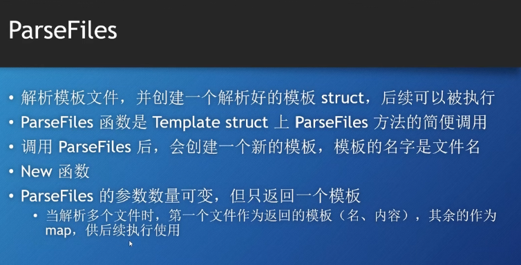
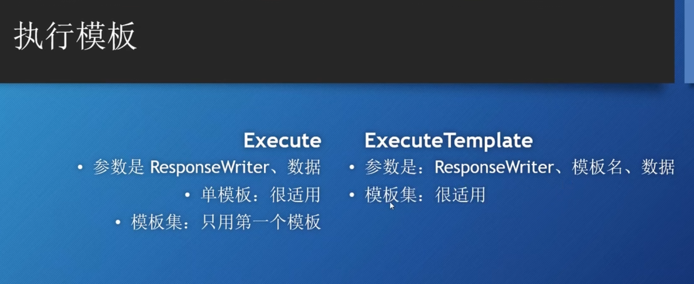
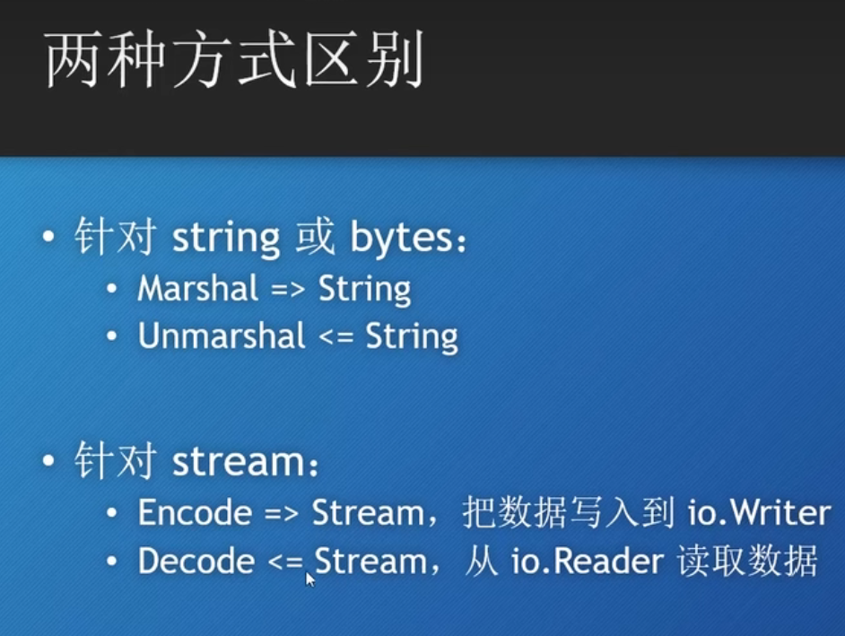
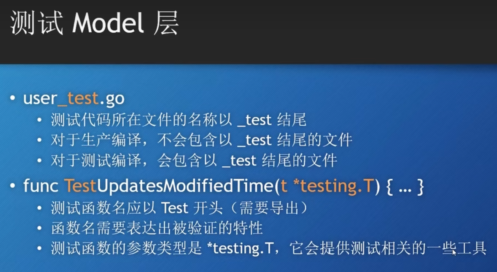

# Go Web 原生开发
# 一个快速入门
代码
```go
package main

import "net/http"

// 一个最简单的web demo
func main() {
	// 注册一个函数, 让他可以对web请求作出响应 (成为一个handler)
	// r 是一个指针, 表示这个http请求
	// 第一个参数, 路由路径
	// 第二个参数, 接受一个函数类型的参数
	http.HandleFunc("/", func(w http.ResponseWriter, r *http.Request) {
		w.Write([]byte("Hell World"))
	})

	// 监听端口, 第二个参数表示你想要使用哪个路由, 传入 nil 则使用 DefaultServerMux (默认路由)
	http.ListenAndServe("localhost:8080", nil) // 第二个参数, DefaultServerMux
}
```

# Go语言处理Http请求
go中使用Handler处理请求, 每次有一个web请求, go语言就会使用一个goroutine来进行处理
go语言默认使用 http.DefaultServeMux 来处理.

可以使用http.ListenAndServe这个函数来创建 Web服务器

http.ListenAndServe()

这个handler相当于就是谁来处理这个请求


**两种创建WebServer的方法**
```go
package main

import "net/http"

func main() {
	// 第一种方式
	// 他实际上也是调用的第二种方式的方法
	// http.ListenAndServe("localhost:8080", nil)

	// 第二种
	// http.Server 要更加灵活
	server := http.Server {
		Addr: "localhost:8080",
		Handler: nil,
	}
	server.ListenAndServe()
}
```

以上这两种是http的, 无法配置https的
https的需要对应在函数后面加上TLS
http.ListenAndServeTLS()
server.ListenAndServeTLS()

**关于handler**
handler是一个接口, 只要实现了 ServeHTTP 这个方法就可以作为 handler使用.
```go
package main

import "net/http"

// 验证 实现了ServeHTTP的方法都是可以作为handler的
type myHandler struct {}

func (m *myHandler)ServeHTTP (w http.ResponseWriter, r *http.Request){
	w.Write([]byte("我就像我的祖国爱我一样爱我的祖国"))
}
func main() {
	mh := myHandler{}

	http.ListenAndServe("localhost:8080", &mh)
} 
```

**向DefaultServeMux中注册多个路由**
可以使用http.Handle()方法.

大概步骤就是: 
1. 定义http.Server的时候, 第二个成员使用nil, 代表使用默认的DefaultServeMux
1. 自己定义handler, 实现HTTPServe方法即可
1. 通过http.Handle方法传入handler, 便可实现多个handler

**handleFunc区别于handle**
handlerFunc 区别于handle, 直接传入对应handler的func进去即可, 这个方法接受一个函数.

在底层源码里面还有一个handerFunc是一个type的函数类型.

# http包下一些内置的handlers
http.NotFoundHandler()
返回一个handler, 他给每个请求返回的都是 404 not found.
底层就是 之前的那个 HandlerFunc 那个函数, 接收一个函数类型

http.RediectHandler()
这个是一个重定向的handler好像, 
他把会指定response为你指定的 code(函数的第二个参数), 并跳转到arguments的url上.
code 一般为3XX, 常见的: StatusMovedPermanently, StatusFound, StatusSeeOther 等

http.StripPrefix(prefix string, h handler)
返回一个handler,它从请求URL中去掉指定的前缀，然后再调用另一个handler。
string 就是要去掉的前缀.
这个有点像handler的修饰, 一个中间件

http.TimeOutHandler(h handler, dt time.Duration, msg string)
给handler指定了加时机制, 需要在指定时间内完成.
dt的类型是一个int64的别名, 指一个时间间隔, 单位应该是纳秒.
也相当于是一个**修饰器**.

- h，将要被修饰的handler
- dt, 第一个handler允许的处理时间
- msg，如果超时，那么就把msg返回给请求，表示响应时间过长


http.FileServer(root FileSystem) Handler
这里我是照着ppt写的: 返回一个handler, 使用基于root的文件系统来响应请求. 
FileSystem 是一个接口, 定义了一个open方法.

一般会传入一个Dir类型(type Dir string) 委托给操作系统来处理文件.
实际上就是传入一个字符串, 作为根路径. 

# 请求 request
主要是这些字段的一些介绍, 在 Go 的底层是什么样子的.
还是要有http的一些相关基础
http消息: HTTP request 和 HTTP response
他们的结构是: 
- 请求 (响应) 行: 
- 0个或多个Header
- 空行
- 可选的消息体(Body)



go语言的 net/http包 实现了与其对应的相关内存映射
request


总之拿到了对应的Request之后, api是很丰富的

URL字段代表请求行(请求信息的第一行内容), 是一个指针, 指向一个内置类型
URL的通用格式是: 
```
scheme://[userinfo@]host/path[?query][#fragment]
```

# 在Handler中可以拿到 query 参数
很简单, r *http.Request 就代表一个 request
r.URL 可以拿到一个url
而 url 又可以拿到一个query参数, 类型 map[string][]string
也就是 用户在 url 里面写的 query的 key-value 的值. 

```go
func main () {
    http.HandleFunc("/", func (w http.ResponseWriter, r *http.Request)  {
        url := r.URL
        query := url.Query()
        fmt.Println(query["zzk"])
    })

    http.ListenAndServe(":8080", nil)
}
```
至于 map的value为什么是 slice, 因为 query 里面的key是可以重复的

# Form表单
原谅我根本没系统的学过web...
一个post form 的基本格式


form 表单 如果method 使用post方式提交的话, 提交的数据会在 request的body里面, 存放的格式 可以由 表单的enctype 属性决定.
默认是: application/x-www-form-urlencoded
query字符串会被转换成 url编码的那种形式.

除此之外, 也有一种 multipart/form-data 
此时每一个 key-value 都会被转换成 一个MIME消息

选择的话, 简单文本使用默认, 大量消息使用第二种形式进行传输.

# Go里面的 form字段
通过request的URL 和Body可以提取数据. 
Form的字段为以下类型
- Form
- PostForm
- MultipartForm

Form 里面的数据通常是 键值对 

有时候, url和 body里面都可以携带数据, 如果此时只想要 post提供的数据的话, 可以使用PostForm字段.

如果, form里面的 enctype 如果改成 multipart类型, 那么就需要使用MultipartForm 来访问.

关于这个字段的介绍: 



# 上传文件 和json
multipart 适合用来传输文件类型的数据
Multipart里面有一个 File字段, 是一个map, value就是 (因为里面可能有多个文件上传)一个 *FileHeader的指针.
使用Open()可以得到一个文件类型. 
然后是有ioutil里面的ReadAll()可以将其 转换为 byte slice 

总结步骤: 


类似于 FormValue的封装, *http.Request 里面也有一个 FormFile 来快速访问map里面的第一个文件.
我个人感觉业务里面肯定还是直接使用map访问的多, 更还别说有框架其实. 

补充一个 MultipartReader 这个会返回一个流(stream)
流的操作参考 Java的IO流
要我评价的话, 流的操作是持续性的. 

# Json body 的 post 请求
在前端中, post请求并非都来自于 Form表单
例如各种前端框架中如 Angular(application/json) 和 JQuery(application/x-www-form-urlencoded)
而go的 ParseForm 方法就无法解析application/json 类型

至于怎么解释json, 以后细讲

# Handler 里面的Response返回: ResponseWriter
ResponseWriter 是一个接口, handler使用它来返回响应
它的底层是 http.response , 这种设计我觉得有点面向对象里面的 代理模式的感觉.

关于 ResponseWriter: 它是一个接口, 底层是一个private的response, 它的**指针** 实现了ResponseWriter接口
真几把绕
不管了

# ResponseWriter 接口的三个方法
## Write 方法: 
这个方法可以接受一个 byte slice, 把数据写入到 response 的 body 里面去

请注意, 如果header里面没有设定 content-type的话, 那么这个数据的前面512个字节就会被用来检测content-type
这是在header里面没有显式调用 WriteHeader()的情况

## WriteHeader 方法
1. 接受一个 int 的参数, 用于设置 response的 status code 状态码.
1. 第一次调用 Write方法时, Write 会自动调用 WriteHeader(http.StatusOK). 因此, 这个方法一般传输 其他的状态码. 
1. 没理解, 如果调用了 WriteHeader()方法后, ResponseWriter 仍然可以写入, **但是 Header 已经无法再被修改了**. 

## Header 方法 
可以返回一个 Headers: type Header map[string][]string
可以进行修改, 会体现在 Response里面. 


有几个注意点: 
- 直接调用 Write(), 会隐式调用 WriteHeader()一次
- 调用了 WriteHeader()之后, 无法再对 Header 进行修改.

# 标准库内置的Response
Go的标准库中内置了一些常用的 Response, 例如 404 等, 可以加速开发


# Go模板
因为现在前后端分离, 所以模板的应用越来越少
不过我还是可以了解一下

## 模板快速入门
模板就是一套规范的, 可以被反复使用的 HTML 模板, 他们可以被 go 的模板引擎反复使用, 生成 html的页面.

Go的标准库提供了两个模板库: text/template, html/template, 这两个库几乎没有差别

模板引擎可以 合并模板 与 数据, 生成最终的 html 页面.

### 模板引擎


模板里面的嵌入逻辑一般叫 action

使用: 
例如在 一个 handler 里面加入以下代码
```go
func templateHandler(w http.ResponseWriter, r *http.Request) {
    // 解析模板文件
    // 忽略err
    t, err := template.ParseFiles("输入你的模板文件的文件名")
    // 像Writer里面写入, 并传入数据
    t.Execute(w, "Hello World")
}
```
## 模板的解析与执行
通过函数解析模板: 
- parseFiles(): 解析模板文件
- parseGlob(): 根据匹配模式解析模板
- parse(): 直接解析字符串模板

parseFiles()的底层就是parse(), 会把文件读取进去, 然后将其转换成字符串, 再交给 parse()进行解析. 



parseGlob 会根据模板串进行匹配, 例如 *.html

parse 就是最底层的, 直接解析字符串模板

模板的执行: 


## 模板综合案例
写一个综合的demo代码, 笔记详细卸载注释里面
```go
package main

func main() {
    // 使用自定义好的 模板函数 加载模板
    template := loadTemplates()
    // 定义 handler, 并在里面处理模板
    http.HandleFunc("/", func (w http.ResponseWriter, r *http.Request){
        // 可以通过 Request的 URL字段获取 URL的数据, 然后 URL 的Path字段可以获取 URL的资源路径
        // 默认第一个前缀是 斜杠 所以需要去掉
        fileName := r.URL.Path[1:]
        // Lookup 方法可以在模板中找到指定名称的 模板并将其返回
        t := template.Lookup(fileName)
        // 如果模板存在
        if t != nil {
            // 使用方法 Execute()方法生成 HTML
            // 参数: 一个writer, 还有 Data Context (数据上下文)
            err := t.Execute(w, "Hell World")
            // 错误处理
            if err != nil {
                log.Fatalln(err.Error())
            } else {
                w.WriteHeader(http.StatusNotFound)
            }
        }
    })

}

func loadTemplates() *template.Templates {
    // 使用 New 函数直接初始化一个空的模板文件, New里面可以传参, 是他的模板名, 随意
    result, err := template.New("myTemplates")
    // 返回值: 解析后的模板, 以及错误信息
    // template 内置一个 Must()函数, 将对错误的处理统一成了 panic, 程序若出错直接结束
    template.Must(result, err)
    return result
}
```

# 模板: Action
Action就是 Go模板中嵌入的命令, 用 两个大括号 包裹.

. 就是一个 Action, 并且是最重要的一个, 他代表传入模板的数据

Action 可以分为五类
- 条件类
- 迭代/遍历类
- 设置类
- 包含类
- 定义类

## 条件类
```html
{{if args}}
    some content
{{else}}
    other content
{{end}}
```

有点类似一些旧的编程语言的方式

## 迭代/遍历类
```html
{{range array}}
    Your array data will display here. {{.}}
{{end}}
```
这类 Action 用来遍历数组, slice, map 或channel 等数据结构
此时 这里的 . 不再代表传入的数据, 而是array 里面的 element

而且这个 range关键字 还有一个回落机制, 如果array是空的话, 可以使用 else 实行另外的逻辑.

## 设置类
```html
The dot is {{.}}
{{with args}}
    Now dot is going to replaced with {{.}}
{{end}}

True data is {{.}} now.
```
这个 action 可以暂时将范围里面的点变成临时指定的参数.
他也有回落机制. 不演示了.
## 包含类
允许你可以在模板里面嵌套使用模板.
```html
{{template "templateName" arg}}
```
也可以像被包含的模板里面传递参数
## 定义类
定义一个模板


# 模板中的函数与管道
可以在模板中定义变量: 在 变量名前面加入 美元符号 即可

## 管道
管道 是 连接到一起的参数, 函数 和方法
类似 Unix 里面的管道
比如 {{p1 | p2 | p3}}
他们要么是参数, 要么是函数

## 函数
不是 Go的函数.
模板会提供一些常用的, 简单的 函数方便使用, 但是最重要的是, 自定义函数的方法

template有个函数 template.FuncMap(), 可以返回一个 map[string]func类型

通过 Template的Funcs()方法可以关联 模板和 FuncMap, 接着在模板里面就可使用 key来访问函数了.


# 路由
这个其实算一个比较重要的东西...
路由是什么, 我不好说
功能的话, 用来**分发不同的请求到不同的handler里面**去
Go的里面有一个 前置 Controller, 它会匹配最具体的, 适配路径的 handler

其实能理解路由的含义就可以. 

以上其实属于静态路由. 说简单点就是, 一个路径对应一个页面. 是静态的.
与之相应的就有动态路由: 带参数的路由, 根据路由的参数, 创造出一族不同的页面: 模板相同, 但是数据不尽相同的页面

呃部分我还不太熟悉, 说一下大概的思路
因为 go 里面 handler的匹配的机制, 会去找最适配的那个. 所以一般 路径那里, 会加一个 斜杠
然后在 handler 里面处理

# json
在前后端分离流行的今天, 交换数据更多的是使用json. 

因为 go的struct 和 json的命名规范有些冲突, 因此 go提供了一种 tags的方式 来加以区分.
```go
type Company struct {
    ID int `json:"id"`
    Name string `json:"name"`
    Country string `json:"country"`
}
```

这个比较重要: 未知结构的json的映射
可以使用 map[string]interface{} 和 []interface{}
都可以存储任意的json格式

## json的读取和写入
go的库自带 相关的编码器和解码器, 都是通过new先拿到对应的引用再通过他们进行编码和解码.
相关的包: "json" 函数: NewEncoder和 NewDecoder

还有一种, 但是在 web里面不常用
json.Marshal() 以及 json.Unmarshal()
json.Marshal() 还有一种派生, MarshalIndent(), 支持格式化输出



# 中间件
比较特殊, 顾名思义是在中转请求和相应的, 可以实现的功能也比较多, 思路和原理很简单, 不过这个玩意的拓展很丰富.
...
原生的context的方式是使用一个 自定义的struct实现 mux所需要的接口, 代替 DefaultServerMux
然后使用handler来附加处理逻辑, 本质上是 handler的 封装

# 请求上下文
我说说我的理解, 现在的项目架构都是提倡分层实现, 但是有时候 例如数据库层需要 从 中间件那里的数据来进行一些业务处理, 这时就需要 Context来提供信息了.
顾名思义, 提供一个环境.

使用 Context的原则是, 你只可读取, 不可修改. 如果要信息不同的 context, 你需要重新创建一个.
func (*Request) Context () context.Context: 返回当前请求的上下文
func (*Request) WithContext(ctx context.Context) context.Context: 基于 context 进行修改, 实际上是创建一个新的上下文. 

context.Context 的结构解析: 
本质是一个接口: 
DeadLine: 可以得知 Context的失效时限
Done: 返回一个 类型是 空struct 的 channel, 是用来做取消操作的. 
Err() err
Velue(key interface{}) interface{}
这些方法都是使用的设置
一个使用 使用 Context的实例

# https
http作为传输协议, 之间的数据都是明文信息, 非常的不安全, 任何时候都不推荐使用http. 

https最明显的区别是添加了一层中间层 TLS 来为信息进行加密. 只有BS的两端可以解密.

go中使用 http.ListenAndServeTLS来启动https服务器: 
他需要四个参数: 中间两个是证书的路径. 因为开发环境下没有证书, 所以go提供了一个 .go 文件生成证书.
```shell
go run D:\DDD\Go\src\crypto\tls\generate_cert.go -host localhost
```

提到一些: 
- go语言从 http转换到https 会使协议从 http/1.1 升级为 http/2, 效率更高
- 现在相应里面的 header 数据的key前面会加一个冒号

# 关于 http/2
http1的不足: 基于 header 和 body 的包捆绑在一起发送, 数据量一大数据就会降低;
http2 使用基于 tcp连接的流, 流里面的 frame就是对应的数据. frame的类型各有不同, 因此可以单独进行优化. 例如数据压缩等.

**特点**
- 请求多路复用
- Header 压缩
- 默认安全
- Server Push

Server Push 也没怎么看懂, 暂时就不说了. 

# Go Web 的测试
特点


**测试需要掌握**

比如验证一个函数的功能: 
```go
// 随便写的一个函数
func isZero(n int) bool {
	if n == 0 {
		return true
	}
	return false
}

```

测试的文件有三个要求: 
1. 测试代码的go文件需要有 `_test` 的后缀.
1. 测试函数名必须以 `Test` 为**前缀**.
1. 形参必须是`(t *testing.T)`

我写的一个测试代码, 很简单:


go 的测试功能, vscode 和goland都支持.

单元测试一般有一个原则: 
> 为了保持单元测试的隔离性, 不要使用 数据库, 外部API, 文件系统等外部资源.

# 性能分析(Profiling)
匿名导入一个包
```go
import "net/http/pprof"
```

> 关于**匿名导入**
> 如果你只是想导入一个包而不使用它的话, 你可以用这种形式.

导入这个包之后, 你可以用过web 和 命令行获取 当前程序性能信息的一些快照. 

看文档研究, 没法直接就这么写完.

# 部署
就是部署到 Linux Server 上. 

在Linux上可以直接使用 go build 命令编译, 然后启动可执行文件即可. 
不过这种方式不稳定, 关掉命令行服务器就会关闭.
还有一种 可以使用 nohug命令, 忽略挂断命令继续执行程序, 不过这种也不太好. 

绑定 Linux进程的系统守护进程, 添加到开机自启动.

步骤: 
```shell
# found a new service, 建立一个新服务
sodo vim /etc/systemd/system/servicename.service
```

```service
[Unit]
Description=Go Web App running on Ubuntu

[Service]
# bin path
ExecStart=/home/binpath
# Restart when process crashed
Restart=always
# Restart service after 10 seconds if the notnet service crashes
Restart=10
KillSignal=SIGINT
# Log Description
SyslogIndentifier=go-web-example
# Which user will start it
User=risk

[Install]
WantedBy=multi-user.target
```

配置完成后启动服务即可.
```shell

```
