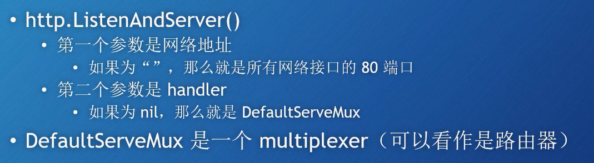
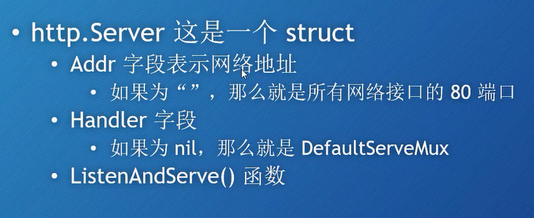
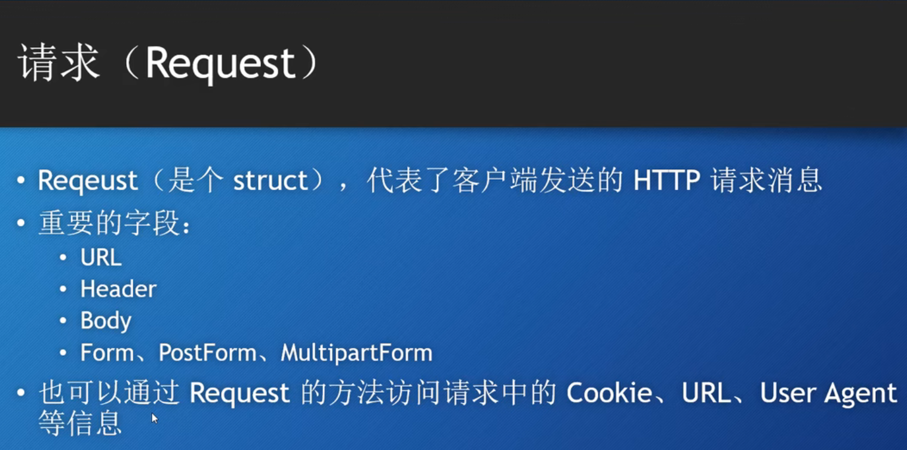

# Go Web 开发
# 一个快速入门
代码
```go
package main

import "net/http"

// 一个最简单的web demo
func main() {
	// 注册一个函数, 让他可以对web请求作出响应
	// 固定写法? 应该是
	// r 是一个指针, 表示这个http请求
	// 第一个参数, 路由路径
	// 第二个参数, 
	http.HandleFunc("/", func(w http.ResponseWriter, r *http.Request) {
		w.Write([]byte("Hell World"))
	})

	// 监听端口, 使用默认路由
	http.ListenAndServe("localhost:8080", nil) // 第二个参数, DefaultServerMux
}
```

# Go语言处理Http请求
go中使用Handler处理请求, 每次有一个web请求, go语言就会使用一个goroutine来进行处理
go语言默认使用 http.DefaultServeMux 来处理.

可以使用http.ListenAndServe这个函数来创建Webserver

http.ListenAndServe()

这个handler相当于就是谁来处理这个请求



**两种创建WebServer的方法**
```go
package main

import "net/http"

func main() {
	// 第一种方式
	// 他实际上也是调用的第二种方式的方法
	// http.ListenAndServe("localhost:8080", nil)

	// 第二种
	// http.Server 要更加灵活
	server := http.Server {
		Addr: "localhost:8080",
		Handler: nil,
	}
	server.ListenAndServe()
}
```

以上这两种是http的, 无法配置https的
https的需要对应在函数后面加上TLS
http.ListenAndServeTLS()
server.ListenAndServeTLS()

**关于handler**
handler是一个接口, 只要实现了 ServeHTTP 这个方法就可以作为 handler使用.
```go
package main

import "net/http"

// 验证 实现了ServeHTTP的方法都是可以作为handler的
type myHandler struct {}

func (m *myHandler)ServeHTTP (w http.ResponseWriter, r *http.Request){
	w.Write([]byte("我就像我的祖国爱我一样爱我的祖国"))
}
func main() {
	mh := myHandler{}

	http.ListenAndServe("localhost:8080", &mh)
} 
```

**向DefaultServeMux中注册多个路由**
可以使用http.Handle()方法.

大概步骤就是: 
1. 定义http.Server的时候, 第二个成员使用nil, 代表使用默认的DefaultServeMux
1. 自己定义handler, 实现HTTPServe方法即可
1. 通过http.Handle方法传入handler, 便可实现多个handler

**handleFunc区别于handle**
handlerFunc 区别于handle, 直接传入对应handler的func进去即可, 这个方法接受一个函数.

在底层源码里面还有一个handerFunc是一个type的函数类型.

# http包下一些内置的handlers
http.NotFoundHandler()
返回一个handler, 他给每个请求返回的都是 404 not found.
底层就是 之前的那个 HandlerFunc 那个函数, 接收一个函数类型

http.RediectHandler()
这个是一个重定向的handler好像, 
他把会指定response为你指定的 code(函数的第二个参数), 并跳转到arguments的url上.
code 一般为3XX, 常见的: StatusMovedPermanently, StatusFound, StatusSeeOther 等

http.StripPrefix(prefix string, h handler)
返回一个handler,它从请求URL中去掉指定的前缀，然后再调用另一个handler。
string 就是要去掉的前缀.
这个有点像handler的修饰, 一个中间件

http.TimeOutHandler(h handler, dt time.Duration, msg string)
给handler指定了加时机制, 需要在指定时间内完成.
dt的类型是一个int64的别名, 指一个时间间隔, 单位应该是纳秒.
也相当于是一个**修饰器**.

- h，将要被修饰的handler
- dt, 第一个handler允许的处理时间
- msg，如果超时，那么就把msg返回给请求，表示响应时间过长


http.FileServer(root FileSystem) Handler
这里我是照着ppt写的: 返回一个handler, 使用基于root的文件系统来响应请求. 
FileSystem 是一个接口, 定义了一个open方法.

一般会传入一个Dir类型(type Dir string) 委托给操作系统来处理文件.
实际上就是传入一个字符串, 作为根路径. 

# 请求 request
还是要有http的一些相关基础
http消息: HTTP request 和 HTTP response
他们的结构是: 
- 请求 (响应) 行
- 0个或多个Header
- 空行
- 可选的消息体(Body)

go语言的 net/http包 
request


