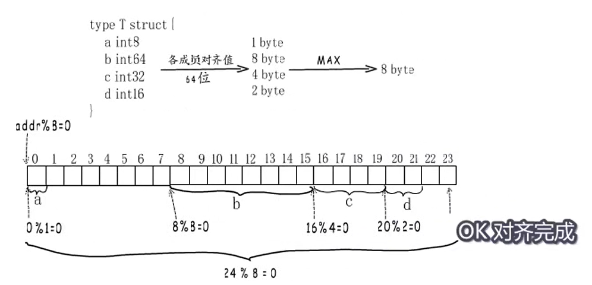

# Golang内存对齐
有可能是我学的最认真的一次了。

# 重回计组：地址总线和数据总线
后面提到的单位（一根位到底是一个bit还是一个byte），我这里是一个没搞懂的，不过**这个并非重点**，核心是搞清楚内存对齐的**的作用以及优化。**

至少最传统的，cpu和内存之间是通过**地址总线和数据总线进行交互。**
地址总线代表cpu**最大的寻址空间**：我的意思是，如果地址总线就那么多根，而你的内存就算再大，cpu也是读不到的。（这里我不确定）

数据总线代表内存**可以一次向cpu传输多少数据**。

这里的话理解大概概念就行，暂时不要去管底层那一套，也不要自作多情的自己去想实现，没必要。

# 计组：内存的物理结构
从理论上来说，内存**应该**是一个大矩阵，通过行和列可以确认一个地址。

不过实际上，这样读取数据的效率太低，所以：

这里我忘记存内存条的截图出来了，不过不影响；
内存条的一面，是一个 RANK，
一个RANK的一面就是一个chip；
而一个chip上一般是（？）有8个矩阵，被称为bank。
在bank这个维度，通过行和列就可以定位一个具体的内存地址了；

而8个chip，每次取每个chip的同一个地址的内存的话，实际上就相当于**连续的8个内存单位。**

这样可以大幅提高读取的效率，不过如果这样设计内存条的话（一次读8个地址出来），那么**一个地址单位也就是8的倍数。**

# 为什么要进行内存对齐
所以，根据上面的内容，如果你的数据分别在第一组的8个地址和第二组的8个地址的话（即使它原本可以放在同一组），cpu也是需要读取两次的；
实际上，你可以访问任意的地址，但是底层实际上是cpu帮你做了处理，分别读取两次，然后在组装这个数据；
这也是性能会降低的根本原因。

以Go语言为例，对齐就是根据数据的类型，把它放到对应的位置，这样就可以减少寻址的次数。（为了防止我上面说的那种情况的出现）

# 内存对齐的概念
内存对齐要求：
1. 数据的起始地址要是**对齐边界的整数倍**
1. 数据占用的空间大小也要是**对齐边界的整数倍**

Why？后面会写。
这个对齐边界，你可以理解为数据类型怎么进行对齐的**依据**。

现在知道怎么算对齐了，那么怎么确定这个对齐的边界？
如果你觉得我前面的内容讲清楚了，那么直接就可以说结论：

min(数据类型占的大小, 对应架构的寄存器的大小)
这很容易理解： 就是边界不能超过 regSize。

核心就是： 减少浪费，提高性能。

# Go中结构体的对齐
一个结构体的边界怎么确定？
**取所有字段里面最边界最大的那个字段的边界值**。注意还是不能超过 regSize。

具体怎么对齐呢？回忆之前写到的那个**两个原则**：
1. 其实地址是对齐边界的倍数；
1. 占用的空间也是对齐边界的倍数；
具体可以看下面这个图

我当你看懂了，所以一般说的对结构体的**字段顺序**进行优化可以**减少一个结构体占用的空间**。

不过我有个问题，我觉得这个可以由编译器自己优化的，不一定需要程序员自己做好像；
确实go的团队也说以后有考虑进行优化的打算；