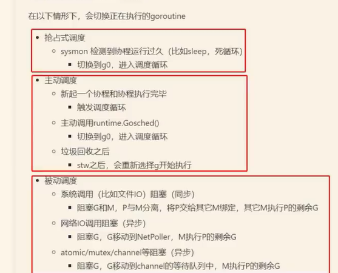

# Golang面试题一部分
参考哔站的一个视频：[golang大厂面试题讲解](https://www.bilibili.com/video/BV1H8411j7Tu/)

# Golang和JAVA的区别
前者支持指针（safe和unsafe的都有），后者为了安全起见，不支持直接操作内存，而是转为支持引用。Golang默认也不支持内存运算，但是可以通过unsafe包下面的数据结构来达到效果。
Golang支持更加轻量的携程。不过JAVA的线程库封装的也比较好（有许多框架）。Golang的优势是上手起来更加的容易。
JAVA支持函数重载，这应该算是面向对象语言一个重要的特性。而Golang并非明显的支持面向对象的语言。不支持函数重载。

Golang自身的网络库支持简单的网络服务器，而JAVA的项目需要部署在tomcat服务器上。这不是重点，因为tomcat本身也是用JAVA写的。只能说JAVA比较老，而不能说哪门语言有更明显的优劣。

上面这些都是很基本的东西，根本就没有面试的必要。

Golang语言的特点。主要是与JAVA语言做对比。
第一，由于从编程语言上支持携程，所以他从编码的角度来说，并发度的粒度要更高。
第二，由于语法比较简陋，所以并不如其他编程语言般复杂，所以某种程度上它的可读性要更好，~~并且编译速度也要更快~~。并且Golang抽象能力要更弱，写起业务代码来，他是不如其他的老牌语言的。
第三，对比于JAVA，他的gc与程序同时运行。某种程度上，垃圾回收的效率要更加高效。

区分Golang线程与协程。
主要线程是**操作系统级别**的概念，而协程是**编程语言级别**的概念。
内核级别的线程，它有多种不同的调度算法，都有CPU时间片，如何进行调度完全要操作系统自己决定，并且他更加重量级。
而用户级的线程也就是协程，他是在线程的基础下，有编程语言自己进行的额外的调度算法。一般来说都是进行协作式调度，可定制性更高，但是重量级不及内核的线程，所以我自己推测在运行某些任务的时候，该用线程还是需要用线程的。

通常来说，只需要记住
**线程一般是强制性调度，而协程通常是协作性调度。**

也就是说，CPP和JAVA他们只是没有对应协程的轮子罢了。不能从这个方面来说，就因为有协程这个特性，它就比这另外两门编程语言更好。

这里有一个额外知识，在多线程编程的场景中，频繁的切换线程会导致CPU耗费大量的性能，因此c加加和JAVA等语言他们提供了异步IO编程模型，这使得性能得到提高，但是编码变得更加复杂。

Golang语言的发明者们的编码能力是顶级的，但是并不能因此就觉得Golang本身是一门用起来舒服的语言，还是那句话，不同的语言在不同的方面的表现通常是不一样的。

既然说了协程这么多好处，那来看看它内部的细节。
协程解决了线程的痛点。**怎么去执行的问题，怎么去切换的问题**？
协程仍然是基于线程的，在内部实现上，Golang底层是维护一组数据结构和n个线程，而对应代码是放在一队列中的，有编程语言决定这些线程用什么样的顺序来执行这些协程。

而协程切换是怎么做的呢？
Golang针对不同的操作系统对他们内部的io函数进行了封装。当这些函数返回busy或者blocking的状态（也就是说程序可能会卡死在这里，而导致用户使用体验不佳。）利用这个时机把现有的执行队列压栈，然后用去拉取另一个协程的代码去执行。这些异步函数包括linux的epoll、select和windows的iocp、event等。

进度：协程怎么切换的下一个部分

# note5笔记
数组和切片。
golang的切片是它集合的主要使用形式。
数组不过是，它的底层结构罢了。

如果你实在需要的话，那就写一下他们主要的区别：数组需要事先声明长度，而切片不需要

第二，切片可以自动扩容

第三，在作为参数传递的时候，数组是值传递，而切片由于底层的封装，它是值传递的，当然它当中还有许多细节，不过这不重要

关于切片的扩容，golang底层对切片的处理是复用原则，所以这一点有时候会产生许多的坑，我个人更加偏好于rust的显示指定的方式

我不清楚up主这里讲解的它的切片的扩容是基于golang哪个版本，因为不同的版本的扩容时机，或者说负载因子是不一样的

不过我仍然写在这里，
嗯，首先这个新申请的容量应该是旧切片的容量加上现在状态的切片的大小。唉，这里我也不知道什么意思，那我就把它写一下。old.len+ new.len
首先判断如果新申请的容量它大于两倍的旧容量，那么最终的容量就是新申请的容量。
如果不是，即，新申请的容量没有达到旧容量的两倍，那么看旧切片的长度是多少，如果它小于1024，也就是2的10次方，那么最终容量就是旧容量的两倍，从这里可以看出，切片的扩容最少都会扩容至原来的两倍的。
如果就切片的容量大于1024，那么以原来旧切片的容量为单位，每次增加它的1/4的容量，直到最终容量超过所需要的，申请的新的容量。
然后这一个最终容量需要向上取整，也就是说它需要是二进制偶数。

切片的使用陷阱。
这完全是golang自己挖出来给自己跳的。没有人能在阅读源代码之前就很轻松的弄清楚切片的扩容机制。而你既然是为了让人快速入门，那么就不应该把扩容弄得这么复杂，或者说你应该提供一种更为友好的方式。这里我考虑跳过，我现在不想考虑这个问题。

wait update

记录GM和GMP模型的区别。后者是golang现在正在采用的并发调度模型。
这个p就是procesor的意思，调度器
这里我以前在看那个golang语言面试指南的时候，有提到golang原来它是采用的GM模型，而后面再有一位大神加入并改善之后，才有了现在的G MP模型

区别一，减少大量的全局队列锁的竞争。在没有引入process之前，只能通过性能低下的锁来，保证数据不会因为竞争而产生冲突，引入p之后就可以执行无锁操作，提高了性能

区别二：这里讲的有点混乱，我稍微理一下，就是说在引入P之后，每一个G都是由M创建的，M在创建G之后呢，会将基对应的信息保存到与M相绑定的P之中，这样后面M在执行这个P当中的G的时候，不需要额外的获取G的信息，如果没有这个P的话，那么相关的信息就会丢失，每次M运行它的时候需要额外花费一点时间来获取相关信息

区别三。Gmp对比gm提高了资源利用率。
首先是当本地的P的队列中已经没有代码（等待执行的协程）等待执行的时候，它的顺序是先从全局队列中拿取。如果全局队列里面的G也为空那么，去从其他本地队列中偷取数量一半的G放到本地的P中。

从上面这个部分可以看出，这么安排顺序的原因是为了让每一个M都能有一点事情做。这应该也是榨取性能的一种方式吧。

此外区别四：还是提高资源利用率的目的，他有一个hand-off机制。但是这个和我之前所了解的协作是调度，好像并没有本质区别。所以这里只提一嘴具体的原理我如果有需要再看。

下面来说一下gmp模型的具体工作过程。
第一，用go关键字创建一个协程
第二，创建的G（也就是协程）会优先保存在p的本地队列中。在本地队列满了之后再会保存到全局队列中。
第三，M是用来执行P中的G的，如果本地队列中已经没有G了，那么就从全局队列中获取，如果全局队列中也没有呢，那就去其他队列中偷。这个在上面已经说过了。
第四，G把相关的数据传输给M，为M执行G做准备。
第五，当M正在执行G的时候，如果G里面执行到系统调用，产生阻塞了，这里应该就是hand -off机制，运行时会把m和p分离（因为m阻塞动不了了。），然后看是否有空闲的m，如果有就直接用，如果没有就创建一个新的m…总之不会让他阻塞在这里的。然后应该似乎是把原来p中的其他的g给执行完。
第六，把这个g销毁，然后返回执行结果。
第七，当m的系统调用结束的时候，M就去尝试获取一个p去执行当中的g，获取不到，那就说明你这个m现在没事做，那么他就会被加入到空闲线程中，变成休眠状态。

可以看到GMP模型的资源利用率是很高的。

而gm模型由于少了p这个东西，所以有两个很明显的缺点：
第一是全局队列会产生激烈的锁竞争，你想想那么多的p要去获取对应的m来执行，之间一定会产生竞争。
第二就是m无法充分利用。

# 反射的部分
反射的部分

反射主要是三个，拿到对象的方法set和get，

主要的API，嗯，这里我觉得用一个截图记录一下吧，或者直接查阅文档

下面一部分讲解的是垃圾回收
第1种就是众所周知的著名的引用计数，它的特点是渐进式（这里是对比于主流的三色标记法的ST W而言），实现简单（只需要维护一个成员变量就可以）

缺点是，第1个就是众所周知的不能处理循环引用，不过他也有比较多的解决方案，比如强引用。
第2，维护这一个计数器，会降低运行效率，而三色标记法则不需要这些代价
第三，对于某一种单元磁力，它并不是缓存有好的就会导致缓存丢失，降低运行效率，这个我并不清楚是什么东西，所以只是记录一下

第2种是标记清扫
这是一种自动内存管理，基于追踪的垃圾收集算法。内存单元不会变成垃圾后，马上被回收，而是达到一种不可达的状态，直到到达某一个阈值或者是时间，单位这时候会出现ST w，也就是GC会停止用户运行的程序，专注于进行垃圾回收。垃圾回收程序对当前所有的存货单元进行一次全局便利，并确定哪些内存可以进行回收。这个算法分为两个部分，第1个是标记，第2个是清扫。标记阶段表明所有的存货单元清扫阶段进行回收。

它的优点是避免了引用技术的缺点，而缺点就是会挂起用户程序。

三色标记算法重点
三色标记的过程
首先所有的对象都是白色。
然后开始从根节点进行扫描，所有可以到达的对象标记为灰色。并放入一个待处理的队列。
然后从队列中取出灰色对象将其对应，引用的对象标记为灰色放入队列中，然后把已经处理完的标记为黑色。
重复上一个步骤，直到，队列清空。此时颜色标记为白色的，即为垃圾。

三色标记的一个明显的好处就是能够让用户程序和算法中的标记部分并发的进行。

什么是根对象呢？
根对象就是生命周期可以保证的对象。
像全局变量，线程栈这些就是根对象。
这里如果有需要，可以去看视频的0707的位置

三色标记法的屏障机制
不能说三色标记法应该是，扫描清除这种垃圾回收算法的， ST w机制的改进。首先它增加了时间消耗，还停止了用户程序的进行，这是在某一些高性能领域最诟病的一点。为了避免这种情况的出现，可以通过写屏障来解决垃圾回收期间，已经扫描为黑色的对象……这一波说的什么玩意儿我看看？

强弱三色不变式，概念解释
强三色不变式它不存在黑色对象引用白色对象的指针，已经标记为黑色的他压根就跟白色对象没有关系了，这是我自己的理解……这里似乎有点难，而且我不是很懂，留下一个记号，并做一个截图 位置，0723
