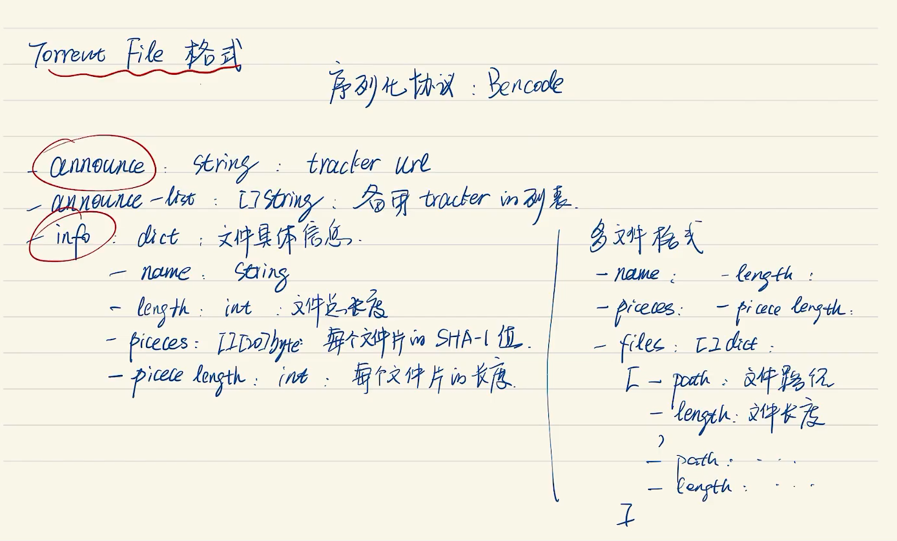
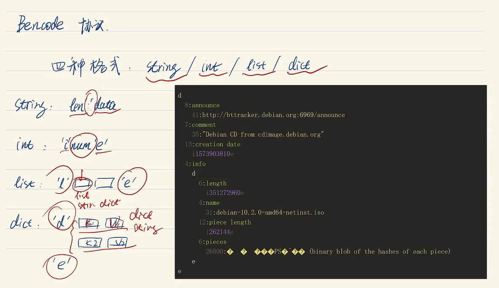
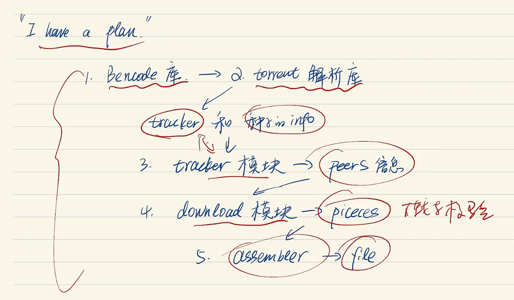
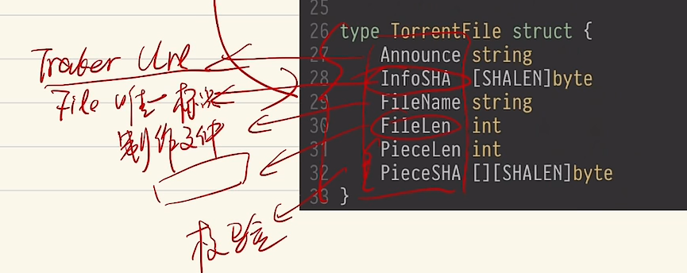
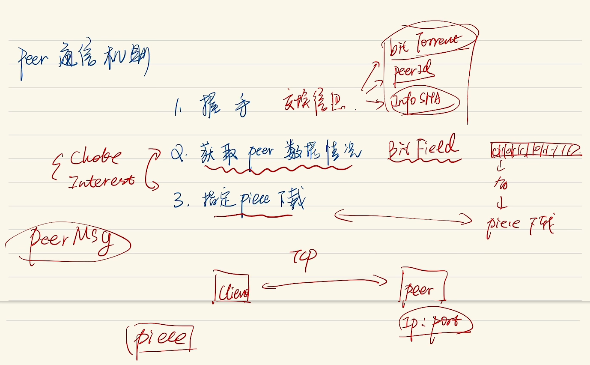

# Go手写一个BT下载器
B站上面大神的项目。

# BitTorrent下载的原理
虽然我不清楚细节，不过我想就是 P2P的核心概念；

以前（或者说很久以前）是**中心化**下载，很明显这种方式，对于客户端来说，服务器的带宽就决定了cli的顶级速度
所以当用户（客户端的数量）越来越多的时候，体验就会显著降低。

P2P就是点对点传输，是一种（应该是）分布式的思想。

细节不知道说清楚了没有，反正BT下载器的核心思想就是：
把**文件分成一个个的片（piece）**，有哪个节点（peer）想要下载，就从其他所有的结点里面去下载数据就行；
是**人人为我，我为人人**的体现。我个人认为这就是图这种DS的体现；

要实现基本的BT下载，有两个要解决的问题：
1. （你要下载的东西在别人的电脑里面，你要怎么知道你要从谁的电脑里面去下？） How to find peers?
1. 第二，你要怎么下呢？

第一个问题可以通过**中心的思想**，之前中心的思想是应用在下载上面，下载的带宽要求大；但是现在就相当于只要提供一个信息：**谁的电脑里面要你想要的东西**，这样带宽压力几乎没有；

第二个问题的话： 如歌从多个peers里面下载一个完整的文件呢？
这里的话用的是一种比较原始的方法： 把一个文件分割成多个片（piece），然后加上各种覆盖的信息，下载的时候根据各种选择信息去下载就可以了。


那么在**代码层面**的实现：
bt下载有一个文件叫做种子文件：TorrentFile,
它实际上就是一个info的文件，包含了各种下载文件需要的**信息**，这个文件不大，只有几kb而已；
里面的信息大概是这个样子：


那么很容易就想到： 一个torrent文件实际上是可以用文本格式打开的，里面的内容就是协议里面的那些；

## Bencode 协议
这个协议的内容很简单：他只能支持传输**四种**数据类型

为了方便起见，把 Bencode支持的这**四种数据结构统称为 BObject**。

顺便一提这种协议的格式**有点像Python或者toml那种，对空格和缩进的要求比较严格之类的**
反正不要去寄；

Bencode这个协议的优点：
- 相比于json类型简单，呃我不是特别能理解
- 这个协议特别适合网络传输：从第一个字符就可以知道对应data的类型，然后决定对应的逻辑；

既然如此，解析 TorrentFile就肯定是一个必须的工作，所以我们先从这个开始：

## 整个程序的编码的逻辑
大概就按照这个截图的来：


# 实际编写Bencode库
Bencode库实际上就是实现 bencode协议的**序列化和反序列化**；

首先是四种bencode支持的数据类型：str、int、list和dict

定义 BObject和对应转换的方法：
```go

// 这里是待会解析出错的话，需要返回的错误类型
var (
	ErrNum = errors.New("expect num")
	ErrCol = errors.New("expect colon")
	ErrEpI = errors.New("expect char i")
	ErrEpE = errors.New("expect char e")
	ErrTyp = errors.New("wrong type")
	ErrIvd = errors.New("invalid bencode")
)

// BType 通过类似状态码的方式来标记类型的，所以直接用一个字节表示完全足够
type BType uint8

// 定义 BType的枚举，照着原作者写的直接来的，应该有更优雅的方案，不过算了
// Bencode 协议支持四种类型：str，int，list，dict
const (
	BSTR  BType = 0x01
	BINT  BType = 0x02
	BLIST BType = 0x03
	BDICT BType = 0x04
)

type BValue interface{}

// BObject 就是由类型表示和具体的值组成，相当好理解的一个定义方式。
type BObject struct {
	type_ BType
	val_  BValue
}

// 将BObject转换成实际的数据类型的方法
// 可以理解 Go接口的类型断言了
// 四种类型的转换思路一致，所以只做一个的注释

// Str 用于把BObject转换成 string类型
func (o *BObject) Str() (string, error) {
	if o.type_ != BSTR {
		return "", ErrTyp
	}
	return o.val_.(string), nil
}

func (o *BObject) Int() (int, error) {
	if o.type_ != BINT {
		return 0, ErrTyp
	}
	return o.val_.(int), nil
}

func (o *BObject) List() ([]*BObject, error) {
	if o.type_ != BLIST {
		return nil, ErrTyp
	}
	return o.val_.([]*BObject), nil
}

// Dict 为了简单实现，只允许 Dict的Key是 String类型的。
func (o *BObject) Dict() (map[string]*BObject, error) {
	if o.type_ != BDICT {
		return nil, ErrTyp
	}
	return o.val_.(map[string]*BObject), nil
}
```

这里弄完之后得到的只是 BObject的val的字面值，接下来要好好就是具体的en和de的过程：

整个序列化与反序列化好像是用流的方式实现的来着？


# Tracker交互
  
从这开始不知道为什么状态总是不怎么好...大概写一下步骤：
与Tracker交互使用Http协议，
通过buildUrl函数从 TorrentFile中解析出 url地址来；

然后就是通过 go的net库来获取Peers的信息了。
具体的逻辑在 FindPeers函数里面
```go
// FindPeers 返回Peer结点的信息 Slice
func FindPeers(tf *TorrentFile, peerId [IDLEN]byte) []PeerInfo {
	// 通过 buildUrl方法获取 url
	url, err := buildUrl(tf, peerId)
	if err != nil {
		fmt.Println("Build Tracker Url Error: " + err.Error())
		return nil
	}

	// 发送get请求并获取相应
	cli := &http.Client{Timeout: 15 * time.Second}
	resp, err := cli.Get(url)
	if err != nil {
		fmt.Println("Fail to Connect to Tracker: " + err.Error())
		return nil
	}
	defer resp.Body.Close()

	trackResp := new(TrackerResp)
	err = bencode.Unmarshal(resp.Body, trackResp)
	if err != nil {
		fmt.Println("Tracker Response Error" + err.Error())
		return nil
	}

	return buildPeerInfo([]byte(trackResp.Peers))
}
```

# 实现Peers通信
步骤很简单，但是细节很多
贴截图：


握手调用 handshake函数
握手使用的一个数据报的内部是：
第一部分，一个字节的大小，用来**指定第二块的长度**
第二部分，用来指定所使用的的协议，在这里就是 BitTorrent协议了；因为固定所以是19个字节
第三部分：八个字节的大小，用于协议的拓展，在这个玩具程序中相当于没用；
第四部分：InfoSHA
第五部分：peerId

通过fn handShake来处理握手的逻辑：
就是基于tcp的握手逻辑，在fn的最后判断一下两次的 InfoSHA是否一致。

整个PeerConn的流程的话：
Client <----> Peer进行一个通信
通信的这个过程，抽象成一个结构体：PeerConn
关于NewConn这个函数的话：主要的步骤就是：
1. 一开始设置指定的地址；
1. 开始握手
1. 没有问题的话，就实例化一个刚刚的那个结构体出来，字段直接填充进去，choke填充true，表示默认对上传行为不感兴趣。
此时就有一个已经建立连接的东西了。

PeerConn的话，下一步就是建立下载。

# 并发下载
首先说一个 PeerMsg这个东西；
这个东西定义的是与其他peer进行通信的时候的一个数据报，
有一个字段id表示该数据报的状态。
具体的含义我写在代码中：

```go
const (
	MsgChoke       MsgId = 0 // Choke & Unchoke is about UPDATE;
	MsgUnchoke     MsgId = 1
	MsgInterested  MsgId = 2 // Interested & NotInterest is about DOWNLOAD;
	MsgNotInterest MsgId = 3
	MsgHave        MsgId = 4
	MsgBitfield    MsgId = 5
	MsgRequest     MsgId = 6 // MsgRequest means a true download request.
	MsgPiece       MsgId = 7 //
	MsgCancel      MsgId = 8
)
```

回忆一下前面讲到的内容，
首先是通过 Tracker（可以获取Peer信息的一个服务器（再让我细分的话，其实这个东西也可以算索引的一种应该是））
然后与 peer通过握手建立 conn

这是之前提到的内容。

现在的话，把整个下载的过程抽象成一个结构体：TorrentTask（后面简称ToTask）

这个结构体中有字段peerid，peerlist。。。。好像和之前那个结构体的样子非常类似；

然后建立的这个 ToTask是一个大任务（也就是说一般来说不能直接把这个东西直接下载下来）
每次执行的下载任务其实是 ToTask的一个小任务：也是一个结构体： pieceTask
里面的内容就是 Index、sha（用于验证的）还有length（其实只有文件的最后一部分会小一点）

都写到这里了可以看一下代码：
```go
// Defination of struct TorrentTask
// TorrentTask Defination of struct TorrentTask.
// But every task won't be this.
type TorrentTask struct {
	PeerId   [20]byte
	PeerList []PeerInfo
	InfoSHA  [SHALEN]byte
	FileName string
	FileLen  int
	PieceLen int
	PieceSHA [][SHALEN]byte
}

// 实际上每次执行下载任务的结构体，但是它不对外暴露。
type pieceTask struct {
	index  int
	sha    [SHALEN]byte
	length int
}
```

实际上整个并发下载的过程就是一个标准的生产者消费者的模型：
pTask是生产者，负责产生待完成的任务；
一个个待连接的peer就是消费者，他们负责完成对应的下载任务，完成一个继续下一个；

用Go的并发模型来抽象的话，pTask就放在channel里面，而一个个向peer的请求就可以交给 Goroutine。

**提一下**
BitMap(BitField)好像是用来判断Client有没有对应的内容的，如果有就不下载了。

当一个 pieceTask完成之后，会被封装成一个 Result，也要放入到channel里面去， 等待校验；
成功会放入buffer，最后组成文件。（file）

**大概**就是所有的全过程。

还有一个结构体 taxState 用于表示 下载这个piece的中间状态，

```go
// taskState shows(and maybe check) a middle status about a goroutine.
type taskState struct {
	index      int
	conn       *PeerConn // Provide a pointer about PeerConn.
	requested  int // Still need
	downloaded int // Already have
	backlog    int // concurrent size 并发度
	data       []byte
}
```

Download函数的逻辑：
```go

// Steps：
// 1. 创建两个通道：一个是用来生产任务的；一个是用来做验证时的生产者的；
// 2. 把一个大的 TorrentTask分割成小的pieceTask丢到 channel里面去；
// 3. 用Goroutine去处理下载任务即可；这里涉及到另外一个重要的fn
// 4. 下一步做数据的校验和文件处理，不算核心，所以只大概提一下


func Download(task *TorrentTask) error {
	fmt.Println("start downloading " + task.FileName)

	// split pieceTasks and init task&result channel
	taskQueue := make(chan *pieceTask, len(task.PieceSHA)) // The cap of channel is len(pieces);
	// NonCache channel, because we deal with one at a time.
	resultQueue := make(chan *pieceResult)
	// Split TorrentTasks into pieceTasks, then throw them into channel;
	for index, sha := range task.PieceSHA {
		begin, end := task.getPieceBounds(index)
		taskQueue <- &pieceTask{index, sha, end - begin}
	}
	// init goroutines for each peer
	// looks like Routine has a syntax error...
	for _, peer := range task.PeerList {
		go task.peerRoutine(peer, taskQueue, resultQueue)
	}
	// end. Then each goroutine will finish the piece tasks above all.
	// collect piece result
	// 简单处理下载好的数据到一个 []byte里面
	buf := make([]byte, task.FileLen)

	count := 0
	for count < len(task.PieceSHA) {
		res := <-resultQueue
		begin, end := task.getPieceBounds(res.index)
		copy(buf[begin:end], res.data)
		count++
		// print progress
		percent := float64(count) / float64(len(task.PieceSHA)) * 100
		fmt.Printf("downloading, progress : (%0.2f%%)\n", percent)
	}
	close(taskQueue)
	close(resultQueue)
	// create file & copy data
	file, err := os.Create(task.FileName)
	if err != nil {
		fmt.Println("fail to create file: " + task.FileName)
		return err
	}
	_, err = file.Write(buf)
	if err != nil {
		fmt.Println("fail to write data")
		return err
	}
	return nil
}
```


