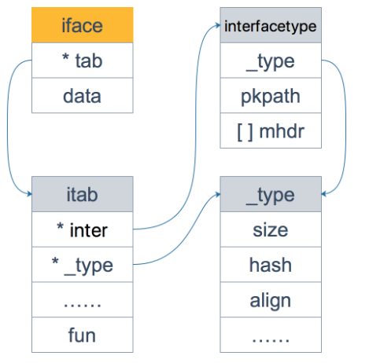

# Go接口
Go用两个 struct来描述接口：`iface`和`eface`
为什么是两个呢？因为go是要区别带有方法的接口和不带任何方法的空接口的；
虽然他们**都被叫做接口实际上是两个东西**。记住这点就行。

# iface
维护两个字段：
一个指向相关元数据的指针（这里是我自己造的词语）：
主要用来描述**接口本身的类型信息**和**实现了接口方法的，具体实现类的类型信息**，所以其实是**记录了两个类型的信息**；
还有一个unsafe.Pointer指向一个堆内存的空间（像是Java的实例所处的位置）

## 关于 itab
这个就是存储的和接口类型有关的各种**类型信息**：
inter（face）字段就是**接口本身的类型信息**；
type就是描述的**实体的类型信息**；
fun这个字段则放置： 实体类型实现了接口方法的**方法的地址**

就这三个字段比较重要；
当一个接口类型调用一个方法的时候，实际上调用的应该就是fun这个字段的方法了；
所以当`_type`发生变化的时候，对应fun应该也会发生变化。
顺便一提，fun只存接口方法的地址，实体类型的**其他方法是不存的**。

为什么fun的类型是一个大小为1的数组呢？
这无关紧要，实际上是在这个方法之后连续存储的，相当于c语言里面**数组的地址等同于数组第一个元素的地址一样**

> 另外，你可能会觉得奇怪，为什么 fun 数组的大小为 1，要是接口定义了多个方法可怎么办？实际上，这里存储的是第一个方法的函数指针，如果有更多的方法，在它之后的内存空间里继续存储。从汇编角度来看，通过增加地址就能获取到这些函数指针，没什么影响。顺便提一句，这些方法是按照函数名称的字典序进行排列的。

而interfacetype 类型，它描述的是接口的类型：
> 可以看到，它包装了 _type 类型，_type 实际上是描述 Go 语言中各种数据类型的结构体。我们注意到，这里还包含一个 mhdr 字段，表示接口所定义的函数列表， pkgpath 记录定义了接口的包名。

# eface
空接口就简单多了。

因为空接口本身就是用来描述任意类型的（应该）
所以对应的eface里面的字段就：
type描述的就是实体的类型；
data自然就是数据的指针了。

结论：
iface 及 eface 结构体的字段是可以联系起来的：两个函数都是将参数组装一下，形成最终的接口。

# 接口的动态类型以及动态值
一句话总结：
iface里面包含的两个字段： tab是类型指针，data是具体值指针，只有两个都为nil的时候，接口的值才完全是nil。
动态的意思是：接口的实体类型发生改变时， tab和data两个也会对应的发生改变。

# Go编译器自动监测类型是否实现接口
Go通过 隐式类型转换的时候判断 **右边的实体类型有没有自动实现左边的接口类型**。