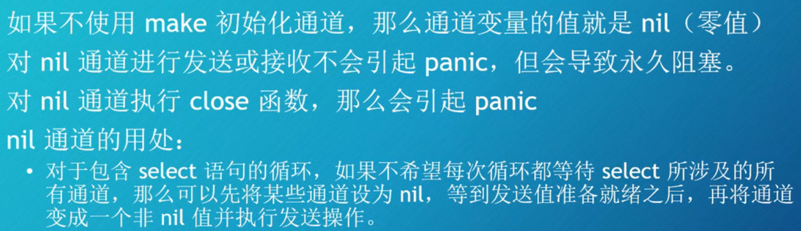

# Go语言教程
# 第一章
**使用Printf来格式化输出**
Printf的第一个参数必须是字符串.
好像go没有自动强转这个功能?
**使用var或者const同时声明多个变量或者常量**
```go
package main

import(
	"fmt"
)

func main(){
	const TEAM_NUMBER = 10
	// var work = "I"

	// The first declaration of var
	var number1 = 5
	var number2 = 4

	// The second declaration of var
	var (
		number3 = 114514
		number4 = 1919810
	)

	// The second declaration of var
	var number5, number6 = 1, 4
	fmt.Println("Hello, Go! ")
	fmt.Println("Now we'll start a var declaration console application.")
	fmt.Printf("A number is %+v\n", 104.5+6)	
	fmt.Println(number1, number2)
	fmt.Println(number3, number4)
	fmt.Println(number5, number6)
}
```

**赋值符**
go也存在 *= 这种写法

**go的随机数**
使用rand包可以生成伪随机数
**Boolean类型**
在Go中, 只有true是真的, 只有false是假的. 不接受其他值.
**分支语句**
if和大多数的编程语言是一样的, 不过go的没有括号.
switch的判断类型可以使用number和string
case语句**不需要使用break进行分割**, 执行完一个case就会退出switch结构.
如果想象java那样去执行下一个case语句, 可以使用关键字fallthrough. 这种设计和C以及Java是相反的.

**循环语句**
Go 语言的 For 循环有 3 种形式，只有**其中的一种使用分号**。
for如果不跟条件, 就是无限循环. 
break跳出循环. 
```go
// 第一种for, 和C语言的一样
for init; condition; post { }

// 第二种, 只写条件
for condition {}
// 第三种, 无限循环, 通过 break 控制
for {
    if condition {
        break
    }
}


```


**变量的作用域**
Go里面 \{\} 就是作用域的范围.
和主流的编程语言是一样的.
**短声明**
var count = 10 和 count := 10 是一样的
短声明可以在var无法使用的地方使用.
例如 for, if, switch的条件表达式的位置使用短声明, 而var不行. 

如果变量被声明在package的作用域的话, 在package内的多个函数都能使用. 短声明不可用来声明package作用域的变量. 

# 第二章
**go的浮点类型**
只要一个数含有小数部分, 那它的类型就是float64
如果需要指定float32, 那么你需要提前声明好变量的类型就是float32
**零值**
Go语言的每一个数据类型都有一个默认值, 他被称作零值.
当你声明变量却不进行初始化的时候, 它的值就是零值.

**使用%f进行格式化**
**浮点类型的计算**
由于精度的四舍五入的问题, 推荐运算时先做乘法, 再做除法
浮点数的比较, 因为精度的问题, 所以不能直接用运算符去比, 
**go里面的整数类型**
共同特点:
- 不可以存小数部分
- 范围有限
- 通常根据值的大小范围来确认使用哪种数据类型
- 五种有符号数, 五种无符号数

int的无符号类型: uint
整数的默认类型推断就是int

以此类推的int8, int16, int32, int64. 如果一个数有用科学记数法的e来表示(这种数字被称为**指数类型**), 那么它的类型默认就是int64

一个不相关的: Printf中可以使用%T打印出变量的数据类型

uint8 适合用来存储颜色: (RGB: 0-255)

和很多编程语言一样的, 数字前面加上0x就可以表达16进制


"**整数环绕**"行为: 实际上应该叫溢出才对
例如如果一个uint8的数在值为255的情况下++, 那么它的值会变成0, 也就是在所能表示的范围内循环.
其他语言差不多.

**bit位的打印**
Printf中使用%b来规范.

**Go里面的大数表示**
1. 使用Int64, 不够?
1. 使用Uint64, 还不够?
1. Go提供了一个big包

big.Int: 大于10的18次方的整数
big.Float 任意精度的浮点数
big.Rat 分数

关于big包里面一些需要注意的部分:
一旦使用了big.Int, 那么等式里面的其他部分也必须使用big.Int
NewInt()函数可以把int64类型的数转换为big.Int类型
而不能转换大于int64的数字, 因为这个函数接收的参数类型是int64的

需要这么做:
1. new 一个big.Int出来
1. 通过setString函数将数字对应的字符串形式以及几进制传入即可.

下面的代码不做解释, 因为我自己也难说清楚
通过字符串来创建一个大数
```go
func main(){
	distance := new(big.Int)
	distance.SetString("2600000000000000000", 10)
	fmt.Printf("It's value is %v, and it's type is %T", distance, distance)
}
```

**关于大数常量**
const定义的类型相比var和短声明, 多了一种叫做无类型(untyped)的类型.

针对字面值和常量的计算都是在编译期间完成的.

**字符串的字面值和原始字符串的字面值**
首先从语法层面: "" 字符串, `` 原始字符串, 不包含转义字符

Code Points, bytes等: Unicode编码中的每个字符都是用数字表示的, go为他们创造了专门的数据类型, 通常是已知类型的别名: rune: int32, byte: uint8

引出类型别名: 类型别名就是同一个类型的另外一个名字.
所以, rune 和 int32互相使用是不会报错的. 起别名只是为了方便而已.
使用 type 关键字可以定义别名.
```go
type byte = uint8
type rune = int32
```

**使用%c来直接打印编号对应的字符**
**String本身是不可变的**
**range关键字**
go的关键字range可以遍历**数组, 切片, 通道, map**, 返回**索引**和对应的值.
```go
// 使用配合range使用for循环
for index, value := range []int {} ...
```

使用range遍历字符串时会**考虑字符串编码大小不等的情况**
使用单下划线可以不接受参数

**类型转换**
go里面不会自动强转.并且类型也不能混用.
比如字符串和数字不能混用, 整数和浮点数也不能混用.
需要类型转换需要用目标类型加一个括号来完成.

go里面的类型判断很严格

# 第三章
**函数声明**
在go里面, 包里**大写字母开头**的函数, 变量, 标识符等会被导出, 其他包可见.
**小写字母开头的不行**

类比Java, 大写相当于public, 小写相当于private

**可变参数函数**


**func 传递参数是按值传递**

**声明新类型**
使用type关键字可以声明新类型.
```go
type name string
var school_name name = "特雷森学园"
```
使用type可以提高代码的可读性. 
不过, 如果使用type定义了新类型, 即使它们底层的结构一样, 它们也因为**数据类型不同不能进行混用**

go中没有显示定义类和对象, 

可以将**函数**与type定义的新**类型相关联**, 使得它成为方法.
重点是: 关联. 注意原生类型不可以添加关联的方法. 

然后像Java等语言一样直接去调用即可. 

**头等公民**
和大部分面向对象语言不同, 在go里面函数是头等公民, 可以像值一样的赋给变量, 不能加括号, 代表func没有执行.

疑问: 一个之前接受了函数类型的变量, 不能接受返回值为其他类型的新的函数类型. 
函数也可以作为值传递给其他函数. 

**闭包和匿名函数**
关于闭包, 我的理解:
有这么一种需求, **外部的作用域需要访问内部的局部变量**. 使用一般的代码完成的话代码量非常复杂. 闭包就是来简化这个问题的.
闭包是一种函数式编程(lambda表达式, 匿名函数,)的思想
匿名函数就是**没有名字的函数**. Go里面又称函数字面值.

## 第三章结束
# 第四章
**数组**
任何情况下, 一旦数组的长度确定, 他就**不能再改变了**.

go中数组作为参数传递的时候, 是**值传递**. 效率比较低.
数组的长度也是也用于数据类型的确认:
- 尝试将长度不符的数组作为参数传递将会报错.

函数中一般不使用数组作为参数, 而是使用slice(切片) 作为参数.

**Slice(切片)** 动态数组?
Slice是指向数组的窗口, 是数组的视图.
切片是数组的切分. 使用的是左闭右开区间.

切片的默认索引: (起始索引和结束索引可以不写)
默认是0和数组长度
索引不能是负数. (Python好像可以是负数?)

切片也可以用来切分字符串.
```go
var plant = "neptune"
tune := plant[3:]
fmt.Println(tune)
plant = "earth"
fmt.Println(tune)
```

以上两次的输出结果都是tune. 
Slice根据字节数而不是rune来进行切分.

slice有一种简写的声明方式: contentSlice := []string{...} , 所谓的复合字面值.
append 是slice的常用函数.
参数是一个slice以及后面的可变参数

**Slice的长度和容量**
Slice的底层是数组. 很明显.
slice 的大小相关的概念有两个: 长度和容量.
Slice中可见元素的个数决定了slice的长度. len(s slice)
Slice底层数组的长度决定了Slice的容量. cap(s slice)

slice容量不够会扩增两倍容量.

**Slice的三索引切分**
Go1.2 中引入了能够限制**限制新建切片容量**的三索引.
可以自定义切片的的capacity.

**使用make函数对slice进行预分配**
当capacity不足时, go会进行深拷贝. 不过通过内置的make函数, 可以对slice进行预分配.
make([]any{}, len int, cap capacity)

不传第三个参数时, 代表 len = cap

总之, make是为了**提升性能**用的

**可变参数的函数**
声明可变参数的函数, 需要在parameters的最后一个参数前加一个 省略号 ...

**集合的 ... 操作符**
使用 ... 可以展开集合
多用于可变参数函数的传参.

**Golang 中的map**
声明
```go
// key为 string, value为 int
map [string] int
```

如果对应的key不存在, 就返回value类型的零值. 
当然这种做法不适应于业务逻辑判断;
go里面提供了 ",与ok" 的写法 
+ [ ] 暂时不知道怎么写

map的值**不会被复制**
类似Java的引用类型.

delete 函数可以删除map的键. 
**make函数对map进行预分配**
如果初始化map的时候没有对map赋值, 那么**必须使用内置的make函数**来为map**分配空间**.
api: 
make(map的类型, 容量大小)
使用make初始化的容量为0

**使用map作为计数器**
通过map统计slice中的元素(体现在key上)以及他们的重复次数(体现在value上)

**注意!**使用range遍历map的时候, 顺序是无法保证的. 

**结合slice和map实现数据分组**
```go
package main

import (
	"fmt"
	"math"
)

func main() {
	temperatures := []float64{
		-28.0, 32.0, -31.0, -29.0, -23.0, -29.0, -28.0, -33.0,
	}
	groups := make(map[float64][]float64)

	for _, t := range temperatures {
		g := math.Trunc(t/10) * 10
		groups[g] = append(groups[g], t)
	}

	for g, temperatures := range groups {
		fmt.Printf("%v: %v \n", g, temperatures)
	}
}
```

**使用map实现set**
go默认不提供set.
通过将value设置为bool的方式来设置.

**range按照某种顺序输出**

## 第四章结束
# 第五章
**Go语言的结构体**
思想和C语言的结构体是一样的.

**通过type关键字复用struct结构体**
**使用fmt.Printf打印struct**
使用%v 直接输出value.
使用%+v 输出key: value

**struct的拷贝**
struct会完整复制一次. : 值传递, 深拷贝

**将struct编码成json数据**
包 "encoding/json" 的Marshal函数可以将struct中可以导出的字段(字段首字母大写代表对外可见)进行编码.
Go中要求使用驼峰命名法来命名字段. 
不过如果有需要使用下划线(蛇形命名规范), 需要在 struct 中单独声明一个标签
例如
```go
type Location struct {
    Lat float64 `json:"latitude"`
    Long float64 `json:"longitude"`
}
```

**go语言没有class**
go没有类, 没有对象, 没有继承

不过可以通过struct和函数方法化来实现面向对象.

**组合和转发**
在面向对象的世界中, 对象由更小的对象组成.
Go语言没有class, 通过struct实现组合. (composition) 其实就是类型组合或者struct组合. 
Go还提供了一个叫做"嵌入(embedding)"的特性, 他可以实现方法的转发.

组合可以实现类似 OOP 中继承的效果.
组合是一种更加灵活, 更加简单的方式.(用起来确实, 至于写起来嘛...)
现阶段来看无疑是面向对象更加简单.

**struct嵌入**
用法是 在struct中指定成员的时候只指定类型而**不指定字段名**;
这用可以直接**通过struct本身**调用**内部**成员的方法. 
当这样编码时, 
- struct直接通过类型名调用成员;
- struct可以直接调用成员的方法;
- struct中可以转发任意类型. 

**接口**
**接口定义规范**, 这在其他语言里面也是一样的. (Java, C#, Python)

Go语言接口的实现不需要**显式声明**
换句话说, go的接口是隐式满足的.

为了方便复用, interface一般都会声明成一个新的type. 

go的接口非常灵活.

## 第五章结束
# 第六章
这里的指针和C语言的是一样的, 指针变量用于**指向另一个变量的地址**
Go语言的指针比较安全, 不会出现迷途指针. 

和C语言一样, go也使用 &和* 符号.
&就是地址操作符, 通过&可以获得变量的内存地址.
*是解引用符, 提供内存地址指向的值.

**注意**在go里面无法通过&符号获得 string, number, bool 字面值的地址. (会直接报错)
```go
// fatal error
pNumber := &75;
```


C语言中可以pointer++这种指针运算可以通过编译, 但是go不行, 因为这不安全.

go的指针类型和其他的类型是一样的.

指针的相等判断是内存地址相等就判断相等.

如果指针指向结构体, 那么通过指针调用结构体的成员的时候可以不用写\*号. (也可以写)

**指针指向数组**


和C语言不一样, 数组和类型在go中是两种类型. 

使用指针可以实现类似Java中的引用的效果.

**隐式指针**
go里面一些内置类型在底层就是指针类型: map, slice

map的key和value都可以是指针.

slice本质上就是由:
- 底层数组的指针
- slice的容量
- slice的长度
组成的.

**nil**


nil的东西太多了...只能慢慢应用的时候去记忆了.

**错误**
error是一个内置类型, 不讲.

**defer关键字**
有点类似Java的finally, 它会函数return前执行.


**error的new方法**
可以用来自定义error
...

## 第六章结束
# 第七章
## go的并发
这是go受欢迎的一个重要原因

**goroutine**
特点


使用go关键字就可以开启一个goroutine. 

有点类似kotlin的routine, 当主goroutine(?)停止时所有的goroutine都会停止. 

每次使用go都会产生一个新的goroutine. 这些goroutine在底层并非真的并行执行(计算机的底层限制).

类似函数传值, goroutine也是值传递.

go的channel(通道)机制
**channel**
- 使用channel可以在多个goroutine里面安全的传值.
- channel也是一种类型, 可以用作变量, 函数参数, 结构体字段...
- 创建channel使用make函数, 并指定传输的类型
```go
// 创建一个可以传输int类型数据的通道
c := make(chan int)
```

**通过channel发送和接受数据**
使用 <- 操作符 来像channel里面发送或者接受数据.
```go
// 向管道发送值
c <- 99
// 接受值
port :=<- c
```

**使用select处理多个通道**
一个通道只能处理类型相同的值.

time.After 函数

select 可以看做是一种特殊的 switch 语句, 它的每个case值都持有一个通道.
select会等待某个case的分支操作就绪, 然后执行该case分支.
?

不使用make初始化channel的话, channel的值就是零值nil

对nil通道操作会导致一系列的问题:


**阻塞和死锁**
引起goroutine堵塞的情况: goroutine等待channel的发送或接收时.
如果这个条件永远无法达成则会造成死锁.

go允许在没有值可供发送的情况下关闭通道. 
关闭后channel无法写入任何值, 否则会panic.

通常, 会有一直从channel读取数据知道它关闭的需求, go提供了range关键字用来替代 逗号ok的繁琐写法.

**go的并发状态**
go在写入事务的时候, 会产生竞争条件(race condition).

go的锁机制
Lock(), 相当于加锁, 这个goroutine正在使用共享值, Unlock() 相当于归还.


