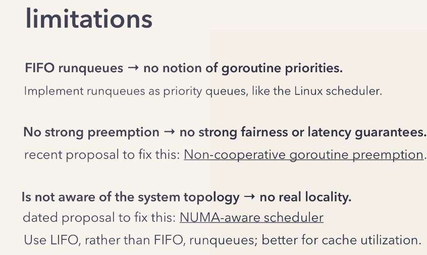
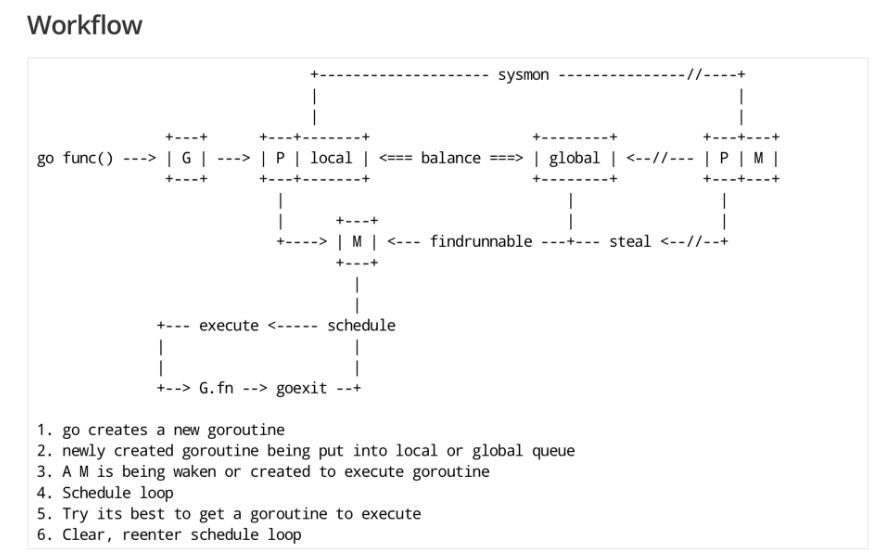
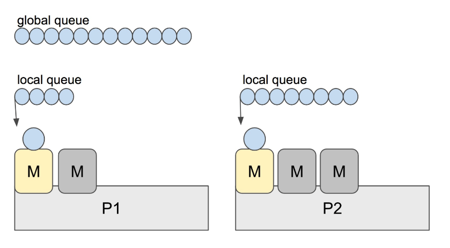

# Go调度器
# goroutine 和线程的区别
如果问到这个，从三个方面去讲：
内存消耗、创建和销毁、切换；

## 内存消耗
普通的任务在并发时根本不需要使用原生的thread（一个goroutine大小为2kb，而一个thread为4m），所以需要根据业务的性能消耗的粒度来区分一个并发单元的大小。

goroutine只是直接帮你做了这个事情，用其他语言一样可以做。

## 创建和销毁
通常认为thread的使用代价巨大，所以一般会使用thread pool的方案；
而goroutine因为代价小的缘故，一般可以肆无忌惮的使用。

没有本质的区别。

别忘了Go可是一门现代语言。

## 切换
因为尾大不掉的缘故，thread的切换涉及到16个寄存器。
而goroutine只涉及到三个寄存器。


可以说goroutine的这些有点，如果thread有办法优化的话，也可以做到。


# Go Scheduler（调度器）
Go的用户程序分为“用户程序”和“运行时”两个部分。（runtime相当于守护进程）

诸如协程创建、通道交流、内存分配等过程都有runtime来负责。

Goroutine的调度由Scheduler负责调度。指定运行Goroutine的实际的thread。 它是Go程序并发效率高的核心。


# Scheduler的底层原理
再次强调一下，站在操作系统的角度是**看不见Goroutine的存在的**。它仅仅是runtime时的概念。

g 代表一个 goroutine，它包含：表示 goroutine 栈的一些字段，指示当前 goroutine 的**状态**，指示当前运行到的**指令地址**，也就是 PC 值。

m 表示操作系统内核线程，包含正在运行的 goroutine 等字段。

p 代表一个虚拟的 Processor，它维护一个处于 Runnable 状态的 g 队列，m 需要获得 p 才能运行 g。

PC值，在计算机科学中，通常指**程序计数器**(Program Counter)的值。（我的理解是：相当于Next方法）它是一种用于存储CPU中下一条指令执行的内存地址的寄存器，也就是当前正在执行的指令在存储器中的地址或序号。在一般情况下，CPU每次执行完一条指令后，PC值会自动加1或为其它规定的值，以便取出存储器中下一条要执行的指令。当程序需要跳转到其它位置时，需要将PC值修改为需要执行的指令地址，以此实现跳转到指定位置执行相应指令操作。


在Go的早期版本中，并没有P这个结构，使得只能M通过全局锁来获得G，锁的效率较低。 后面用一个独立P来维护一个处于运行状态的G。取消了全局锁。

## Sched的三个核心操作
1. reuse threads；复用线程，这一点就是线程池的思想，核心就是 **不要让thread反复的创建和销毁，这两个行为是需要成本的**。
2. 限制同时运行（不包含阻塞）的线程数为 N，N 等于 CPU 的核心数目；（限制并发的数量，提高每一个thread运行时的性能）。**少即是多**。
3. 不要让thread闲置：线程私有的 runqueues（运行队列），并且可以从其他线程 stealing goroutine 来运行，线程阻塞后，可以将 runqueues 传递给其他线程。

至于为什么不直接把Goroutine的信息放到thread上的原因是因为要实现“工作窃取”的功能。当一个thread blocked的时候，把与他绑定的p上的Goroutine转移到其他的thread上运行，（防止这些Goroutine饿死？）

并且，协作式调度时，针对长时间运行的Goroutine，它有惩罚机制：
将其转移到global runqueues上，这是一个**运行优先度低**的队列。



`runtime.NumCPU()`这个函数打印的是机器的逻辑核心数；根据上面的N原则，在一个go程序初始化的时候，会分配N个os级别的thread，然后每一个 thread会绑定一个Processor；

并且关于存储 runqueues的队列：可以分为全局队列和每个P的本地队列。 全局是优先度低的那个；

尽管Go的底层是协作式调度，但是它是由runtime控制的，并非由用户控制，所以仍然可以将它看做抢占式。

下面这张图是启动一个Goroutine的工作流：


# 可预测的sched调度的时机
1. new Goroutine：使用go关键字创建一个新的协程
1. gc：gc也运行在一个Goroutine，并且肯定的，它的优先级要更高
1. syscall：如果涉及系统调用，会阻塞对应的m，此时会发生调度
1. 内存同步访问：涉及到锁、原子性操作、通道阻塞时，会等待其他的Goroutine进行同步，这种发生阻塞的情形也会发生调度。

# M:N模型
说的是协程和其对应的协程的数量关系。 
这里我有一点小问题...

在同一时刻，一个线程上只能跑一个 goroutine。当 goroutine 发生阻塞（例如上篇文章提到的向一个 channel 发送数据，被阻塞）时，runtime 会把当前 goroutine 调度走，让其他 goroutine 来执行。目的就是不让一个线程闲着，榨干 CPU 的每一滴油水。

# 工作窃取（work stealing）
目的是为了不让已经执行完任务的thread闲着：

sched的一个重要职责就是要保持所有的threads有均匀的Goroutine。



实际上，Go scheduler 每一轮调度要做的工作就是找到处于 runnable 的 goroutines，并执行它。找的顺序如下：

本地队列（LRQ） -> 全局队列（GRQ） -> 其他的协程（Other LRQ），并且偷取一半的P放入队列。

# GMP模型源码
## G
就是Goroutine。主要保存 goroutine 的一些**状态信息**以及 CPU 的一些寄存器的值，例如 IP 寄存器，以便在轮到本 goroutine 执行时，CPU 知道要从**哪一条指令处**（个人理解就是断点处）开始执行。

调低CPU： 寄存器中的信息存储到g结构体中；
被调度运行： g结构体中的信息**恢复到寄存器中**

go1.18 runtime2.go
```go
type g struct {
	// Stack parameters.
	// stack describes the actual stack memory: [stack.lo, stack.hi).
	// stackguard0 is the stack pointer compared in the Go stack growth prologue.
	// It is stack.lo+StackGuard normally, but can be StackPreempt to trigger a preemption.
	// stackguard1 is the stack pointer compared in the C stack growth prologue.
	// It is stack.lo+StackGuard on g0 and gsignal stacks.
	// It is ~0 on other goroutine stacks, to trigger a call to morestackc (and crash).

    // 这个就是Goroutine使用的栈
	stack       stack   // offset known to runtime/cgo

    // 并且因为
	stackguard0 uintptr // offset known to liblink
	stackguard1 uintptr // offset known to liblink

	_panic    *_panic // innermost panic - offset known to liblink
	_defer    *_defer // innermost defer
	m         *m      // current m; offset known to arm liblink
	sched     gobuf
	syscallsp uintptr // if status==Gsyscall, syscallsp = sched.sp to use during gc
	syscallpc uintptr // if status==Gsyscall, syscallpc = sched.pc to use during gc
	stktopsp  uintptr // expected sp at top of stack, to check in traceback
	// param is a generic pointer parameter field used to pass
	// values in particular contexts where other storage for the
	// parameter would be difficult to find. It is currently used
	// in three ways:
	// 1. When a channel operation wakes up a blocked goroutine, it sets param to
	//    point to the sudog of the completed blocking operation.
	// 2. By gcAssistAlloc1 to signal back to its caller that the goroutine completed
	//    the GC cycle. It is unsafe to do so in any other way, because the goroutine's
	//    stack may have moved in the meantime.
	// 3. By debugCallWrap to pass parameters to a new goroutine because allocating a
	//    closure in the runtime is forbidden.
	param        unsafe.Pointer
	atomicstatus uint32
	stackLock    uint32 // sigprof/scang lock; TODO: fold in to atomicstatus
	goid         int64
	schedlink    guintptr
	waitsince    int64      // approx time when the g become blocked
	waitreason   waitReason // if status==Gwaiting

	preempt       bool // preemption signal, duplicates stackguard0 = stackpreempt
	preemptStop   bool // transition to _Gpreempted on preemption; otherwise, just deschedule
	preemptShrink bool // shrink stack at synchronous safe point

	// asyncSafePoint is set if g is stopped at an asynchronous
	// safe point. This means there are frames on the stack
	// without precise pointer information.
	asyncSafePoint bool

	paniconfault bool // panic (instead of crash) on unexpected fault address
	gcscandone   bool // g has scanned stack; protected by _Gscan bit in status
	throwsplit   bool // must not split stack
	// activeStackChans indicates that there are unlocked channels
	// pointing into this goroutine's stack. If true, stack
	// copying needs to acquire channel locks to protect these
	// areas of the stack.
	activeStackChans bool
	// parkingOnChan indicates that the goroutine is about to
	// park on a chansend or chanrecv. Used to signal an unsafe point
	// for stack shrinking. It's a boolean value, but is updated atomically.
	parkingOnChan uint8

	raceignore     int8     // ignore race detection events
	sysblocktraced bool     // StartTrace has emitted EvGoInSyscall about this goroutine
	tracking       bool     // whether we're tracking this G for sched latency statistics
	trackingSeq    uint8    // used to decide whether to track this G
	runnableStamp  int64    // timestamp of when the G last became runnable, only used when tracking
	runnableTime   int64    // the amount of time spent runnable, cleared when running, only used when tracking
	sysexitticks   int64    // cputicks when syscall has returned (for tracing)
	traceseq       uint64   // trace event sequencer
	tracelastp     puintptr // last P emitted an event for this goroutine
	lockedm        muintptr
	sig            uint32
	writebuf       []byte
	sigcode0       uintptr
	sigcode1       uintptr
	sigpc          uintptr
	gopc           uintptr         // pc of go statement that created this goroutine
	ancestors      *[]ancestorInfo // ancestor information goroutine(s) that created this goroutine (only used if debug.tracebackancestors)
	startpc        uintptr         // pc of goroutine function
	racectx        uintptr
	waiting        *sudog         // sudog structures this g is waiting on (that have a valid elem ptr); in lock order
	cgoCtxt        []uintptr      // cgo traceback context
	labels         unsafe.Pointer // profiler labels
	timer          *timer         // cached timer for time.Sleep
	selectDone     uint32         // are we participating in a select and did someone win the race?

	// Per-G GC state

	// gcAssistBytes is this G's GC assist credit in terms of
	// bytes allocated. If this is positive, then the G has credit
	// to allocate gcAssistBytes bytes without assisting. If this
	// is negative, then the G must correct this by performing
	// scan work. We track this in bytes to make it fast to update
	// and check for debt in the malloc hot path. The assist ratio
	// determines how this corresponds to scan work debt.
	gcAssistBytes int64
}

```

Goroutine自身的栈可以根据情况进行扩张；
stack就是栈；

// 用于栈的扩张和收缩检查，抢占标志
	stackguard0 uintptr // offset known to liblink
	stackguard1 uintptr // offset known to liblink

m就是绑定的thread

// goroutine 的运行现场
sched          gobuf

// wakeup 时传入的参数
	param          unsafe.Pointer // passed parameter on wakeup
wakeup应该就是出于runnable到executing的那个过程，称之为唤醒

// g 被阻塞之后的近似时间
	waitsince      int64  // approx time when the g become blocked
	// g 被阻塞的原因
	waitreason     string // if status==Gwaiting

上面这个是g阻塞的相关信息

// 指向全局队列里下一个 g
	schedlink      guintptr
我推测：如果判断这个指针的位置没有g的话就会发生工作窃取。

// 抢占调度标志。这个为 true 时，stackguard0 等于 stackpreempt
	preempt        bool     // preemption signal, duplicates stackguard0

// 创建该 goroutine 的语句的指令地址：我可以认为是创建g的go func的那个在底层的汇编语句吗？
	gopc           uintptr

// goroutine 函数的指令地址
	startpc        uintptr


stack表示的是g的底层使用到的栈空间；

```go
// Stack describes a Go execution stack.
// The bounds of the stack are exactly [lo, hi),
// with no implicit data structures on either side.
type stack struct {
	lo uintptr
	hi uintptr
}
```

除了栈之外，还有一些额外的数据，用一个struct gobuf来进行存储：

```go
type gobuf struct {
	// 存储 rsp 寄存器的值
	sp   uintptr
	// 存储 rip 寄存器的值
	pc   uintptr
	// 指向 goroutine
	g    guintptr
	ctxt unsafe.Pointer // this has to be a pointer so that gc scans it
	// 保存系统调用的返回值
	ret  sys.Uintreg
	lr   uintptr
	bp   uintptr // for GOEXPERIMENT=framepointer
}
```

m就是machine，其实就是thread。
再来看 M，取 machine 的首字母，它代表一个工作线程，或者说系统线程。G 需要调度到 M 上才能运行，M 是真正工作的人。结构体 m 就是我们常说的 M，它保存了 M 自身使用的栈信息、当前正在 M 上执行的 G 信息、与之绑定的 P 信息……

如果m没事可做，会先进行一些检查工作，然后也没事可做的话，就会进入休眠；

m结构体：
// 维护的Goroutine
// 发生调度时会发生栈的切换
g0      *g     // goroutine with scheduling stack/

// 通过tls来实现m与os thread的绑定：
tls           [6]uintptr // thread-local storage (for x86 extern register)

// 指向正在运行的 goroutine 对象
curg          *g       // current running goroutine

// 当前工作线程绑定的 p，如果当前m没有代码需要执行的话这个字段的值会是nil
p             puintptr // attached p for executing go code (nil if not executing go code)

// 为 true 时表示当前 m 处于自旋状态，正在从其他线程偷工作，spinning就是旋转、螺旋的意思
	spinning      bool // m is out of work and is actively looking for work

// 正在执行 cgo 调用
	incgo         bool // m is executing a cgo call

// 没有 goroutine 需要运行时，工作线程睡眠在这个 park 成员上，
// 其它线程通过这个 park 唤醒该工作线程
park          note


下一个是最核心的P结构：
取 processor 的首字母，为 M 的执行提供“上下文”，保存 M 执行 G 时的一些资源，例如**本地可运行 G 队列**，memeory cache 等。

一个M必须持有P才能运行，当thread发生阻塞的时候，P会被其他的M接管。

P的结构体

	// 每次调用 schedule（runtime进行一次调度） 时会加一
	schedtick   uint32
	// 每次系统调用（系统调用）时加一
	syscalltick uint32
	// 用于 sysmon 线程记录被监控 p 的系统调用时间和运行时间

...
关于结构体暂时就不看了。
waiting update

# Scheduler的初始化过程

