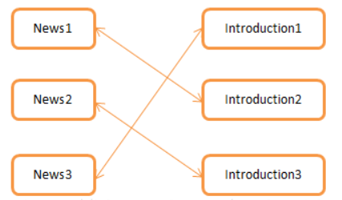
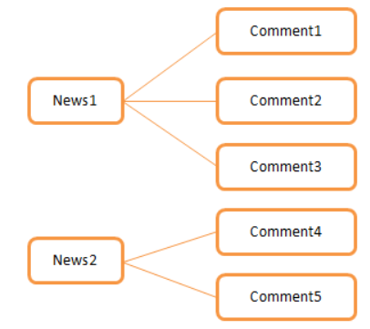
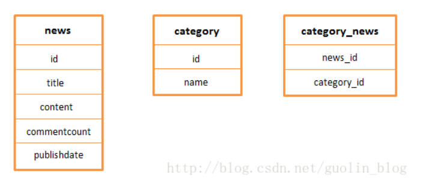

## SQLite命令基本用法
**关于 /data/data 目录**：
    所有应用程序的本地存储文件都是存放在这个目录下面的。为了要让不同应用程序之间的数据容易区别开来，Android是使用应用程序包名进行分开管理，也就是说每个应用程序的本地存储文件都会存放在自己应用程序包名的那个目录下。

在databases的目录中，后缀是journal的文件是日志文件，不用管。

然后可以使用sqlite3命令打开数据库。

**注意**！国内当前流行的PC端的安卓模拟器的内部没有内置SQLite模块，因此无法使用sqlite3命令；
有两种解决方法：

临时解决方法：
使用adb pull 数据库文件路径 将文件拉取到电脑上，电脑内置的adb可以使用sqlite3命令打开数据库：

通用解决方法：
参考博客：[Android 模拟器 sqlite3命令 not found 解决办法](https://blog.csdn.net/guolin_blog/article/details/38461239)

现在假设你已经能成功使用sqlite3命令打开数据库文件了：

使用.table;命令可以查看当前数据库的所有表。
在MySQL中则是 show tables;

查看表的结构：pragma table_info(表名)
在MySQL中则是 desc 表名;

默认的展示方式不太美观，可以更换显示模式，例如 .mode line，然后重新运行pragm table_name(表名) 来显示表的结构。

此时可以向表里面去添加数据了，crud的语句的语法和MySQL几乎是相同的。

值得一提的是，每个**SQLite数据库**中都还有一个隐藏的sqlite_master表，这里记载了当前数据库中所有表的建表语句，可以使用select * from sqlite_master命令进行查看。

如果想看某个表的建表sql语句，使用where关键词进行筛选即可。

这种方式对于分析数据库表的结构很有帮助。

## 创建表和Litepal的基本用法
### 程序中的传统建表方式
其实为了方便我们对数据库表进行管理，Android本身就提供了一个帮助类：SQLiteOpenHelper。这个类集创建和升级数据库于一身，并且自动管理了数据库版本，算是一个非常好用的工具。

SQLiteOpenHelper 本身是一个抽象类，需要重写两个抽象方法，分别是onCreate()和onUpgrade()，我们必须在自己的帮助类里面重写这两个方法，然后分别在这两个方法中去实现创建、升级数据库的逻辑。
以创建一个数据库为例：
Kotlin代码示例
```kotlin
import android.content.Context
import android.database.sqlite.SQLiteDatabase
import android.database.sqlite.SQLiteOpenHelper

class MySQLiteHelper (context: Context, name: String, factory: SQLiteDatabase.CursorFactory, version: Int) : SQLiteOpenHelper (context, name, factory, version){

    companion object{
    	const val create_news =
			"create table news (" +
					"id integer primary key autoincrement," +
					"title text," +
					"content text, " +
					"publishdate integer,commentcount integer)";
    }
	override fun onCreate(db: SQLiteDatabase) {
		db.execSQL(create_news)
	}
	override fun onUpgrade(db: SQLiteDatabase, oldVersion: Int, newVersion: Int) {
	}

}
```

这样，当实例化自定义的帮助类MySQLiteHelper就能实现数据库的创建了。

```kotlin
// in Activity class
class MainActivity : AppcompatActvity(){
    ...
    override fun onCreate(saveInstanceState: Bundle?){
        val dbHelper: SQLiteOpenHelper = MySQLiteHelper(this, "demo.db", null, 1)
        val db = dbHelper.writableDatabase
    }
}
```

我自己在拷贝这个代码在顶层的main函数里面运行的时候使用this来初始化自定义的帮助类时会报一个 "this" is not defined in this context 的错误。底层的原理我还没有弄清楚。

### Litepal的基本使用
第一步：导入Litepal的依赖
请注意，因为Litepal部署在jcenter，而因为jcenter已经失效，Android Studio的最新版本已经将其从默认的仓库中移除，添加jcenter的坐标编译器也会有警告，但是需要jcenter来解决问题。
参考博客
[AndroidStudio配置LitePal时Failed to Resolve或配置AndroidManifest文件时Unresolved package 'litepal' 的解决方案](https://blog.csdn.net/qq_42924347/article/details/123809960)

第二步：litepal.xml的配置文件的介绍
```xml
<?xml version="1.0" encoding="utf-8"?>
<litepal>
    <dbname value="demo" ></dbname>
 
    <version value="1" ></version>
 
    <list>
    </list>
</litepal>
```
配置文件相当简单，<dbname>用于设定数据库的名字，<version>用于设定数据库的版本号，<list>用于设定所有的映射模型，我们稍后就会用到。

第三步：配置LitePalApplication
由于操作数据库时需要用到Context，而我们显然不希望在每个接口中都去传一遍这个参数，那样操作数据库就显得太繁琐了。因此，LitePal使用了一个方法来简化掉Context这个参数，只需要在AndroidManifest.xml中配置一下LitePalApplication，所有的数据库操作就都不用再传Context了，如下所示
```xml
<manifest>
    <application
        android:name="org.litepal.LitePalApplication"
        ...
    >
    ...
    </application>
</manifest>
```

todo: 已经有自定义Application的情况暂时先不讨论。

第四步：开始建表
以建立一个News类为例
```kotlin
import java.sql.Date

data class News(
    private val id: Int,
    private val title: String,
    private val content: String,
    private val publishDate: Date,
    private val commentCount: Int
)
```
其中id这个字段可写可不写，因为即使不写这个字段，LitePal也会在表中自动生成一个id列，毕竟每张表都一定要有主键的嘛。

LitePal的映射规则是非常轻量级的，不像一些其它的数据库框架，需要为每个模型类单独配置一个映射关系的XML，LitePal的所有映射都是自动完成的。根据LitePal的数据类型支持，**可以进行对象关系映射的数据类型**一共有8种，int、short、long、float、double、boolean、String和Date。只要是声明成这8种数据类型的字段都会被自动映射到数据库表中，并不需要进行任何额外的配置。

现在模型类已经建好了，我们还差最后一步，就是将它配置到映射列表当中。编辑assets目录下的litepal.xml文件，在<list>标签中加入News模型类的声明。
当所有的配置完成后，使用代码
SQLiteDatabase db = Connector.getDatabase();
表应该就会自动创建完成。

用你上一节的内容来查看一下创建好的表吧！

## 使用Litepal升级表
### 传统方式
使用SQLiteHelper的onUpgrade方法，在里面写上更新表的逻辑。

使用这种方式升级数据库，随着数据库更新的次数越来越多，代码的逻辑会越来越复杂，不利于管理，所以不推荐这种方式。

### 使用Litepal
先提一嘴，Litepal的底层应该也是SQLiteHelper，所以不要想着他能解决这个抽象类本来就解决不了的问题。

以创建一张comment表为例：
第一步：根据ORM映射关系创建实体类。
```kotlin
data class Comment(
    private val id: Int,
    private val content: String
)
```

第二步：在litepal.xml当中添加配置关系。
```xml
<?xml version="1.0" encoding="utf-8"?>
<litepal>
    <dbname value="demo" ></dbname>
 
    <version value="2" ></version>
 
    <list>
        <mapping class="com.example.databasetest.model.News"></mapping>
        <mapping class="com.example.databasetest.model.Comment"></mapping>
    </list>
</litepal>
```

这样就可以直接通过样例代码直接生成表了。
```kotlin
SQLiteDatabase db = Connector.getDatabase();
```
更新表结构的逻辑也很简单，在实体类中直接修改代码，然后在配置文件中增加<version value>的数值就可以了。
通过这两种升级方式的对比，相信你已经充分体会到了使用LitePal进行升级表操作所带来的便利了吧。我们不需要去编写任何与升级相关的逻辑，也不需要关心程序是从哪个版本升级过来的，唯一要做的就是确定好最新的Model结构是什么样的，然后将litepal.xml中的版本号加1，所有的升级逻辑就都会自动完成了。LitePal确实将数据库表的升级操作变得极度简单，使很多程序员可以从维护数据库表升级的困扰中解脱出来。

并且Litepal在底层帮你实现了删除列的功能了。

## 使用Litepal建立表的关联
### 数据库表关联的基本知识
表与表之间的关联关系一共有三种类型，一对一、多对一、和多对多，下面我们分别对这三种类型展开进行讨论。

**一对一**
这种场景其实并不是很常见，但是还是来说一下
以一个新闻表为例，里面主要记录了新闻的标题和内容，那么除了标题和内容之外，有些新闻还可能带有一些导语和摘要，我们把这两个字段放在一张introduction表中，作为新闻的简介。那么很显然，news表和introduction表就是一对一的关系了，因为一条新闻只能对应一个简介，一个简介也只能属于一条新闻。它们之间的对应关系大概如下图描述的一样：


这种一对一关系在编程语言中很好体现，需要在News类中持有一个Introduction类的引用，然后在Introduction类中也持有一个News类的引用，这样它们之间自然就是一对一的关系了。
在数据库中这种一对一是通过外键来实现的。

**多对一**
表示一张表中的数据可以对应另一张表中的多条数据。
比如说现在我们的数据库中有一个news表，还有一个comment表，它们两个之间就是典型的多对一关系，一条新闻可以有很多条评论，但是一条评论只能是属于一条新闻的。它们的关系如下图所示：


这种多对一的关系在编程语言中是非常容易体现出来的，比如Java中就有专门集合类，如List、Set等，使用它们的话就能轻松简单地在对象之间建立多对一的关系。

多对一的方式仍然是通过外键的方式来实现，把外键加在对应多关系的表上，上面例子里面就应该加在comment表中。

**多对多**
表示两张关联表中的数据都可以对应另一张表中的多条数据。这种场景也不算是很常见，但比一对一关系要稍微更加常用一些。
举个例子，我们都知道新闻网站是会将新闻进行种类划分的，这样用户就可以选择自己喜欢的那一类新闻进行浏览，比如说网易新闻中就会有头条、科技、娱乐、手机等等种类。每个种类下面当然都会有许多条新闻，而一条新闻也可能是属于多个种类的，比如iPhone6发布的新闻既可以属于手机种类，也可以属于科技种类，甚至还可以上头条。因此，新闻和种类之间就是一种多对多的关系，如下图所示：

编程语言只需要在News类中使用集合类声明拥有多个Category，然后在Category类中也使用集合类声明拥有多个News就可以了。

**总结**就是：在关系型数据库中一对一**外键**，多对一**外键**，多对多使用**中间表**。

### 使用Litepal建立表的关联
使用LitePal来自动建立表关联是一个非常不错的选择，不需要关心什么外键、中间表等实现的细节，只需要在对象中声明好它们相互之间的引用关系，LitePal就会自动在数据库表之间建立好相应的关联关系了。

第一步：建立实体类
```kotlin
data class Introduction(
	private val id: Int,
	private val guide: String,
	private val digest: String
)
```

```kotlin
data class Category(
    private val id: Int,
    private val name: String
)
```

第二步：在编程语言中给实体类建立关联
在News类中可以得到一个对应的Introduction的实例，那么它们之间就是一对一关系了。

接着Comment和News是多对一的关系，因此News中应该包含多个Comment，而Comment中应该只有一个News。

...
代码不演示了，太占篇幅，反正很简单。

**第三步**
关联关系都声明好了之后，我们只需要将所有的实体类都添加到映射列表当中，并将数据库版本号加1就可以了。

## Litepal的CRUD操作
### 原生安卓的CRUD
最原始的方法就是通过SQL语句拼接字符串的方式来进行存储。
实际上JDBC就是通过这种方式就是这种方式。
Android提供了一种更简单的方法，将编写sql语句的操作变成**调用api操作**。
但是这种方法的局限有点大，比如说没有考虑表关联的情况，我们需要手动对关联表的外键进行存储。再比如说，没有提供批量存储的功能，当我们有一个集合的数据需要存储时，需要通过循环来遍历这个集合，然后一次次地调用insert()方法来插入数据。

**api参数**：
public long insert(String table, String nullColumnHack, ContentValues values)
insert方法接收三个参数，第一个参数是表名，第二个参数通常都用不到，直接传null，第三个参数则是一个封装了待存储数据的ContentValues对象。因此，比如说我们想往news表中插入一条新闻，就可以这样写。

```java
// 取得数据库引用
SQLiteDatabase db = dbHelper.getWritableDatabase();
// 实例化待插入的数据容器
ContentValues values = new ContentValues();
// 向容器中添加数据
values.put("title", "这是一条新闻标题");
values.put("content", "这是一条新闻内容");
values.put("publishdate", System.currentTimeMillis());
// insert方法执行后返回受影响的行数。
long id = db.insert("news", null, values);
```
这个方法有诸多的局限：
比如说没有考虑表关联的情况，我们需要手动对关联表的外键进行存储。再比如说，没有提供批量存储的功能，当我们有一个集合的数据需要存储时，需要通过循环来遍历这个集合，然后一次次地调用insert()方法来插入数据。

### LitePal的插入
首先LitePal要求所有的实体类都要继承自DataSupport这个类之后才能进行相关的存储操作。
以News类为例，让其继承LitepalDataSupport这个类。
```kotlin
data class News(
    ...
) : LitePalSupport(){
    ...
}
```
之后的操作就非常简单了。
不需要SQLiteDatabase，不需要ContentValues，不需要通过列名组装数据，甚至不需要指定表名，只需要new出一个News对象，然后把要存储的数据通过setter方法传入，最后调用一下save()方法就好了，而这个save()方法自然就是从DataSupport类中继承而来的了。
除此之外，save()方法还是有返回值的，我们可以根据返回值来判断存储是否成功。
此外如果你有当存储失败就抛出异常的需求的时候可以将其替换成saveThrows方法代替。

另外由于SQLite中的每个表都强制会生成id作为主键字段，当调用save()方法或saveThrows()方法存储成功之后，LitePal会自动将该条数据对应的id赋值到实体类的id字段上。

## Litepal的修改和删除
### 传统的修改和删除数据方式
Android也提供了update()和delete()这两个方法，分别用于修改和删除数据。
UPDATE语句：UPDATE 表名 SET 列名 = 值或者表达式 WHERE 筛选条件

更新的api：
public int update(String table, ContentValues values, String whereClause, String[] whereArgs)
接收四个参数：
第一个参数是表名, 对应update后面的内容；
第二个参数是一个封装了待修改数据的ContentValues对象, 对应set后面的值；
第三和第四个参数用于指定筛选条件, 对应了where部分。

例如：
把news表中id为2的记录的标题改成“今日iPhone6发布”
```java
SQLiteDatabase db = dbHelper.getWritableDatabase();
ContentValues values = new ContentValues();
values.put("title", "今日iPhone6发布");
db.update("news", values, "id = ?", new String[] {"2"});
```

效果相当于
```sql
update news set title='今日iPhone6发布' where id=2;
```

接下来再看一下delete()方法的方法定义：
delete的api：
public int delete(String table, String whereClause, String[] whereArgs)

delete()方法接收三个参数，
第一个参数同样是表名，
第二和第三个参数用于指定删除哪些行，对应了SQL语句中的where部分。


那么比如说我们想把news表中所有没有评论的新闻都删除掉，就可以这样写：
```java
SQLiteDatabase db = dbHelper.getWritableDatabase();
db.delete("news", "commentcount = ?", new String[] {"0"});
```
其作用相当于如下SQL语句：
```sql
delete from news where commentcount=0;
```

### 使用Litepal来修改数据
#### 使用ContentValues来修改
#### 直接通过id更新单行数据
#### 通过updateAll方法来更新指定的多行数据
#### 修改默认使用setToDefault方法来修改数据为默认值。

### 使用LitePal来删除数据
#### 指定id来直接删除行数据
另外在MySQL中如果该行有外键约束的话是不能直接删除的。
不过**LitePal可以直接删除**。
#### 通过筛选条件删除多行数据

另外由于框架的局限，实例化对象并不代表数据已经持久化。
因此框架还提供了一个isSaved()方法来判断对应的数据是否已经持久化。

## 【重点】LitePal的查询
### 传统的数据查询方式
Android提供直接使用原生SQL语句的API，是rawQuery()方法。
API定义：
public Cursor rawQuery(String sql, String[] selectionArgs)
接收两个参数，第一个参数接收的就是一个SQL字符串，第二个参数是用于替换SQL语句中占位符（?）的字符串数组。rawQuery()方法返回一个Cursor对象，所有查询到的数据都是封闭在这个对象当中的，我们只要一一取出就可以了。

Android也提供了内置的查询方法：
....API的参数非常的多，这里还是不写了。

### LitePal的API
#### 直接通过ID查找
```java
News news = DataSupport.find(News.class, 1);
```
这个find方法直接通过id得到单行数据。
#### 取出表的第一行或最后一行数据
```java
News firstNews = DataSupport.findFirst(News.class);
News lastNews = DataSupport.findLast(News.class);
```
直接提供泛型类即可。

#### 同时取出多行数据
使用findAll()方法，提供一个id的数组即可。
```java
long[] ids = new long[] { 1, 3, 5, 7 };
List<News> newsList = DataSupport.findAll(News.class, ids);
```

#### 通过连缀查询来指定筛选条件
##### where 指定筛选条件
为了避免冗长的参数列表，LitePal采用了一种非常巧妙的解决方案，叫作连缀查询，这种查询很灵活，可以根据我们实际的查询需求来**动态配置查询参数**。 这里举个简单的例子，比如我们想查询news表中所有评论数大于零的新闻，就可以这样写：
```java
List<News> newsList = DataSupport.where("commentcount > ?", "0")
                                .find(News.class);
```
使用where()，就相当于where关键字
##### select 指定哪些列

##### order指定如何排序，对应order by
##### limit指定分页的标准，对应关键字 limit

... 
有必要写这么详细吗？
那我就写的简单一点

