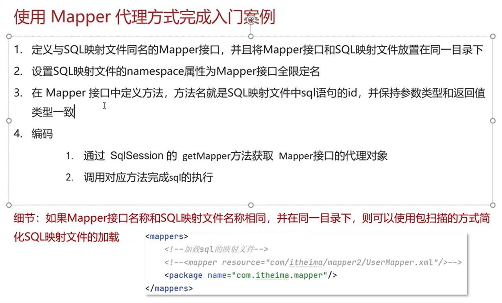
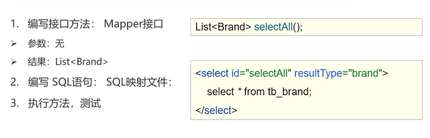

# MyBatis使用指南
基于黑马的 JavaWeb的课程
# MyBatis基本信息
它是一个简化 JDBC的框架。
顺便提一个：虽然我觉得它和 GROM一样是，但是很遗憾的是 MyBatis并不是一个确确实实的 ORM框架。
它是一个**半ORM框架**。 Hibernate是全 ORM框架。
**MyBatis拥抱原生SQL。**

MyBatis 简化了大量 JDBC的工作，所以进行开发的话，使用 MyBatis就行。

# 快速入门（尝试整合 Spring 和 MyBatis）
## 导入坐标
步骤就是：导入坐标，配置文件xml，配置单独的表的映射mapper，然后代码调用。。。

```xml
    <dependencies>
        <!-- Spring的基本坐标 -->
        <dependency>
            <groupId>org.springframework</groupId>
            <artifactId>spring-context</artifactId>
            <version>5.2.10.RELEASE</version>
        </dependency>

        <!-- Alibaba的 druid：数据库连接池 -->
        <dependency>
            <groupId>com.alibaba</groupId>
            <artifactId>druid</artifactId>
            <version>1.1.16</version>
        </dependency>

        <!-- MyBatis的基本坐标 -->
        <dependency>
            <groupId>org.mybatis</groupId>
            <artifactId>mybatis</artifactId>
            <version>3.5.6</version>
        </dependency>

        <!-- mysql，这个好像是数据库操作的基本坐标 -->
        <dependency>
            <groupId>mysql</groupId>
            <artifactId>mysql-connector-java</artifactId>
            <version>5.1.47</version>
        </dependency>

        <!-- Spring如果要操作数据库，需要的坐标 -->
        <dependency>
            <groupId>org.springframework</groupId>
            <artifactId>spring-jdbc</artifactId>
            <version>5.2.10.RELEASE</version>
        </dependency>

        <!-- Spring 整合 MyBatis的坐标 -->
        <dependency>
            <groupId>org.mybatis</groupId>
            <artifactId>mybatis-spring</artifactId>
            <version>1.3.0</version>
        </dependency>
    </dependencies>

```

## 了解一下旧版本的配置开发
首先是加载 mybatis的配置文件和对应的映射文件：一个是 mybatis-config.xml, 一个是 对应的mapper。

然后就是一系列的通用的代码模板。

### MyBatis的配置文件
贴代码。具体的解释直接写在注释里面：
```xml
<?xml version="1.0" encoding="UTF-8" ?>
<!DOCTYPE configuration
        PUBLIC "-//mybatis.org//DTD Config 3.0//EN"
        "http://mybatis.org/dtd/mybatis-3-config.dtd">
<!-- 顶级标签，这个就是配置的意思，里面的子标签就代表各种 会影响 MyBatis 运行的配置 -->
<configuration>
    <!-- 设置类型别名 -->
    <!-- 主要是为了减少冗余包名的书写，以及添加对大小写的包容性 -->
    <typeAliases>
        <package name="com.entity"/>
    </typeAliases>
<!--    <properties resource="jdbc.properties"/>-->
    <!-- 环境，类似于 多个配置偏好，方便不同环境快速切换不同的配置 -->
    <!-- 我在猜如果在这个标签外面的是不是就是 Global配置了 -->
    <environments default="development">
        <environment id="development">
            <!-- 事务管理，以后会被Spring接管 -->
            <transactionManager type="JDBC"/>
            <!-- 连接池，以后会被Spring接管 -->
            <dataSource type="POOLED">
<!--                可以运行的配置-->
<!--                <property name="driver" value="com.mysql.jdbc.Driver"/>-->
<!--                <property name="url" value="jdbc:mysql://localhost:3306/mybatis?useSSL=false"/>-->
<!--                <property name="username" value="root"/>-->
<!--                <property name="password" value="risk"/>-->

<!--                尝试使用 Properties的配置-->
                <property name="driver" value="${jdbc.driver}"/>
                <property name="url" value="${jdbc.url}"/>
                <property name="username" value="${jdbc.username}"/>
                <property name="password" value="${jdbc.password}"/>
            </dataSource>
        </environment>
    </environments>
    <mappers>
        <mapper resource="com/mapper/UserMapper.xml"/>
    </mappers>
</configuration>
```

我感觉 别名应该很有用。注意配置的时候要注意**前后顺序**


## Mapper代理
说结论：建立Mapper接口**来统一SQL映射的规范**来可以减少硬编码，解耦合，以及方便 ide的提示；

一开始的开发是直接写 mapper配置里面的 namespace.id 的方式，字符串硬编码，难以维护；
所以通过MyBatis提供的映射模式；转换为 接口编程，**可维护性提高**

Mapper接口是对应的**MyBatis的原先Mapper配置文件的**，在快速入门的时候就已经发现要写字符串了。



通过**约定大于配置**这个思想，让配置文件转换成 面向接口编程，可以简化操作。

顺便提一句：为什么只编写一个接口就可以实现功能呢？因为 MyBatis会根据配置文件的信息，**生成一个代理类**

这里有一个小知识点：
maven的项目编译后的**字节码文件里的项目结构同级**，换句话说 java和resources文件夹里面的**同名文件夹内文件最终会合并在一起**；

## 通过配置文件进行实际开发
### 基本开发
首先推荐安装 MyBatis的插件，实现两个功能：
- 接口和映射的快速跳转；
- 接口更新 API的时候 映射内自动生成对应的 statement（就是对应的sql语句）
因为有了自动生成的功能，别名也可以省略了。

接口开发一个实际的功能的过程：
1. 开发接口
1. 配置文件对应具体的SQL语句
1. 执行测试



具体的xml配置文件太多，一个个地去做案例效率太低
所以直接贴具体的**标签和属性的用法**

id: 映射的唯一标识符
resultType: 用来定义返回值的类型；
resultMap: 使用 resultMap映射之后，用来替换上面那个；
parameterType: 用来指定形参类型，可以省略

MyBatis有两种占位符：#和$，前面是为了防止sql注入的，和jdbc一样

因为对应的语句是写在 xml的问题，存在 转义的问题：cddata或者转义字符，和html是一样的。

### 多条件查询
直接指定字段查询：
在多条件查询的时候，在接口的参数里面要写 Params注解标注**占位符**的名称。（虽然我觉得不要）
这里我自己测试了一下，不用的话确实会报错

通过封装之后的**对象查询**：
直接传入对象，也省去了 Params注解

通过键值对查询；
类似，key表示名称，val表示值

另外参数如果**有模糊查询的需求的话**需要在**程序代码**中进行处理。（我觉得这本来就是后端做的事情其实。）


### 字段不匹配的问题（一般用 ResultMap解决）
MyBatis使用**同名的匹配的机制**来实现自动封装；
但是 Java使用驼峰命名，而 sql字段一般使用 蛇形命名；这样两者就不匹配；

**MyBatis提供了两种解决的方法**
第一、设置别名：
就是根据表的查询结果和 实体类对象对不对应得上，所以可以**在SQL查询时给表设置别名；**
但是这样会有大量的语句重命名，非常麻烦；进一步的简化是**设置sql片段**，即将常用的sql语句弄成一个片段直接使用：
相关的标签是`<sql></sql>` `<include></include>`

第二、提供 ResultMap 提供 字段和成员的对应关系：
这里直接贴代码更加直观：
放在对应的Mapper里面
```xml
<!-- 字段因为命名方式不匹配的问题使用 ResultMap 进行映射 -->
    <!-- id指定map的唯一表示， type表示对哪个类进行映射 -->
    <resultMap id="userMap" type="com.entity.User">
        <!-- id管主键的映射 -->
        <!-- result管理普通字段的映射 -->
        <result column="user_name" property="userName"/>
        <!-- 写完之后记得把原先sql语句的那个 resultType修改成 resultMap-->
    </resultMap>
```

还是很麻烦
为什么不能自动映射？

### 动态条件查询（动态SQL）
当查询条件变化较大，使得sql语句会在不同的情况下变化的时候，动态sql可以在**框架层面提供较好的支持**
用标准一点的话来说就是：
> SQL语句会随着**用户的输入或者外部条件的变化而变化**， 这种叫做动态SQL。

MyBatis的动态SQL的使用比较简单。