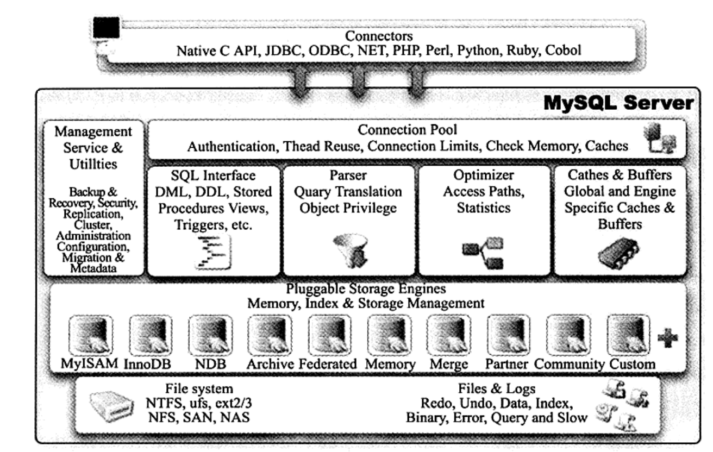

# MySQL InnoDB引擎
所有的知识来源：《MySQL技术内幕 InnoDB存储引擎》

# 第1章 MySQL体系结构和存储引擎
扫盲两个概念, "数据库" 和 "实例". 这个定义和 Java中的 class(对象)和instance(实例)很像.

"数据库": 物理实体, 我理解的话不存在程序的概念中, 是被持久化了的文件, 通常是文件的形式. 我的理解是: 持久层, 好比等待被人使用的物品.

"实例": 程序的概念, 即通常意义的**线程**以及程序所使用到的**内存区**. 本质是一个程序, **执行用户的操作**.

## 一些穿插进来的小概念
> 可能上面我解释的还不够直白, 那我用书里的语言再来说一遍:
"数据库", 是文件的集合, 存储在二进制文件中的. 用户几乎**不可能通过直接干预文件系统的方式**来准确的修改数据库的内容.

> "(数据库)实例", 是软件, 它就是用来操作和管理(维护)数据库的.

## MySQL存储引擎的介绍
### InnoDB
MySQL的存储引擎是**基于表的**. 这个结论很重要.
并且是一种基于**插件式**的, 用户可以很方便的进行自定义.
有趣的是, InnoDB这个默认引擎最开始是一个第三方引擎, 后来被 Oracle 收购. 

InnoDB是MySQL_5.5.8 之后的默认引擎, 一般没有特殊情况(一般是要求高性能的场景), 都只会使用这个引擎. 
特点是: 支持行锁, 支持事务, 支持外键, 支持类似 Oracle的非锁定读. 
而且它对 事务的隔离级别, 以及一些高性能和高可用的功能有着丰富的支持.

表中数据的存储都是根据主键的顺序来进行存放的, 如果用户没有显示指定主键, 那么MySQL会自己添加一个 ROWID 作为主键. 

### MyISAM
之前的默认引擎, 最明显的特点就是不支持事务. 具体的细节很难说清, 不过特点就是用于一般读表操作操作很舒服. 
4gb的限制是因为操作系统的限制决定的, 细节不说了, 不重要. 

### 其他的数据引擎, 不再做更多的具体介绍. 

### 根据以上的知识, 可以得到的一些面试题(?)的解答
1. MySQL 数据库**支持全文索引**. InnoDB, MyISAM 都支持.
1. 1000万数据以上 MySQL的性能会显著下降吗? 不! 这种下降不是线性的, 如果选择了**正确的配置以及正确的存储引擎.** 因为已经有具体的公司 存储过 1tb的数据了.

## 连接 MySQL
连接数据库软件是使用 一个数据库软件的第一步, MySQL的连接本质上 单独**使用一个进程与 MySQL的实例进行通信**. 

我知道的 shell, navicat, 还有idea的数据源连接应该都是 使用的在本机上连接的这个方式使用的. 

这里就不写具体的连接的方式了, 我想对你们来说也不重要.

# 第二章 InnoDB存储引擎
InnoDB 数据引擎是 MySQL的核心. 

# 第六章 锁

InnoDB的锁的机制类似于Oracle

# 草稿区域
MySQL的行级锁的开销比表锁大很多. 
