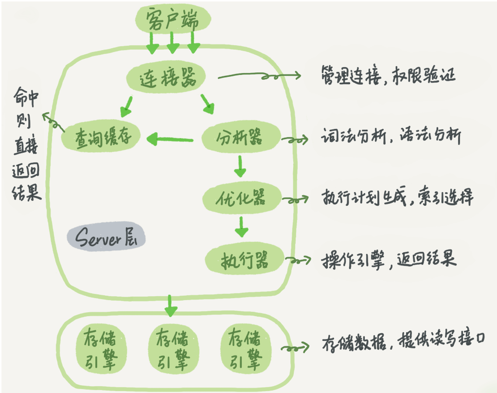
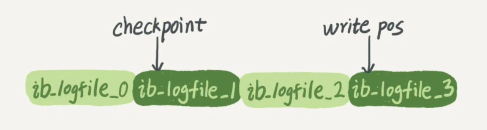

# MySQL 实战 45讲 笔记
# 基础架构: 一条查询语句是怎么实现的
先系统的了解一下 MySQL 一条语句的执行过程: 

先直观的说一下我的感受: 
跟我以前在计组里面学到的东西好像有那么点类似, 拥有缓存机制都会优先考虑缓存是否命中.
大体来说，MySQL可以分为**Server层和存储引擎层**两部分。 这个大架构其实还简单, 存储引擎负责IO存取数据, 而server负责**处理数据并像客户端输出最终的结果**. 

## 一句sql语句的执行流程
###  第一步, 连接上数据库
连接器负责跟客户端建立连接、获取权限、维持和管理连接。
你和MySQL的连接由它全程负责. shell里面的 mysql 实际上是一个客户端指令. 本质上是本地上的**TCP/IP通信**. 


这个步骤是: 
> 连接命令中的mysql是客户端工具，用来跟服务端建立连接。在完成经典的TCP握手后，连接器就要开始认证你的身份，这个时候用的就是你输入的用户名和密码。

>如果用户名或密码不对，你就会收到一个"Access denied for user"的错误，然后客户端程序结束执行。
如果用户名密码认证通过，连接器会到权限表里面查出你拥有的权限。之后，这个连接里面的权限判断逻辑，都将依赖于此时读到的权限。
这就意味着，一个用户成功建立连接后，即使你用管理员账号对这个用户的权限做了修改，也不会影响已经存在连接的权限。修改完成后，只有再新建的连接才会使用新的权限设置。

也就是说本次连接的**权限一旦确定将不可修改**. 

可以通过`show processlist` 看到当前的连接. 

客户端如果太长时间没动静，连接器就会自动将它断开。这个时间是由参数wait_timeout控制的，默认值是8小时。

MySQL建立连接的过程比较麻烦, 所以为了提升性能, 尽量**不要大量建立连接**.

**MySQL的内存涨的很快的原因: **
资源全在连接内部, 只有在连接断开的时候这些资源才会释放, 所以这个前面尽量不要建立长连接的思想矛盾. 
两个解决办法: 
- (低版本)定期断开长连接。使用一段时间，或者程序里面判断执行过一个占用内存的大查询后，断开连接，之后要查询再重连。

- (5.7 或者更高)如果你用的是MySQL 5.7或更新版本，可以在每次执行一个比较大的操作后，通过执行 mysql_reset_connection来重新初始化连接资源。这个过程不需要重连和重新做权限验证，但是会将连接恢复到刚刚创建完时的状态。

### 第二步 查询缓存
这个缓存机制, 存储的是**你之前查询过的语句**(key) 以及 **对应的结果**. 

但是, 我觉得小刻都看得出来 这种缓存失效的方式失效的速度非常快, 所以
**因为查询缓存往往弊大于利。**
只要有对一个表的更新，这个表上所有的**查询缓存都会被清空**. 

笑嘻了从8.0开始已经没有这个功能了. 

### 分析器
和编译原理很像.
分析器会把你输入的指定, 解释成他可以理解的语句, 再去执行. 

```
如果没有命中查询缓存，就要开始真正执行语句了。首先，MySQL需要知道你要做什么，因此需要对SQL语句做解析。

分析器先会做“词法分析”。你输入的是由多个字符串和空格组成的一条SQL语句，MySQL需要识别出里面的字符串分别是什么，代表什么。

MySQL从你输入的"select"这个关键字识别出来，这是一个查询语句。它也要把字符串“T”识别成“表名T”，把字符串“ID”识别成“列ID”。

做完了这些识别以后，就要做“语法分析”。根据词法分析的结果，语法分析器会根据语法规则，判断你输入的这个SQL语句是否满足MySQL语法。

如果你的语句不对，就会收到“You have an error in your SQL syntax”的错误提醒，比如下面这个语句select少打了开头的字母“s”。
```

可以说, 经过这个步骤, mysql就能理解你的意思了. 不过, 因为你对 mysql的理解一般没那么好, 所以MySQL会对你的指令执行一些优化. 

### 优化器
执行优化, 比如有多个索引或者 使用外连接的时候, 优化器会选择效率更高的语句.

### 执行器
顾名思义. 不过有意思的是, 权限的验证是在这里执行的, 我不知道为什么要这么设计. 

### 总结
排除掉已经不再使用的 缓存(keyvalue的那个), 这个过程其实是很好理解的. 总之, 就是分析, 优化, 执行的过程. 

提个问题, mysql语句报错的部分是在哪个阶段被判断出来的? 答案是 分析器.

# 更新语句的执行流程
更新语句可以看做是 查询语句 + 更新数据

那么**查询的步骤它是肯定要走一遍**的. 

重点在于更新的部分: 因为IO的 成本比较高, 所以mysql采用了一个 类似**先整理, 再更新**的办法.

## redo log
先在内存里面更新你需要的数据, 然后在系统空闲的时候 IO更新到文件系统里面去. 

> 整个过程，其实就是MySQL里经常说到的WAL技术，WAL的全称是Write-Ahead Logging，它的关键点就是先写日志，再写磁盘，也就是先写粉板，等不忙的时候再写账本。

**redo log内部实现的数据结构**


应该是一个数组(或者连续空间的内存), 用两个指针标记位置, 一个记录数据更新到哪里, 一个记录当log满了的时候从哪里开始写入磁盘. 
MySQL的 crash-safe 功能也是靠这个玩意实现的. 

## bin log
MySQL整体来看，其实就有两块：一块是Server层，它主要做的是MySQL功能层面的事情；还有一块是引擎层，负责存储相关的具体事宜。上面我们聊到的粉板redo log是InnoDB引擎特有的日志，
而Server层也有自己的日志，称为binlog（归档日志）。

解释一下为什么会有两个日志: 因为innodb 这个引擎并不是 MySQL默认自带的, 而它原来有一个默认的日志工具(binlog). 

**两个日志的不同**
- redo log是InnoDB引擎特有的；binlog是MySQL的Server层实现的，**所有引擎都可以使用**。
- edo log是物理日志，记录的是“在某个数据页上做了什么修改”；binlog是逻辑日志，记录的是这个语句的原始逻辑，比如"给ID=2这一行的c字段加1"
- redo log是循环写的，空间固定会用完；binlog是可以追加写入的。“追加写”是指binlog文件写到一定大小后会切换到下一个，并不会覆盖以前的日志。


那么, 追加了这两个日志系统之后, MySQL实际更新一条数据的过程其实是: 


为了保持两份日志里面的备份一致, 将redo log的写入拆成了两个步骤：**prepare和commit**，这就是"两阶段提交"。

## redolog 的 双阶段提交
我个人觉得其实就和 事务的功能差不多. redo先进行临时存储, binlog随后也进行 "追加写", 等待完成后, redo再进行提交. 

简单说，redo log和binlog都可以用于表示事务的提交状态，而两阶段提交就是**让这两个状态保持逻辑上的一致**。

## 一些总结
更新语句的执行原理我觉得说的很清楚了, 就是双日志的执行过程. 

作者还提了一个问题, 就是 一天一备份和一周一备份哪个好. 

结论是: 
> redo是物理的，binlog是逻辑的；现在由于redo是属于InnoDB引擎，所以必须要有binlog，因为你可以使用别的引擎
保证数据库的一致性，必须要保证2份日志一致，使用的2阶段式提交；其实感觉像事务，不是成功就是失败，不能让中间环节出现，也就是一个成功，一个失败
如果有一天mysql只有InnoDB引擎了，有redo来实现复制，那么感觉oracle的DG就诞生了，物理的速度也将远超逻辑的，毕竟只记录了改动向量
binlog几大模式，一般采用row，因为遇到时间，从库可能会出现不一致的情况，但是row更新前后都有，会导致日志变大
最后2个参数，保证事务成功，日志必须落盘，这样，数据库crash后，就不会丢失某个事务的数据了
其次说一下，对问题的理解
备份时间周期的长短，感觉有2个方便
首先，是恢复数据丢失的时间，既然需要恢复，肯定是数据丢失了。如果一天一备份的话，只要找到这天的全备，加入这天某段时间的binlog来恢复，如果一周一备份，假设是周一，而你要恢复的数据是周日某个时间点，那就，需要全备+周一到周日某个时间点的全部binlog用来恢复，时间相比前者需要增加很多；看业务能忍受的程度
其次，是数据库丢失，如果一周一备份的话，需要确保整个一周的binlog都完好无损，否则将无法恢复；而一天一备，只要保证这天的binlog都完好无损；当然这个可以通过校验，或者冗余等技术来实现，相比之下，上面那点更重要


# 第三讲 事务隔离
## 事务的四大特性
复习一下事务的四个特性以及他们的意义:
- 原子性: 事务内的操作必须要么全部完成, 要么全部不完成, 通过**事务回滚**实现. 
- 一致性: 事务执行前后, 数据库的状态都应该是正确的. 如果数据库系统 运行中发生故障，有些事务尚未完成就被迫中断，这些未完成事务对数据库所做的修改有一部分已写入物理数据库，这时数据库就处于一种不正确的状态，或者说是 不一致的状态。
- 隔离性: 事务之间彼此隔离, 互不影响; 我觉得这个多线程的设计很类似
- 持久性: 提交成功的事务对数据库的影响是永久的

## 不同隔离的具体含义
这里要说的是隔离, 隔离和原子是两个需要手动实现的东西(我个人觉得)

当有多个事务一起执行的时候, 会出现 类似多个线程对同一个变量进行读写的情况, 不过好像 MySQL这里好像要分得更加具体...

**具体是**: 
mysql数据库的隔离情况
- 读未提交是指，一个事务还没提交时，它做的变更就能被别的事务看到。
- 读提交是指，一个事务提交之后，它做的变更才会被其他事务看到。
- 可重复读是指，一个事务执行过程中看到的数据，总是跟这个事务在启动时看到的数据是一致的。当然在可重复读隔离级别下，未提交变更对其他事务也是不可见的。
- 串行化，顾名思义是对于同一行记录，“写”会加“写锁”，“读”会加“读锁”。当出现读写锁冲突的时候，后访问的事务必须等前一个事务执行完成，才能继续执行。

说实话这个解释要清晰得多

那么可重复读这个玩意应该是用 **视图实现**的, 整个事务的执行过程中都是用的这个视图.

串行化是直接加锁了, 最安全, 但是效率也最低.

可重复读是现在 MySQL的默认隔离级别.

## 事务隔离的实现
通过**视图**和**回滚日志**来实现.

回滚日志就是记录回滚操作用的. 在语句执行的时候, 对应的回滚操作就会被写入回滚日志. 

所以, 因为回滚日志比较占据空间, 尽量不要使用长事务.

具体细节我还是没怎么理解, 如果有需要我再去看一遍. 

## 事务的启动方式
直接说结论: 要避免长事务, 使用 set autocommit = 1, 开启自动提交; 如果嫌弃 每次使用 begin语句开启事务麻烦, 就用 使用commit work and chain语法: 
在autocommit为1的情况下，用begin显式启动的事务，如果执行commit则提交事务。如果执行 commit work and chain，则是提交事务并自动启动下一个事务，这样也省去了再次执行begin语句的开销。同时带来的好处是从程序开发的角度明确地知道每个语句是否处于事务中。

## 思考题: 你作为数据库负责人, 你如何避免长事务? 
`壹笙☞漂泊`的回答:
在开发过程中，尽可能的减小事务范围，少用长事务，如果无法避免，保证逻辑日志空间足够用，并且支持动态日志空间增长。监控Innodb_trx表，发现长事务报警。

参考答案: 
- 确认是否使用了set autocommit=0。这个确认工作可以在测试环境中开展，把MySQL的general_log开起来，然后随便跑一个业务逻辑，通过general_log的日志来确认。一般框架如果会设置这个值，也就会提供参数来控制行为，你的目标就是把它改成1。
- 确认是否有不必要的只读事务。有些框架会习惯不管什么语句先用begin/commit框起来。我见过有些是业务并没有这个需要，但是也把好几个select语句放到了事务中。这种只读事务可以去掉。
- 业务连接数据库的时候，根据业务本身的预估，通过SET MAX_EXECUTION_TIME命令，来控制每个语句执行的最长时间，避免单个语句意外执行太长时间。（为什么会意外？在后续的文章中会提到这类案例）

# 索引(上)
常用的, 简单的索引模型有: 
哈希表, 有序数组, 搜索树

哈希表是使用 数组 加 链表实现的, 如果存在大量哈希冲突的时候效率会退化, 并且 哈希表**不适合做区间查询**(因为无序).
比如如果要扫描一个在区间里面的用户, 那就只能全部扫描. 

哈希表适合**等值查询**的情境.

有序数组则因为底层连续存储的特性, 非常适合**区间查询**. 使用二分就可以轻松得到. 
不过, 插入相当麻烦. 

**有序数组索引只适用于静态存储引擎**

二叉搜索树的查询和更新基本复杂度基本都是 O(logn), 不过,**虽然二叉树是搜索效率最高的，但是实际上大多数的数据库存储却并不使用二叉树。其原因是，索引不止存在内存中，还要写到磁盘上。**

呃, 中间解释的理论我看不太懂, 总之现在常用的是 N叉树.

数据结构就是这样, 重要且枯燥. 因为没有实战上手. 

## InnoDB 的索引模型
直接说结论: 每一个索引对应一颗 B+树. 

分为主键索引和非主键索引(二级索引), 主键索引存储**整行数据**, 二级索引存储对应的**主键的值**, 也就是说 尽量使用主键索引来提高效率. 

> 也就是说，基于非主键索引的查询需要多扫描一棵索引树。因此，我们在应用中应该尽量使用主键查询。

## 索引的维护
具体的理论看不懂; 所以直接说结论: 

B+树为了维护索引有序性，在插入新值的时候需要做**必要的维护**。

实战的案例就是 到底**需不需要使用自增的主键**

使用自增主键的 B+树维护起来往往**性能比较高**. 

有业务逻辑的字段做主键，则往往**不容易保证有序插入**，这样写数据成本相对较高。

所以，从**性能**和**存储空间**方面考量，自增主键往往是更合理的选择。

有一个情况, 适合用**业务字段直接做主键**: KV场景. 

- 只有一个索引；
- 该索引必须是唯一索引。

这种情况下, 由于没有其他索引, 所以不用考虑二级缓存的问题, 那么此时, 选择这个唯一的业务字段作为主键查询好像才是最佳的选择. 

## 思考题, 以及一些高质量的评论
两个重建索引的做法, (主键索引和二级索引该怎么做? )
`参考答案`
首先是, why 要重建索引? 
之前解释过 表在 更新或者删除之后, 索引 可能会出现 
> 索引可能因为删除，或者页分裂等原因，导致数据页有空洞，重建索引的过程会创建一个新的索引，把数据按顺序插入，这样页面的利用率最高，也就是索引更紧凑、更省空间。

但是! 重建主键索引的话, 不论是删除主键还是创建主键，都会将**整个表重建**。 
也就是说, 如果两个语句连续执行, 第一个重建就白做了. 

如果要达到类似的目的, 可以使用  alter table T engine=InnoDB


`评论` 
每一张**索引其实就是一个**B+树** ，树结点的key值就是某一行的主键，value是该行的其他数据。新建索引就是新增一个B+树，查询不走索引就是遍历主B+树。

# 索引(下)
## 覆盖索引
引出覆盖索引: (我个人的理解)
以一个 查询语句举例: select * from T where k between 3 and 5;
因为 查询条件是k的原因, 所以 会先扫描 T的索引(二级索引), 找到对应的主键值之后, 再去主键索引上找 行数据; 然后循环这个过程... 

这个从主键索引又回到二级索引的过程 叫做 "回表". 等同于 算法里面**无意义的回溯**, 覆盖索引就是针对这个进行优化的. 

具体就是: select ID from T where k between 3 and 5; 因为二级索引记录的就是 主键的数据, 这样就没有必要回表了. 可以显著提高效率. 

一个经典的案例是: 现在要建立一个 在一个市民信息表上，是否有必要将**身份证号和名字**建立联合索引? 
如果名字这个字段的查询特别频繁, 答案是: 是的, 你最好这么做. 这样就可以达到对应的提升性能和节约空间的目的. 

## 最左前缀
最左前缀原则: 
因为 索引项是按照索引定义里面出现的**字段顺序**排序的。
这个最左前缀可以是联合索引的**最左N个字段**，范围小一点的话, 就是字符串索引的最左M个字符。
我的理解是: 字段靠前, 存储的位置靠前, 相同的部分会排列在一起, 按照字典树排序(?)
结论是: 只要满足最左前缀，就可以利用索引来加速检索. 

它的原理是: 
**B+树这种索引结构，可以利用索引的“最左前缀”，来定位记录。**

**以上就是加速的原理, 那么怎么设计字段呢? **
**第一原则是，如果通过调整顺序，可以少维护一个索引，那么这个顺序往往就是需要优先考虑采用的。**
比如  有了(a,b)这个联合索引后，一般就不需要单独在a上建立索引了, 因为 a就是这个左前缀. 
但是如果 查询的字段是 b, 那就不行了, 因为此时他不是左前缀, 你就可以建立 (b,a) 这个索引. 

但是, 还是上面这个例子, 如果a和b 都分别有查询的需求, 那么就优先考虑 联合索引中, 把字段长的放在前面, 然后小的可以单独设置索引, 这样 最节省空间.

## 索引下推
如果, where 条件里面是两个的话, 你是至少要查两个索引的, 所以 覆盖索引 好像只能解决一个字段的效率的问题

5.6 版本开始, 出现了 一个名叫 索引下推 的解决方案. 
~~??? (我自己的看法)什么几把, 不是已经建立了联合索引了吗?~~

索引下推 就是 可以在索引遍历过程中，对索引中**已经包含了的字段先做判断**直接过滤掉不满足条件的记录，减少回表次数。


# 第六讲 全局锁和表锁
锁几乎都是处理并发问题的资源访问问题的. 

根据加锁的范围，MySQL里面的锁大致可以分成全局锁、表级锁和行锁三类。
**作用**
全局锁就是用来做备份的时候用的, 开启的时候任何**除了 查询之外**的语句都会被阻塞, 直到解锁. 

**MySQL不是有一个可重复读的隔离级别吗?** 
说法错误, 不是MySQL有 隔离级别, 而是 数据引擎的事务机制有隔离机制. 是的说的就是 InnoDB. 
MySQL提供了一个加全局读锁的方法，命令是 Flush tables with read lock (FTWRL)。
如果是 比如，对于MyISAM这种不支持事务的引擎，如果备份过程中有更新，总是只能取到最新的数据，那么就破坏了备份的一致性。这时，我们就需要使用FTWRL命令了。

所以对于备份, 其实有两种情况: 
对于支持事务的引擎, single-transaction方法. 
> 官方自带的逻辑备份工具是mysqldump。当mysqldump使用参数–single-transaction的时候，导数据之前就会启动一个事务，来确保拿到一致性视图。而由于MVCC的支持，这个过程中数据是可以正常更新的。

MyISAM这种不支持事务的引擎, 需要使用FTWRL命令. 

一个小的知识点: 
你也许会问，既然要全库只读，为什么不使用set global readonly=true的方式呢？确实readonly方式也可以让全库进入只读状态，但我还是会建议你用FTWRL方式，主要有两个原因：

一是，在有些系统中，readonly的值会被用来做其他逻辑，比如用来判断一个库是主库还是备库。因此，修改global变量的方式影响面更大，我不建议你使用。
二是，在异常处理机制上有差异。如果执行FTWRL命令之后由于客户端发生异常断开，那么MySQL会自动释放这个全局锁，整个库回到可以正常更新的状态。而将整个库设置为readonly之后，如果客户端发生异常，则数据库就会一直保持readonly状态，这样会导致整个库长时间处于不可写状态，风险较高。

## 表锁
MySQL 里面分为两种: 普通表锁, 元数据锁

### 普通表锁
表锁的语法是 lock tables … read/write。 `这是一种由开发人员控制的锁.`
可以用unlock tables主动释放锁，也可以在客户端断开的时候自动释放。需要注意，lock tables语法除了会**限制别的线程的读写外**，也限定了**本线程接下来的操作对象**。
`我觉得这是一种防止死锁的保险措施.`

在还**没有出现更细粒度的锁**的时候，表锁是最常用的处理并发的方式。`老版本(没有 innodb的时候), 用这个玩意控制并发规则`

### 元数据锁
MDL的作用是，保证读写的正确性。`还是针对 innodb之外的早期引擎, 应该是`
5.5版本加入, 分为 读锁(crud时) 和 写锁(修改字段结构时), **读锁之间不互斥**, **写锁和任何锁互斥**
至于为什么很容易想清楚. 

5.6举例, 一个mdl读锁会导致线程爆满: 
如果某个表上的查询语句频繁，而且客户端有重试机制，也就是说超时后会再起一个新session再请求的话，这个库的线程很快就会爆满。
因为后面如果有 表结构操作, 会被阻塞: 因为线程后面加了写锁, 导致后面的所有线程全部被堵塞. 

**这里提到了一个解决方案**
情境: 如何安全地给小表加字段?
首先是长事务的问题, ddl操作(修改字段的操作)不能和长事务共存, 必须 要考虑先暂停DDL，或者kill掉这个长事务。

但是! 
> 但考虑一下这个场景。如果你要变更的表是一个热点表，虽然数据量不大，但是上面的请求很频繁，而你不得不加个字段，你该怎么做呢？

这时候kill可能未必管用，因为新的请求马上就来了。比较理想的机制是，在alter table语句里面设定等待时间，如果在这个指定的等待时间里面能够拿到MDL写锁最好，拿不到也不要阻塞后面的业务语句，先放弃。之后开发人员或者DBA再通过重试命令重复这个过程。
`思路是让行于业务语句, 设置等待时间, 空闲的时候再考虑进行ddl操作`

## 总结
1. 全局锁的作用: 全局锁主要用在逻辑备份过程中。对于全部是InnoDB引擎的库，我建议你选择**使用–single-transaction参数**，对应用会更友好。

2. 在有行锁的情况下, 表锁一般是用不到的...
为什么有一个 加锁的命令? 这个指令一般是给 InnoDB 之外的引擎使用. 
如果你发现你的应用程序里有lock tables这样的语句，你需要追查一下，比较可能的情况是：

- 要么是你的系统现在还在用MyISAM这类不支持事务的引擎，那要安排升级换引擎；
- 要么是你的引擎升级了，但是代码还没升级。我见过这样的情况，最后业务开发就是把lock tables 和 unlock tables 改成 begin 和 commit，问题就解决了。

3. 然后就是注意不要让ddl锁住线上的查询和更新. 

## 思考题
mysqldump 使用–single-transaction做逻辑备份的时候(实质是一段事务, 隔离级别为可重复读), 从 binlog发来一段 ddl语句: 
会发生什么情况? 

```sql
Q1:SET SESSION TRANSACTION ISOLATION LEVEL REPEATABLE READ;
Q2:START TRANSACTION  WITH CONSISTENT SNAPSHOT；
/* other tables */
Q3:SAVEPOINT sp;
/* 时刻 1 */
Q4:show create table `t1`;
/* 时刻 2 */
Q5:SELECT * FROM `t1`;
/* 时刻 3 */
Q6:ROLLBACK TO SAVEPOINT sp;
/* 时刻 4 */
/* other tables */
```
在备份开始的时候，为了确保RR（可重复读）隔离级别，再设置一次RR隔离级别(Q1);

启动事务，这里用 WITH CONSISTENT SNAPSHOT确保这个语句执行完就可以得到一个一致性视图（Q2)；

设置一个保存点，这个很重要（Q3）；

show create 是为了拿到表结构(Q4)，然后正式导数据 （Q5），回滚到SAVEPOINT sp，在这里的作用是释放 t1的MDL锁 （Q6。当然这部分属于“超纲”，上文正文里面都没提到。

DDL从主库传过来的时间按照效果不同，我打了四个时刻。题目设定为小表，我们假定到达后，如果开始执行，则很快能够执行完成。

**参考答案**如下：

如果在Q4语句执行之前到达(字段很快被添加)，现象：没有影响，备份拿到的是DDL后的表结构。

如果在“时刻 2”到达，则表结构被改过，Q5执行的时候，报 Table definition has changed, please retry transaction，现象：mysqldump终止；

如果在“时刻2”和“时刻3”之间到达，mysqldump占着t1的MDL读锁，binlog被阻塞，现象：主从延迟，直到Q6执行完成。

从“时刻4”开始，mysqldump释放了MDL读锁，现象：没有影响，备份拿到的是DDL前的表结构。

回滚事务还可以**释放表锁**

# 第七讲 行锁: 怎么减少行锁对性能的影响
顾名思义就是锁住**表的一行**. 使用行锁的一个重要的原因就是为了**提高并发度. **
MySQL的行锁是在引擎层 **由各个引擎自己实现**. 
行锁本质上是给事务的索引项加锁, 如果没有建立索引, **会退化成表锁**. 
行锁是一个二阶段锁: 
在InnoDB事务中，行锁是在**需要的时候才加上**(例如执行update语句的时候加上)的，但并不是不需要了就立刻释放，而是要等到**事务结束时**(执行commit的时候)才释放。这个就是两阶段锁协议。
因为行锁的这个特性, 你需要: 
如果你的事务中需要锁多个行，要把**最可能造成锁冲突、最可能影响并发度的锁尽量往后放**。这样就可以减少这个锁的时间.

innodb的行锁有死锁的可能: 这个死锁是 innodb的事务结束才释放锁这个机制导致的. 
当出现死锁以后，有两种策略：
1. 设置超时等待
1. 进行死锁检测, 主动回滚出现死锁的事务;

第一种超时设置的太长或者太短都不好, 一般是使用超时检测. 

但是超时检测的 资源耗费比较大(时间复杂度O(n)), **遇到高并发的情景时性能会迅速下降**

所以第二种策略又有优化的方案: 
1. **临时关闭**死锁检测, 这个方法简单但是不太好使
1. 另外一种就是**控制并发度**, 这个并发控制要做在数据库服务端(因为服务端的数量源远少于客户端), 可以考虑**使用中间件**, 或者直接修改源码;
思路都是: 对于相同行的更新，在进入引擎之前排队

还有一种**从设计上优化的思路**
> 你可以考虑通过将一行改成逻辑上的多行来减少锁冲突。还是以影院账户为例，可以考虑放在多条记录上，比如10个记录，影院的账户总额等于这10个记录的值的总和。这样每次要给影院账户加金额的时候，随机选其中一条记录来加。这样每次冲突概率变成原来的1/10，可以减少锁等待个数，也就减少了死锁检测的CPU消耗。


## 思考题
如果你要删除一个表里面的前10000行数据，有以下三种方法可以做到：

第一种，直接执行delete from T limit 10000;
第二种，在一个连接中循环执行20次 delete from T limit 500;
第三种，在20个连接中同时执行delete from T limit 500。

选择哪一种? 为什么? 
`参考答案`
选择第二种. 
第一种方式（即：直接执行delete from T limit 10000）里面，单个语句占用时间长，锁的时间也比较长；而且大事务还会导致主从延迟。
第三种方式（即：在20个连接中同时执行delete from T limit 500），会人为造成锁冲突。

# 第八讲 事务到底隔离不隔离?
这是我前八讲里面最疑惑的一章, 也是最长的一章.
分别复制粘贴和修改我做的笔记: 
**第一**
> 注意**事务的启动时机**: begin/start transaction 命令并不是一个事务的起点, 第一个操作InnoDB表的语句（第一个快照读语句） 才算事务的正式启动. 为什么要注意这个? 因为RR(可重复读的隔离条件下)只有 **事务启动的时候才会生成一致性视图**
如果想要马上启动, 使用 start transaction with consistent snapshot 这个命令。

**第二**
在MySQL里，有**两个视图**的概念：

一个是view(用户自定义的视图)。它是一个**用查询语句定义**的虚拟表，在调用的时候执行查询语句并生成结果。创建视图的语法是create view ... ，而它的查询方法与表一样；
另一个是InnoDB在实现MVCC时用到的**一致性读视图**，即consistent read view，用于支持RC（Read Committed，读提交）和RR（Repeatable Read，可重复读）隔离级别的实现。
> 这个一致性的视图, **没有物理结构，作用是事务执行期间用来定义“我能看到什么数据”。** 
> 它是读提交和可重复读隔离程度的实现. 

我的理解是, 也就是说, 这个是**专门为可重复读准备的**. 

**第三**
**MySQL在RR和RC两个隔离级别是怎么执行 查询和更新的**

每个事务有一个**唯一的事务ID**，叫作transaction id。
> id按照申请顺序严格递归. 
> 而每行数据也都是有多个版本的。每次事务更新数据的时候，都会生成一个新的数据版本，并且把transaction id赋值给这个数据版本的事务ID，记为row trx_id。同时，旧的数据版本要保留，并且在新的数据版本中，能够有信息可以直接拿到它。

我的理解是，事务拥有历史记录的功能, (应该也是个表, 加了个 trx_id), 可以拿到当次update之后的数据. ？这里有点存疑，我不是很清楚。

实际上MVCC的实现依靠 undo log 和 transaction id.
注意区分**redo log 和 undo log**
前者是 事务持久性的保证, 后者是回滚日志, 用于事务的回滚. 

所以RR隔离级别下，事务使用的"快照" 实际上是: 
> 因此，一个事务只需要在启动的时候声明说，“以我启动的时刻为准，如果一个数据版本是在我启动之前生成的，就认；如果是我启动以后才生成的，我就不认，我必须要找到它的上一个版本”。
通过对照事务启动的时间, 来判断哪一部分的undo log 是所需要的, 把分界点之前的 undo log 作为快照, 然后再基于这个快照执行事务.

这是具体的理论，MySQL实际上是（代码实现）：
> 在实现上， InnoDB为每个事务构造了一个数组，用来保存这个事务启动瞬间，当前正在“活跃”的所有事务ID。“活跃”指的就是，启动了但还没提交。


用我的自己的理解就是, 如果 向前寻找已经提交的 transaction id, 他就是一个**老版本的快照**, 要回到这个版本, 就使用 undo log(回滚日志) 来实现. 

实际上，RR的隔离性就是指：
它(事务)在执行过程中，感知到的数据变化应该只有自己操作引起的(或者已经提交完成的事务)，不存在其他事务引发的数据变化。
> 所以，我来给你翻译一下。一个数据版本，对于一个事务视图来说，除了自己的更新总是可见以外，有三种情况：
> 版本未提交，不可见；
> 版本已提交，但是是在视图创建后提交的，不可见；
> 版本已提交，而且是在视图创建前提交的，可见。

直接说结论: 一致性视图通过 事务id和undo log实现, 而 进行update操作的时候则会: 1. 要么根据最新版本来进行更新. 2. 事务还没提交, 没有拿到行锁, 进入阻塞. 

RR（可重复读）和RC（读已提交）的实现细节的区别就是：
> 可重复读的核心就是一致性读（consistent read）；而事务更新数据的时候，只能用当前读。如果当前的记录的行锁被其他事务占用的话，就需要进入锁等待。
> 而读已提交(就是可重复读的上一个隔离级别), 他和可重复读的最大的区别就是: 每一个**语句执行前**都会重新都会重新计算出一个**新视图**.

# 第九讲 选择唯一索引还是普通索引?
## change buffer 提升性能
先说结论：选择普通索引。因为有了 change buffer存在。

mysql的数据读取**以页为单位**, 将其整体读取进入内存. innodb的默认的页面大小是16kb. 

这个东西（一个内存的缓存）可以使得**update的时候不必读取不在内存中的数据页**而是在要查询的时候读取的时候读取进来，然后再通过 change buffer执行已经缓存的操作。

将change buffer中的**操作应用到原数据页，得到最新结果的过程称为merge**。 
三个时间点会进行 merge：除了访问这个数据页会触发merge外，系统有后台线程会定期merge。在数据库正常关闭（shutdown）的过程中，也会执行merge操作。

使用 change buffer可以**减少IO的次数**，这也是它可以使性能得到提升的原因。

这是 change buffer的**原理**

**什么时候使用change buffer呢**
对于唯一索引来说，因为要检测数据的唯一性，就**必须把数据页读入内存**，那么它就没用了。

**因此，唯一索引的更新就不能使用change buffer，实际上也只有普通索引可以使用。**

buffer使用的是 pool的内存，因此注意buffer的大小。


还有一个，记住：通常，IO的成本相当的高，如果要说性能提升，通常就是指这个了。

所以，因为有了change buffer的原因，是的IO次数大大减少，所以这个时候普通索引的性能比唯一索引的性能要高。

当然，刚刚也说了 cb原理，所以：

> 因此，对于写多读少的业务来说，页面在写完以后马上被访问到的概率比较小，此时change buffer的使用效果最好。这种业务模型常见的就是账单类、日志类的系统。

> 反过来，假设一个业务的更新模式是写入之后马上会做查询，那么即使满足了条件，将更新先记录在change buffer，但之后由于马上要访问这个数据页，会立即触发merge过程。这样随机访问IO的次数不会减少，反而增加了change buffer的维护代价。所以，对于这种业务模式来说，change buffer反而起到了副作用。


## redo log 和 CB的区别
先说结论：
> 所以，如果要简单地对比这两个机制在提升更新性能上的收益的话，redo log 主要节省的是随机写磁盘的IO消耗（转成顺序写），而change buffer主要节省的则是随机读磁盘的IO消耗。

我简单的说一下过程，先记录数据和操作在 buffer pool 中，在写入到redo log中。

## 思考题
刚刚说了，buffer pool是保存在内存里面的，如果此时断电，它里面的数据就会丢失，那怎么解决这个问题比较好？
实际上里面的 系统表和 redo log可以帮助进行持久化。
反正我也没看太懂，到时候再说吧。。。

# MySQL会选错索引
在不断修改和删除的业务场景下，MySQL的优化器有时候会选错索引。说说原因和优化：
优化器会根据**扫描行数，临时表和排序（可能还有其他）**来选择它认为最优的索引；

在数据库里面，扫描行数是影响执行代价的因素之一。扫描的行数越少，意味着访问磁盘数据的次数越少，消耗的CPU资源越少。

扫描行数无法事先得知，因此MySQL使用一个机制来评估，（会出错也是因为这个原因）

## mysql基数的计算
那么，MySQL是怎样得到索引的基数的呢？这里，我给你简单介绍一下MySQL采样统计的方法。

为什么要采样统计呢？因为把整张表取出来一行行统计，虽然可以得到精确的结果，但是代价太高了，所以只能选择“采样统计”。

采样统计的时候，InnoDB默认会选择N个数据页，统计这些页面上的不同值，得到一个平均值，然后乘以这个索引的页面数，就得到了这个索引的基数。

而数据表是会持续更新的，索引统计信息也不会固定不变。所以，当变更的数据行数超过1/M的时候，会自动触发重新做一次索引统计。

在MySQL中，有两种存储索引统计的方式，可以通过设置参数innodb_stats_persistent的值来选择：

设置为on的时候，表示统计信息会持久化存储。这时，默认的N是20，M是10。
设置为off的时候，表示统计信息只存储在内存中。这时，默认的N是8，M是16。
由于是采样统计，所以不管N是20还是8，这个基数都是很容易不准的。

## 解决选错索引的问题的小结
对于由于索引统计信息不准确导致的问题，你可以用analyze table来解决。
而对于其他优化器误判的情况，你可以在应用端用force index来强行指定索引，也可以通过修改语句来引导优化器，还可以通过增加或者删除索引来绕过这个问题。


## 一些提及到的命令
explain 使用EXPLAIN关键字可以模拟优化器执行SQL查询语句, 也就是说这个语句你可以知道MySQL具体是怎么执行的。
force可以强制指定索引
analyze table 可以用来重新统计索引信息

# 怎么给字符串字段加索引

# 草稿区域
## 为什么要定义前缀索引？
定义字符串的前缀索引：
就是普通的建立 索引的语句，如果在字段后面加上括号和数字的话，就可以指定使用多长的前缀索引...

短前缀索引的优势是占用空间小，但是由于存储的有效信息也少的原因所以效率肯定是要低一些的，这是肯定的。

因此很容易知道 如果要发挥前缀索引的优势， **需要定义好长度**，就可以做到既节省空间，又不用额外增加太多的查询成本。

## 怎么定义好前缀索引
语句就是：
```sql
# 通过直接查询来判断区分度
mysql> select count(distinct email) as L from SUser;

# 模拟不同长度的前缀下区分度
select 
  count(distinct left(email,4)）as L4,
  count(distinct left(email,5)）as L5,
  count(distinct left(email,6)）as L6,
  count(distinct left(email,7)）as L7,
from SUser;
```

大概就是通过不同的区分度来判断使用多长前缀的索引比较好，接受的误差范围是 L * 95%


