# MySQL 为秋招做准备
## 数据库的三层结构
DBMS DB Table 这三者的关系：我想我是清楚的，不废话；

在一个表中：列叫做column，行叫做row
表的同一行被称为一条记录；一列是一个字段
在Java中一行数据使用对象来映射（封装）

## Java操作MySQL入门
使用jdbc进行操作：略

### 数据库操作相关：
创建数据库：主要是指定字符集和校对规则
COLLATE：指定数据库字符集的校对规则，一般有utf8_bin（区分大小写）和utf8_general_ci（不区分大小写）两种
字符集默认就是使用utf-8

创建数据库的时候使用默认的字符集和校对规则就可以了
数据库中的表可以拥有自己的校对规则。
关键字推荐全部大写

另外，推荐你在创建数据库时名称部分加上一个反引号``，更加安全，可以防止跟关键词冲突等问题。

### 查询数据库的指令
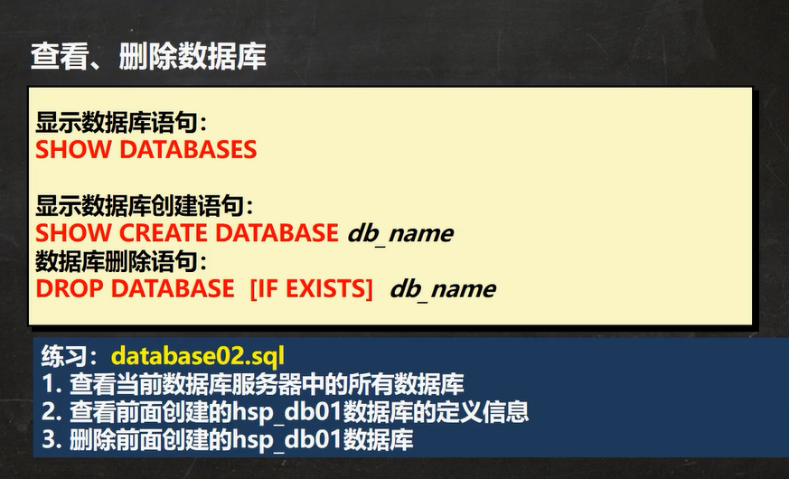

### 备份恢复数据库
使用命令行备份数据库：
    mysqldump -u 用户名 -p -B 数据库1 数据库2 数据库3 > 文件名.sql
该指令可以备份多个数据库；
也可以通过去掉-B的启动选项来单独地去备份表
    mysqld -u 用户名 -p 数据库 表1 表2

然后在mysql的客户端中使用Source关键字恢复
这个更像是mysql的客户端直接从文件中去读取sql语句


### 表的相关sql语句 
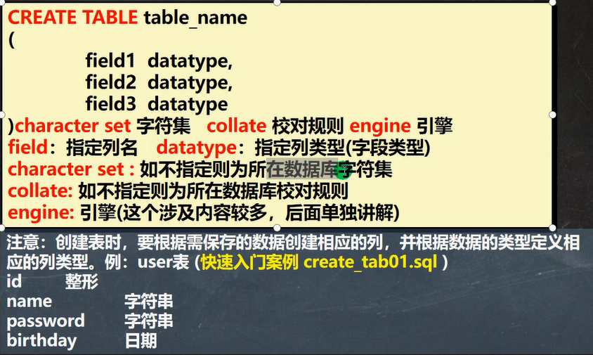

举例：建表语句
```sql
create table user(
    id int,
    name varchar(32),
    password varchar(32),
    birthday time
) character set utf8 collate utf8_general_ci
```

表的修改：
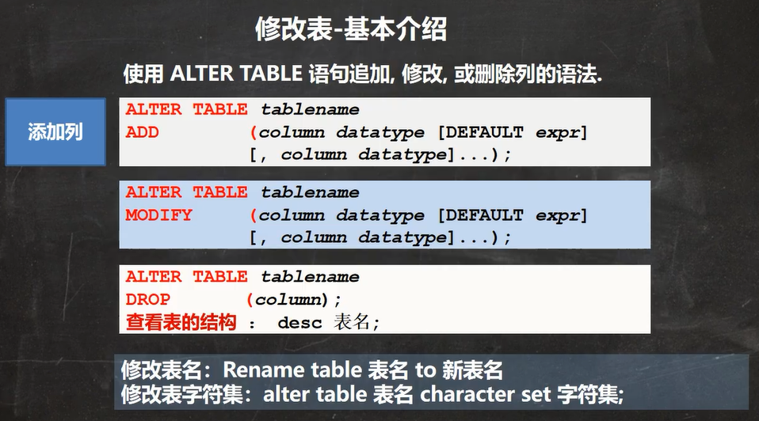
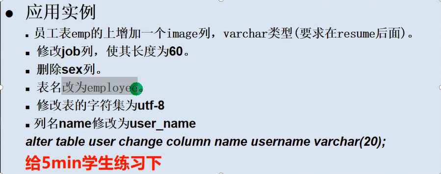
```sql
DROP TABLE IF EXISTS `emp`;
DROP TABLE IF EXISTS `employee`;

CREATE TABLE `emp` (
	ID INT,
	`name` VARCHAR (20),
	`sex` CHAR(1),
	`birthday` DATE,
	`entry_date` DATETIME,
	`job` VARCHAR(10),
	`Salary` FLOAT,
	`resume` text
) CHARSET utf8 COLLATE utf8_bin ENGINE INNODB;

INSERT INTO `emp` VALUES(100, '你爹', '男', '2001-10-21', '2022-09-12 12:00:00', '测试工程师' ,8000.00, '勿以赢小而不麻');
# 使用Alter关键字来修改表的属性
# 添加一列在Salary的后面
# 非空，默认为空字符串
ALTER TABLE `emp`
ADD `image` VARCHAR(32) NOT NULL DEFAULT '' AFTER `Salary`;
# 修改job列，使其长度为60
ALTER TABLE `emp`
MODIFY `job` VARCHAR(60);
# 删除sex列
ALTER TABLE `emp`
DROP `sex`;
# 然后修改表名为employee
RENAME TABLE `emp` TO `employee`;
# 修改表的字符集为utf8
ALTER TABLE `employee` CHARACTER SET utf8;
# 列名user修改为user_name
ALTER TABLE `employee`
CHANGE `name` `user_name` VARCHAR(64) NOT NULL DEFAULT '默认用户名';
DESC `employee`;
```

**注意**！修改列名的语句里面也要重新规定数据类型。
### MySQL的数据类型
数字类型：
整数：
- tinyint 一个字节
- smallint 两个字节
- mediumint 三个字节
- int 四个字节 **常用**
- bigint 八个字节

小数：
- float 四个字节
- double 八个字节 **常用**
- decimal 实数类型，通过制定M和D来确认具体的范围

文本类型：
char 0-255 **常用**
varchar 0-65535 **常用**
text 0-65535 **常用**
longtext 0-2^32-1

数据库也可以存储二进制数据
blob 0-65535
longblob 0-2的32次方

日期类型 说常用的
date 存放日期，只能存放年月日
time 存放时分秒
datetime **常用** 时间格式为：YYYY-MM-DD HH:mm:ss 存放年月日时分秒，最广泛
timestamp 时间戳 **常用** 他的特性是这个玩意会自动更新，不过也需要自己去配置规则

位类型 Bit 直接使用位来存储，有特殊的应用空间

### mysql的各种数据类型
整型：注意插入数据数据不要超过类型所能表示的范围就好

位类型：bit是一个可变的单位：后面要跟一个数字表示位的位数，范围是 1-64，这类数据显示的时候是按照位显示的，也就是二进制数。
在查询的时候依旧可以根据十进制或者其他进制的数字来查询。

小数以及实数类型：
小数类型：总之结论就是如果希望使用精度高的小数就推荐使用decimal类型去表示。
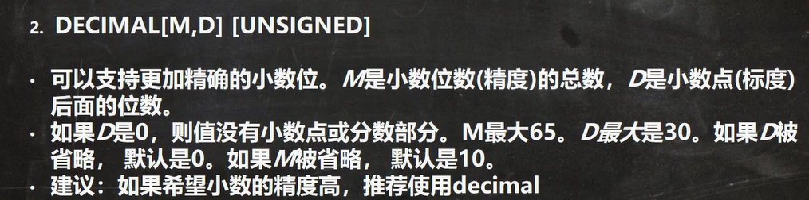

#### 字符串类型：
CHAR(Size)
固定长度的字符串 最大255个**字符**  (与之对应的varchar的最大其实也是16字节数)
VARCHAR(size) 可变长度字符串 
注意：utf-8编码的最大字符数是21844，一个字符需要三个字节，然后有保留的1-3个字节来记录大小
计算公式就是：utf8 varchar(size) size = (65535-3) / 3 = 21844 
而使用其他编码例如GBK编码时最大字符数又会发生变化，这里是个重要的细节。
utf8 varchar(size) size = (65535-3) / 2 = 32766
还有注意一个如果sql语句中间有错误那么代码的执行会在错误处中止并抛出一个错误，后面的语句是不会执行的。

**这里是个重要的细节**：字符串的使用细节：
细节1：

也就是说两种字符串类型后面括号里面的数字都不是表示具体的字节数。

细节2：
char占据的空间大小是固定的；
varchar是变长，根据实际占用空间来分配。然后varchar自己还会有三个字节来记录内容的长度。

细节3：
双方的使用情景：
数据定长使用char，数据不定长使用varchar。
查询速度char > varchar

细节4：
text有点类似int类型的数据，不能指定大小，而varchar和char就类似decimal，可以指定大小。
如果text不够用又不想指定大小的话可以使用范围更大的mediumtext和longtext。

#### 日期类型
讲解较为常用的 TIME、TIMEDATE、TIMESTAMP，
在MySQL5.7版本：如果需要timestamp自动更新的话，需要进行以下配置：
建表语句：
```sql
CREATE TABLE `birthday06` (
    t1 DATE,
    t2 DATETIME,
    t3 TIMESTAMP NOT NULL DEFAULT CURRENT_TIMESTAMP ON UPDATE
    CURRENT_TIMESTAMP
); timestamp时间戳
```

### 经典的CRUD
#### insert
INSERT INTO 表名 [可选](单独指定你要添加的列名) VALUES (数值一, 数值二), (数值一, 数值二);

注意事项：
1. 欲插入的数据应与列的数据类型相同。不过如果数字有单引号的话可以正常转换的话也能添加成功(底层会帮你进行转换，失败才会报错。)。
1. 数据的长度不能超过列定义的长度。
1. 在values中列出的数据需要与前面声明的列的顺序相同。
1. 字符和日期应该被包含在单引号中。 例如：'string'和'2022:06:26'。
1. 列中可以插入空值null，如果这个列允许插入空值的话。并且当不指定该列的长度时会默认为空。
1. 如果希望指定某个列的默认值，可以在创建表时指定默认值或者modify来进行修改。
1. values后面可以同时添加多列数据。
1. 在不给某个列数据的时候，如果有默认值就会是默认值，否则就会报错。

以商品表为例：
```sql
DROP TABLE IF EXISTS `goods`;

CREATE TABLE `goods` (
	id INT,
	goods_name VARCHAR(10),
	price DOUBLE
);

INSERT INTO `goods` VALUES (2, '光阪镇团子', 10), (3, '油炸方便面', 2.5);
ALTER TABLE `goods`
MODIFY `price` DOUBLE NOT NULL DEFAULT 33.5;
INSERT INTO `goods`(`id`, `goods_name`) VALUES (4, '油豆腐');
SELECT * FROM goods;
```
#### update
UPDATE 表名 SET 列名 = 值或者表达式 WHERE 筛选条件

使用细节：
1. 如果需要修改多个字段，可以通过 set 字段1 = 值1，字段2 = 值2...
1. WHERE 指定更新哪些行。如果没有WHERE，则更新所有行。

#### delete
delete语句用于删除表中的记录。使用WHERE关键字来添加筛选条件。
不适用WHERE则删除所有的记录。

使用细节：
1. 不能使用delete单独删除某一列的值。可以使用update更新数据为''或者NULL。
1. 使用delete仅能删除记录，不能删除表本身。

#### 【重要】select
SELECT [DISTINCT过滤掉重复数据] * | {指定查询哪些列} FROM 表名 WHERE 筛选条件
以下表为例：
```sql
DROP TABLE IF EXISTS `student`;
# 创建新的表
CREATE TABLE `student` (
	`id` INT NOT NULL DEFAULT 1,
	`name` VARCHAR(20) NOT NULL DEFAULT '',
	`chinese` FLOAT NOT NULL DEFAULT 0.0,
	`english` FLOAT NOT NULL DEFAULT 0.0,
	`math` FLOAT NOT NULL DEFAULT 0.0
);

INSERT INTO `student` VALUES (1, '韩顺平', 89, 78, 90),
	(2, '张飞', 67, 98, 56),
	(3, '宋江', 77, 87, 77),
	(4, '关羽', 89, 78, 90),
	(5, '赵云', 89, 78, 90),
	(6, '欧阳锋', 55, 85, 45),
	(7, '黄蓉', 75, 65, 30);
	
	SELECT * FROM `student`;
```

基本查询语句：
```sql
# 查询表中所有学生的信息
SELECT * FROM `student`;

# 查询所有学生的姓名和对应的英语成绩
SELECT `name`, `english` FROM `students`;

# 使用distinct过滤表中的所有重复数据
SELECT DISTINCT * FROM `student`;
# DISTINCT只有当每个字段的内容都相同的时候distinct才会对其进行删除。
```

进阶查询
```sql
# 统计每个学生的总分
SELECT `name`, (`chinese` + `english` + `math`) AS `summary` FROM `student`;

# 在每个学生的总分上加10分
SELECT `name`, (`chinese` + `english` + `math` + 10) AS `summary` FROM `student`;

# 使用别名表示学生的总分
SELECT `name` AS `姓名`, (`chinese` + `english` + `math`) AS `成绩总分` FROM `student`;
```

使用WHERE子句进行筛选
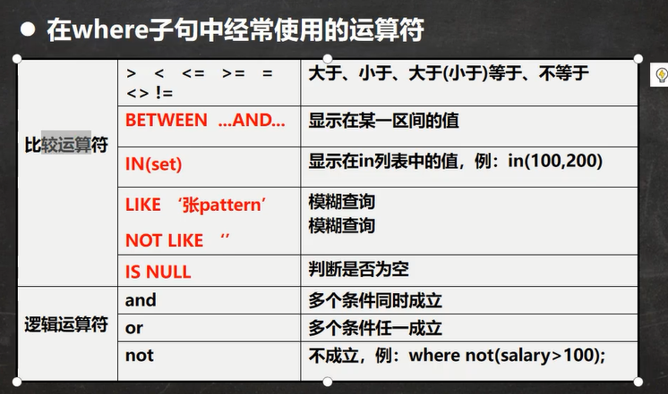
```sql
# 查询姓名为赵云的学生的成绩
SELECT * FROM `student` WHERE `name` = '赵云';

# 查询英语成绩大于90分的同学
SELECT * FROM `student` WHERE `english` > 90;

# 查询总分大于200分的同学
SELECT * FROM `student` WHERE (`name` + `english` + `math`) > 200;

# 查询math大于60 并且 id大于3的同学
SELECT * FROM `student` WHERE math > 60 AND id > 3;

# 查询英语成绩大于语文成绩的同学
SELECT * FROM `student` WHERE enlish > chinese;

# 查询总分大于200分，并且数学成绩小于语文成绩，并且姓韩的同学。
SELECT * FROM `student` WHERE (`name` + `english` + `math`) > 200 AND math < chinese AND `name` LIKE '韩%';

# 查询语文分数在 70 - 80之间的同学
SELECT * FROM `student` WHERE chinese BETWEEN 70 AND 80;

# 查询数学成绩为89,90,91的同学
SELECT * FROM `student` WHERE math IN (89, 90, 91);

# 查询所有姓李的学生的成绩
SELECT * FROM `student` WHERE `name` LIKE '李%';
```

查询排序
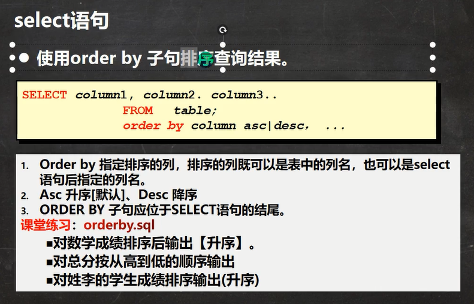
```sql
# 对数学成绩进行升序输出
SELECT * FROM student ORDER BY math DESC;

# 对总分进行降序输出
SELECT `name`, (`chinese` + `english` + `math`) AS total_score FROM student ORDER BY total_score;

# 对姓李的同学的总分进行升序输出
SELECT `name`, (`chinese` + `english` + `math`) AS total_score FROM student WHERE `name` LIKE '李%' ORDER BY total_score;
```

### MySQL的统计函数(又称聚合函数，指对一组值执行计算并返回单一的值)

count 返回行的总数
select count(*) from table_name
注意count(*)和count(列)的区别：
前者：返回满足条件的记录的行数；
后者：和 * 一样，但是会排除数据为null的情况。
请注意，只有count会计算为null的情况。   

sum函数
select sum(*) from table_name WHERE condition
注意sum函数只能对数字类型的列起作用，其他的类型没有意义。
注意：对于多列求和，逗号是不能少的。

avg函数
select avg(列名) from table_name WHERE condition

max函数和min函数
返回满足WHERE条件的最大值和最小值。

### 分组查询
建表语句，一共是三个表
```sql
DROP TABLE IF EXISTS dept;
DROP TABLE IF EXISTS emp;
DROP TABLE IF EXISTS salgrade;

CREATE TABLE dept( /*部门表*/
deptno MEDIUMINT   UNSIGNED  NOT NULL  DEFAULT 0, 
dname VARCHAR(20)  NOT NULL  DEFAULT "",
loc VARCHAR(13) NOT NULL DEFAULT ""
);

INSERT INTO dept VALUES(10, 'ACCOUNTING', 'NEW YORK'), 
(20, 'RESEARCH', 'DALLAS'), 
(30, 'SALES', 'CHICAGO'), 
(40, 'OPERATIONS', 'BOSTON');

-- 员工表

CREATE TABLE emp
(empno  MEDIUMINT UNSIGNED  NOT NULL  DEFAULT 0, /*编号*/
ename VARCHAR(20) NOT NULL DEFAULT "", /*名字*/
job VARCHAR(9) NOT NULL DEFAULT "",/*工作*/
mgr MEDIUMINT UNSIGNED ,/*上级编号*/
hiredate DATE NOT NULL,/*入职时间*/
sal DECIMAL(7,2)  NOT NULL,/*薪水*/
comm DECIMAL(7,2) ,/*红利 奖金*/
deptno MEDIUMINT UNSIGNED NOT NULL DEFAULT 0 /*部门编号*/
);

-- 添加测试数据
 INSERT INTO emp VALUES(7369, 'SMITH', 'CLERK', 7902, '1990-12-17', 800.00,NULL , 20), 
(7499, 'ALLEN', 'SALESMAN', 7698, '1991-2-20', 1600.00, 300.00, 30),  
(7521, 'WARD', 'SALESMAN', 7698, '1991-2-22', 1250.00, 500.00, 30),  
(7566, 'JONES', 'MANAGER', 7839, '1991-4-2', 2975.00,NULL,20),  
(7654, 'MARTIN', 'SALESMAN', 7698, '1991-9-28',1250.00,1400.00,30),  
(7698, 'BLAKE','MANAGER', 7839,'1991-5-1', 2850.00,NULL,30),  
(7782, 'CLARK','MANAGER', 7839, '1991-6-9',2450.00,NULL,10),  
(7788, 'SCOTT','ANALYST',7566, '1997-4-19',3000.00,NULL,20),  
(7839, 'KING','PRESIDENT',NULL,'1991-11-17',5000.00,NULL,10),  
(7844, 'TURNER', 'SALESMAN',7698, '1991-9-8', 1500.00, NULL,30),  
(7900, 'JAMES','CLERK',7698, '1991-12-3',950.00,NULL,30),  
(7902, 'FORD', 'ANALYST',7566,'1991-12-3',3000.00, NULL,20),  
(7934,'MILLER','CLERK',7782,'1992-1-23', 1300.00, NULL,10);

-- 工资级别
#工资级别表
CREATE TABLE salgrade
(
grade MEDIUMINT UNSIGNED NOT NULL DEFAULT 0, /*工资级别*/ 
losal DECIMAL(17,2)  NOT NULL, /* 该级别的最低工资 */
hisal DECIMAL(17,2)  NOT NULL /* 该级别的最高工资*/
);

INSERT INTO salgrade VALUES (1,700,1200);
INSERT INTO salgrade VALUES (2,1201,1400);
INSERT INTO salgrade VALUES (3,1401,2000);
INSERT INTO salgrade VALUES (4,2001,3000);
INSERT INTO salgrade VALUES (5,3001,9999);

```
具体的分组
```sql
# 显示每个部门的平均工资和最高工资
SELECT  AVG(sal), max(sal), deptno FROM emp GROUP BY deptno;

# 显示每个部门的每种岗位的平均工资和最低工资
SELECT avg(sal), min(sal), deptno, job FROM emp GROUP BY deptno, job;

# 显示平均工资低于2k的部门号和它的平均工资，并用别名显示
SELECT avg(sal) AS avg_sal, deptno AS '部门号' FROM emp GROUP BY deptno HAVING avg_sal < 2000;
```

通过以上的内容可知 group by 就是将相同的某列合并。

**注意**分组后的结果使用关键字HAVING进行过滤。并非所有的过滤都由WHERE完成。

**子句的顺序**
如果SELECT语句中包含GROUP BY(分组), HAVING(分组后筛选), ORDER BY(排序), LIMIT(分页), 那他们应该是按这个顺序排列。
如果子句顺序有误会报错，而且还看不出错误类型，特别麻烦。
实例：
```sql
# 请统计各个部门的平均工资，要求只统计大于1000的，并且按照平均工资从高到低排序，并取出前两行记录。
SELECT deptno AS '部门', AVG(sal) AS avg_sal FROM emp GROUP BY deptno HAVING avg_sal > 1000 ORDER BY avg_sal DESC;
```

### 字符串函数
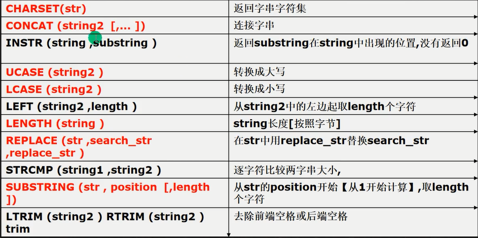

DUAL是MySQL的一个关键字，代表系统中的一个哑元表，可以做测试使用。
例如：SELECT instr('zhengzikang', 'kang') FROM DUAL;

```sql
# 若一列大写，请使用首字母小写的方式将数据输出
# 方式一
# 先取出以一个字符，转成小写，然后与后面剩余的字符串进行拼接。
SELECT CONCAT(LCASE(SUBSTR(ename, 1, 1)), SUBSTR(ename, 2)) AS 首字母小写 FROM emp;
# 方式二
# 使用替换函数直接将第一个子串转换成小写，其中取得首字母可以用SUBSTR函数或者LEFT函数。
SELECT REPLACE(ename, SUBSTR(ename, 1, 1), LCASE(SUBSTR(ename, 1, 1))) AS 替换首字母小写 FROM emp;
```
### 数学函数
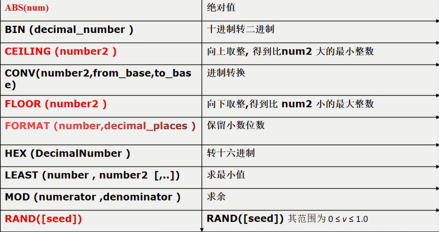
常用的数学函数
```sql
# 绝对值
SELECT ABS(-7) FROM DUAL;

# 十进制转换为二进制
SELECT BIN(10) from DUAL;

# 数字向上取整
SELECT CEILING(114.514) FROM DUAL;

# 进制转换: 这里 原始是十进制，目标是二进制
SELECT CONV('A', 16, 10) FROM DUAL;

# 数字向下取整
SELECT FLOOR(114.514) FROM DUAL;

# 保留小数位数: 数字、保留小数的位数，遵循四舍五入
SELECT FORMAT(19.19, 1) FROM DUAL;

# 求最小值
SELECT LEAST(0, 1, -4, 4) FROM DUAL;

# 求余数
SELECT MOD(5,2) FROM DUAL;

# 转换十六进制，和CON(x, 10, 16) 是等价的
SELECT HEX(11) FROM DUAL;

# 返回随机数，其范围是是[0, 1]
# 可以设置seed，如果seed不变，随机数也不变
SELECT RAND(3) FROM DUAL;
```

### 日期函数
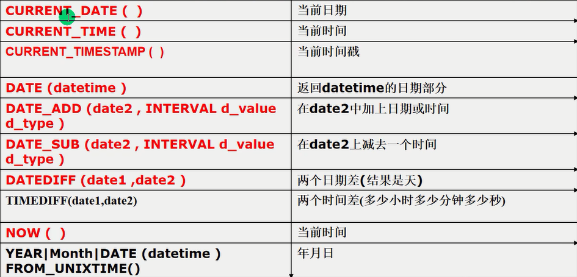
测试表
```sql
DROP TABLE if EXISTS mes;
CREATE TABLE mes(
	id INT , 
	content VARCHAR(30), 
	send_time DATETIME
);
-- 添加一条记录
INSERT INTO mes 
	VALUES(1, '北京新闻', CURRENT_TIMESTAMP()); 
INSERT INTO mes VALUES(2, '上海新闻', NOW());
INSERT INTO mes VALUES(3, '广州新闻', NOW());
```
测试
```sql
# 显示所有的新闻信息，发布日期，只显示日期而不显示时间
SELECT id, content, DATE(send_time) FROM mes;

# 查询在十分钟内的新闻
# 思路是使用DATE_ADD 函数加上时间然后与当前时间比较大小
SELECT * FROM mes WHERE DATE_ADD(send_time,INTERVAL 10 MINUTE) >= NOW();

# 求出 2011-11-11 到 1990-1-1 相差了多少天，这个函数是前面的减去后面的
SELECT DATEDIFF('2011-11-11','1990-1-1') FROM DUAL;

# 求出我活了多少天
SELECT DATEDIFF(NOW(), '2001-10-21');

# 如果你能活80岁，算出你还能活多少天
SELECT DATEDIFF(DATE_ADD('2001-10-27', INTERVAL 80 YEAR), NOW()) FROM DUAL;

# 可以通过对应的日期关键字进行日期转换。(不演示)

# unix_timestamp() 返回的是从1970-1-1到now的秒数，是一个无符号整数。

# '%Y-%m-%d' 是一个固定格式，表示年月日
# 意义：把一个数值当做时间来记录，然后通过FROM_UNIXTIME进行转换。
SELECT FROM_UNIXTIME(UNIX_TIMESTAMP(), '%Y-%m-%d');
```

一些小细节：
1. DATE_ADD() 和 DATE_SUB() 中的 INTERVAL 可以是 year, minute, second, day等。
1. DATEDIFF(date1, date2) 的结果得到的是天数，并且是date1-date2，因此可以取到负数。
1. 这四个函数的参数类型可以是 DATE, DATETIME, TIMESTAMP

### 加密和系统函数
```sql
# 查询当前用户, 格式是用户名@IP地址
SELECT USER() FROM DUAL;

# 查看当前正在使用哪个数据库
SELECT DATABASE();

# 为字符串算出一个 MD5 32位的字符串，常用于为用户加密
# 使用md5的好处是一是加密信息，而是定长可以加速查询，使用char数据类型进行存储
SELECT LENGTH(MD5('risk'));

# 使用PASSWORD() 来进行加密, MySQL默认就使用这个函数进行加密
SELECT PASSWORD('hsp');
# 验证：MySQL使用这个函数来进行加密
SELECT * FROM mysql.`user`;
# 在MySQL的底层也是用表来存储用户信息的
```

### 流程控制函数
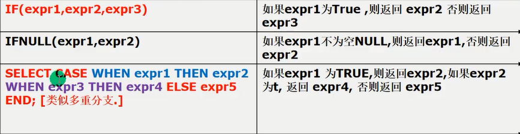
```sql
# IF函数，有点类似编程语言的三元表达式
SELECT IF(TRUE,'韩顺平','蒋效会');

# IFNULL函数，类似Kotlin的.?运算符
SELECT IFNULL(comm, 0.0) FROM emp;

# CASE 函数，类似Kotlin的when语句，Java的switch语句，就是多重分支 
SELECT `ename`, (CASE job
	WHEN 'clerk' THEN
		'职员'
	WHEN 'manager' THEN
		'经理'
	WHEN 'salesman' THEN 
		'销售人员'
END) AS job
	FROM emp;
```
我自己写的时候好像case语句的判断表达式好像也可以直接写到case后面似的...
不过我也不准备深入研究了

### 单表查询加强(练习)
1. 在MySQL中日期类型可以直接进行比较。
1. 使用LIKE进行模糊查询，%表示0到任意个字符，下划线_表示单个字符。
1. 使用desc来查看表的结构。
1. ORDER by 可以通过逗号指定多个排序依据。

### 分页查询
基本语法
select ... limit start, rows
表示从start + 1行开始取，取rows行。
对应的一般的公式就是：
SELECT * FROM emp ORDER BY empno LIMIT 每页显示的记录数 * (页码 - 1), 每页显示的记录数

## 多表查询
### 笛卡尔积
关于**笛卡尔积**：不加任何限制的直接进行多表查询会直接返回笛卡尔积的结果，也就是每个表的列数相乘个数目的结果会被返回。
多表查询的默认结果就是笛卡尔积。多表查询的实质就是写出正确的过滤条件过滤掉你不需要的结果。
**注意**：多表查询的的条件个数至少得是**表的数目 - 1**，否则会出现笛卡尔积。

练习
```sql
# 多表查询训练
# 显示部门号为10的部门名，员工名还有工资
SELECT dname, ename, sal FROM emp, dept WHERE dept.deptno = emp.deptno AND dept.deptno = 10;

# 显示各个员工的姓名，工资，及其工资的级别
# 工资级别需要靠最高工资和最低工资来过滤，因此使用BETWEEN...AND...来判断范围。
SELECT ename, sal, grade FROM emp, salgrade WHERE sal BETWEEN losal AND hisal;
```
### 自连接
自连接是指在同一张表上的连接查询。(将一张表当成两张表来使用)
因为
自连接举例：
```sql
# 显示员工表中的雇员和对应的上级领导的名字
# 使用自连接，通过字段mgr进行匹配
SELECT worker.ename, manager.ename FROM emp worker, emp manager WHERE worker.mgr = manager.empno;
```

特点：
1. 把一张表当成两张表来使用
1. SQL中为了能够使用需要起别名才能使用自连接。给表起别名不需要使用AS关键字。
### 子查询
子查询是在其他sql语句里面的select语句，也叫嵌套查询。

- 单行子查询
只返回一行数据的子查询语句。默认直接使用等于号。
- 多行子查询
返回多行数据的子查询语句，使用关键词in在结果中遍历。

```sql
# 子查询
# 查询和smith相同的部门的所有员工
SELECT ename FROM emp WHERE deptno = (
	SELECT deptno FROM emp WHERE ename = 'smith'
);

# 查询和部门10工作相同的雇员的名字、岗位、工资、部门号，但是不包含本身属于十号部门的雇员。
# 1. 先查询10号部门里面有哪些工作, 注意要过滤掉重复的工作岗位！
# 2. 
SELECT * FROM emp WHERE job IN (
	SELECT DISTINCT job FROM emp WHERE deptno = 10
) AND deptno <> 10;
# 在新的MySQL规范中推荐使用<>来进行不等的判断。
```

### 子查询临时表
查询的返回结果是一张表，因此子查询的结果本身就可以当成一张表来使用。

```sql
# 查询eshop的各个类别中，价格最高的商品
SELECT goods_id, cat_id, goods_name, shop_price
	FROM (
			# 把子查询的结果当做临时表使用
			SELECT cat_id, MAX(shop_price) AS max_price
			FROM ecs_goods
			GROUP BY cat_id
	) temp, ecs_goods
		WHERE temp.cat_id = ecs_goods.cat_id
		AND temp.max_price = ecs_goods.shop_price;
```

### all关键字和any关键字的使用
max和min函数有类似的效果
```sql
# 获得部门号为30的员工
select ename, sal, deptno
from emp where sal > all (select sal from emp where deptno = 30
);

select ename, sal, deptno
from emp where sal > any (select sal from emp where deptno = 30)

```
### 多列子查询
就是在子查询里面查询多列结果
```sql
# smith的岗位与部门

# 用上面子查询的结果查出岗位和部门相同的雇员，martin本人

select *
from emp where (job, deptno) = (select job, deptno from emp where ename = 'martin'
) and ename <> 'martin';

# 请查询和宋江的数学，英语，语文成绩相同的其他同学
select * from student where (math, english, chinese) = (select math, english, chinese from student where name = '宋江')
```

### 一些子查询的练习
```sql

```

### 表的复制和去重
表的复制又称为蠕虫复制，当需要海量的数据的时候，可以通过复制来测试SQL语句的效率。
**复制**
```sql
# 可以通过复制表的方式来创造一个拥有大量数据的环境。
create table my_tab01 (
    id int,
    `name` varchar(32),
    sal double,
    job varchar(32),
    deptno int
);

desc emp;

# 自我复制流程
# 表数据的迁移：
# 1. 可以直接将select查询到的语句通过insert插入到新的表中
insert into my_tab01 select empno, ename, sal, job, deptno from emp;

# 2. 表的自我复制
# 其实很简单：就是重复插入*的查询结果就是了，多运行几次就是指数爆炸。
select * from my_tab01;
insert into my_tab01 select * from my_tab01;

# 这个用法基本就是用来测试自定义SQL语句的执行效率来使用的。

```
**删除重复数据**
核心就是使用distinct关键字，这个应该是最简答的一种思路了。
实现略，懂表的复制的语法就不成问题。
使用like关键字可以复制表的结构，是个很有用的关键字。

### 合并查询
使用union关键字可以重复查询。这个关键字有点类似语句之间的and的意思。
使用union all只是进行简单和合并，不会进行去重。
```sql
select ename, sal, job from emp where sal > 2500 
union all 
select ename, sal, job, from emp where job = 'manager';
```
单独使用union，回去重。

### 外连接
什么是外连接？
之前的多表查询使用的是数据关联的方式，但是如果某个表中的数据不和其他数据产生关联，独立存在，那么这个数据就被筛选条件漏掉。
外连接就可以显示不存在关联数据的行出来。
连接有一个左表和右表的概念，左连接就是显示左表的所有数据；右连接就是显示右表的所有数据。
以左连接为例：
select * from 左表 left join 表2 on 筛选条件。
```sql
# 外连接
# 列出部门名称以及内部的员工姓名以及工作，同时显示内部没有员工的部门
# 使用多表查询
select dname, ename, job from emp, dept where emp.deptno = dept.deptno order by dname;
# 这种属于关联查询，如果存在数据不包含关联关系那么很可能就会有数据被漏掉。
# 使用外连接：外连接分为左外连接和右外连接
# 两者的区别在于哪个表会完全显示，就是谁是主体谁是从的关系
# 建表：学生表和考试成绩表
create table stu (
    id int,
    `name` varchar(32)
);
insert into stu (id, name)
values (1, 'jack'), (2, 'tom'), (3, 'kity'), (4, 'nono');
select *
from stu;
create table exam (
    id int,
    grade tinyint);
insert into exam (id, grade)
values (1, 56), (2, 76), (11, 8);
# 使用左连接(显示学生表中的所有数据，成绩为空也要显示id和姓名)：
select `name`, stu.id, grade from stu left join exam on stu.id = exam.id;
# 使用右连接：
select `name`, stu.id, grade from stu right join exam on stu.id = exam.id;
```
之前直接进行多表查询的方式也叫做**内连接**。

## 约束
约束用于确认数据库的数据满足特定的规则。
### 主键
用于唯一的表示表行的数据。
定义主键约束后，该列不能重复。
主键的细节
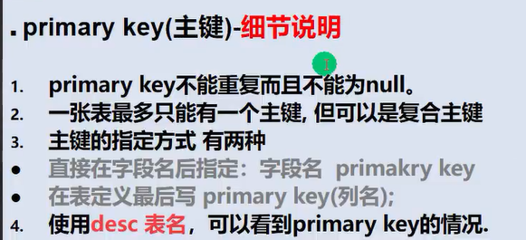
**复合主键**
一个表中只能有一个主键，但可以是复合主键。
复合主键就是指表中的多个列当成一个主键。
语法是在定义中单独指定主键，并用括号括起来。
主键的指定语句和列的定义语句是同级的。

这样定义后，只有当这些字段都相同时才会违反主键的唯一规则。

### Unique
唯一约束，表示该列的数值唯一。
**细节**
1. 当unique和not null搭配使用的时候，类似primary key的效果。
1. 不指定not null时，null并不会被判断成重复。
1. 一张表可以有多个unique的约束。

### 外键约束
外键是用来**定义主表和从表之间关系**的一种约束。
具体的表现得为：
    外键的约束要定义在从表上，主表必须具有主键或者唯一约束。当定义了外键约束后，外键列的数据必须在主表的主键上存在或者外键在允许为空的情况下为null。
    简单来说就是外键可以体现表与表之间的关联关系。
    并且当主从表的外键约束形成后，无法直接删除主表上有外键约束的行，必须得先删除从表的对应数据才行。

外键的语法：
foreign key 从表的字段名 references 主表名(主键名或unique名)

**外键使用细节**

1. 第一条直观一点就是reference后面的字段必须有主键或者唯一键约束。
1. 表的类型必须是innoDB才支持外键的机制。记住这点就行。
1. 外键字段的类型要跟主表的字段类型相一致，因为外键本质上算是一种引用，不过**长度可以不同**。
1. 外键字段的值必须在主表出现过，或者为null。(在该列允许为空的情况下)
1. 建立了外键约束的主表不能随意的删除，为了数据的一致性；如果需要删除，顺序是：删除从表对应的所有数据、然后再删除主表的数据。
1. 
### Check约束
check约束用于**强制行数据必须满足的条件**。
假如你定义了一个check的约束，要求数值必须在1000~2000之间，那么插入不满足这个要求的数据将会报错。
我大学大纲中的数据库课程使用的是SQL SERVER，是支持使用check约束的。
不过MySQL5.7的版本现在并不支持check约束，只做语法校验。虽然你可以使用check关键字，但是并不会生效。

在MySQL5.7的版本中，实际上的check的实现是靠程序代码或MySQL的触发器实现的。

这个东西做一个了解。

### 自增长
基本语法：字段名 整型 primary key auto_increment
如果不对自增长的字段进行处理的话，该字段就会实现自动管理。

**小细节**
1. 自增长一般**配合主键**一起使用，不过也可以配合unique使用。
1. 自增长可以修饰小数，但是一般不会这么使用。
1. 自增长默认从1开始，也可以通过alter table table_name auto_increment = 新的开始值。
1. 自增长的列可以自行指定。但是不推荐不这么做：因为这样就破坏自增长自动管理自身的原则了。

## 索引
### 索引可以做什么？
首先说结论：索引可以以最小的代价来提高数据库查询的性能。索引是用来优化查询速度的。
索引语法：在指定表的指定列创建索引。
索引本身也会**占用一定的开销**。
CREATE INDEX 索引名 on 表名(列名)
索引的性能提升只能使设置了索引的列生效。

### 索引的原理
select的查询就是按照**顺序**对每行的数据进行扫描比对。
这样全表扫描的查询办法使得效率极低。所以慢！
索引就是形成索引的数据结构，系统会按照特定的数据结构去进行检索，这样就比之前的方式高效很多。
设计规范的数据结构利于检索。    

#### 索引的代价：
1. 增加磁盘占用，因为新的数据结构占用了空间。
1. 对dml语句(insert, update, delete)语句的效率产生影响。对数据进行更改会导致数据在索引中的位置发生变化，因此dml语句的效率会降低。
索引的思想就是数据与数据之间彼此通过数据结构建立了关联，因此查询速度会加快，而牵一发而动全身，dml语句的速度会因此变慢。

### 索引的类型
- 主键索引；主键就是一种索引。(因为主键本身的约束适合创建索引)。想要创建所谓的主键索引直接创建主键即可。
- 唯一索引：有唯一约束的列也是一种索引。(Unique索引) 
- 普通索引：最常用的索引；是为了加快检索速度而使用的。
- 全文索引：适用于MyISam(一种存储引擎)。MySQL的全文索引比较烂，一般开发推荐使用全文索引的框架：Solr和ElasticSearch。

### 相关的SQL语句
```sql
# 演示索引相关语句的使用
# 创建示例表
CREATE TABLE t25 (
	id INT,
	`name` VARCHAR(32)
);

# 查询表是否有索引，查询结果是一个对应的表。
SHOW INDEXES FROM t25;

# 添加索引
# 添加唯一索引
CREATE UNIQUE INDEX id_index ON t25 (id);
# 添加普通索引的方式1
CREATE UNIQUE INDEX id_index ON t25 (`name`);
# 上面两种索引，如果不重复的话优先考虑唯一索引。

# 添加普通索引的方式2
ALTER TABLE t25 ADD INDEX id_index (id);

# 删除索引
DROP INDEX id_index ON t25;
# 删除主键索引，不需要指定列名，因为主键在表中必须是单例。
ALTER TABLE t25 DROP PRIMARY KEY;

# 修改索引就是先删除旧索引然后创建新索引。

# 查询索引的方式
# 方式1
SHOW INDEX FROM t25;
# 方式2
SHOW INDEXES FROM t25;
# 方式3
SHOW KEYS FROM t25;
# 另外使用desc也可以展示粗略的索引信息。
DESC t25;
```

### 索引使用细节
索引该怎么样使用？
索引是为了改善查询速度而使用的。并且底层实现的原理决定了它不能在频繁更新的字段上使用。
综合来讲：
1. 较频繁作为查询条件的字段应该创建索引。
1. 唯一性太差的字段不适合使用索引，因为这样的字段使用索引也无法改善性能。如筛选性别等。
1. 更新频繁的字段不适合使用索引，这样会使得dml语句的效率降低。
1. 不会出现在where子句中的字段不应该创建索引。

## 事务
### 事务的作用
事务用于保证数据的一致性，由**一组dml语句组成**(不包含select语句，因为select语句不会修改数据，不会对数据的一致性造成影响)。这些dml语句要么全部成功，要么全部失败。比如转账就需要使用事务来管理。
```sql
# 事务的具体操作
# 1. 创建测试表
DROP TABLE IF EXISTS `t27`;
CREATE TABLE `t27` (
	id INT,
	`name` VARCHAR(32)
);

# 2. 开始事务
START TRANSACTION;

# 3. 设置第一个保存点
SAVEPOINT a;
# 执行相关的dml操作
INSERT INTO t27 VALUES (1, 'tom');
# 设置第二个保存点
SAVEPOINT b;
# 执行第二次dml操作
INSERT INTO t27 VALUES (1, 'jack');
# 回退到b
ROLLBACK TO b;
# 全部回滚
ROLLBACK;
# 提交，并且提交后无法回滚
COMMIT;
```

**使用细节**
1. MySQL默认不开启事务，意思是在不开启事务的情况下，你的每个dml操作都将立即生效，不能回滚。
1. 执行回退操作之后，会删除对应区间内所有的保存点。
1. 在MySQL一般在innoDB存储引擎中才使用事务。
1. 在事务提交之前，其他会话(数据库连接)的数据都是事务内进行dml操作之前的数据。
1. 要开启事务可以使用start transaction 或者 set autocommit=off。后者的意思其实是关闭MySQL默认的自动提交。

### 事务的隔离级别
什么叫隔离级别？
在多个数据库连接在开启各自事务的时候要来负责隔离操作，来保证**各个连接获取数据的正确性**。数据隔离就是保证各个连接在其他连接开启事务的时候**数据依旧能够保持准确**。
隔离级别跟事务息息相关，如果不开启事务，隔离毫无意义。
如果**不考虑隔离性，会导致出现以下问题**
- 脏读(dirty read)：当一个事务读取另外一个事务**尚未提交的修改**时，会出现脏读
- 不可重复读(nonrepeatable read)：
- 幻读(phantom read)：
不可重复读和幻读的区别在于其他事务所做的修改是修改删除还是插入：前者是不可重复读，后者是幻读。
以上三种问题的情境其实很类似，我觉得没有必要专门去记住他们的区别。

具体的事务隔离级别
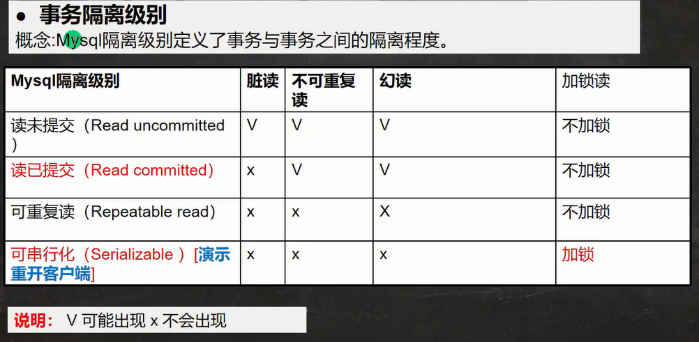

### 具体操作
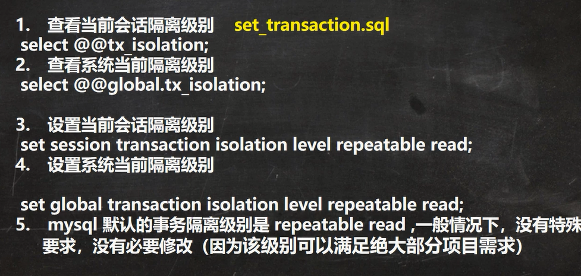

### ACID特性
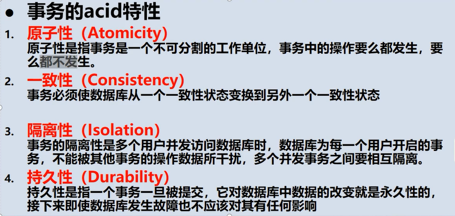
## 表的类型和存储引擎
### 基本介绍
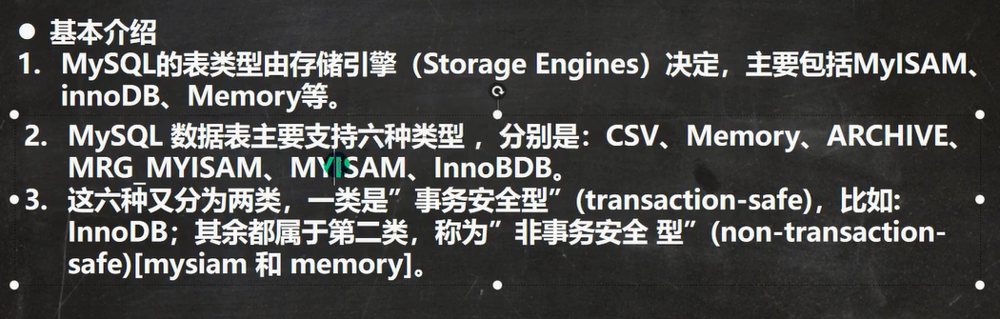
1. MySQL的表类型由**存储引擎**决定。
1. MySQL表的类型有六种，**常用的有三种**。
1. 六种类型中只有innoDB支持事务。

### 特点
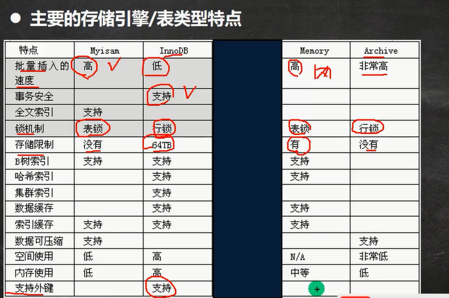

最常用的三种存储引擎：MyISam、InnoDB、MEMORY
1. MyISam不支持事务，不支持外键，但是**访问速度快**，对事物的完整性没有要求。
1. InnoDB具有完整的事务安全(提交、回滚、崩溃恢复能力)。相对应的有一定的代价。
1. MEMORY在内存中操作表。每个memory只实际对应一个磁盘文件。

**对应的使用案例**：


## 视图
视图本质上是一个虚拟表。虚拟表的数据**来源于真实表**。
视图和实际表互相影响。
### 基本使用
1. create view 视图名 as select语句：创建视图
1. alter view 视图名 as select语句：修改视图
1. show create view视图名：展示视图对应的创建语句。
1. drop view 视图名一，视图名二...：一次性删除多个视图。

### 视图的细节
1. 在新建视图之后， 视图在磁盘中对应的文件是视图名.frm
1. 视图**可以影响基表**，基表也可以影响视图。
1. 视图可以嵌套。

### 视图的最佳实践


## 权限管理
权限管理的部分我跳过了，因为感觉用不上的样子。

