# RUST入门教程
[RUST入门教程](https://www.bilibili.com/video/BV1hp4y1k7SV)

# 安装
没什么好说的，比java简单。
基本就是安装，环境变量，然后命令行测试就行。

我安装的时候没有给我自动设置环境变量，所以记得设置一下。

还有rust编译需要cpp环境，默认会给你一个瘤子vs要你去下载，
这里用两个命令完成：
```shell
rustup toolchain install stable-x86_64-pc-windows-gnu
rustup default stable-x86_64-pc-windows-gnu
```

此时应该就可以正常编译一个rs文件了。


# Hello World
和其他语言的没有什么不同，似乎是多了一个 “宏”的概念；

```rust
fn main(){
    println!("Hello Rust!");
}
```

定义函数的关键字为fn；
和其他编程语言一样，main是代码入口；
叹号是一个宏，以后再说；
代码后面需要用分号结尾

以上的是视频里面总结出来的信息，我还没有进行过验证；

和go类似，rust的可执行文件几乎不依赖什么环境，可以直接在别人没有rust环境的条件下运行。
rust的编译和运行是**两个部分**，
使用rustc编译后会

算了我直接贴图：
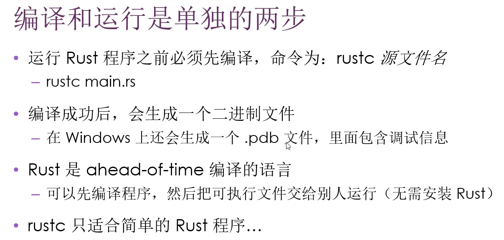

宏，是一种用代码生成代码的手段。。。先记住这句话。

rustc这个编译命令只适合简单的程序，换句话说相当于没用。

rust一般使用 cargo来进行编译。

# Hello cargo
cargo是rust的项目编译工具和包管理工具，十分强大。

cargo使用toml作为配置文件。 反正很容易看懂，不细说

在rust里面，一个包通常叫做crate

cargo的项目结构：
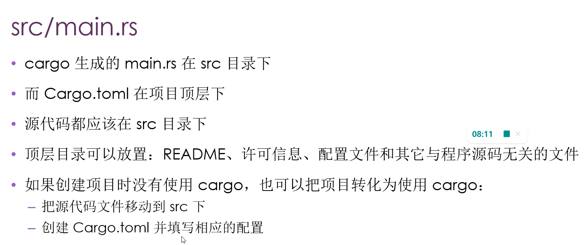

cargo的编译和运行的命令非常丰富：
build：编译项目或文件，带上 标志位 --release，编译时间会更长，但是代码会优化
run：编译并运行
check：仅仅检查编译是否可以通过，不实际编译，时间比build短很多。

总之一句话：cargo真几把好用

# 通过实例来了解知识点：猜数游戏
## 一次随机的猜测：读取用户的输入的string并输出

```rust
fn main(){
    println!("猜数游戏！");
    println!("猜一个数字吧托雷那！");

    let mut guess_number = String::new();
    std::io::stdin().read_line(&mut guess_number).expect("嚯嚯好像输入有问题啊");

    println!("那么，今天我们两个的幸运数字是...{}!", guess_number)
}
```

我要慢慢去啃rust了，每天不要贪婪的去学太多东西，防止**产生放弃的心理**

这一部分的话记住两个内容：
1. use关键字是导入其他包或者库（crate）所使用的关键字
1. let关键字是用来 “绑定”的，记住这一点。 let声明的变量默认都是不可变的，需要显式的声明 mut关键才行。

## 生成申必数字
这里 是依赖管理的问题：cargo build 与依赖
这里以引入一个三方库为例： 引入rand

首先要在cargo的配置文件：toml的dependency里面引入依赖：
例如： rand = "^0.3.14"

幂次符号可选，表示只要兼容这个版本的依赖都可以。

### 精确依赖
除此之外，cargo引入了 “精确依赖” 这个概念：
cargo初次编译成功后，会生成cargo.lock文件，
它代表这些依赖是可以成功编译的，除非使用update命令，否则，
即使以后这些依赖有新的更新，cargo也将优先使用之前可以编译成功的依赖的版本。

这样做的好处显而易见：就是**防止新版本的依赖破坏原有代码的结构**。

### 关于rust的代理问题
要么挂梯子，要么代理，国内这傻逼环境

cargo 的 crate（你可以理解成包）分为两类：
一个是 bin：二进制类，是可以运行的；
一个是 lib：库文件，专供其他代码使用的，俗称 “轮子”


总之 这个猜数游戏里面引入了许多rust的新概念，不懂也没有关系。后面的时候再细说。

# 通用的编程概念

## 变量可变性
通过`let`进行变量的绑定。Rust的变量默认都是不可变的，也就是说如果**值确定之后**，就不能再次发生改变了。
可变变量需要加上`mut`关键字；

常量：
很多人容易因为 常量和不可变变量的值都不能发生变化这一特征而混淆它们，或者觉得它们的区分没有必要；
常量的核心特点是：**它的值必须在编译的时刻就被确认下来**，而后者不需要。
常量的特点：
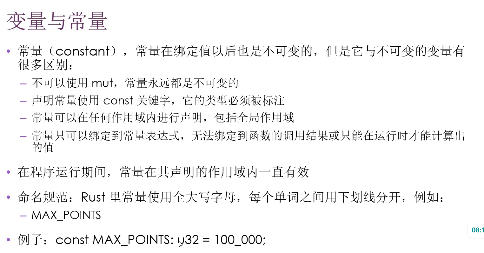

**遮蔽shadow**
这是一个重要的概念，也是rust里面用的比较多的：
使用let可以重新将变量绑定到一个新的数据上去，前面的变量类型会**被覆盖**；
关于它的细节暂时不说，你只需要rust里面**可以这么用，而且推荐这么用就行**

## 数据类型
从大的说，Rust的数据类型分为两类： 标量类型和复合类型。
标量类型就是**只有一个值的类型。**

Rust是静态语言：静态语言的特点就是在**编译的时候必须知道所有变量的数据类型**

**整数类型**
Rust的大部分类型和其他语言的都差不多，多了一个 arch类型：isize（有符号的）和usize（无符号的），由系统的架构确定：如果是64位系统，那么isize等同于i64.

关于溢出的处理：
结论： 
debug编译环境下值溢出 -> panic
release编译环境下值溢出 -> 发生数据环绕

**字符类型**
rust用关键字 char表示字符，默认为 Unicode，类似 Go的rune类型。等同于i32。

**rust的复合类型**
rust提供有两种关于符合类型的基础实现：
元组（tuple）和数组
元组的字面值通过小括号创建，和Python很像。是 不可变（immutable）的。
元组类型的成员的访问是**点标记法**。
实际上和go的多返回值差不多了实际上。

数组和其他语言的差不多。数组是分配在栈空间的，而Vector（可以先暂时理解成动态数组或者其他语言里面的List）在堆上。
数组越界会引发panic。

不过rust的数组类型和其他语言的不同：
Go：`[5]int`
Rust：`[i32; 5]`

数组用的不多，Vector用的更多，类似其他语言的集合。
如果如果不确定用哪个，那么就用Vector。

## 数组和数组的切片
和其他语言一样， rust的默认数组性能优秀（存储在栈上），但是功能较差（长度固定，不能动态增加）

rust的数组类型的声明是这样的： Rust：`[i32; 5]`
切片则为： `&[T]`， t为具体的元素的数据类型；
和go语言一样， 切片在大多数时候要更加有用：
```rust
#![allow(unused)]
fn main() {
let a: [i32; 5] = [1, 2, 3, 4, 5];

let slice: &[i32] = &a[1..3];

assert_eq!(slice, &[2, 3]);
}

```


## 函数
这里注意区分一个在Rust中很重要的概念：
语句（Statement）和表达式（Expression）：语句是一个指令，而表达式是计算值
Rust里面的分号**表示一个语句的结束**
你也可以理解成 语句的值是**一个空元组()**

**返回值**
Rust不允许为返回值命名；
函数体内的最后一行表达式是函数的返回值；
可以用`return`提前返回。

## 注释
和其他编程语言一致。
这里重点说一下**文档注释**

# 控制流
`if`用于分支， 它是一个**表达式**
因此if可以很好的替换其他语言的三元表达式
不过如果有多于一个`else if`的话，使用更强大的match吧。

Rust提供三种循环关键字（各有用途，某种意义上体现了一致性原则），循环也是**表达式**。
`loop`: 典型的需要手动停止的循环。一般使用break语句停止的；
`while`：经典的条件判断的循环：每次执行循环体前需要判断条件。
`for`：用于迭代的循环。也是**最常用的循环**。

# 所有权
Rust独有的一个概念，让其图拥有GC，也能提供内存的安全性。
同时，它的机制是**让其对内存的处理，提前到了编译期间**，而非运行时，性能比拥有GC的语言要高。

## 栈（Stack）和堆（Heap）
在Rust这样的系统级语言中，数据分配在栈还是堆上的重要性比**其他语言的更加重要**

栈和堆的对比：
栈上的数据不用寻址，也不能寻址，每次操作都在**栈顶**；
分配在栈上的数据必须拥有**已知的、固定的**大小。 （Go里面就有内存逃逸的例子）

如果不符合这个条件，就只能分配到堆中。
堆虽然灵活，但是性能较差。
一般在堆上分配内存的话，是操作系统（OS）在堆上分配大小，然后返回一个指针。

因为指针是已知固定大小的，所以可以放在 Stack上。

结论就是：Stack上性能好，但是不灵活；堆相反。

**函数调用时**
把值（包括指向堆上内存的指针）传递给函数，函数本地（Local）使用的变量会被压入到栈中。

## 所有权
Rust引入了所有权的概念，它可以：
1. 跟踪堆上内存的情况；
1. 最小化堆上的重复性数据
1. 可以清理未使用的数据，节省空间

所有权机制是用来管理**堆数据**的

所有权机制的**核心**是：
任何的值（Value）在任何时候有且只有一个所有者：变量（Variable），当所有者超出它的作用域（Scope）时，它对应的值会立刻被丢弃（调用drop函数。）

以 Rust里面的String类型为例：
首先介绍一下Rust中的 String类型：
String和字符串字面值（str）并非同一种类型：前者是分配在堆上，大小可变的；后者是编译时值就确定，放在栈里面的。
通过函数 String::from()可以用字面值生成一个值字面值的String类型变量。
归根结底是str和String在Rust中使用内存的方式不同。

**变量和数据交互的方式**
首先是String的结构：
是经典的结构体加底层数组的方式。

设想如果是Rust这种语言执行以下的代码：
```rust
// 创建了s1 和s2的作用域
let s1 = String::from("Hello");
let s2 = s1;

// 超出s1和s2的作用域
```

如果是赋值操作的话，超出作用域后会出现**二次释放**现象，存在安全隐患。
所以Rust的所有权规定：
一个类型的值，在**同一时间只能由一个变量**所拥有；
上面的示例代码中，如果在作用域里面使用s1的话，会报错：因为s1所代表的值的所有权已经转交给s2，那么此时s1会被rust编译器给锁定，无法再使用，保证了安全性。
对于没有实现 Copy Trait的变量来说，等号执行的是**移交操作（MOVE）** 
对于 实现了 Copy Trait（特征）的类型（实现Copy Trait以为着两件事： 它的拷贝**几乎不会有性能损失**；它是**分配在栈上**的）来说，它的拷贝一般不会具有危险性，所以Rust**不会把它的的所有权转移**，而是将一个新的值压入栈中。

## 函数与返回值的所有权传递
默认情况下，将参数传入函数，会发生所有权的转移，原本的变量就会失效。
在函数内，如果有返回值，那么就会将所有权返回。
一句话总结：**函数的入参和返回都会发生所有权的转移**

不过这么转移来转移去实际上显得过于麻烦，我们大部分时候其实是不希望所有权转移的：这就引出
单单引入所有权机制会使得变量的使用变得**复杂**，所以rust提供了另外一种机制来简化： 引用和借用。

**借用和引用**
**获取变量的引用，这个过程称作所有权的借用**
使用and符号表示引用，表示你引用某些值而**不改变其所有权**，解引用是星号；

不过光光使用and符号只能让你**读取到**对应的值，如果你要修改的话？
对应的你要使用可变引用： mut
注意为了防止数据竞争：Rust规定同一作用域，特定数据只能有一个可变引用
并且，如果已经存在了一个不可变的引用，那么你也是不能使用可变引用的：

结论：
在**同一个作用域**内，引用只能存在两种情况：
- 拥有一个可变引用；
- 拥有任意多个不可变引用。

```rust

#![allow(unused)]
fn main() {
let mut s = String::from("hello");

let r1 = &s; // 没问题
let r2 = &s; // 没问题
let r3 = &mut s; // 大问题

println!("{}, {}, and {}", r1, r2, r3);
}
```

引用的作用域和变量稍微有些不同，引用的作用域只会持续到最后一次使用到它的地方，比如上面的代码如果删除println的宏的话，代码是可以通过编译的。

确实是很有意思的特性，而且确实很安全。

## 切片
以典型的字符串切片为例：在Rust中字符串切片是 &str[..]
切片是引用类型，不持有所有权，因为切片一定是**对某个变量的引用**。

Rust的切片用 [0..5]表示，其他的语法糖类似其他语言。
可以使用诸如一下格式的语法糖
```rust
fn string_slice() {
    let root_string = String::from("Hello rust!");
    let l2m_str = &root_string[..5]; // l2m_str: &str = Hello
    let m2r_str = &root_string[5..]; // rust!
    println!{"{}, {}, {}", root_string, l2m_str, m2r_str};
}
```

对于字符串切片在作为fn形参的时候，推荐使用类型 &str, 这样既可以传入String引用，也可以传入 &str切片，并且不会有任何性能上的损失。

**切片本质上是一种引用，所以切片也要遵守引用的规则。**

# Struct
使用 struct定义在逻辑上有关联的字段，并命名。
在实例化 struct的时候需要初始化所有的字段。

如果一个struct变量是**可变的**，那么它所有的字段就都是可变的。

**一些语法糖**
如果 struct初始化的时候字段和初始化的值相同的话，就**可以合并**

结构体的复用语法：
如果一个struct想复用一个已存在的struct，那么可以：
```rust
let user1 = User{
    name: String::from("Nick"),
    age: 32u8,
};
    
let user2 = User{
    name: String::from("Ellis"),
    ..user1
};
```

这个代码中： user2复用了user1的字段，也发生了所有权的转移。

关于struct的所有权相关的问题需要引入生命周期，现在暂时写不了。

## Tuple Struct
元组结构体，适用于想直接使用元组，但是又想把它区别于 Rust默认的元组的话，可以使用它
**元组结构体就是一个有名字的元组**

学习智能指针时补充：
定义一个自定义的 Box 就可以使用 tuple Struct：
```rust
struct MyBox<T>(T);

impl<T> MyBox<T> {
   fn new(x: T) -> MyBox<T> {
    MyBox(x)
   } 
}
```


## Unit-Like Struct 空结构体
适用于想实现Trait而又不需要有字段的情况下。

## Struct 的方法
通过impl关键字可以定义代码块，里面实现struct的方法
包含self参数的是**方法**，只是定义在里面的就是**关联函数**（可以简单的理解为Java里面的静态方法。）


# Option枚举
Rust的枚举是一个强大的功能，我觉得就像离散数学一般；
Option枚举是用来代替其他语言中的null的。

Option enum 在标准库的 predule中，是被预导入的。
用来描述 某个值存在或者不存在这两种情况。

Rust中没有null的概念。
其他语言中NULL的问题在于：
要NULL的东西去执行非NULL的动作，这太莫名其妙了：这种会直接引起错误的行为应该，但却没有被规避；

在Rust中使用 Option\<T>来代替null：
在底层里，Option是一个枚举类型：
有Some和None两种情况，值存在返回Some，否则为None。
注意Some/<T>和T是不一样的：
相当于要你显示去处理这两种情况。

# 模式匹配
用关键词 match
match 后面接表达式，然后在代码块中匹配对应的arm（分支），并作为match表达式的值
match需要穷举所有的可能性，下划线表示不关心对应的结果。
## 部分值匹配
enum中的类型可以额外绑定数值，也可以用于模式匹配。

if let相当于只关注单一匹配结果的match，**可以理解成**match的语法糖。
写法：
```rust
fn gen_err() -> Result<(), Box<dyn Error>> {
    
}

if let Err(e) = 
```


# Rust的模块管理工具
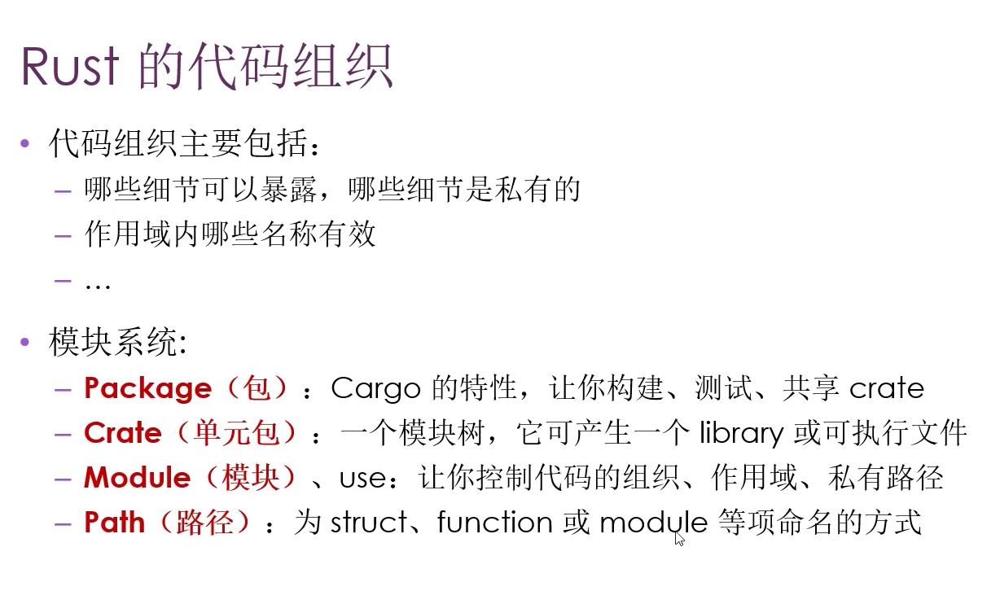

Package是 crate的管理者，这样理解就行。
并且p和c之间有严格的数量关系限定：
看截图：
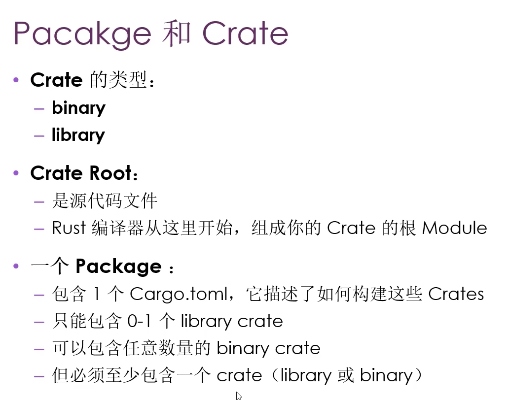
约定大于配置思想。

crate的作用：
可以将 同逻辑的功能组合到一个作用域内，方便在项目之间进行共享。
一般 crate就是一个文件。

crate根：代表一个crate的入口，main.rs和lib.rs分别就是对应的二进制的根和库的根


我暂时还不知道 Rust这么设计的意义，不过看还是看得懂的，因为有其他语言的经验。


## Path（路径）
Path用来作为定位模块中资源的方式：和文件系统的路径是一个道理；
也分为相对路径和绝对路径：

绝对路径从 crate开始（应该）


模块下的子模块以及其他的组件默认都是**私有**的。

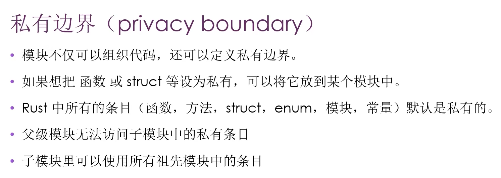

Rust的路径相关的关键字：
super：上级，类似文件系统中的..

pub关键字可以加在struct、fn、enum等前面

如果struct前面加，结构体公有，但是内部字段依然**私有**

如果enum加，枚举类型公有，enum的变体也是私有的；

## use关键字
use用于导入路径下的模块到当前的作用域中，
有点类似文件系统中符号链接的那味

关于引入的规则：
fn一般引入到父级模块；
struct和enum用绝对路径引入，表示不变性。
as关键字可以起别名。

pub use可以使得在引入的时候之后，该模块被外部引用时，该部分是公开的。 这种行为叫做**重导出**

在use中，可以通过花括号区别前缀相同但后缀不同的路径；

use中也可以引入所有模块，通过通配符星号。不过不建议在引入的时候这么做：
通常推荐：
测试
预导入

rust的目录结构要与**模块的层级结构相匹配**

# Rust中的集合
通常是指三个：
Vector
String
HashMap

## Vector
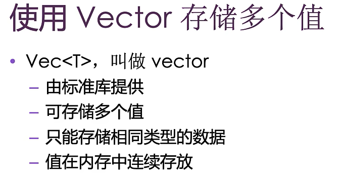

Vec内部只能放相同的元素。
Vec的元素在内存中（具体来说是堆中）是连续存放的

Vec可以使用宏来方便的创建一个Vector：
```rust
let v = vec![0, 1, 2, 3];
```

通过**push方法可以添加元素**，rust可以进行上下文类型推断（这不重要）

读取 Vec的元素：
一个是通过索引，另外一种是通过get方法（返回一个Option的枚举，可以搭配match使用）
使用get因为提前做了错误处理。


Vec存储在堆中，关于**它的所有权问题**：
不可同时存在可变和不可变的借用。

通过for迭代循环遍历 vec中的元素。

Vec默认只能存储类型相同的值，
而枚举的实例可以存储不同的变体值，通过这种方式来实现Vec中存储不同的元素：

```rust
// 定义枚举
enum SpreadSheetCell {
    Float(f64),
    Int(i32),
    Text(String),
}

// 创建Vec
let sheet_vec = vec![
        SpreadSheetCell::Float(3.14), 
        SpreadSheetCell::Int(114514),
        SpreadSheetCell::Text(String::from("")),
    ];
```

可以这么用的方式是因为：编译器**可以提前知道具体的类型**。

## String
Rust的字符串分String（复杂类型）和str（简单类型，底层类型）两种。

字符串的**本质**就是 字节的集合（Vec\<u8>）

在Rust这类系统级的编程语言中，需要把首先把它当成Byte集合，然后再考虑下一步该怎么做。

String的设计和Go的string的设计差不多。底层是str，通常以&str的形式出现。
这两个最大的区别是：前者会发生所有权的转移，后者则通常是对应的借用。

（个人）可以近似的认为String的本质就是 Vec\<u8>, 所以一般用于Vec的操作一般也可以用于String。

String的常用操作：
push_str可以连接，加号也可以，不过会发生所有权的转移，
format!这个宏也可以，并且是用的最多的。有点类似println!的宏

### 关于Rust的String的索引
从安全的角度上来看，Rust不支持String的索引有它的考虑；
String默认不支持索引访问，编译时会报错：没有实现对应的Trait。

Rust中String的底层是对 Vec\<v8>的包装；

len方法会返回String字面值的字节数；

字节，字面值，字形簇（最接近所谓的字母一种形式）是 Rust看待字符串的三种方式；

前两个可以通过bytes和chars方法获得对应的迭代器；
最后一个有点复杂，标准库没有实现，需要去找第三方的crate

最后一个不允许 String直接索引的原因是：
Rust认为索引应该是O(1)复杂度的，
而Rust需要通过遍历字符串来确保字符合法，这样就不能保证常数时间复杂度了。

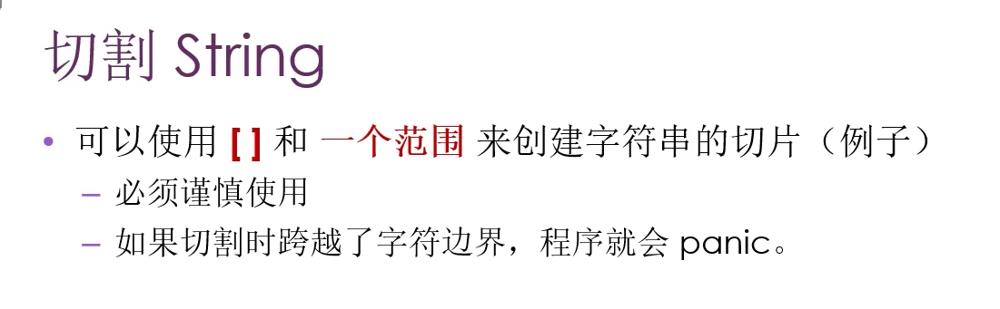


## RUST的HashMap
和其他语言的HashMap一样， Rust的hashmap也是用 hash函数实现的。
hashmap通过new创建一个新的，还有通过insert插入数据。

hashmap在rust里面好像用得少，所以没有被预导入。
标准库对其的支持也相对较弱。

HashMap还可以通过 collect方法创建，不过这里暂时就不写了。

### HashMap的所有权
和其他容器的一样：实现了Copy Trait的类型会自动进行复制，无所谓所有权的概念；
但是如果没有，那么所有权会被**转移**给 HashMap本身。

### 获取 HashMap容器中的值
通过get方法，返回一个Option枚举（在Rust用来处理null的情况）
通过match模式匹配可以处理：

```rust
match map.get(key_name) {
    Some(s) => println!("{}", s);
    None => println!("Not exists...");
}
```

HashMap本身也是一个可迭代对象。
可以使用模式匹配来进行对应的null处理；

### 更新值
往HashMap中插入值一般来说有三种情况：
这里不好写啊。。。

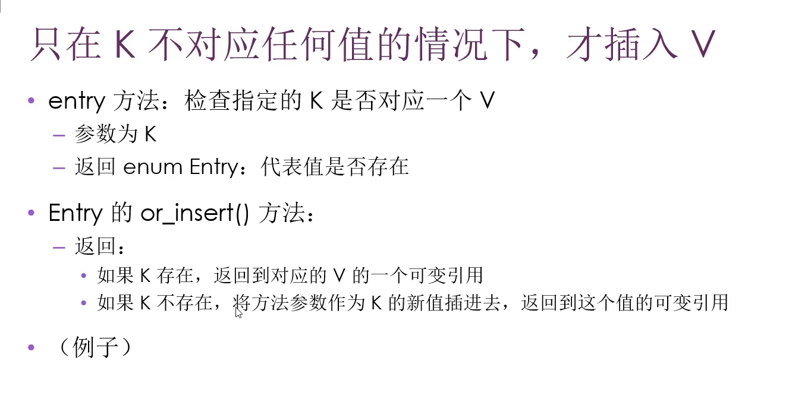

Rust这里Hash的东西挺多，以后有需要再看。

# 错误处理
RUST中分为可恢复的错误（用`Result<T, E>`处理）和不可恢复的错误（用`panic!宏处理`）

当发生panic的时候：rust默认会
1. 打印错误信息
1. 展开（unwind）和清理调用栈（stack）
1. exit

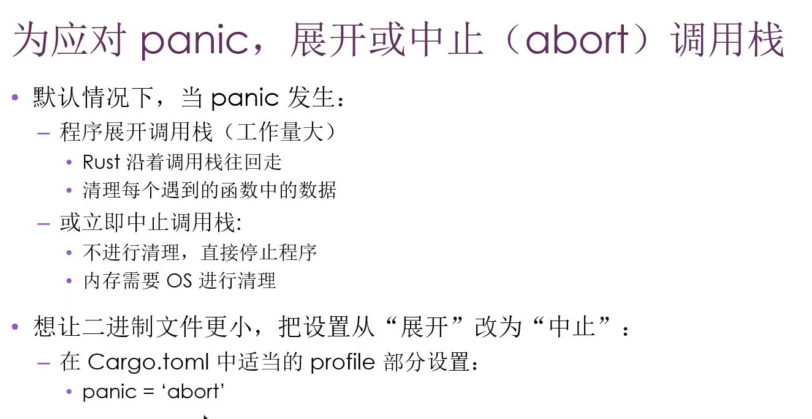


这个第二步的话，调用栈是由rust清理的；如果你想让二进制文件小一点，那么你可以可选的立刻终止（abort）调用栈，转而用os去处理，这样你的bin文件会小一些。

可以在Cargo.toml里面配置
```toml
[profile.release]
panic = 'abort'
```

Rust在出现 panic的时候默认是不会显示 BackTrace的回溯信息的；
设置环境变量`SET BACKTRACE=1`或者full可以显示出现panic时函数的调用栈信息。

## 可恢复的错误在Rust中是采用的枚举的方式
Result枚举
Result枚举十分好理解：
```rust
enum Result<T, E> {
    Ok(T),
    Err(e),
}
```

如果正确，返回Ok这个枚举，并携带对应的数据；Err同理；

可以通过match表达式来处理 Result枚举；
不过虽然match很有用，但是十分的原始；

unwrap是match的一个封装：Ok则返回值，Err则panic；
expect则在unwrap的基础上，可以显式的指定信息；

## 错误传播
类型与异常向上抛。这个函数的返回值需要是 Result的泛型。
如果符合以上要求的话， 可以通过？运算符节省代码量，算一个语法糖。

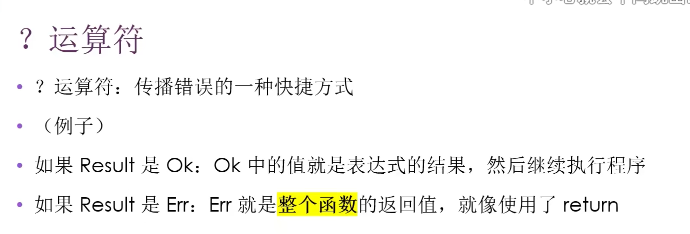

？会隐式调用from函数：这个函数可以实现错误之间的相互转换；
适用场景： 因为不同的原因而需要返回**同一个类型的错误的时候**

另外关于错误处理：
有时候会有一个 `Box<dyn Error>`的错误类型，这个需要学习到 Trait的时候才能具体；

现在暂时可以简单理解成： 任何可能的错误类型；

## panic的使用场景
具体的说panic的使用场景十分的复杂，而我现在暂时也没有具体的应用场景，所以暂时不用管这些。

慢慢补充：
Test的时候应该使用panic，应该一旦发生错误整个测试就算失败；

# Rust的泛型
就是我知道的那个泛型：
Rust的泛型可以用于 fn、struct、enum（让枚举变体持有泛型类型）、method

```rust
// 函数定义
fn find_max<T> (list: &[T]) -> T{
    ...
}

// 结构体
struct Point<T>{
    x: T,
    y: T,
}
```

关于方法的泛型：可以针对对应结构体（或枚举）中所有的类型都编写方法，也可以只针对具体的某个类型编写方法：
```rust
// 为所有的类型都编写方法
impl<T> Point<T> {
    pub fn x(&self) -> &T {
        &self.x
    }
}

// 或者只单独为某一个类型编写方法
impl Point<u32> {
    pub fn x(&self) -> &u32 {
        &self.x
    }
}
```

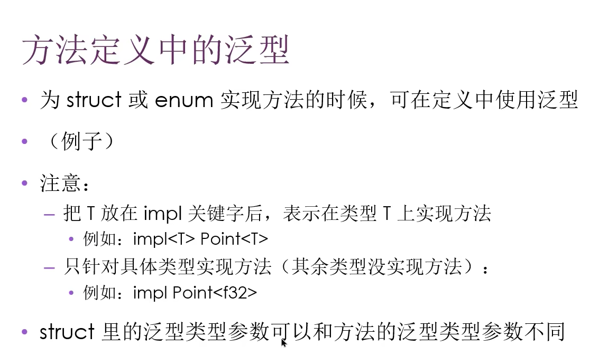

Rust语言中使用泛型的性能：（C++使用泛型在运行时也不损失性能，但是生成的是大量的模板代码，编译时间长）运行时**不损失性能**

单态化：编译时为泛型的每一种类型都生成代码。


turbofish语法：
可以参考这篇博客：[Link](https://www.jianshu.com/p/9107685ece03)

简单的说，在编译器不能推断泛型参数的时候，有**两种显式的指定泛型参数的方式**
1. 直接给变量指定类型；
1. 通过turbofish语法指定：

```rust
let v = Vec::<bool>::new();
println!("{:?}", v);
```

其他的以后再说。
# Trait
```rust
// 定义 trait
pub trait Summary {
    fn summarize (&self) -> String;
}
```

实现trait和实现方法很像；
不过略有不同：
```rust
pub trait Summary {
    fn summ(&self) -> String;
}

pub struct Bilibili {}

// 我自己觉得rust语法的可读性其实还可以
// 实现 特征 Summary 用 Bilibili
impl Summary for Bilibili{
    fn summ(&self) -> String {
        String::from("Bilibili")
    }

}
```

Rust的trait遵循**孤儿法则**：
> trait不能跨crate实现，这是为了安全，防止其他人可以修改你的代码；

trait也可以在定义的时候就提供一个默认实现，类似于Java的接口的默认实现，这样当你想用默认实现的时候可以不用为每个实现添加重复的逻辑；
另外trait默认实现的的方法中可以另外调用**没有提供默认实现的方法**
这很容易理解。

## trait作为参数
简单地说，如果你的形参是一个普通的**鸭子类型**，那么你的可以这样：
```rust
fn receive_trait(item: impl Summary) {}
```

这种适用于简单情况；
还可以结合泛型来实现类型约束：
```rust
fn receive_trait<T: Summary>(item: T) {}
```
这种可以适用于复杂情况，并且利用泛型**统一类型**

在要求参数实现多个trait的时候，之中可以用`+`进行连接
```rust
(item: impl Summary + Display)
```
不过这种写法在函数参数复杂的时候，是泛型约束和类型信息耦合在一起：Rust提供了语法糖：
where关键字（不知道是不是从sql语法拿的）
```rust
-> String
where T: Summary + Display,
```

trait也可以作为返回类型，和作为参数是一样的，
但是注意： 返回类型必须是**确定**的：
> 返回的只能是确定的同一种类型；（俗称静态派发）
> 不过应该可以是通过枚举包装来实现那个效果的；

另外 trait bound 还可以用于这样一个情境：
> 在实现多个trait的时候，才能实现某一个方法；
```rust
impl <T: Display + ParticalOrd> Pair<T> {
    fn cmp_display(&self) {
        ...
    }
}
```

另外trait还有一种叫做**覆盖实现的机制**，有机会再说

# 生命周期
Rust生命周期的**主要作用**应该就是为了**防止悬垂引用**的出现。

生命周期的特点：
1. 是针对**引用**的生命周期
1. 生命周期表示的是**引用有效**的范围；
1. 大多数时候声明周期是可以自动推断的，因此是隐式的；
1. 不能推断的时候，要**显式的声明**引用的声明周期；


简单的说，被引用的生命周期必须必引用者的生命周期的时间长；

Rust在编译期时会通过**借用检查器**检查所有权以及对应的借用；
一个简单的理解就是： 被引用者的生命周期不得小于引用者的生命周期；

## 函数中的生命周期
结论：在函数中包含多个引用的时候，**编译器可能无法判断对应的引用的生命周期**，这个时候需要**手动标注**

所以请注意：**生命周期标注并不会改变任何引用的实际作用域**
> 例如一个变量，只能活一个花括号，那么就算你给它标注一个活全局的生命周期，它还是会在前面的花括号结束处被释放掉，并不会真的全局存活。

生命周期的参数用`'a`表示，包含这个标识的引用的意思是：
引用存活的时间大于`'a`的时间。

个人理解： 这个东西是给**编译器的一个提醒**，作为一个**约束**，它会阻止它不清楚的情况出现。但是不能作为真实的引用具体的生命周期时间。

函数中的引用只会来源于两个地方：参数是一个引用、在函数作用域内部变量的引用
而返回后者的话一定是一个悬垂引用，除非返回对应的所有权；

所以fn返回的引用必定**来源于参数的生命周期**。

## struct中的生命周期
可以在字段内部使用引用类型，不过需要注意生命周期。

## 概念：输入生命周期和输出生命周期
出现在**函数参数位置**的生命周期就是输入生命周期；
出现在**函数返回值位置**的就是输出生命周期。

## 生命周期的省略规则
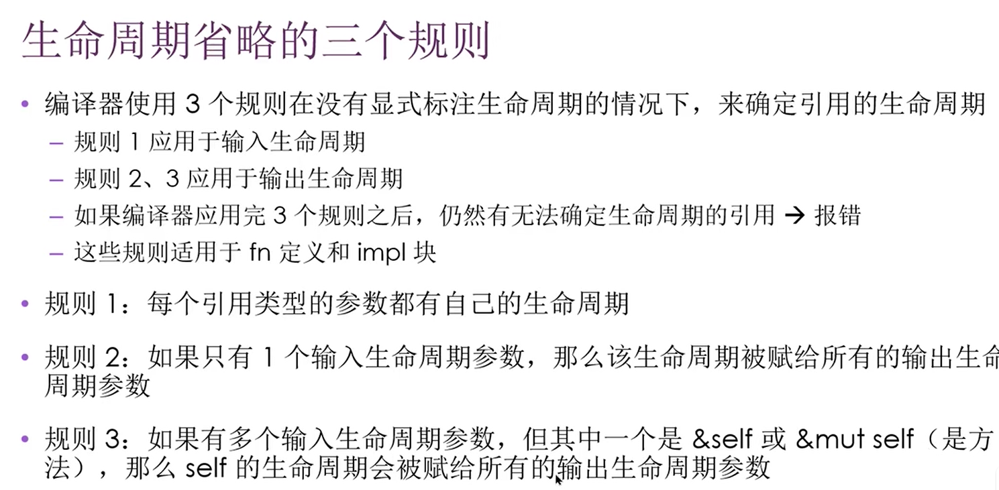

如果可以通过这三条规则确定对应的生命周期，就可以不需要显式指定对应的生命周期。

## 方法中显式声明生命周期
如果在定义方法的结构体上包含有生命周期的字段，那么实现方法的时候需要在impl关键字后面显式声明。

然后就是省略规则的第三条。

## 静态生命周期
在这个机制里面，有一个特殊的生命周期：`'static`，表示在程序运行期间内一直存活。

你必须小心的使用它。

# 测试
任何项目中，编写和运行测试都是非常重要的。
测试分为三步：
1. 准备测试用数据
1. 运行测试代码
1. **断言**结果

在一个函数上标注`#[test]`可以使得函数变成测试函数。

通过`cargo test`命令可以执行测试。（也就是Rust中内置测试模块）Rust会构建一个可执行文件，专门用于测试。

当通过cargo创建一个库项目的时候，会生成一个 test module。 里面有test函数，可以参考它的结构去编写其他的测试函数。
（这也说明Rust执行测试的基本单位至少不是test module，因为测试模块中也可以包含普通的函数。）执行测试后，编译器的的调试信息是很多的。

## 测试失败
当一个测试函数发生panic的时候就表示测试失败：
每一个测试都会单独运行在一个线程中（Rust这么设计应该有它的道理的）
而主线程则相当于一个管理者，监视其他的Thread，失败则把他们标记成 Test Failed。

## RUST断言
Rust在语言级别中提供断言（Go默认不提供）。
`assert!`就是一个最基础的断言宏。
来自标准库（不需要use导入的意思），用于检测某个表达式的值（bool类型）
true: passed; flase: panic!

宏`assert_eq!和 assert_ne!`分别用于判断两个值是否相等和不等；
在 assert中也可以用`==`来判断，不过前者在断言失败的时候还可以打印对应的值（哈哈其实就一个很简单的功能而已）
因为equals和打印value的特性，因此要求这两个要实现 PartialEq和Debug两个trait。

## 断言宏中可选的错误信息
assert相关的宏可以添加可选的String参数，它会向format宏发送错误信息，最终打印额外的错误信息。

## 在测试中使用Result反馈测试结果
前面的例子中都是通过panic和assert来判断测试是否通过的；
而Result是用来进行错误传播的，所以其实也可以用来进行测试函数的结果判断：Ok为测试通过，Err为测试失败；
注意，此时不要再使用`#[should_panic]`，因为两种测试的使用情况相矛盾。
```rust
#[test]
fn test_with_result() -> Result<(), String> {
    if 2 + 2 = 4 {
        Ok(())
    } else {
        Err(String::from("two plus two doesn't equal four"))
    }
}
```

# 对测试的行为进行控制
## 对测试命令添加命令行
执行测试的默认命令式`cargo test`，可以可选的添加命令行参数：
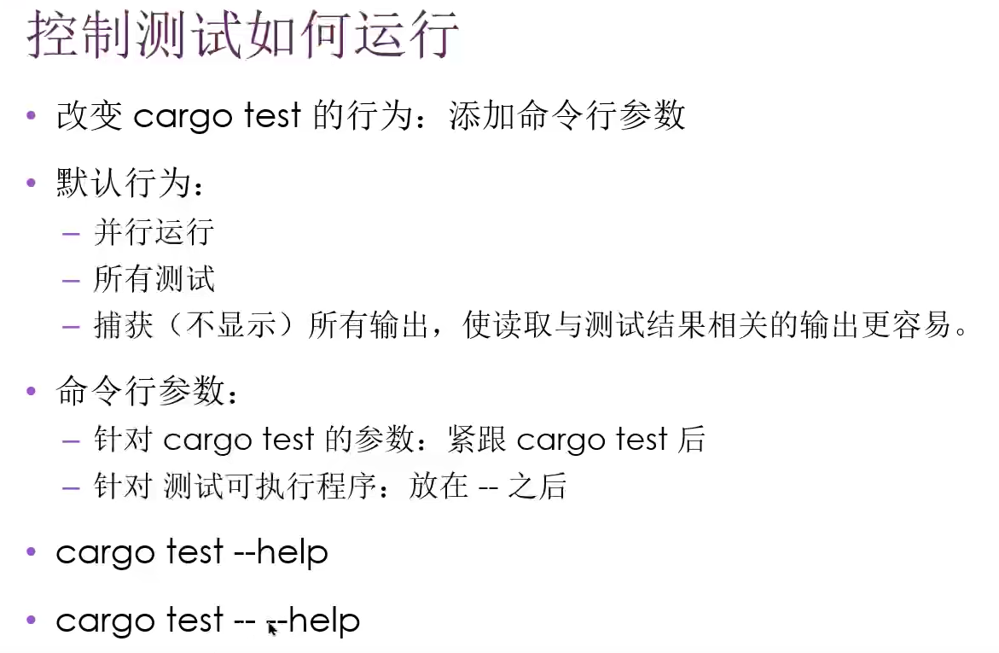

## 并行运行测试
Rust进行测试的时候，默认是进行多线程并行进行（依赖于现代语言对多核处理器的有效支持），这样的好处是**测试运行更快**，不过这对测试用例也有要求：
1. 测试用例之间不得彼此具有依赖；
1. 测试用例之间不依赖某个共享状态（环境变量等）

如果你想：
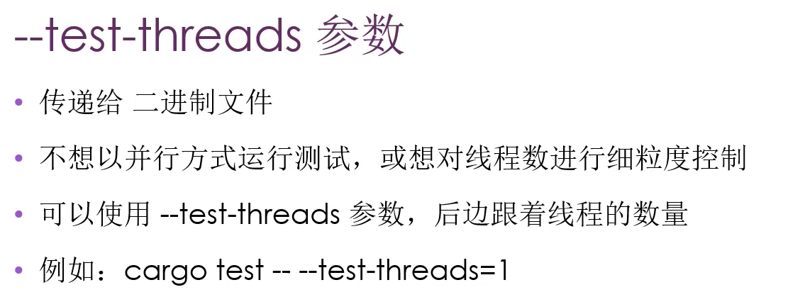
通过`cargo test -- --test-threads=1`

## 显式函数的标准输出
测试中默认会**捕获**测试通过的函数的输出。
而没有通过的
这样做的目的是为了不让通过测试的日志信息对调试结果产生干扰。

开启的话用命令`cargo test -- --show-output`

## 通过名称运行测试的子集
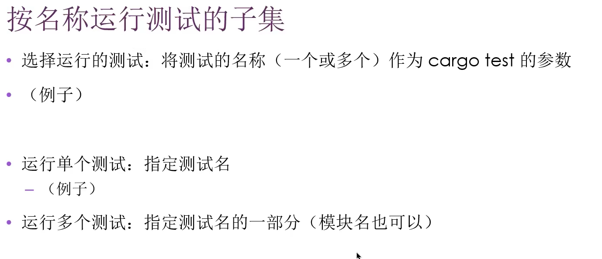

## 忽略耗时测试
想象这样一个场景：某一个测试，只有你在想执行它的时候，才执行它；那么你需要这么做：
1. 给测试函数指定一个忽略测试的注解`#[ignore]`
1. 这样cargo在测试的时候会忽略它。
1. 指定`cargo test -- --ignored`执行被忽略的测试。（这里的描述还不是很清楚，留个心眼）

## 测试的分类
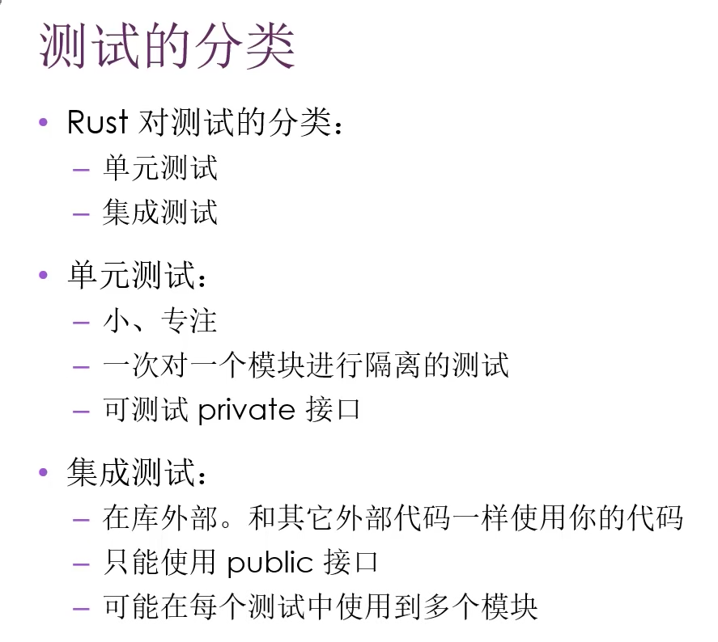

单元测试的注解为`#[cfg(test)]`，只有在test环境才会编译和运行。

集成测试则是外部的测试文件，一般用于多个模块的运行是否达到预期。 所以**测试覆盖率是一个很重要的指标。**
一般集成测试的代码会在和src同级的tests folder里面，和src的代码分离开。
提交`cargo test`指令一样会运行tests目录里面所有未被忽略的测试。
也可以指定参数： 
1. 运行一个特定的测试： cargo test 函数名
1. 运行某个测试文件里面所有的测试： cargo test --test 文件名

## 针对binary crate进行测试
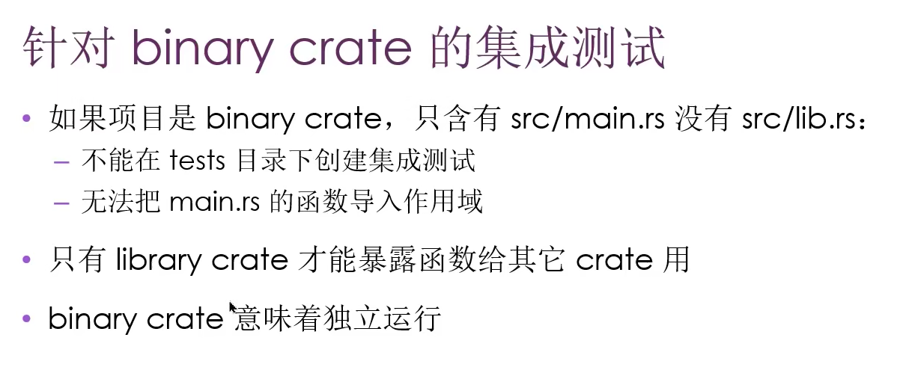

个人理解：逻辑就是要放在lib里面的，main里面主要就是胶水。

# 实战项目：Rust编写命令行程序
需求：编写一个类似Linux的grep的程序：第一个参数是需要匹配的内容；第二个参数是读取的文件。

对应的知识点：
1. 如何接受命令行参数
1. 怎么读取文件
1. 重构：改进模块和错误处理
1. 使用TDD（测试驱动开发）开发库功能
1. 使用环境变量
1. 将错误信息写到标准错误而不是标准输出

## 接受命令行参数
Rust的标准库提供一个函数可以读取程序的启动参数：`std::env::args;`
这就是第一个需求的核心实现：它会返回一个迭代器，里面包含的就是启动参数的内容；通过collect方法可以拿到一个集合（Vec）
里面的元素就是启动参数了。
单元测试为打印一遍即可。

```rust
use std::env;
fn main() {
    let args: Vec<String> = env::args().collect();
    let first_arg = &args[0];
    println!("{}", first_arg);
    
    // borrow two args for query and locate;
    let query = &args[1];
    let filename = &args[2];

    println!("query value is ## {} ##, file name is ## {} ##", query, filename);
}
```

## 读取文件
读取文件内容：
通过标准库中的一个函数可以读取文件中的文本内容并返回一个`Result<String>`
包含上一节内容的代码：
```rust
use std::env;
use std::fs;
fn main() {
    let args: Vec<String> = env::args().collect();
    let first_arg = &args[0];
    println!("{}", first_arg);
    println!("################");
    println!("################");
    
    // borrow two args for query and locate;
    let query = &args[1];
    let filename = &args[2];

    println!("query value is ## {} ##, file name is ## {} ##", query, filename);

    // expect is sugar of unwrap: 
    // OK -> Vaule;
    // Err -> print msg && panic!;
    let content = fs::read_to_string(filename)
    .expect("Something went wrong when read file...");
    println!("With text:\n{}", content);
}
```

## 重构的最佳实践：对前面的代码进行重构

**软件开发的原则是： 尽可能早的开始代码的重构**

重构的目的是：
1. （我认为的）解耦
1. 增加代码的模块化程度，每个fn只负责一个功能；
1. 错误处理

现在的代码存在的问题：
1. main函数里面涵盖了所有的业务代码，混乱；
1. 在逻辑上有关系的变量在代码层面没有实际的联系；
1. 功能不同的变量混合在一个代码里面了；
1. 错误处理的方式过于单一（仅仅是打印），程序不够健壮

### 二进制文件分离要点
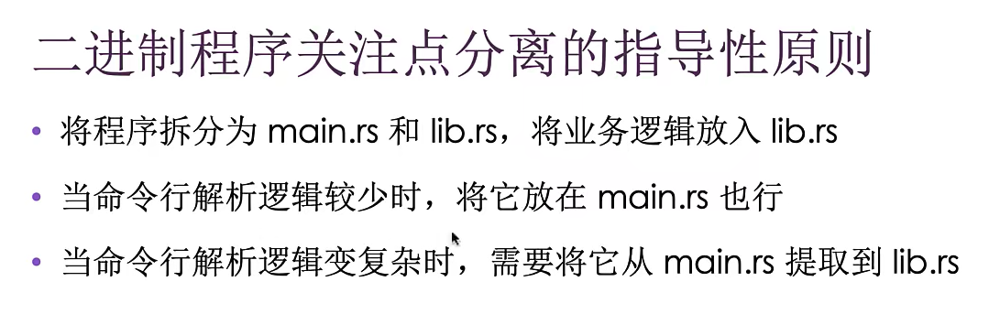

所以所有的业务逻辑代码应该在lib中，而对应的二进制程序的代码量应该尽可能的少，以致于只需要通过直接阅读代码就可以确认代码的正确性。

```rust
use std::env;
use std::fs;
fn main() {
    let args: Vec<String> = env::args().collect();
    let first_arg = &args[0];
    println!("{}", first_arg);
    println!("################");
    println!("################");
    
    // borrow two args for query and locate;
    // Old code:
    // let query = &args[1];
    // let filename = &args[2];

    // New code:
    let config = Config::new(&args);


    println!("query value is ## {} ##, file name is ## {} ##", config.regex, config.filename);

    // expect is sugar of unwrap: 
    // OK -> Vaule;
    // Err -> print msg && panic!;
    let content = fs::read_to_string(config.filename)
    .expect("Something went wrong when read file...");

    println!("With text:\n{}", content);

}

// struct Config is uesd to retain regex and filename
struct Config {
    regex: String,
    filename: String,
}

impl Config {

// Service: Parse args when run main application
// params: &[String] including all the args split by <Space>, although we just need regex and filename
// return: (&str, &str) The 1st is regex, 2nd is filename
fn new(args: &[String]) -> Config {
    // let query = &args[1];
    Config{regex: args[1].clone(), filename: args[2].clone()}

}
}
```

错误处理的最佳实践暂时不写。

### 使用TDD（测试驱动开发）的方式进行库开发
TDD是一种众多软件开发方法中的一种。
它是通过**测试驱动的**。（据说）这种开发方式可以提高代码编写的激励性，也可以提高测试的覆盖率。
通用的TDD的开发方式是这样：
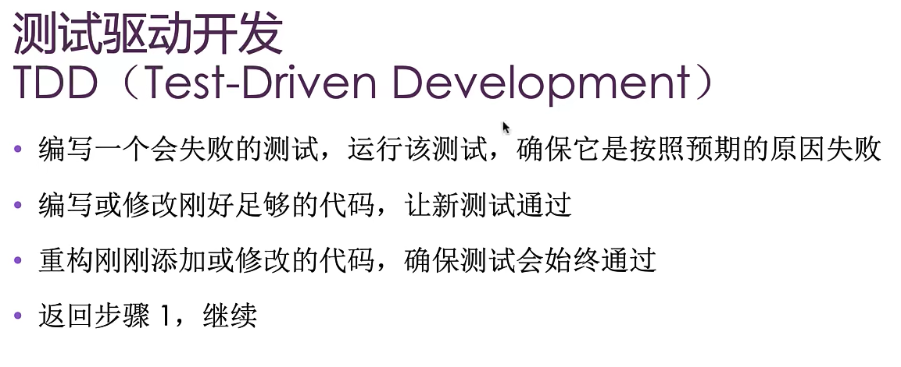

我对着视频的那个方式那么写过代码，不过我不确定到底要怎么把对应的笔记记到这里会比较好...

### 使用环境变量
结论： 两个：
1. 怎么使用环境变量的值；
1. 怎么在程序运行的时候指定环境变量；

第一个：
```rust
use std::env;

fn main () {
    let is_sensitive = env::var("lasdjl").is_err();
}
```

第二个有需要的话看视频或者搜索吧。

### 区分标准输出和标准错误输出
大多数的终端的标准输出有两种：stdout and stderr；
我们一般希望标准输出的信息和错误信息可以**区分开**来：
宏`println!`会输出到标准输出；
宏`eprintln!`会输出到标准错误输出；

# Rust的函数式语言特性：闭包和迭代器
## 闭包
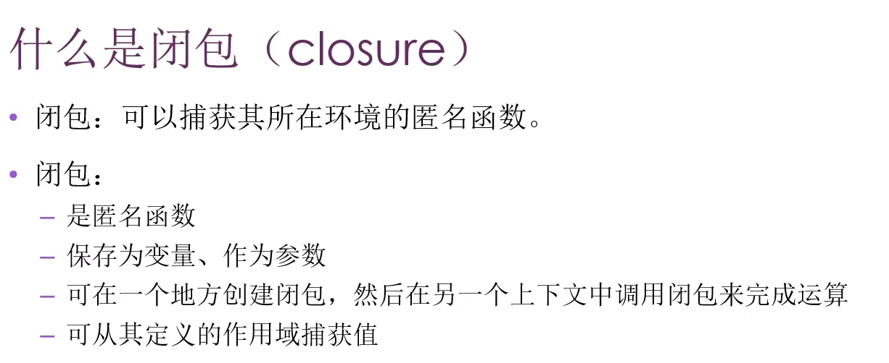
应该和我在学习其他语言时候的闭包定义相同（例如Go语言）；

## 闭包的类型推断
语法：`|param_1: type, param_2: type| -> res {function...}`

因为Rust有上下文推断的机制，所以**参数类型和返回值可以省略**

```rust
fn main(){
    // 因为rust的上下文推断，你可以省略num的参数类型和对应的返回值
    let expensive_clousure = |num| {
        thread::sleep(Duration::from_secs(2));
        num + 1
    }

    let res = expensive_clousure(2);
}
```

因为闭包通常只在狭小的上下文中使用，而函数**作为对外暴露的API**，是需要有唯一，无歧义的定义的。

## 结合泛型和fn trait，通过结构体来存储闭包

struct可以持有闭包以及对应的返回值。这适用于：
1. 需要结果时才会去执行的函数；
1. 结果可以缓存

这种方式在性能优化中很常见，一般叫做延迟加载(相比下IDEA为全加载，所有结果都是已经缓存好的，**各有优势**)

需要注意：因为struct里面要明确每个字段的类型，所以闭包要**指明匿名类型**
并且在struct中的每个闭包**实例唯一**，即使它们的签名一致。

所以通过泛型和 trait bound来让struct持有闭包。

所有的闭包至少都要实现以下一种trait：
- Fn
- FnMut
- FnOnce

下面以Fn举例：

```rust
struct Cacher<F> 
// 在这里对闭包的类型进行约束：参数是u32，返回值是u32
    where F:Fn(u32) -> u32 {
        calculation: F,
        value: Option<u32>,
    }
// 个人感觉这里有点像go的匿名函数的定义：例如接受一个函数类型的参数： func(string) bool 这样的；
```

杨旭介绍的这里的struct的用法是： 如果value为None，那么就执行闭包；如果不是，就返回这个value
```rust
        fn value(&mut self, arg: u32) -> u32 {
            match self.value {
                Some(v) => v,
                None => {
                    let v = (self.calculation)(arg);
                    self.value = Some(v);
                    v
                }
            }
        }
```

我确实不太习惯这种复杂的写法；
而且作为闭包的入门案例来做是不是不太行？
一个简单的功能，但是代码非常复杂；
不过rust确实严谨，这没什么问题。

## 闭包捕获环境
闭包和函数最大的区别是：闭包可以捕获其定义内作用域的参数（不过会产生额外的内存开销）
捕获参数的形式，与函数获得参数的方式一样，并且通过trait来约束获取参数的方式：

- Fn 不可变借用；
- FnMut 可变借用
- FnOnce 所有权转移

这种方式可以避免因为使用闭包而导致的内存泄漏的问题；

struct clousure的**最佳实践**：
先使用Fn，然后如果需要另外两种trait的时候，编译器会告诉你；

# 迭代器相关
首先是了解迭代器模式：
迭代器模式： 通过一个迭代器对一系列的项实施任务。

（个人理解：迭代器算是循环的一种封装，或者就说是循环的一种）

在Rust中，采用惰性迭代器原则（Lazy），**单纯**一个迭代器是**没有任何效果的**。对于这一点，产生了**迭代器需要消费的说法。**

请看实例代码：
```rust
    let v1 = vec![1, 2, 3, 4];
    let v1_iter = v1.iter();

// 这里发生借用，没有发生所有权的转移；v1也可以进行遍历，但是会发生所有权的管理，之后v1将会失效；
    for elem in v1_iter { 
        println!("got: {:?}", elem);
    }
```

## Iterator trait
用于定义 迭代器行为的trait。
它的结构：
关联类型（在Impl中定义，补充的一个，应该是说在使用iterator的时候定义）
next方法（参数为`&mut self`），用于**返回**迭代器的关联类型。

next方法感觉和我在jdbc里面学习到的哪个东西有很强的关联性，，，不知道是哪个东西。。。

实现这个trait只需要实现next方法就行；每次用于返回一项用Some包裹的结果，遍历完成时结果为None。

## 获得迭代器的方法
和前面闭包那里有点类似：也分为取得所有权、不可变引用、可变引用：
- iter方法：在不可变引用上创建迭代器
- into_iter方法：创建的迭代器会获得所有权，原来的变量会失效；
- iter_mut方法：迭代的可变引用

## 消耗迭代器
（个人）可以将迭代器理解成一种资源：
Iterator trait有一些默认已经实现的方法（位于标准库中），他们中的一些会调用next()方法。一个典型的就是迭代器的sum方法：它会计算总和。
而next会消耗迭代器中的资源，因此 next()方法也被叫做 “消耗型适配器”： 因为调用它们会把适配器消耗殆尽。


这里的弹幕里又一次提到了turbofish语法，不过现在**暂时先不用考虑**，我觉得。

## 产生新的迭代器
通过 Iterator trait的一些默认实现，可以将 迭代器转换为其他的迭代器：
请看下图：
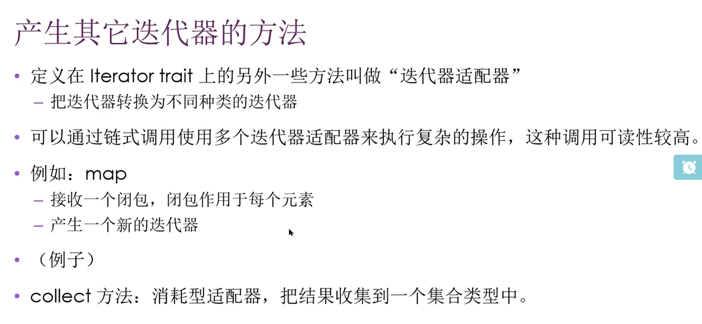

## 通过闭包捕获来产生迭代器
Iterator trait拥有一个filter方法，接受一个闭包作为参数，它的作用是：
这个闭包在遍历原迭代器的每个元素的时候返回一个bool值，true则添加到新的迭代器中。
即所谓的过滤；es6表示这个我很熟；

## 通过实现 Iterator trait来 实现一个自定义的迭代器
首先里面有使用到一个type关键字，似乎同go里面可以定义新的类型（我觉得也可以用泛型实现，不过方向略微有些不同）

核心是实现next方法；

这里视频里面杨老师举了两个例子，具体可以去看视频；
这里标记一些需要记录下来，常用的方法：
（诸如vec之类的集合）例如zip方法：可以把两个集合的元素组合起来，就像拉链一样；

map：Iterator trait默认实现的方法，属于**适配器**的一种，可以通过一个闭包把一个迭代器**映射（map）成**另外一个迭代器。
filter：正是前面提到的，是过滤器。
sum： Iterator trait 默认提供的方法，底层通过调用next()方法来求和。

而且，使用迭代器往往比你通过维护循环和临时变量来实现遍历的方式，在**安全性上和性能上都要显得更高。**
**迭代器是一个非常好的封装，推荐你使用它代替某些循环。**

# Cargo与crates.io
Cargo的详细用法以及发布自己的库函数了。以后再说。

# 智能指针
首先有一个重要的概念： 可以理解**引用是指针一种。最常见的一种。**

这里回顾一下指针的作用：
- 在一个变量前面添加&符号可以获得其**引用**；
- 实现了解引用trait的类型，Rust会自动**尝试去解引用**。
- 引用除了栈上的一个指针的开销之外**没有其他多余的开销**。

智能指针可以理解成**指针plus**，带有额外的元数据和功能。

## 有必要了解的前置知识：Rust中的堆栈
> 栈内存**从高位地址向下增长**，且栈内存是**连续分配**的。
> 并且一般来说OS对**栈内存的大小有限制**，从开发人员以及编程语言的角度来理解：**堆可以认为是无限的，但是栈绝对是有限的。**

（至少对于Rust来说）main线程的栈大小是8mb，而普通线程的大小则是2mb；
> 在函数调用时会在其中创建一个临时栈空间，调用结束后 Rust 会让这个栈空间里的对象自动进入 Drop 流程，最后栈顶指针自动移动到上一个调用栈顶，无需程序员手动干预，因而栈内存申请和释放是非常高效的。

> 与栈相反，堆上内存则是**从低位地址向上增长**，堆内存通常只受物理内存限制，而且通常是不连续的，因此从性能的角度看，栈往往比堆更高。

而 Rust拥有所有权的特性，所以平常的赋值发生的是所有权的转移（底层是**在栈上的，引用或者智能指针的拷贝，而不处理堆上的数据**）

**关于堆栈的性能**
首先排除误区： 栈的性能不一定就比堆的好，不然还要堆干嘛

分为分配和读取： 
- 小型数据，在栈上的分配性能和读取性能都要比堆上高
- 中型数据，栈上分配性能高，但是读取性能和堆上并无区别，因为无法利用寄存器或 CPU 高速缓存，最终还是要经过一次内存寻址
- 大型数据，只建议在堆上分配和使用

**总之，栈的分配速度肯定比堆上快，但是读取速度往往取决于你的数据能不能放入寄存器或 CPU 高速缓存。 因此不要仅仅因为堆上性能不如栈这个印象，就总是优先选择栈，导致代码更复杂的实现。**


## 引用计数的指针的类型
原理： 通过记录所有者的数量，使得一份数据被多个所有者共同持有。

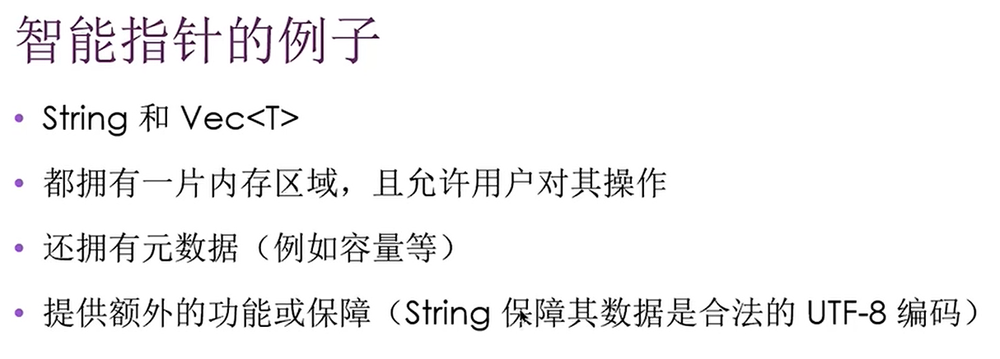

实现一个智能指针通常是：
- 用struct实现
- 实现Deref trait 和 Drop trait,分别可以让这个struct像普通的引用一样使用，以及在离开作用域的时候（它拥有所有权机制）自定义drop函数的逻辑；

## Box
一种**最简单和最常用**智能指针。
可以用于指向堆上的数据，除了指针本身，没有其他的性能开销。
不过**也没有其他的功能**。

它的常见的场景：
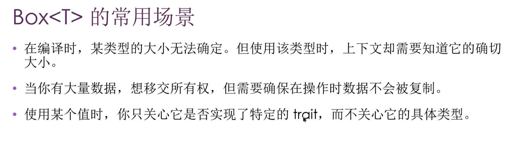

Rust圣经补充： 
- 特意的将数据分配在堆上
- 数据较大时，又不想在转移所有权时进行数据拷贝
- 类型的大小在编译期无法确定，但是我们又需要固定大小的类型时
- 特征对象，用于说明对象实现了一个特征，而不是某个特定的类型

举例：
**防止数据的直接拷贝**
因为栈上分配与读取的效率较高，所以Rust默认的赋值操作是clone。
Rust中的**数组是分配在栈上**的，因此即使当这个数组clone的代价比较大，rust默认也是会直接clone一份的，此时就是Box的一个好场景。

**递归类型（俗称的链表）**
在遇到类似链表的使用场景的时候， Rust仿照 Lisp（一种函数式的编程语言）的一种集合数据结构 Cons List

这里先提及一下**Rust是怎么确定枚举类型的大小的：**
枚举（enum）类型，在任意的时候只会存在一个类型（例如Option枚举只会存在 Some或者None）；
因此rust在确认枚举类型的大小的时候，会为枚举类型分配**变体中最大的类型的大小**； 
这一部分涉及到结构对齐的知识， 可以去看**go的内存对齐**
弹幕里面提到有点类似 C语言的 Union

所以如果用 Box包含 List的话，就可以通过编译；
```rust
#![allow(unused)]
fn main() {
enum List {
    Cons(i32, Box<List>),
    Nil,
}
}

```

**实现特征对象数组**
在Rust中要实现数组中存储不同的类型，只有两种： 枚举和特征对象；
其中前者的限制偏多，常用的是后者；

```rust
trait Draw {
    fn draw(&self);
}

struct Button {
    id: u32,
}
impl Draw for Button {
    fn draw(&self) {
        println!("这是屏幕上第{}号按钮", self.id)
    }
}

struct Select {
    id: u32,
}

impl Draw for Select {
    fn draw(&self) {
        println!("这个选择框贼难用{}", self.id)
    }
}

fn main() {
    let elems: Vec<Box<dyn Draw>> = vec![Box::new(Button { id: 1 }), Box::new(Select { id: 2 })];

    for e in elems {
        e.draw()
    }
}

```

**Box::leak**
算box的高阶部分：
消费Box的内容，并强制清除Box所代表的的内存；

这里有需要再去看rust圣经的内容。


## Deref trait
Deref trait是标准库的一个trait，用于定义**解引用时的规则**。
实现 Deref trait之后，可以实现自定义指针。

要实现它，只需要实现deref这个方法，它的参数是**自身的一个借用**，返回指向内部数据的指针；

```rust
struct MyBox<T>(T);

impl<T> MyBox<T> {
   fn new(x: T) -> MyBox<T> {
    MyBox(x)
   } 
}

impl<T> Deref for MyBox<T> {
    type Target = T;

    fn deref(&self) -> &T {
        &self.0
    }
}
```

## 函数与方法中的隐式解引用转换
我个人的理解是，rust帮助开发者对普通和对应的指针参数进行了自动的转换，通过 deref方法。

实现了 deref trait，在传参时， rust会自动分析 deref返回的类型是否可以转换为函数所需要的类型；

最经典的就是&str and String, 因为 String实现了 deref trait。
整个过程在编译时完成，因此运行时不会产生额外的性能开销；

以上的为 deref trait（不可变），针对可变的，还有另外一种 derefMut trait
针对的是可变类型，其他部分与 前者基本一致。

并且，这种自动转换有规则，总结就是：
实现了对应的deref方法的：
`T: Deref<U>`
不可变 -> 不可变；
可变 -> 可变；
不可变 -> 可变；

# Drop trait相关
Drop trait就是rust的核心的所有权的一部分底层了：**在超出作用域的时候，每个变量会自动释放对应的内存空间，并且不用担心对应的二次释放的问题。**
一个自定义的智能指针通常需要实现 deref trait以及drop trait。

实现Drop trait的话实现drop方法即可。注意：Rust不允许直接调用drop方法。 可以通过标准库的替代方案来手动释放：`std::mem::Drop`
# Rc：引用计数智能指针
多重所有权机制：通过引用计数的方式而实现。
用于引用计数的指针（也是Python等语言垃圾回收机制的原理）。

Rc全称 reference counting(引用计数)

## 使用场景
需要在**堆上分配内存，并且有多个引用都需要同时读取的时候**，使用Rc。

因为多线程会有并发问题，所以**默认的Rc不适用于多线程**。后面会有解决方案的。
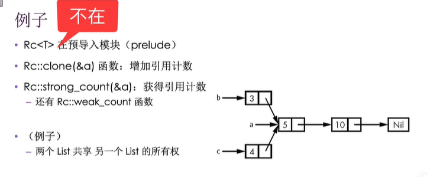

Rc有几个常用的函数：
```rust
use std::rc::RC;

Rc::strong_count(); // 计算Rc的强引用计数，new和Rc::clone都会增加计数；

```

Rc现在可能我没有使用场景，到时候有需要的时候再考虑**最佳实践**
wait update

# RefCell和内部可变性
RefCell是针对Rust的借用规则做出的一种**在编译时的妥协**；
Box要求代码在**编译时**就保证安全性，并且不产生运行时开销；
而RefCell则为在运行时检查，不符合则触发panic。

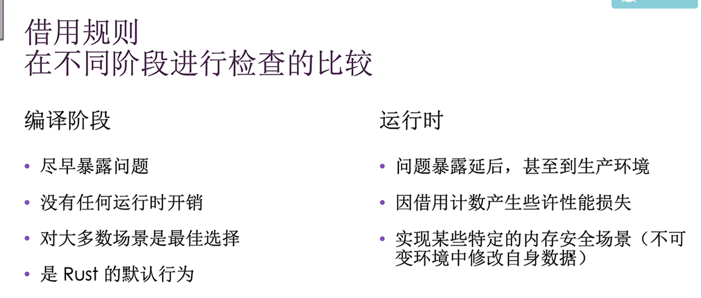

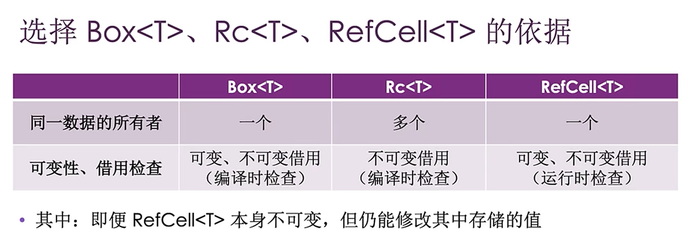

RefCell不到最佳的实践场景通常是用不到的，这样Rust不能保证它的安全。

比如使用RefCell的一些场景：
要**可变的借用**一个本身不可变的值；
一般来说需要用RefCell包装一下

这里有个代码的实例，不过可惜我暂时看不懂，也没需求，所以暂时先停在这里。


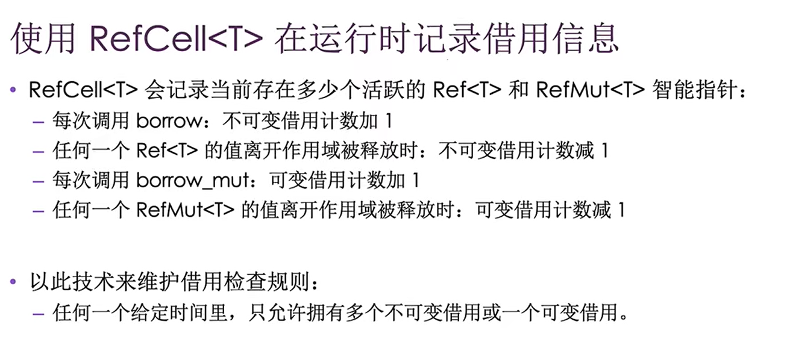

太难了这一部分，根本就没心思听...

## 循环引用导致的内存泄漏
尽管Rust向来以安全著称，但是Rust仍然有可能产生内存泄漏：


# Rust 并发
首先回忆下进程和线程的概念~ 我已经在很多语言里面接触过了，所以这里就不说和并发有关的东西了。


通过标准库thread::spawn函数可以直接创建一个新的线程。
和Go语言不同的是， rust没有采用类似协程（绿色线程的概念，不过可以通过第三方的库实现），rust为了较小的运行时，以及与c交互，所以默认没有提供m:n模型；

在考虑并发的时候需要权衡对应的代价；

## 通过 std::thread::spawn函数创建一个线程
接收一个闭包作为参数，就是另外一个线程中执行的代码； 返回值是一个joinHandle, 他持有值的**所有权**；
和其他主流的编程语言一样，需要手动提供join的逻辑（即默认主线程结束的话那么其他分支线程会立刻结束。）
具体是：
调用这个join方法会立即阻塞当前的thread，知道对应的线程结束为止；

## 使用move关键字来使用其他线程的数据
默认的， 如果要**使用其他线程的数据**，通常是对这个数据产生借用。

如果想要在某个线程里面获取所有权， 可以在闭包的前面加上**move**的关键字。

## 通过消息传递来控制并发
类似于go语言， 线程（或者Actor之间）通过**彼此发送消息来进行消息通信**
Rust标准库提供channel。

一个 channel就相当于一个管道，包含一个发送端和一个接收端
通过**调用发送端的方法**，可以像接收端发送数据；
如果 有任意一端被关闭， 那么可以说**管道被关闭了**

通过标准库的mpsc::channel函数来创建Channel。

mpsc表示 多生产者和单消费者。  返回一个元组， 里面的元素分别是发送端和接收端。 

发送端可以通过send方法发送数据；
接收端可以通过recv方法接收数据； 这会阻塞当前的线程； 可以使用try_recv方法进行非阻塞的接受；通常会使用一个循环的方式；


**Channel和所有权的转移**
所有权可以帮助你编写安全的并发代码：

通过管道发送的数据会发生所有权的转移；
管道拥有 clone方法来可以进行管道的克隆；


## 基于共享内存的并发
实际上rust和go都比较支持通过通信来进行并发（也符合rust的安全理念）
不过rust也提供了不推荐的共享内存的方式：

共享内存类似于多所有权： 多个线程可以访问同一块内存；
和其他语言， rust也是用mutex（互斥锁）来防止数据竞争。


这里暂时没兴趣学；

# Rust的面向对象的特性


进度： rust圣经的，那个什么东西，特征对象，搜这个，在box的位置
