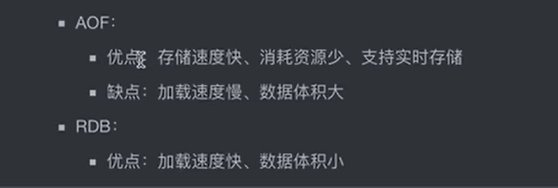
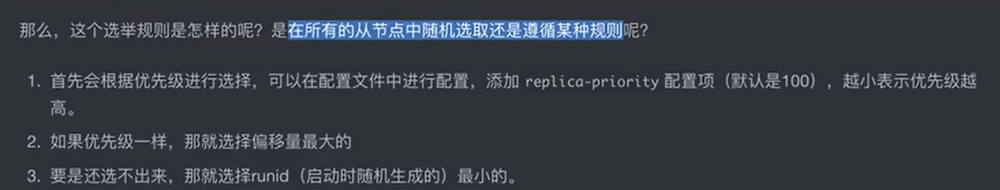

# NoSQL的特点： 为什么需要 Redis？
我在以前的文档里面已经写过一遍了， 所以这里就不再写一遍了。

# Redis的基本操作
Redis的操作就类似 Java中的 HashMap。
Redis中通过数字表示数据库，通过 `select db_no` 即可切换。

```shell
set key value
# 一次性设置多个数据，默认的数据类型是字符串。
mset [<key> <value>]
```

redis中的key有一定的命名规范： 例如：
```shell
# 通过冒号进行板块分割
set user:info:用户ID:name zzk
```

在set时还可以设置数据的过期时间： ex 秒， px毫秒，过期后再查询会显示nil。

也可以通过 expire来设置某个键值对过期时间。

通过ttl可以查询：
```shell
# -1表示永久， -2表示已过期或者不存在。
ttl <key>
# 以毫秒作为单位
pttl <key>
# 设置为永久
persist <key>
```

del可以删除key的值
```shell
del <key>
(integer)1
```

exists可以查询某个键是否存在
```shell
exists <key>
# 返回0表示不存在， 1表示存在
```

randomkey可以随机抽取一个key
```shell
randomkey
```

move 可以移动一个键到其他的数据库里面去
```shell
move <key> db
```

type 可以查看数据类型
```shell
type <key>
```

上面的这些是常用命令。 会慢慢补充的。

# Redis数据类型
Hash可以嵌套：类似Java中的：
```java
HashMap<String, Map<String, String>> map = new HashMap<>();
```

通过 hset以及hget可以设置和获得值
```shell
hset <key> <field-name> <value>
```

对于一个 hash，如果想要一次性获取所有的字段和值，可以通过 `hgetall <key>`
```shell
hgetall <key>
```

总之不同的数据类型的命令是不一样的，hash的前面就有一个h的前缀。

来看几个特殊的命令：
看一个hash里面有多少个kvs： `hlen`

## List数据结构
value是列表的一个数据结构。 类似Java的LinkedList。应该和 Hash类型一样， element只能是字符串，是不能嵌套的。 我之前go的那个是可以嵌套的， 那个感觉更好一点。

可以通过命令指定在左边还是右边来插入元素： `lpush/rpush <key> <value>`
也可以通过insert来进行指定位置的插入： `linsert <key> before/after <key> <element>`

**获取元素**
```shell
# 根据下标获取元素
lindex <key> <下标>
# 弹出最左/右元素
lpop/rpop <key>
# 获取指定范围内的元素，支持负数索引
lrange <key> start stop
```

另外push和pop还能连着用， 算一个好用的语法糖：
```shell
# 从当前list中弹出并进入另外一个list
rpoplpush <当前list> <目标list>
```

同时它还支持阻塞操作，在指定时间内，如果存在数据就pop，没有就作废：
```shell
blpop <key>... timeout
```

## set和sortedset
类似Java的HashSet，查找的效率极高。

添加
```shell
sadd <key> <value>
```

查看set里面有多少个值：
```shell
scard <key>
```

判断集合中是否包含某个值：
```shell
# 查看是否包含某个值
sismember <key> <value>
# 列出所有的值
smembers <key>
```

Set主要是当做数学上的集合来操作： 可以求 差（sdiff）、交（sinter）、并（sunion）等操作；再后面加一个store可以将指定的命令存入到一个新的set中。

移动某个值到另一个中： smove

如果有排序的需要的话，那么就需要使用sortedset：
它**支持为某个值设置一个权重**，这样就可以根据值排序；
```shell
zadd <key> [<score> <value>]
```

zrange命令最后面带上withscores可以同步显示对应值的权重：
也可以显示权重范围内的数据： `zrangewithscore`

上面这些是redis的基本数据类型，感兴趣还可以看其他的高级数据类型。

Redis的基本操作完成。
# 持久化
两种思路： 一是**直接保存数据**（rdb文件），二是保存恢复数据的**所有过程**
这就是一个文件。
通过 save(直接保存)和bgsave（后台执行）可以持久化数据到硬盘上。 -> dump.rdb文件

输入shutdown可以就可以关闭服务器了。

通过save来持久化数据很方便，不过如果数据量大的时候io会影响性能；并且如果写操作不多的话，持久化就没有必要；因此 save命令支持定期存储：
```shell
# 多少秒内有多少个写入的时候存储一次数据，并且这个可以作为配置持久化
save second counts 
```


第二种就是aof（通过日志保存）
有三种策略：
always: 每次写的时候保存
everysec: 每秒保存一次
no：看系统心情保存

可以在配置文件中配置，注意appendonly需要改成yes

aof的缺点也很明显， 通过命令来重演存储过程，理论上比rdb更耗费时间； **改进：**
通过优化指令来减少时间，比如：
```shell
lpush list 666
lpush list 777
lpush list 888

# 可以优化成
lpush list 666 777 888
```

可以通过命令手动进行重写： bgrewriteaof
也可以在配置文件中设置：



# 事务
multi：开启一个事务；
exec：执行之前输入的命令；
discard：中途取消事务；

底层原理是 **创建了一个任务队列**，提前存储命令，然后在提交的时候一起执行。 MySQL的命令拥有回滚机制，但是redis似乎不是这样，它没有回滚的概念（它不像MySQL一样**在事务中也能单独得到结果**）...

# 锁
Redis里面也会出现**数据竞争**的情况出现：
Redis中是乐观锁， 而MySQL是悲观锁（默认应该是）：
- 悲观锁：认为别人回来抢占资源，所以禁止外来访问，直到锁释放；
- 乐观锁：和悲观锁相反，只会在操作数据的时候再去验证是否有人抢占资源；

机制就是：
Redis可以通过watch来监视一个key（unwatch可以取消监视），如果在在事务执行期间a遭到了修改（类似MySQL，也是设置的版本号，所以不存在aba的问题），则退出本次事务。

我的理解是： 悲观锁拿到就可以对数据为所欲为；乐观锁就是如果检测到修改，那么修改的那个自己就不修改了。 就有点那个让着别人的感觉。

# 编程语言与Redis交互
这里以Java为例：
maven引入jedis框架：
```xml
        <dependency>
            <groupId>redis.clients</groupId>
            <artifactId>jedis</artifactId>
            <version>4.0.0</version>
        </dependency>
```

然后创建一个Jedis对象，之后的操作就很类似了。

主要还是看Spring Boot：
创建boot项目时选择NoSQL， Spring Data Redis，然后具体的配置在yml里面配置即可。

在代码里使用时，涉及到模板；

Spring里面，对Redis的事务没有提供功能，不过jdbc可以，所以就用这个。

添加一个 Transactional注解；

# 使用Redis作为缓存

# 主从模式
首先是概念： 是指将一台redis服务器的数据，复制到另一台redis服务器上去；前者是主节点（master），后者是从结点（slave）。 master以写为主， slave则相反。

好处：
- 实现了读写分离；
- 写少读多的场景下，可以安排多个从结点，这样可以大幅分担压力；

并且redis也知道你是有主从模式的需求的，所以提供了一个命令来查看主从的状态： `info replication`，所有的服务器器启动时默认都是master。

`replicaof <host> <port>`可以指定🐖结点服务器；然后当前的服务器变成slave。

`replicaof no one` 可以取消slave状态，恢复到master的时候。

底层原理（可能）
1. slave保存 master的信息；反之应该也是（不清楚）；
2. 从结点在绑定master之后，会运行一个定时任务，用于与master进行网络连接，专门用来接收master发送的命令；
3. slave第一次连接到master的时候，进行全量复制；之后采用增量复制；

一样的，这个主从配置是可以持久化的。

slave每次启动的时候会自动去同步；

slave的slave：这种链式方式可以大幅减轻master的压力，不过缺点也是显而易见的： 如果整个链上出现传播问题的话...

所以实际情况是两种方式共用， 就像一颗树一样的。

# 哨兵模式
哨兵是为**主从模式**服务的：
监控结点的状态，并且采取对应的措施：如果主节点寄了，就从slave里面选一个新的master出来；

这是为了防止主节点挂掉而导致整个服务崩溃的情况发生。
要设置哨兵，推荐在配置文件里面改，先把所有内容清除（可以自动生成的）： sentinel monitor 监控对象名称（随意） 主节点ip地址 端口 判断master挂掉的哨兵的数量

启动后控制台会提示现在已经**以哨兵模式启动**；
哨兵的默认端口是26379

哨兵模式启动后会自动监控master和slaves，可以在console看到相关的信息；

此时如果挂掉master， 哨兵会采取相应的措施；



**可以设置多个哨兵**

# 集群搭建
在单节点已经不够用的情况下，通过集群（多台机器）既可以实现扩容；

在一个新的请求来的时候， 根据哈希算法来决定存储在哪个节点上。
具体的原理等需要的时候去看视频； wait update

需要在配置文件里面开启集群模式： `cluster-enabled yes`，然后将配置文件里面的其他内容清除（应该）；


