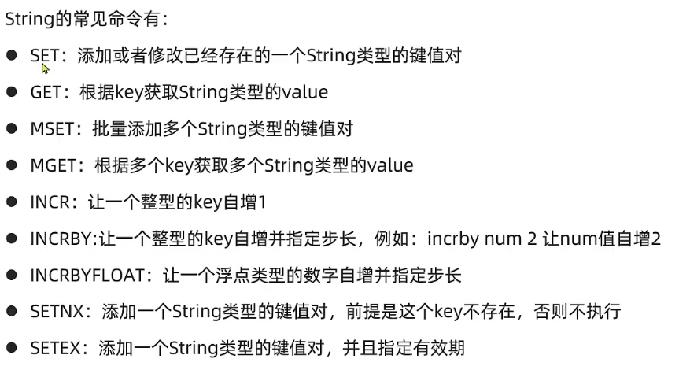

# Redis教程
[toc]{type: "ol", level: [2,3]}
## 直观
Redis是一个企业热门的数据库。
面试需要熟悉底层机制。核心是Redis的缓存原理。
## Redis概述
Redis是一种典型的NoSQL (Redis的存储类型是键值对) 数据库。
### 认识NoSQL
对立于传统的关系型数据库(SQL)。
NoSQL数据的常见的数据结构有键值对、文档、图等类型。共同点在于：它们都不对结构具有严格要求。

回忆SQL的特点：
- 结构化的。SQL通过表来组织数据。
- 关系型的。SQL通过外键来维护表与表的关系。
- 通用的查询方式：SQL语句。SQL型数据库的查询都是通过SQL语句来查询的。这样的好处是通用性，减少了学习成本。
- 事务的四大特性。原子性，一致性，隔离性，持久性。

两者对比：

| 类型 | SQL | NoSQL |
| -- | -- | -- |
| 数据结构 | 结构化 | 非结构化 |
| 数据关联 | 关联的 | 无关联 |
| 查询方式 | SQL查询 | 非SQL |
| 事务特性 | ACID | Base |
| 存储方式 | 硬盘 | 内存 |
| 使用场景 | 相关业务对数据的安全性、一致性要求较高 | 对性能的要求比较高 |
可以看出，NoSQL和SQL可以说是完全相反的...
我更倾向于NoSQL更重要的作用是对SQL的一种补充。

### Redis的特点
- 采用Key-Value存储。
- 单线程。命令的执行具有原子性。
- 低延迟，速度快。（基于内存、IO多路复用、良好的编码）
- 支持数据持久化。
- 支持主从集群和分片集群。

### Redis的安装
Redis官方没有Windows版本的安装包。
因此我们使用Linux系统安装Redis。这里以CentOS7.6为例。

**黑马版和尚硅谷的区别**
黑马的是安装在usr目录的，而尚硅谷是安装在opt目录的。

关于这两点的区别，请看博客[Linux 软件安装到哪个目录](https://blog.csdn.net/aqxin/article/details/48324377)

1. 安装Redis的前置依赖。
Redis基于C语言编写，因此需要gcc编译环境。
使用命令yum install -y gcc tcl。

2. 下载Redis安装包到/usr/local/src目录，
通过命令tar -zxvf 安装包名称进行解压。
CentOS7版本及以上可以直接跨系统复制文件。
6及以下版本设置共享文件夹。
3. 进入解压目录，使用指令make && make install 进行编译与安装。
make指令是Linux的相关功能，自行查阅。

至此，Redis安装成功。Redis的安装目录也会加入环境变量。
默认的安装路径为/usr/local/bin 目录下。

我也有一个更好的办法： 尝试使用在线工具去学习redis：[Redis Playground](https://try.redis.io/)

### Redis的三种启动方式
#### 1. 前台启动
直接输入redis-server启动，控制台会打印redis的logo，但是此时控制台终端会被阻塞，因此不推荐这种启动方式。

#### 2. 带配置文件启动
在redis的安装目录，有一个文件redis.conf，为redis的配置文件。
首先**备份文件防止翻车**：
```properties
cp redis.conf redis.conf.bck
```
redis.conf的部分配置：
```properties
# 监听的地址，默认为127.0.0.1，导致只能在本地访问。修改为0.0.0.0则可以在任意IP地址访问，因为不安全所以不要在生产环境中使用。
bind 0.0.0.0
# 守护进程，修改为yes即可在后台运行，默认是无法后台运行的。可以看出Redis安全措施做得还是挺全面的
daemonize yes
# 密码：设置后访问Redis必须输入密码
requirepass 123456
# 监听端口
port 6379
# 工作目录，默认当前目录，也就是运行redis-server的命令，日志，持久化等东西都会放到这里。
dir .
# 数据库数量，默认16
databases 1
# 设置redis能够使用的最大内存
maxmemory 512mb
# 日志文件，默认为空，不记录日志，可以自行制定文件名字
logfile "redis.log"
```
初次使用res时建议参考一下参数
```properties
bind 0.0.0.0
daemonize yes
requirepass 123321
logfile "redis.log"
```
#### 3. 设置开机自启动
通过配置文件将redis加入到开机服务中，这样就能实现开机自己了喵
首先新建一个系统服务文件
```sh
vi /etc/systemd/system/redis.service
```
编辑内容：
（注意你的redis安装路径。如果没有启动大概率是路径有问题。）
```conf
[Unit]
Description=redis-server
After=network.target

[Service]
Type=forking
ExecStart=/usr/local/bin/redis-server /usr/local/src/redis-6.2.6/redis.conf
PrivateTmp=true

[Install]
WantedBy=multi-user.target
```

然后重载系统服务：

```sh
systemctl daemon-reload
```


现在，我们可以用下面这组命令来操作redis了：

```sh
# 启动
systemctl start redis
# 停止
systemctl stop redis
# 重启
systemctl restart redis
# 查看状态
systemctl status redis
```


执行下面的命令，可以让redis开机自启：

```sh
systemctl enable redis
```
至此，redis服务的开机自启工作完成。修改CentOS的防火墙默认为关闭，方便之后进行数据库连接。
```sh
systemctl stop firewalld.service      #停止防火墙
systemctl disable firewalld.service  #禁止防火墙开机启动
firewall-cmd --state                         #查看默认防火墙状态 防火墙状态显示 not running 就好了
```

### Redis Bash(命令行)和GUI(图形化页面)
服务完成后，输入redis-cli就可以进入客户端。类似于win上的mysql一样。练习命令时推荐进入这个窗口。
不过redis也拥有非官方的服务端：
[GitHub地址](https://github.com/lework/RedisDesktopManager-Windows/releases)
正常下载安装使用即可。
如果GUI连接redis服务器失败，大概率虚拟机内部的防火墙。请看这篇博客：
[RedisDesktopManager连接不上redis的解决方法](https://blog.csdn.net/qq_41568604/article/details/119921353)

## RedisCRUD 常用命令和数据结构
### 通用命令
可以在Redis的官方网站上找到官方文档。这里只放一些常见的通用命令。
- Keys：查看匹配模板的key。这个模板用通配符描述。**不建议使用。**
- DEL：删除一个指定的key。
- Expire
- TTL：查看key的有效时间。-1表示永久有效。-2表示已被删除。
- EXISTS：判断Key是否存在。

### 常用数据结构和命令
#### String
String类型的value根据字符串格式又可以分为string，int和float三种类型。
- string
- int：整型，可以做自增自减操作。
- float：浮点型，可以做自增自减操作。

在底层的本质字节数组，就是编码不同。

#### Hash
Hash类型，也叫散列，Value是一个无序字典，类似Java的HashMap。

常用命令

#### List
List类型，和Java中的LinkedList类似，**可以看做**是一个双向链表。
特征：
- 有序
- 元素可重复
- 插入和删除速度快
- 查询速度一般
常见命令

#### Set
Redis的Set结构类似于Java的HashSet，可以看做是一个Value为null的HashMap。
特征
- 无序
- 元素不可重复
- 查找快
- 支持交集、并集、差集

常见命令

#### SortedSet
Redis的Set结构类似于Java的TreeSet，但是底层数据结构差异较大。SortedSet中的每一个元素都带有一个属性score，排序也正是基于这个score。

常见命令

默认升序排列，如果需要降序在Z的后面加REV。
#### Redis中key的层级结构
Redis的key可以使用类似Java包的机制来统一名称，类似于命名空间namespace。
例如：
set com.product:user 1
set com.product:user 2
这种层次感可以很自然地在GUI中看到。

### Redis的Java客户端
Redis包含多种Java客户端。最常用的是Jedis、lettuce和Redission的客户端。

在Spring框架中整合了前两种为SpringDataRedis，推荐学习它。

### Jedis
#### 快速入门 
同大部分的Java程序一样，在Maven工程中导入Jedis的依赖就可以使用它了。
**本质就是你在shell的命令变成了Java的方法名了。**
1. 导入依赖
```xml
<dependency>
    <groupId>redis.clients</groupId>
    <artifactId>jedis</artifactId>
     <version>3.7.0</version>
</dependency>
```
2. 建立一个redis连接
```java
@BeforeEach
    void setUp(){
        jedis = new Jedis(ipAddress, port);
        jedis.auth(pwd);
        jedis.select(database);
    }
```

3. 执行相关操作
```java
@Test
    void testString(){
        System.out.println("jedis.set() = " + jedis.set("name", "张三"));
        System.out.println("jedis.get(\"name\") = " + jedis.get("name"));
    }
```

4. 释放资源
```java
@AfterEach
    void tearDown(){
        if (jedis != null) {
            jedis.close();
        }
    }
```
#### Jedis的连接池
实际中因为线程不安全以及性能问题不推荐使用上面这种方法，而是推荐用线程池。
步骤：（这次不写代码了。）
1. 初始化Jedis的配置类示例JedisPoolConfig。
1. 初始化示例public JedisPool(JedisPoolCofig jpc,String ipAddress, int port)
1. 使用静态方法返回Redis连接实例。

### SpringDataRedis
特点：
多种客户端的整合
API统一，使用方便


#### 快速入门
1. 如果不导入SpringBoot项目的话，单依赖是无法使用，因此先新建SpringBoot项目。
1. 导入依赖
```java
<dependency>
    <groupId>org.springframework.boot</groupId>
    <artifactId>spring-boot-starter-data-redis</artifactId>
</dependency>
```
```java
<dependency>
    <groupId>org.apache.commons</groupId>
    <artifactId>commons-pool2</artifactId>
</dependency>
```
后面就是一些基本的用法了。

#### Java对象的直接存储：RedisTemplate的序列化机制
##### 自定义RedisTemplate
当你使用RedisTemplate的相关方法存储数据时，你在Redis的客户端get的东西是完全不一样的。
因为RedisTemplate默认存储的Key-Value的类型都是Object，在存储时底层会**自动使用默认的序列化机制JDKSerializer序列化对象使其实体对象能直接存入数据库**中。
这种方式有缺点：
- 可读性差，在Redis客户端中完全看不出是什么东西来。
- 内存占用大。

因此在使用RedisTemplate的相关方法时要修改它的默认序列化方式：
- 字符串使用StringRedisSerializer
- 普通JavaBean对象用JSON的方式：GenericJackson2JSONRedisSerializer。
##### 使用序列化方式均为String的StringRedisTemplate
虽然JSON序列化的方式很方便，但是会有一个小问题：
为了在反序列化的时候快速还原对象，它会在**序列化的时候存入相关的类信息**

换句话说...
虽然这玩意方便但是因为空间开销大使得我们只能手动完成这些工作...

好消息是，Spring提供了默认Key-Value的序列化方式都为String的StringRedisTemplate。

## Redis实战
实现黑马点评项目。

先完成项目的部署，说几个重要的：
- 在application.yaml文件务必将对应的配置修改正确，否则一定会报错。
- 前端页面是部署到Nginx上，类似于tomcat的服务器软件。在根目录下start nginx.exe启动服务。
- 在执行黑马提供的SQL语句的时候会出现报错，在MySQL5.7版本中timestamp数据类型的默认值不能为全0，可以执行设置
```sh
set session sql_mode='ONLY_FULL_GROUP_BY,STRICT_TRANS_TABLES,ERROR_FOR_DIVISION_BY_ZERO,NO_AUTO_CREATE_USER,NO_ENGINE_SUBSTITUTION';
```
### 短信登录模块
感觉太啰嗦了
