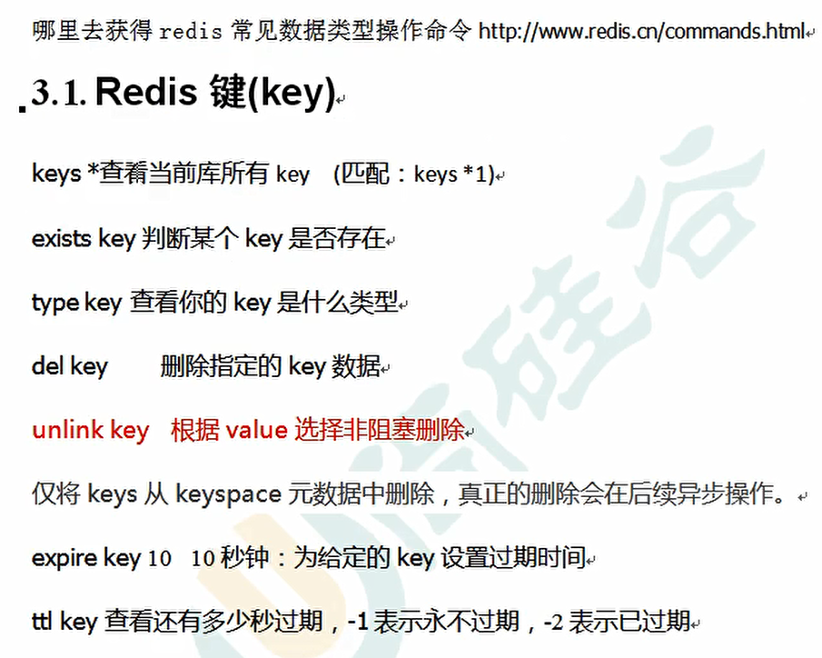
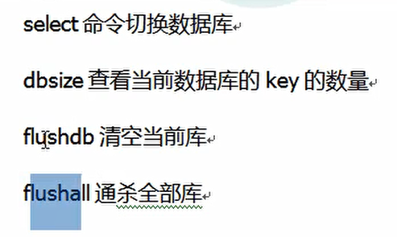
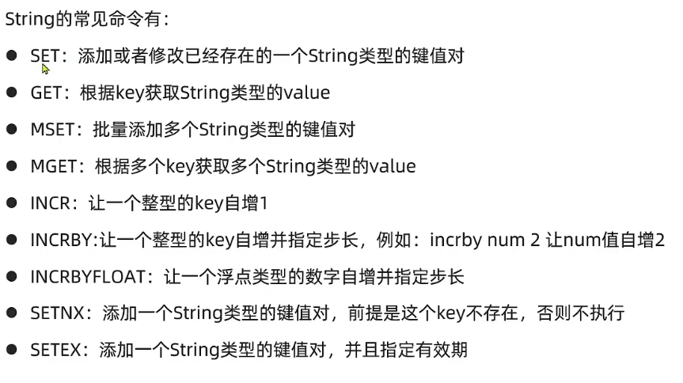
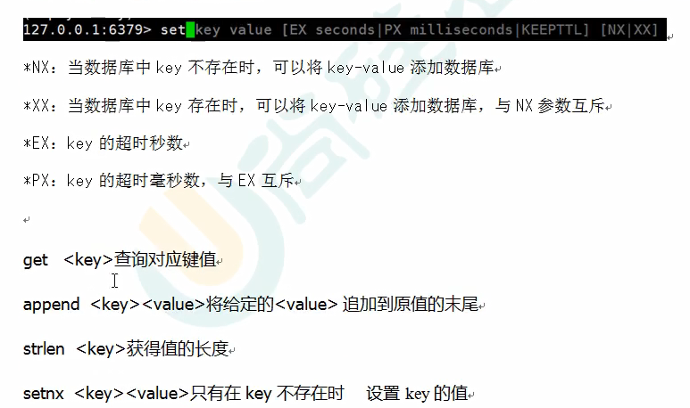
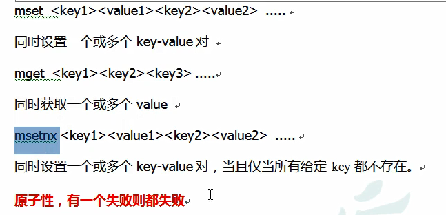
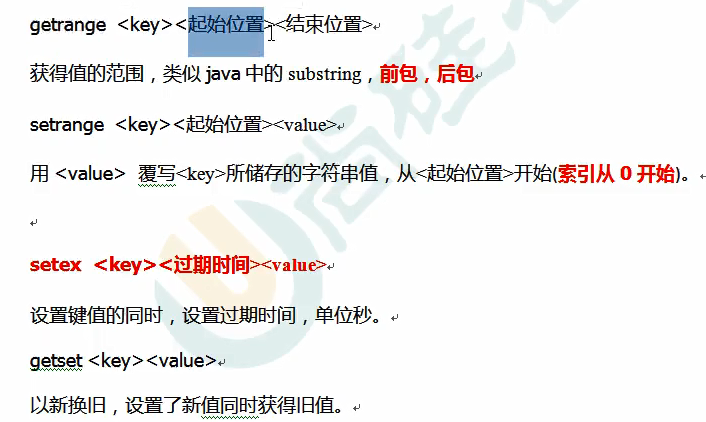

# Redis教程尚硅谷
这次是为了做一个 Redis的快速入门，只记重要的笔记

# 安装
因为多种安装方式、服务器安装有安全问题、快速入门的需求；
所以考虑使用 ground进行在线的使用。

# 入门
入门和mysql一样，知道基本的crud就行。

无用小知识：
6379的默认端口来自 merz的九键输入法的手机输入；
redis默认有16个数据库，通过select指令可以进行切换；
redis单线程但是效率又高的原因： 多路IO复用（阻塞）；单线程防止资源争夺；
完

# 常用命令

这里提一下`unlink key's_name` 也是删除，但是它反馈给你的实际上是**这个key不可用**，物理的删除将在以后进行；
个人猜测应该是在业务量大的时候使用这个命令。

## string类型
就是那些常见的命令

**顺便提一句**：
Redis中的**单条命令就是一个原子操作**，因为 redis是单线程的。
而其他多线程的db的单条命令可能就不是原子操作了。

`m`这个前缀的指令通常是批量操作：
例如 mset和mget
贴图：

而且 redis的**单个命令式原子性的**，这对于mset来说也是一样的，不用担心这个问题；

**string的数据结构**
和现在主流的编程语言不同（例如Java的String实际上是一个常量）
具体的我描述的比较烂所以不说，
和golang的 rune切片比较类似。

## List
redis的redis是一种 quicksort：
数据量小，就用一片连续的存储空间（这种list被叫做ziplist：压缩list）
因为在数据量小的时候链表的指针代价有点大；
当数据量的时候，采用一种折中的方式：使用结点类型就是 ziplist的链表；
这样很好的结合了两者的优点。

List命令，说实话我图片都有点懒得贴上去了，干脆就需要的时候再去查好了。

