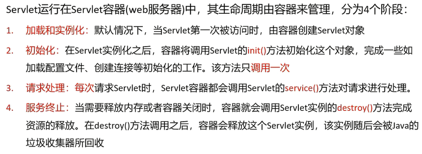
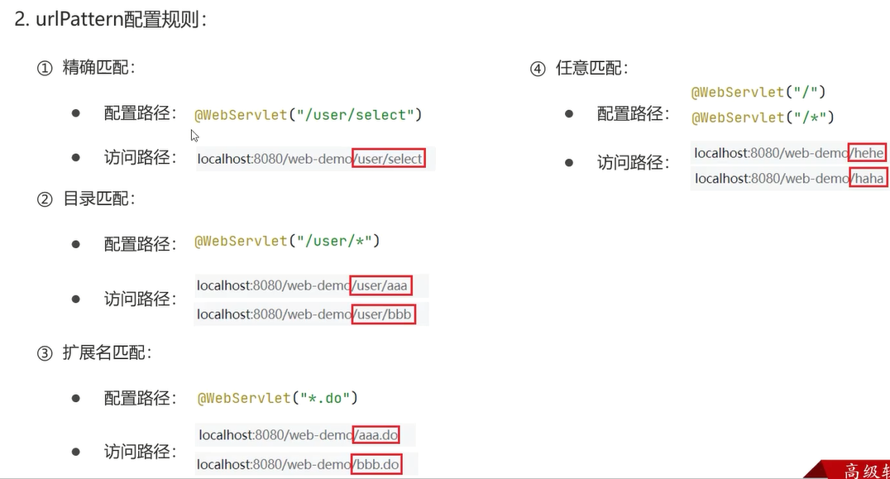
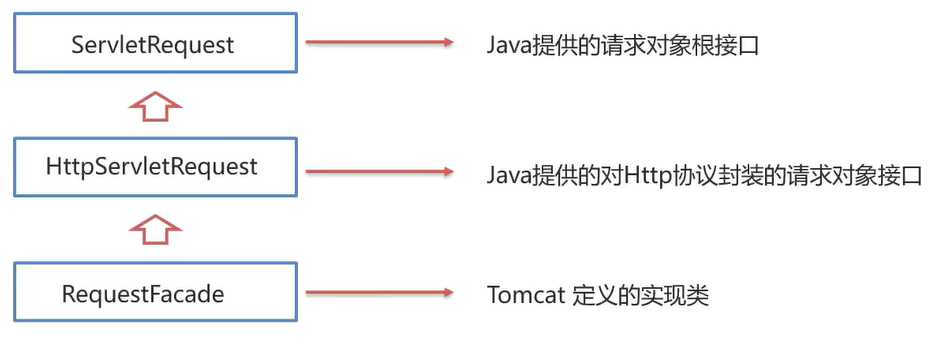
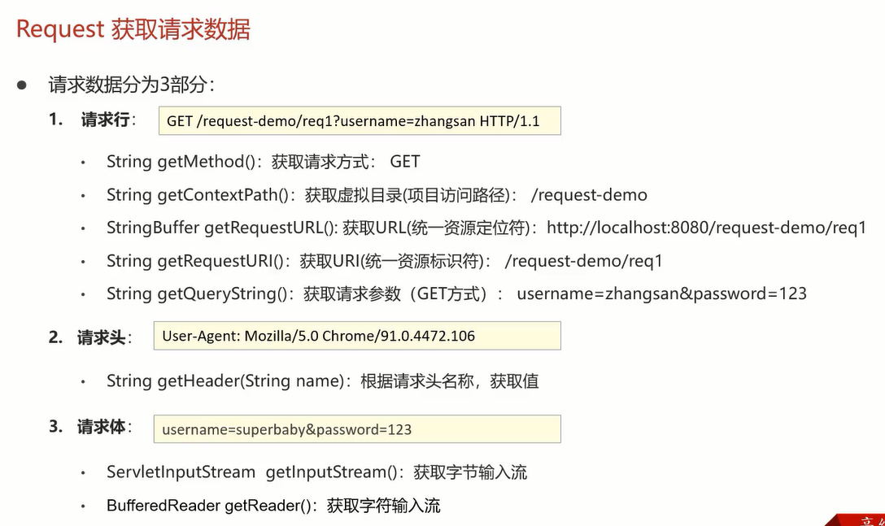
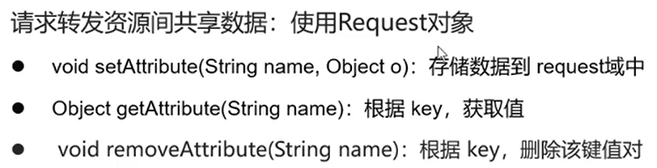
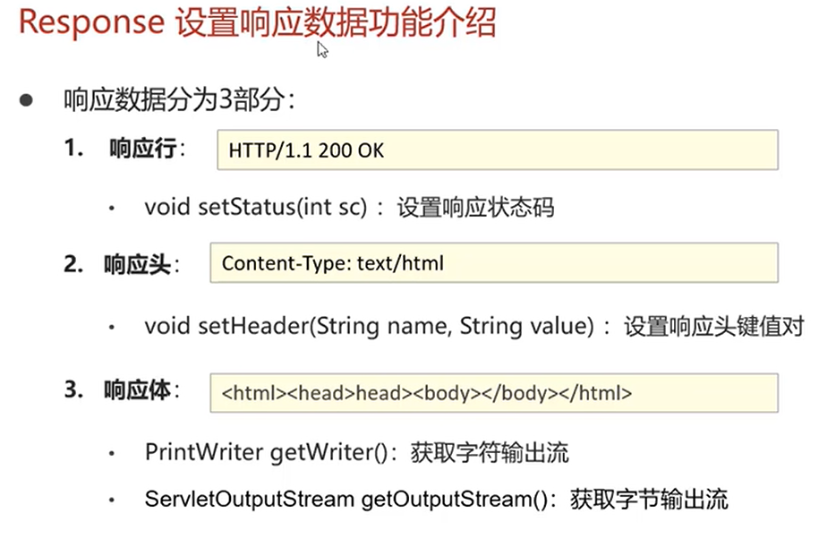

# Servlet和ReqRes
看的黑马的视频搞得快速入门

## Servlet
先了解完毕 Servlet先，个人首先理解它为 golang里面的handlerFunc(Servlet的 service方法)

类似 golang http标准库的 handler注册

### Servlet的执行流程
程序员只负责定义 Servlet内部的逻辑就好，对象创建和方法的调用由服务器软件控制（Tomcat）。

### 生命周期
最重要的就是：什么时候创建？什么时候回收（销毁）？

和 Class Loader的过程挺像的，

个人理解：
这个Servlet被访问就会加载和实例化；其中具体时机可以通过 注解进行配置，这是后话
然后容器就开始进行初始化，调用init()方法；
然后具体就用Service方法处理就行；
然后，在需要的时候，调用destroy方法销毁。

其实还挺简单。

我第一次学习这个东西的时候确实挺枯燥的...

### 方法结构
重要的三个已经在生命周期里面说过了。
里面的一个 ServletConfig可以通过成员变量的方式获得。

### Servlet内部的体系结构
如果直接实现 Servlet接口来实现的话，每次重写五个方法过于麻烦。

所以提供了 一个对应的封装：HTTPServlet，重写对应的 RESTful的请求处理逻辑就行，这样就方便很多了。
(和 Gin的那个挺像的)

另外这里 写了一个快速的demo，解释了表单的action可以指定以 method里面方式像action里面的路径发送请求。

分离请求方式的原因是因为 这样方便管理，如果使用原生的 service方法，还要自己额外针对不同的请求方式来编写逻辑，这里就好比一个封装，是一个已经造好的轮子。

所以 doGet和doPost方法的原理我应该也弄清楚了。

### URLPattern
这个就是将访问的路径和 Servlet绑定在一起。

一个Servlet 可以配置多个 访问路径： urlPatterns = {"demo1", "demo2"}

还有一个重要的是四种匹配的规则：

四种匹配规则的优先级：精确最高...

另外任意匹配的两种，单斜杠会覆盖 Tomcat的默认的 defaultServlet的配置，所以如果没有特殊需求的话可以使用斜杠加星号的方式。
这个默认的Servlet是Tomcat用来处理静态资源的，所以一般不会覆盖。

另外， urlPattern还可以通过 xml配置，只不过麻烦一点，视情况看要不要介绍。。。

xml暂时先不看，视频也只有三分钟来着

## Request 和 Response
### Request的继承体系
其实没有太多要说的，你知道方法调用和传递参数都是由 Tomcat管理的就行。
你可以只去看 JavaEE提供的接口。
对于 使用Tomcat的程序而言， Request的体系结构是

### Request的API
需要的时候去查一下就好。得到 Request的数据的。

GET请求无请求体，post有请求体
请求体的API和流有关。

一个请求(Request)里面比较重要的一个是 获取请求参数，不论是 get也好post也好。

和 go 类似，也是使用 getQueryString这个方法
Post的话就是得到流：getReader()然后通过readLine获取数据应该是。

为了统一API， Request用了一个统一的方法 getParameterMap，具体原理我知道，就不写了，其实也是一个封装，一个现成的轮子。

更加常用的，细致的API我就不写了。贴个截图在这里：

### 乱码的问题
post使用的是流，可以直接设置编码。
get的话通过url编码，稍微有点麻烦，我不确定我要不要写到笔记里面来。

老实说这里的解决方式模板代码，而且高版本的tomcat（8.5之后）已经解决这个问题了。

所以我暂时不看了。

### 请求转发
个人理解就是一个跨 Servlet的解决方案。
request.getRequestDispatcher("/资源路径").forward(req, res);
并且他们之间的数据共享依然靠 Request对象实现。

好像和 Android的哪个有点像...
三个API

**特点**
- 浏览器地址栏不发生变化；
- 只能转发到内部资源
- 一次请求通过 request转发数据

### Response的功能介绍
Response和 Request相辅相成，两者类似。

这里直接贴图：

### 重定向
和 Request的 转发很类似，
重定向就是 告诉浏览器我处理不了，你去找另外一个Servlet去处理的意思。
通过状态码来实现这个消息的传递。

具体是：
设置状态码 302
设置响应头 location: xxxx

response.setStatus(302);
response.setHeader("location", "资源B的路径");
这个方法也是有方法封装的：setRedirect()，不重要

**特点**：
和 转发相反哈哈
- 浏览器路径发生变化
- 可以定位到任意位置，因为第一个的原因
- 本质上是两次请求

相似又相反

### 关于虚拟目录的问题
这个虚拟目录就是Servlet前面的项目名字，**内部跳转**不需要，重定向或者浏览器之类的外部跳转需要，就酱。

### 响应体的写入数据的方式
字节数据写入流
字符数据写入流

这里顺便还复习了一下 IO流的原理，以及一个具体的拷贝的代码。

如果到时候有需要，我就去看看。。。
有现成的框架可以直接使用：commons-io