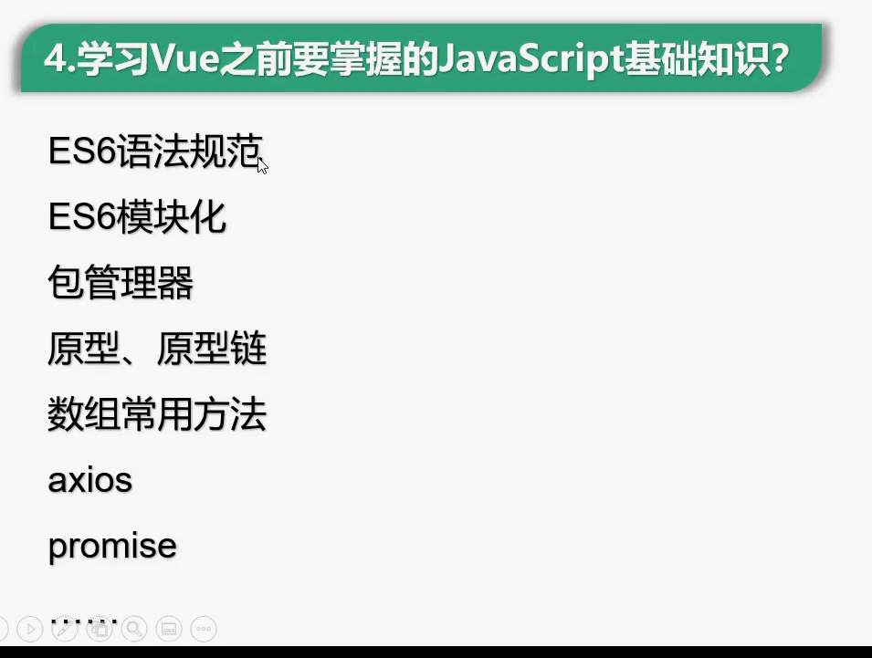
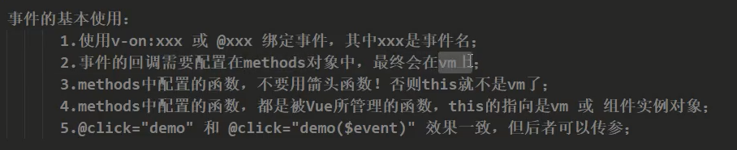
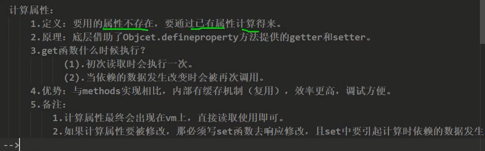

# Vue简介
一套用于**构建用户界面**的**渐进式**JavaScript框架。
构造用户界面： 核心就是得到数据并展示；
渐进式：根据需求的量级来决定引入库的数量。
Vue可以**自底向上**逐层构建的应用。
Vue要与原生JavaScript共存非常的容易。

## Vue的特点
1. 采用**组件化**模式，将高度复用的代码持久化成文件：本质还是Html、css、js的组合。
    
1. **声明式编码**，让编码人员不再需要直接操作dom，而是使用vue自带的指令代替。
    原生js：命令式编码
    ```javascript
    // 准备html字符串
    let htmlStr = ''
    // persons.forEach( p => {
        htmlStr += `<li>${p.id} - {p.name} - {p.age}</li>`
    });
    // 获取list元素
    let list = document.getElementById('list')
    // 修改内容(亲自操作dom)
    list.innerHTML = htmlStr
    ```

    使用vue的指令：
    ```vue
    <ul id="list">
        <li v-for="p in persons">
            {{p.id}} - {{p}} - {{p.age}}
        </li>
    </ul>
    ```
    声明式编码由底层的命令式编码封装而来。
1. 虚拟dom和优秀的diff算法提升性能。
    网课的举例有点类似与String和StringBuffer的区别。
    vue的虚拟dom有点类似控制器。
    新旧虚拟dom的比较使用diff算法实现，性能较好。

## vue的前置知识


## Vue的官网使用指南
重要的东西：
- 教程
- API
- 整个工具导航栏
- 核心插件
- Awesome Vue 官方整理的实用的包

## Vue安装环境
1. 下载开发版的vue.js
1. 下载vue开发者工具的谷歌拓展

# Vue基础语法
## HelloWorld案例
```html
<!DOCTYPE html>
<html lang="en">
<head>
    <meta charset="UTF-8">
    <title>初识Vue</title>
    <script type="text/javascript" src="../js/vue.js"></script>
</head>
<body>
<div id="root">
    <h1>hello, {{ddd}}, {{Date.now()}}</h1>
    <a v-bind:href="url">点我去尚硅谷学习</a>
</div>
</body>

<script>
    Vue.config.productionTip = false // 阻止vue在启动时生成生产提示
    // 创建vue的实例
    new Vue({
        // el是element的缩写
        // el用于指定当前的vue实例为哪个容器服务，它的值通常为css选择器字符串
        // 也可以通过js原生的dom节点获取的方法来制定。但是通常不用。
        // el: document.getElementById('root')
        el: '#root',
            data: {
            // data中用于存储数据，数据供el所指定的容器去使用，这里data的值通常会写成一个函数。
                ddd: '郑子康',
                age: 22,
                url: 'https:www.bilibili.com'
            }
    });
</script>

</html>
```
解读：
1. {{}}：使用两组花括号来直接在html中进行插入赋值；
1. el用于指定vue实例服务的数据容器是谁。value填css的选择器。
1. data里面是的数据在vue模板中可以访问到。

**el和data的初始化有另外的方式**
el：Vue的实例的_proto_(原型对象)的$mount属性对应的就是el。
data：data推荐使用函数式的初始化方式：
```javascript
data:function(){
            return {
                school_name:'大本钟',
                address:'英国伦敦'
            }
        }
```
并可以简写成
```javascript
data(){
    ...
}
```

总结性的东西：
    1. 想让Vue工作，就必须创建一个Vue实例，且要传入一个配置对象；
    1. root容器里的代码依然符合html规范，只不过混入了一些特殊的Vue语法；
    1. root容器里的代码被称为【Vue模板】；

细节：
1. vue实例和html中的容器一一对应
1. 双花括号里面必须写受js支持的表达式。
使用v-bind可以动态的给标签里的属性绑定值。

## 数据绑定
v-bind 是单向的数据绑定，数据由data流向页面。
v-model 是双向的数据绑定：数据不仅可以由data流向页面，还能由页面回流向data。
v-model支持的标签类型是**有限**的，只能应用在表单类元素(输入类元素)上。再详细点就是标签要有value属性。
v-model:model 可以直接简写成v-model
因为**非输入类元素设置双向绑定没有意义**。

## 数据代理
### Object.defineProperty()
通过Object.defineProperty()方法，可以给对象添加或者修改属性：
api：
```javascript
defineProperty(o: any, p: PropertyKey, attributes: PropertyDescriptor & ThisType<any>): any;
```
主要是传三个重要的参数：
欲添加属性的对象；新属性的名字；配置数据。
使用这个方法添加的属性，是**不可以枚举**的。换句话说，这个属性是**不参与遍历**的。
枚举 = 参与遍历

define方法允许精确地控制对象的成员属性。
define的getter和setter使得对象的属性和它的数据源拥有了**双向绑定**的关系。
getter实现属性能够随数据源的数值变化而变化；
setter可以使数据源的值可以相应属性的变化。
实现的代码是：
```javascript

```

### 数据代理的定义
Java中也有对应的设计模式：代理模式。
通过一个对象代理对另一个对象中属性的操作(读或写)

### Vue中的数据代理

## 事件处理
可以使用指令v-on给\<button\>绑定点击事件
后面跟上对应的函数名。
v-on 的简写可以使用\@代替

js的点击对象默认会传一个event事件对象
event.target: 事件的作用的目标

关于箭头函数：
箭头函数是没有自己的this的，因此你在vue的实例对象中使用箭头函数的时候，会自动找到外层的window实例去。

接受vue管理的函数最好不要使用箭头函数。

一般调用的方法最好不要写在data里面，而是写在methods里面比较好。

事件回调的基本使用：


### 事件修饰符
修饰符就是
Vue中的事件修饰符：
1. prevent：阻止默认事件；
1. stop：阻止事件冒泡；
1. once：事件只执行一次；
1. capture：使用事件的捕获模式：事件在**捕获阶段就开始执行**。
1. self：只有当event.target 是当前操作的元素的时候才执行。
1. passive：事件的默认行为立即执行，无需等待事件回调执行完毕。

js中的事件执行有**捕获阶段**和**冒泡阶段**
事件的捕获是由外往内的，事件的冒泡阶段是由内往外的。
默认事件的处理是在**冒泡阶段**

vue可以通过修饰符 v-on:click.capture 使得js在捕获阶段就处理事件。

事件scroll和wheel：
前者监听滚动条，后者监听鼠标本身的动作；
区别就是scroll只有在滚动条有变化的时候才会执行，wheel只要鼠标滚动就会执行，无关滚动条的情况。

### 键盘事件
Vue不推荐使用keyCode的方式去去制定具体的按键。
1. Vue可以通过修饰符直接绑定常用的按键。
    另外tab键的功能有点特殊，是**将焦点从当前元素切换到下一个元素**，tab按下就立即执行，因此tab的监听的修饰符要使用keydown而不是keyup才能实现功能。
    说简单点，tab必须配合keydown使用。
1. 不太常用的使用js中原始的key-name去绑定，不过要转换成**短横线命名**的方式。
1. 系统修饰符比较特殊：ctrl、alt、shift、meta(win键)
    1. 配合keyup使用：按下修饰键的同时，再按下其他键，随后释放其他键，事件才被触发。
    1. 配合keydown使用：正常触发事件；
1. 也可以通过具体的keyCode去指定按键（不推荐）
1. 最后一种是通过修改Vue.config中的配置自定义按键：Vue.config.keyCodes.自定义键名 = 键码。

通过@键盘事件.修饰符表示按键的方式
例如：
<input type="text" placeholder="请在此处输入内容..." @keyup.enter="showInfo">

## 计算属性(Computed Property)
**先明白属性(Property)的概念**
对于Vue实例而言，**data中包含的**key-value对就是属性。
**定义**
data中**已经定义的属性**，经过运算，得到的全新的属性，就叫做计算属性。

计算属性的底层也是方法Object.defineProperty()。
1. 计算属性要求内部成员写成对象的格式。
1. 对象内部的getter方法在属性被读取是调用，返回值作为value。
1. 对象内部的this引用：**猜测**：原本不是vm的，只不过vue帮你把this设置成了vm方便你调用。
1. getter是有**缓存机制**的，getter方法不会反复调用；
1. 接上，缓存机制也是**有弊的**，因此为了解决这个问题，其实getter有**两个**调用时机：第一个就是**初次读取**的时候；另外一个就是计算属性**所依赖的数据**发生变化时。这样做就是为了**保持数据最新**。

类似getter，计算属性也是有setter方法的。不过**不是必须要写的**，只有**确认**这个数据**会被人为修改**的时候，才需要添加setter方法。要完成类似getter的同步变化的功能，需要在setter中使得getter的数据源发生变化。


getter拥有一种简写的形式, 因为计算属性一般是不需要使用setter方法的：
```javascript
const vm = new Vue({
    ...
    computed:{
        fullName:function () {
            // get函数的逻辑
        }
    }
})
```
用函数代替一个对象.

## 监视属性
vue的devtools的属性展示有一个小问题: 如果 页面上的属性没有使用的话, 那么Vue Devtools里面的 computed 也不会在tool里面体现了.

监视属性: 在vm实例里面配置 watch, 里面写上你要监视的 属性名.
vue会为其配置 handler()方法, 当 属性发生变化的时候调用.

除此之外, watch 有一个 immediate 属性, 默认为false, 意思是 handler 函数是否 立即执行.
...

除了直接在vue创建时配置之外, 也可以使用vm的引用 来保证后序可以自定义控制: 
```javascript
vm.$watch('isHot', {
    // 和配置时一样
})
```
