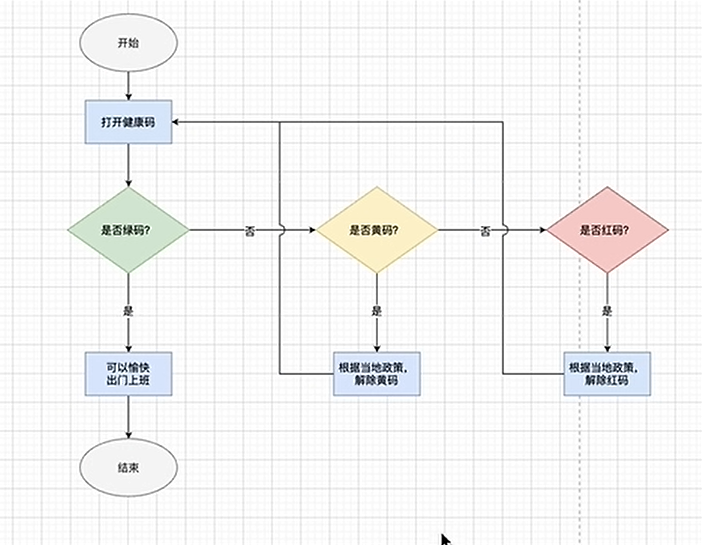

# diagrams画图保姆级教程
也就是drawio。 视频来源 [B站](https://www.bilibili.com/video/BV1oS4y1y7zG/)

UP主为了演示效果， 也专门用 diagrams画了一个流程图。 照着这张流程图画完， 就可以掌握 diagrams 60%的功能。

这个玩意主要用流程图和ER图。 如果你有其他的更高级的图表要去画，就不推荐用这个工具了。

旧版的drawio有一个非常好的互动教程， 就是一系列的动图教程。 可以去看看。
然后这里弹幕提示了 UP主使用的截图软件： snipaste。

~~主要用来画这几种图： gitflow图； 使用Mermaid构件图表； 实体关系图； UML图。~~

想具体的了解某种图片的画法的时候就可以去看看某个图的具体的画法。 

0630部分这里讲的这个工具的布局。 不做笔记， 有需要去视频的位置去查询。 

写几个重要的。 
图形库的上面有搜索框， 还有快捷栏， 使用他们可以免去繁琐的步骤。
右边的格式框都是对当前选中的图形生效的。
右上角的地球图标可以更改语言。

选择多个就和在windows里面一样的， 按住ctrl就可以了。 

要创建图形之间的联系也是十分的简单：
把鼠标🖱放到图形上面，它会显示四个方向的箭头，就代表往对应的方向添加新图形，并且添加对应的联系（箭头）。 如果按住ctrl的话就是图形的一个克隆。 还可以通过 alt+shift+方向键，也可以达到克隆的效果。

如果你想替换某个图形的话， 拖拽图库里的图形到你想替换的图形上面就可以了。

现在暂时算是有一个定论： 已经存在于画布上的图形已经是没有办法再去吸附箭头了。 需要重新从右边弄一个东西过来才可以。 

两个图形的连接部分， 可以修改连接线是固定还是浮动。 怎么看他是哪种， 鼠标选中， 他会有图形提示。  不过这里怎么改的话讲的不怎么清晰， 我也懒得去管。 视频位置2441

这种图形与图形之间的连线有一个标准的名字， 叫做连接器。 以后都以这个名字来称呼。 

修改连接器的入口方向和出口方向： 选中连接器， 在“调整图形”那个位置选择反转即可。 

进度： 2914

暂时就看这么多吧。 

# SQL刷题
返回有连续出现的数字： 这个是发现了数学规律： 连续出现 减去 对应的。 

