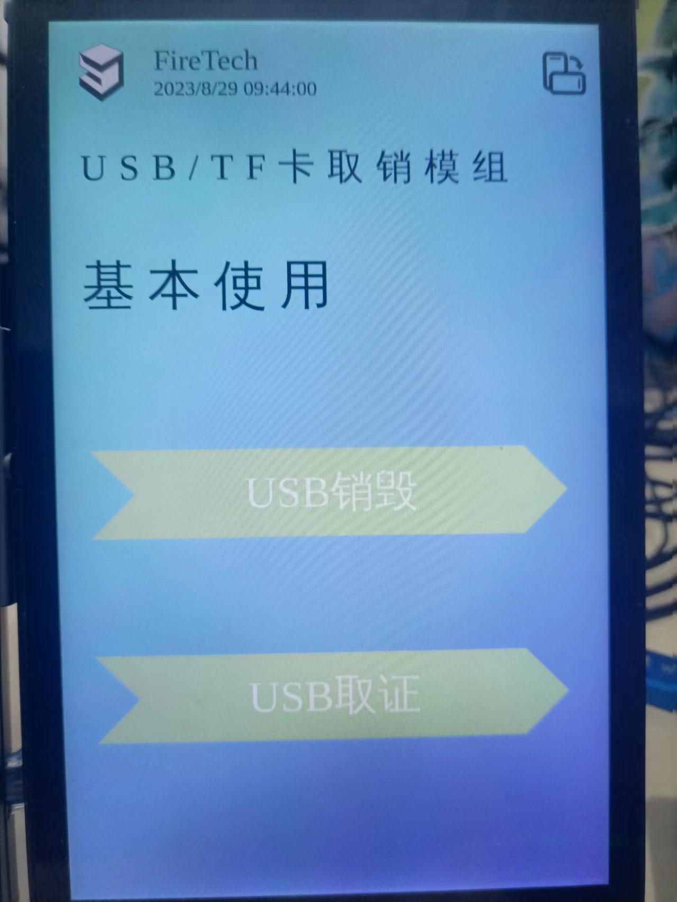
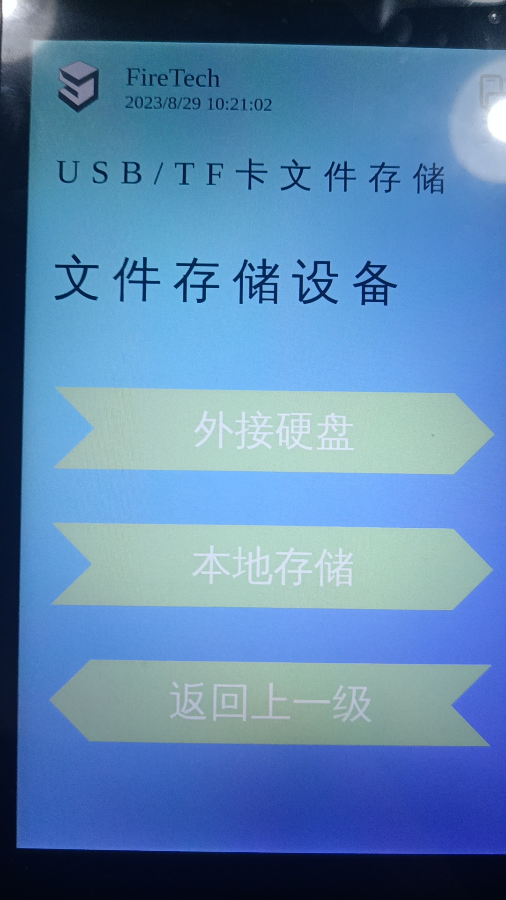
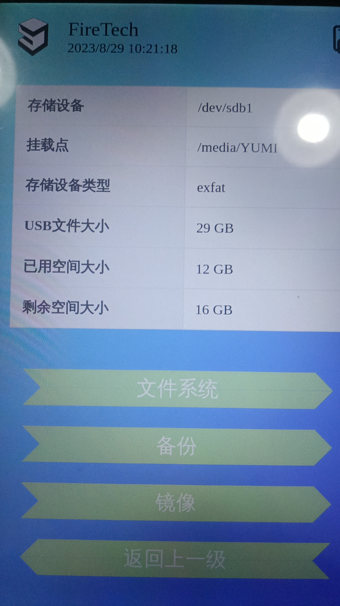
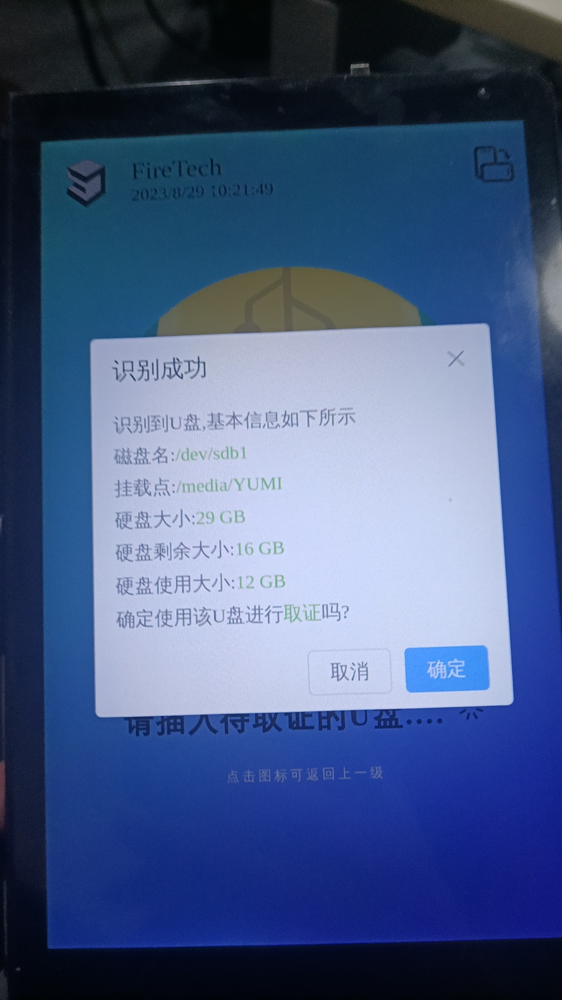
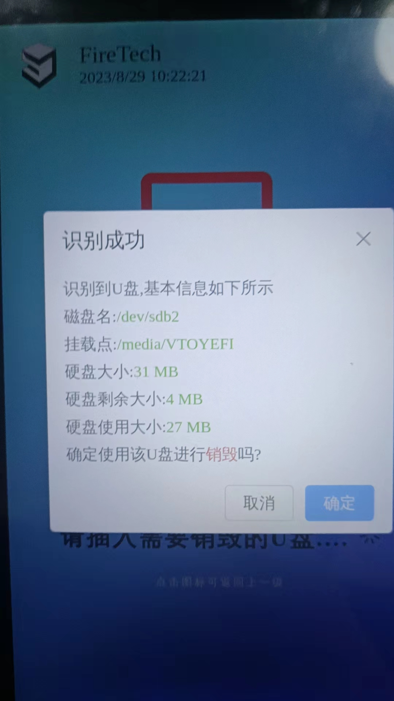
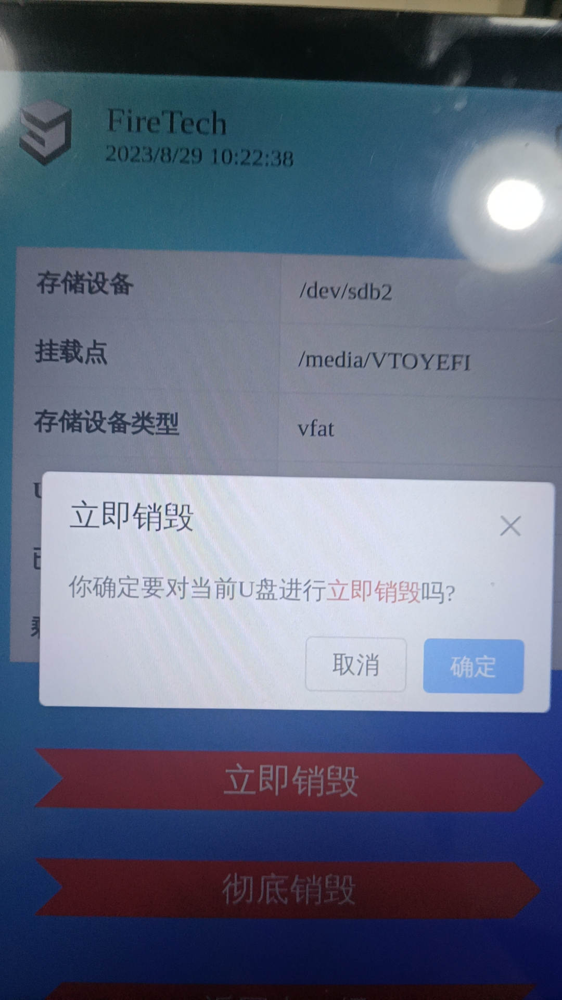
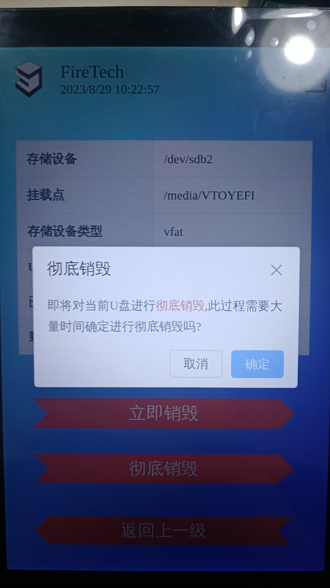

usb/tf卡_取销模块测试用例

测试目标
    验证用户可以通过设备进行磁盘的复制，镜像和数据销毁功能

测试环境
    测试设备：两张u盘及一台安装了usb/tf卡_取销模块的设备

测试步骤：
    1.进入usb/tf卡_取销模块根据提示点击下一步，选择usb取证功能和usb销毁功能
  

    -usb取证：
    2.根据提示选择外接磁盘（如U盘，tf卡等），或者本地存储（即仪器内置磁盘）。

        -本地存储：

            根据提示插入U盘后，可打开“文件系统”功能查看U盘的文件内容
            选择“备份”按钮将U盘文件备份到本地磁盘（即仪器内置磁盘）
            选择“镜像”按钮将U盘文件镜像到本地磁盘（即仪器内置磁盘）
        -外接磁盘：

            根据提示插入外接磁盘，当提示插入存储设备的时候插入第一张U盘或tf卡，然后点击确定，当提示插入取证设备的时候插入第二张U盘，然后点击确定
            选择“备份”按钮将U盘文件备份到本地磁盘（即仪器内置磁盘）
            选择“镜像”按钮将U盘文件镜像到本地磁盘（即仪器内置磁盘）

    -usb销毁：
    2.根据提示插入U盘（检测过程可能要等待几秒）

    2.1进入销毁界面，选择立即销毁功能或者彻底销毁功能或者返回模块主菜单
        -立即销毁：

            不会完全删除数据，而是把已有的文件数据填充为0，达到销毁文件的目的
        -完全销毁：

            完全删除所有数据，不可恢复

预期结果
    用户进入usb模块点击下一步后，弹出页面可选择usb取证或usb销毁
    
    用户选择usb取证后，在跳转的页面选择外接硬盘或者本地存储，选择本地存储后进行U盘是否插入的检测，检测到插入的U盘后点击确定，开始进行文件操作，点击备份将文件备份到本地文件中，点击镜像将U盘镜像到本地文件中。点击文件系统按钮可查看U盘所有文件
    
    用户选择usb取证后，在跳转的页面选择外接硬盘或者本地存储，选择本地存储后进行U盘是否插入的检测，检测分为两次，U盘也分前后两次分别插入，第一次插入的是存储文件的存储盘，第二次是进行取证操作的U盘

    用户在usb取证和usb销毁功能选择销毁时，进入usb检测界面，选择usb作为销毁操作对象，点击立即销毁，U盘中的所有文件都将被字符0填充，而选择完全销毁后，U盘的所有数据都将清空。