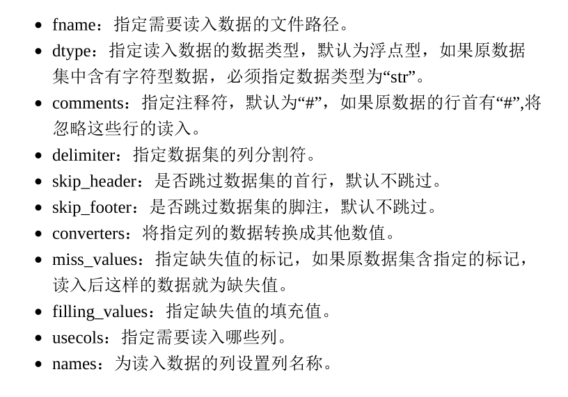

# 【个人用】数据挖掘
为了应付大作业而做的。
不过个人觉得没有意义，所以觉得自己慢慢来啃相关的东西。

# Python数值计算工具——Numpy
DM中，所以基于数组的运算，通过Numpy提供的方法完成。

将掌握如下几方面的内容：
- 数组的创建与操作；
- 数组的基本数学运算；
- 常用数学和统计函数；
- 线性代数的求解；
- 伪随机数的创建。

## 数组的创建与操作
通过numpy模块中的**array函数**实现数组的创建。
像array函数内传入一个列表或者元组即可。

array函数会保证**数组的数据类型一致**，无法转换的将会统一变成string。

可以像操作原生List一样操作数组。
不过numpy提供了更强大的操作来获取**不规律的元素**：
在一维数组中：
列表的**所有索引方法**都可以使用在数组上，而且还可以将任意位置的**索引组装为列表**，用作对应元素的获取；

二维数组中通过一个只有两个元素的List取得对应的元素。

注意ix_函数接受两个List分别作为行和列元素，返回一个对应组成的数组。

## 数组的常用属性
当**从外部读取数据的时候**，你就不能掌握数组的信息了。不过可以通过属性来获得他们。

关于numpy读取函数：
在numpy模块中，可以通过genfromtxt函数读取外部文本文件的数据，这里的文本文件主要为csv文件和txt文件。

这里直接截个图算了

对应的属性有：
ndim: 维数（几维数组）
shape：行列数
dtype：元素数据类型
size：数组元素个数

## 数组的形状的处理
都不知道讲的什么东西，所以直接跳过