# 主流Spring技术学习 黑马
看的黑马的视频
# Spring的基本介绍
这部分的内容应该可以当做一个索引或者说目录来用：
1. Spring的架构
1. Spring的核心容器：IOC和DI
## Spring架构
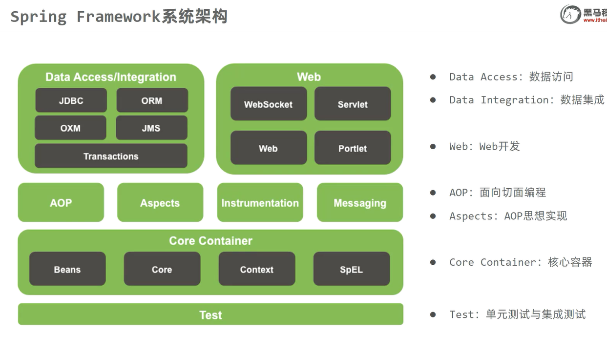

Spring的核心思想就是IOC和AOP，这两个重点学习。
解释一下图中数据集成的意思：Spring自身操作数据库的能力尚可，并且它**对其他框架或者组件的整合也非常的优秀**。这就是集成的意思。


## 核心容器
### 传统 JavaEE的问题
IOC的核心理念是：接口的实现是一种硬编码，导致代码的耦合度高；但是不写实现的话程序优惠无法运行；

所以核心在于实例对象的来源上 -> 因此提出改进思路：对象的实例化**不再由程序员通过代码来进行控制**，而是转由 程序(Spring)来进行提供。
肯定用到了**反射**不用想。

相比于 重新编译的代价，反射增加的性能损耗几乎可以不计。

### IOC
直接贴个图片在这里好。
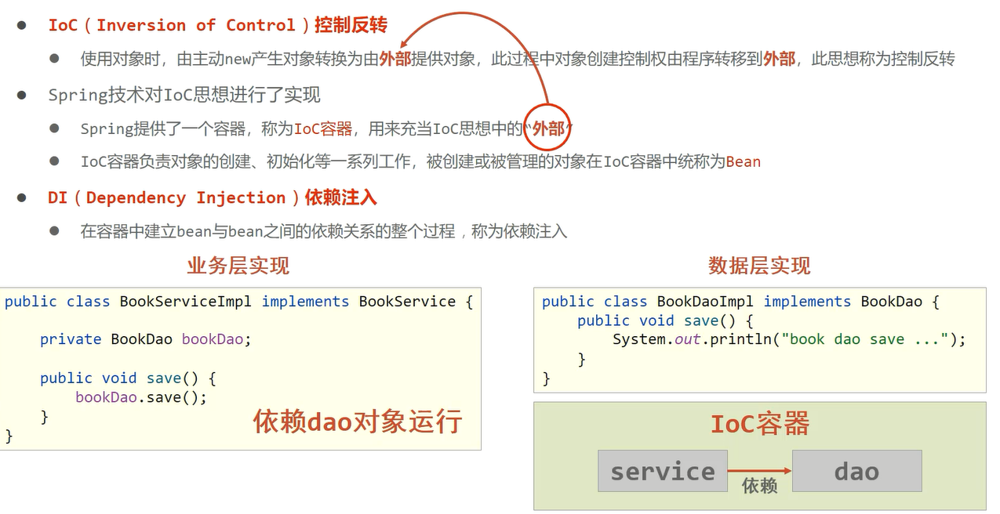

IOC是**解耦的实现**，DI是**对IOC的补全**。

### IOC的实际案例
大概就是这么一个流程：
1. 定义需要由Spring管理的类
1. IOC管理你的类
1. 在业务中获取IOC容器的实例
1. 通过IOC容器实例获得实例类

那么首先导包：
```xml
<!-- pom.xml中 -->
<dependency>
            <groupId>org.springframework</groupId>
            <artifactId>spring-context</artifactId>
            <version>5.2.15.RELEASE</version>
        </dependency>
```

在配置文件里面通过 bean标签配置类，直接写个实例即可。
重要的就两个属性：id表示到时候获取时候的名字，class表示类路径。

然后在代码里面过一下代码就行
```java
public class App {
    public static void main(String[] args) {
        ApplicationContext applicationContext = new ClassPathXmlApplicationContext("applicationContext.xml");
        User user = (User) applicationContext.getBean("user");
        System.out.println(user);
    }
}
```

正式的业务没有这么写的，因为这是个入门案例

### DI的快速入门（setter的引用类型注入）
两个类之间产生依赖关系（**最直接的就是一个实例中包含包含另一个实例的引用**），使用DI在代码方面进行解耦合。

在上一个 bean的标签里面 添加一个`property的标签`
里面的属性分别是：name 属性名，需要写类定义的属性（注意**区分bean 和 使用代码定义成的类**）；ref 绑定bean，值是 bean的id

## 关于Bean
Bean还可以两(?)个额外的基础配置：
- 设置别名
- 控制单例多例

通过 标签属性即可控制；name 和 scope，简单不说了

### Bean的实例化方式
三种，重要的是**广泛应用的工厂模式**
第一种，就是默认的，通过**反射获取构造器的构造器**； 具体后面应该细嗦
第二种，静态工厂配置，添加一个`factory-method`属性（里面写）让 spring知道这是一个 静态工厂；
第三种，实例工厂配置，和第二种不一样的就是需要先实例化工厂才能获取产品的实例：那么先用普通的bean配置工厂，然后使用额外使用`factory-bean`属性指定工厂bean获取对象。

第三种可以优化：
优化成一个步骤：
Spring提供一个接口，这样实现接口就可以**自动识别成一个工厂**，配置时就可以使用默认配置来简化配置文件的书写了。

接口本身比较简单，自己去看

### 生命周期
先贴图
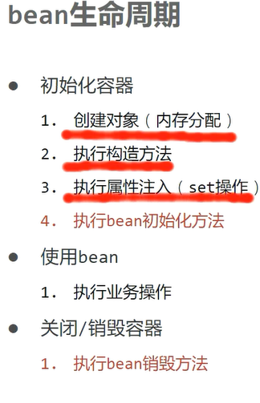

可以配置生命周期的方法：
两种：一个在配置里面写，第二个是**代码实现接口**（相当于符合spring的规范），这样spring就会**有一个默认的处理机制**
比较简单，需要的时候去查


### DI具体
就是给bean的**成员变量赋值**。

setter和构造器两种；
setter：
property标签里面 value表示基本类型， ref加bean的标识 表示引用类型。

构造器：
换了个标签的名字： constructor-arg。这个就是所谓的标准写法；

不过这个标准方式要求**配置和代码的名称要一致**，所以耦合度较高；
有另外一种，根据类型，这种就要求**顺序一定**了。通过type属性确定；这种解决了**形参名称耦合的问题**

另外还有一种**使用参数位置的那种**，使用 index属性确定；

---
以上的方式都各有各的使用方式；那么该怎么选择？

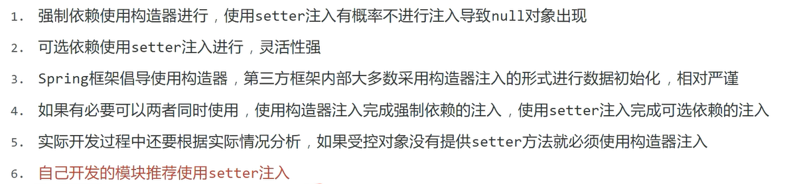

我一直在想**多个构造器**的情况该怎么办...
以后应该可以**直接使用注解**，所以前面的xml的配置可以**适当了解**即可。

### DI自动装配（我叫自动DI，或者自动装配）
DI需要在bean里面去手动配置，不方便，所以 提供了一个**自动装配**的功能

添加属性`autowire`即可。
不过好像注入的属性**也需要用 IOC管理**

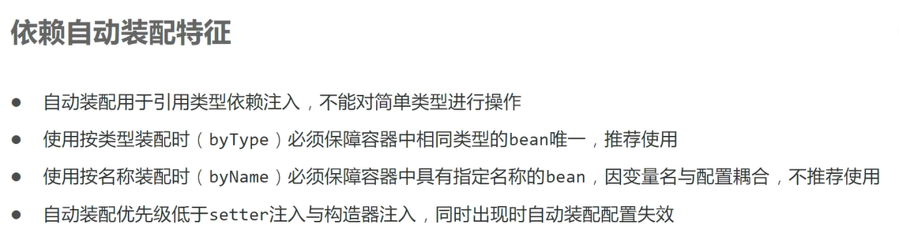

### DI集合注入
为什么不能一起讲完。。。
针对这几类的注入：数组、List、Set、Map、Properties

通过**子标签**来完成

具体的操作去查，现在不看🙈

### 一个小案例
第三方的包的实例使用 容器管理的时候，**推荐使用setter注入**。就酱。

### Spring加载 Properties的配置
呃讲了一个 Spring 名称空间的问题，虽然我也不知道为什么：到时候直接去看；
小知识：怎么给 Spring添加新的命名空间：需要的时候可以直接去看视频；

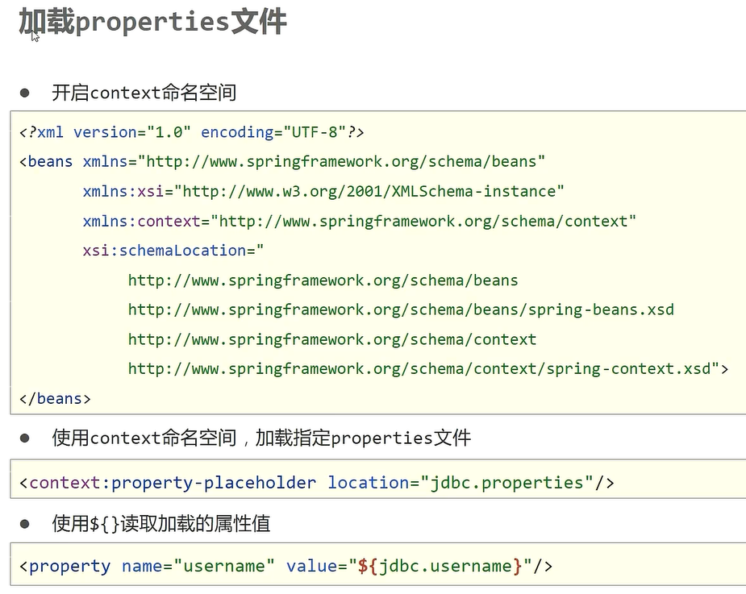

提了一个小知识点：上面的`location`写`classpath:*.properties`
意思是**只读当前项目的所有配置文件**。

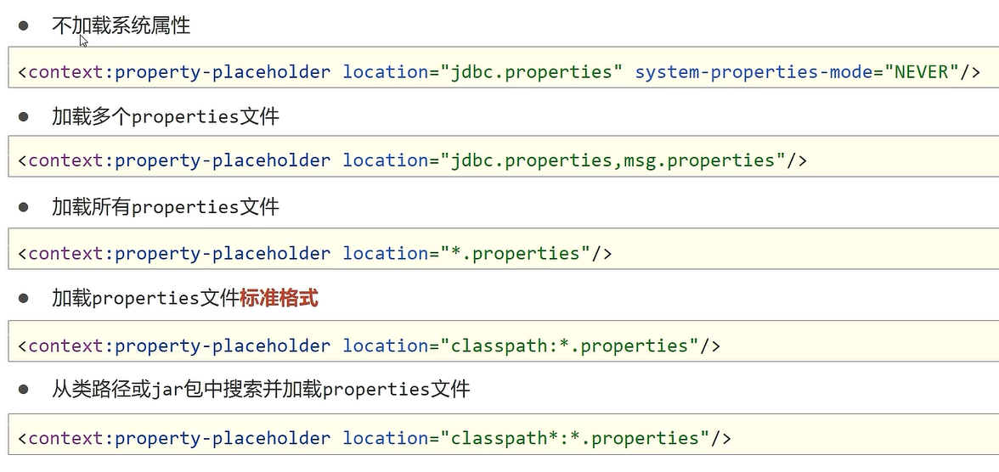

## 容器本身
最后系统的学习一下容器本身。
容器加载和bean的获取不说。


顶层接口的容器的**所有bean都是延迟加载**

## 注解开发
主流方式。

Spring 2.5的时候好像是一个半注解的方式，如果有需要直接看视频；

`@Componet`就能标记一个类为 Bean。他还有其他的别名：为了方便**看懂分层**；

介绍纯注解开发的方式：
最大的改变：配置文件的xml已经**完全被 Java类代替；**
注解`@Configuration`配置；
注解`@ComponetScan`指定 Bean的扫描路径；

使用 Annotation...来加载配置类；

总结一下的话把**原来标签的属性名都换成注解了**

生命周期方法也改成 注解了，在方法上面加上即可。

注入也一样了，不过好像**没有 setter注入和构造器注入了**
全部使用注入装配，**底层原理是 暴力反射**
在成员变量上写上`@Autowired`注解即可。
默认不写就是**按类型装配**
如果有多个实现类就使用注解`@Qualifier`来指定名称。

`@Value`对基本类型进行注入
使用它的好处在于**可以使用 Spring的配置占位符**

`@PropertiesSource`注解加载配置文件，但是**不再允许使用通配符**

### 第三方Bean
怎么一管理三方bean就又回到最原始的代码方面去了？？？
不过还是比最开始的那种强，这个主要是**自己重写第三方组件的实例获取方式**
然后 添加`@Bean`注解

介绍了加载配置类的方法： 使用`@Import`注解

第三方 bean也有DI的需求，怎么搞？
简单类型：通过**配置类的成员变量**打`@Value`注解，简单粗暴

引用类型：直接在函数的形参添加， Spring会扫描为自动装配（按类型扫描）；

## Spring 整合 MyBatis
### 回顾 MyBatis的快速入门
首先回顾 MyBatis的使用过程：
1. 配置文件
1. 映射文件（可以通过注解代替）
1. 模板代码： SqlSessionFactory
1. 执行业务

### 具体步骤（采用注解开发）
这是一个具体并且模块化的动作....
说实话我记得我原本是要做web来着，现在却变成一个劲的学框架了...
以上是吐槽。

大概步骤：
1. **整合所需要的**坐标
1. Spring的Bean管理 SQLSessionFactory以及进行对应的 DI，并提供**对应的配置信息**
2. 核心是 MyBatis的两个配置类：`class SqlSessionFactoryBean` 获取 SqlSession对象；`MapperScannerConfigurer` 用于配置扫描路径；

贴个图片在这里吧：
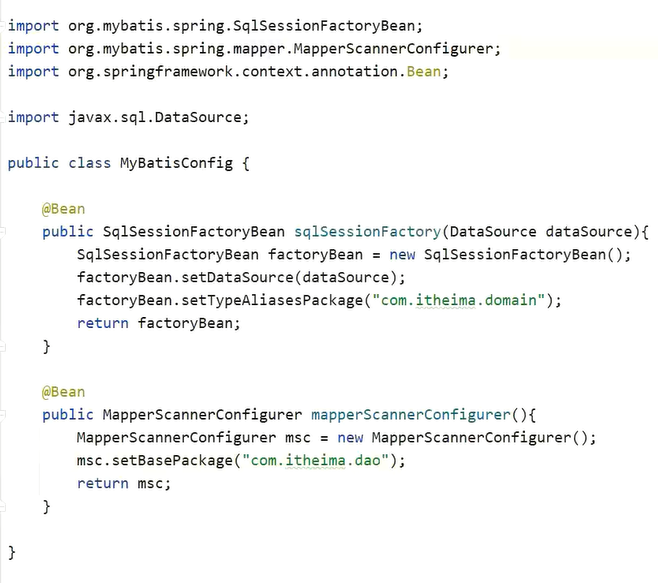

## 整合 JUnit
因为我之前其实没有怎么学过 JUnit，而我又是投了测试的岗位，所以这里的笔记**会写得稍微详细一点**

导包的话一样的： JUnit本身的，以及 Spring 整合 JUnit的包；
```xml
        <!-- JUnit 的坐标 -->
        <dependency>
            <groupId>junit</groupId>
            <artifactId>junit</artifactId>
            <version>4.12</version>
            <scope>test</scope>
        </dependency>
        
        <!-- Spring 整合 JUnit 的坐标 -->
        <dependency>
            <groupId>org.springframework</groupId>
            <artifactId>spring-test</artifactId>
            <version>5.2.10.RELEASE</version>
        </dependency>
```

然后在**测试包里面添加测试方法**，这个我以前没做过，都是直接用的注解；

配置`@RunWith(SpringJUnit4ClassRunner.class)`注解，表示这是测试类；
配置 Spring的配置类：`@ContextConfiguration(classes = SpringConfig.class)`

剩下完成自动装配，然后就是我熟悉的部分了...

一句话解释：要使用**Spring专用的类加载器**
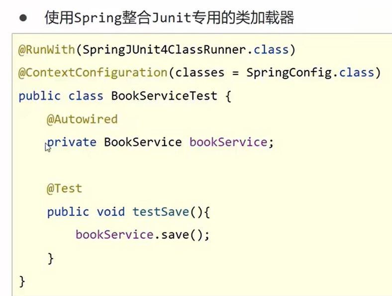

# AOP
一种**编程思想**。
面向切面编程 **指导开发者如何组织程序的结构**
最大的特点（或者说作用）： 不改动原有的代码， 做功能增强
说实话第一次看的的时候挺震撼...

## AOP的核心概念
我要把 AOP 的作用贴到这里： **不改动原有的代码， 做功能增强**
连接点：你AOP不是要增加功能吗？ 在哪些地方你**可以增加**，这些地方就叫连接点；
切入点：增强了之后，这些**已经被增强的方法**， 就叫切入点；
通知：需要添加的**新功能**就称之为通知
切面：一个通知与一个切入点对应之后，管**它们的绑定关系**叫切面
通知在代码中的本质是一个方法(Kotlin中函数是一等公民, 不知道这个会不会发生变化)，方法需要**依附于一个类**, 这个类叫做 通知类

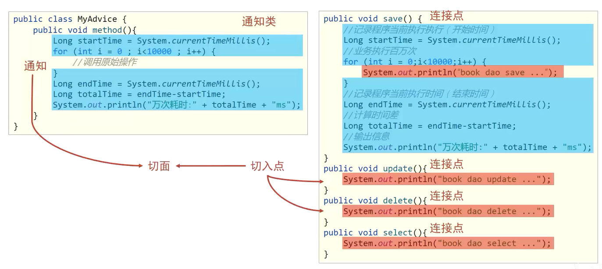
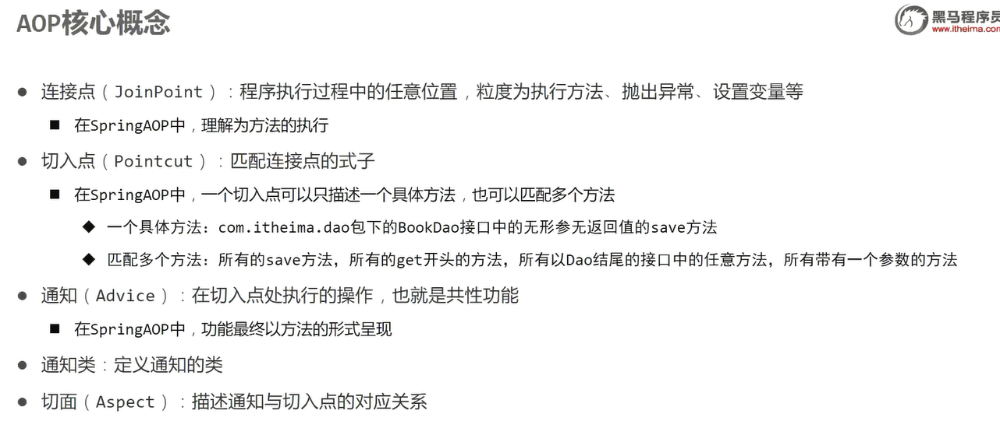

## AOP快速入门
**注意!** 注解算源代码的一部分, 所以如果**配置类的东西 还是用 XML比较好**

大概的步骤是: 导包, 连接点, 通知类和通知定义, 切入点, 定义切面. 完成.

第一步: 导包: context包如果导入的话不再需要 aop, 两者有依赖关系; 只需要导入 ASpectJ的包
```xml
    <dependency>
            <groupId>org.aspectj</groupId>
            <artifactId>aspectjweaver</artifactId>
            <version>1.9.4</version>
        </dependency>
```

我在你已经知道 AOP核心概念的基础上来直接说这个代码的实现: 

第二步: 连接点: 
**Spring里面一般把 函数(方法)作为连接点**

第三步: 定义通知类:
好像现在 Spring框架可以直接定义 一个 aspect, 不过暂时不管

通知(公共方法)定义, 上面加上你需要执行时机注解:`@Componet` 和`@Aspect`; 前者标注bean，后者标注该类**是一个通知类（？）**

第四步: 定义切入点
通过注解`@PointCut`定义一个**私有方法**, 里面有各种切入点定义的格式; 
比如 `@Pointcut("execution(void com.dao.UserDao.update())")`

第五步: 创造切面
第三步完善, 添加注解(应该是时机),需要把第四步定义的切入点作为注解的值;

并且 Spring的aop需要用 作为 Bean被 Spring 管理才行. 在Spring的配置类里面, 添加`@EnableAspectJAutoProxy` 注解, 表示开启注解配置的 aop


以上所有的内容, 整理成代码就是: 
通知类
```java
/**
 * AOP 通知
 */
@Repository
@Aspect
public class MyAdvice {
    // 定义切点: 指定执行哪个方法的时候进行 发送通知(应该是)
    @Pointcut("execution(void com.dao.UserDao.update())")
    private void pt(){}

    @Before("pt()")
    public void method () {
        System.out.println(System.currentTimeMillis());
    }
}
```

## AOP的执行流程
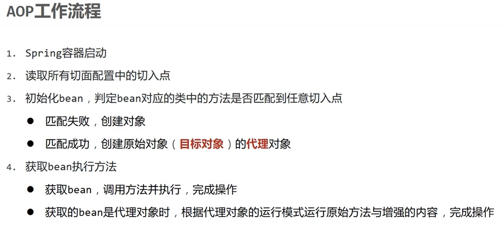
核心是代理模式。这个早就知道了，所以具体的就不写了。

## AOP切入点表达式
    `@Pointcut("execution(void com.dao.UserDao.update())")`
这个逼东西就是切入点表达式：因为做的是**无入侵式的AOP**，所以就只能**手动指定**切入点的特征了；

> 切入点：要增强的方法；切入点表达式：这个方法的描述方式

贴图片在这里：
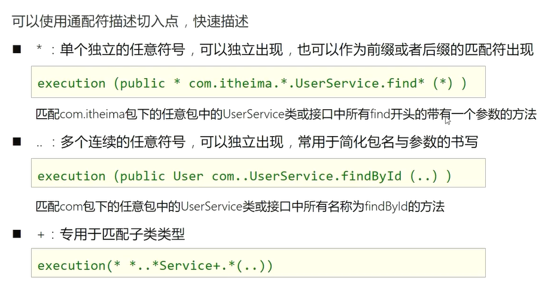
并且记住开发的名称要按照规范来进行开发：
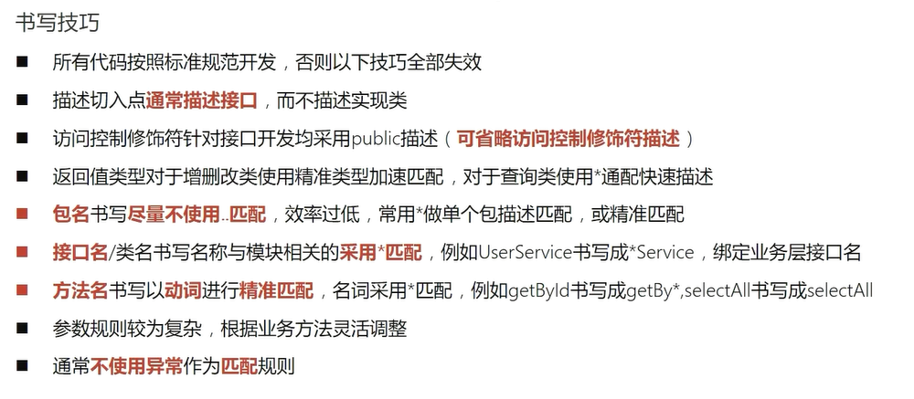
这也是 Spring**约定大于配置思想**的最好体现。

**如果AOP没有生效**，那么很有可能是 AOP切入点表达式和连接点不匹配，
Spring会当做**没有匹配成功**，所以**不会给你报错**。

## AOP的通知类型
切入点表达式解决给谁加的问题；通知类型决定在哪里加：
有五种通知类型，前三种就是（前，中，后），后面两种返回后和抛出异常后。

环绕的执行方式和 前后置的应该是不一样的，**环绕要处理返回值的问题**；
贴一个代码，写在注释里面
```java
// 定义切点，注意返回类型和形参类型一定要写清楚
    @Pointcut("execution(int com.controller.MyController.update(int))")
    private void pt2(){}
...
// 定义通知类型为环绕
    @Around("pt2()")
// 通过类似占位的方式来表示 原始的方法执行的时机
// Object表示 原始的方法的返回值， 形参表示在通知函数里面把原始方法作为一个实例来对待
// proceed()就会执行原始的方法
// 如果原方法有异常抛出，这里也必须处理
    public Object foo2(ProceedingJoinPoint point) throws Throwable {
        System.out.println("我要把你的妈妈抓走");
        Object proceed = point.proceed();
        System.out.println("我把你的妈妈救回来了");
        return proceed;
    }

```

贴一个图片
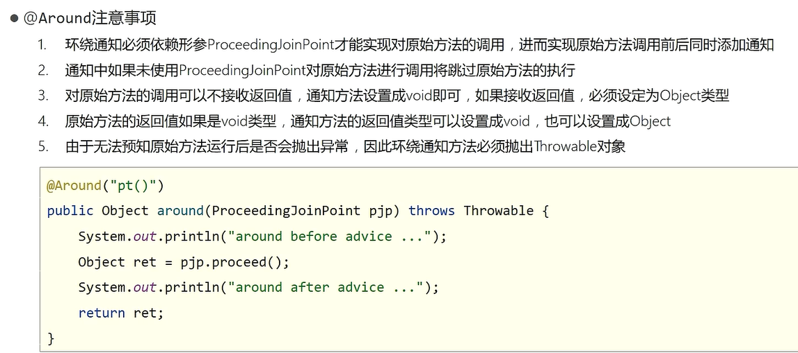

另外这个 ProceedingJoinPoint 实例还有一个 signature成员（翻译为签名），可以拿到 target每次执行后对应的信息：一系列的 get方法，不写了。

## 通过 ProceedingJoinPoint接口及其实现获取 Target（原始对象方法）的数据
API调用，暂时不写；

# Spring事务
事务就是我一直知道的那个事务。 Spring的事务一般用来保证**控制层和业务层**的事务。
因为这两个**底层的操作仍然是DAO层的操作**，所以这样做可以更好的管理事务，对程序员也更加友好。

在 Spring中通过接口来实现事务的操作（这个接口提供提交和回滚两个方法）：
它的默认实现类是 原生的JDBC事务，而 MyBatis的默认实现类也是 JDBC，所以以后**SSM的事务管理直接用 Spring的这一套。**

## 快速入门
快速入门一共三步：
1. 给 service层的方法添加`@Transactional`，表示这个方法开启了事务；
1. 在JDBC的配置类里面提供对应事务管理器实现类的bean， 这个DI类的类名`PlatformTransactionManager`，里面返回一个`DataSourceTransactionManager的实例`，使用自动DI。 具体的代码和之前 JDBC的配置类是一样的。
1. 让Spring知道你开启了事务：在 Spring的配置类上面加`EnableTransactionManagement`

## Spring事务的角色
这是个概念扫盲，很小的内容...
Spring（强调一下，我觉得这里应该就是 Spring的机制）实现 控制事务的方式是**事务合并**，也就是说：
> Service的业务逻辑在底层的本质是**多个事务按顺序执行**，而Spring事务的原理就是**把这些事务合并到一个事务中来。**

呃呃，算了，我觉得没有必要记的。

## 属性
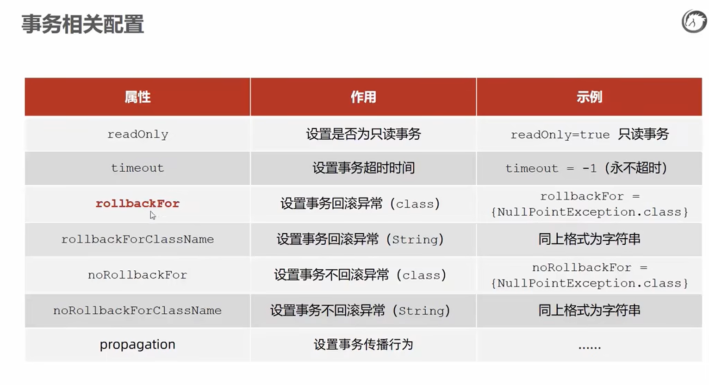
事务传播：我懒得去按这个标准答案去理解。
根据上面的原理，采取合并，但是事务**可以自己决定**到底要不要把自己的事务合并进去。

在事务注解里面定义： `propagation = propagations.REQUIRES_IN`，表示要求一个全新的事务。
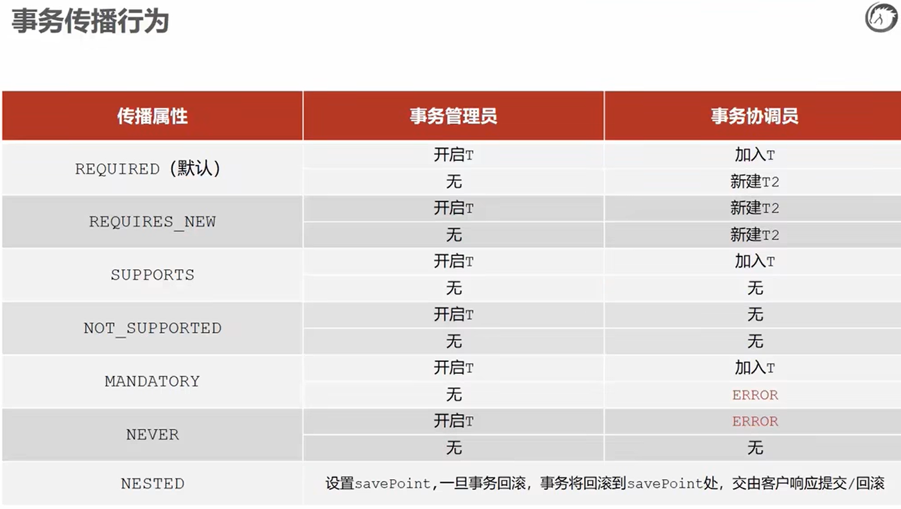

现在再来说一说我关于传播的理解：
对于不同的值决定**协调员怎么处理从管理员那里传播来的事务状态**。就写这么多。希望我以后再看这里的时候我能一下就理解。

事务部分结束。

# SpringMVC部分
首先说结论: SpringMVC是用来替换 Servlet复杂的开发流程的.

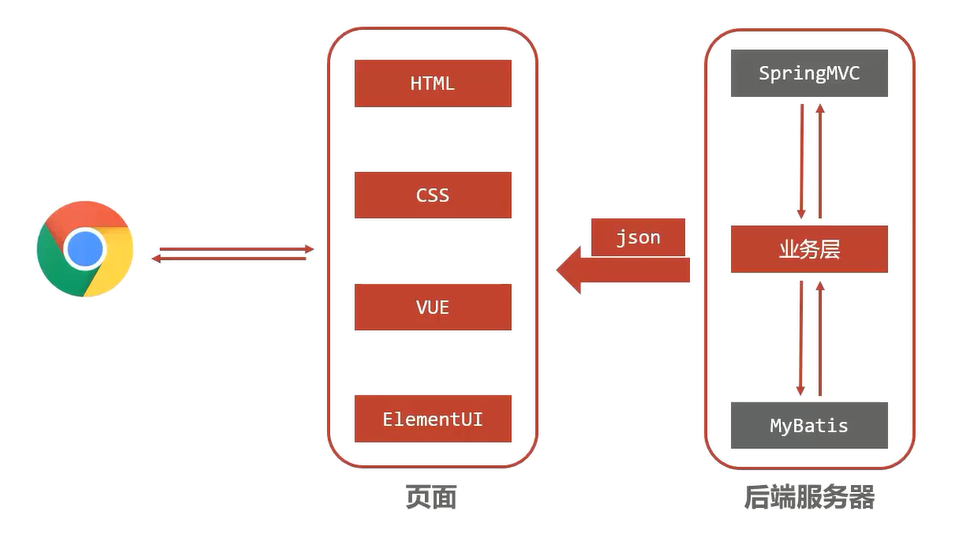

## 快速入门
坐标: Servlet 和 springwebmvc

```xml
        <!-- Servlet的坐标, 可能是因为 MVC 的底层就是 Servlet-->
        <dependency>
            <groupId>javax.servlet</groupId>
            <artifactId>javax.servlet-api</artifactId>
            <version>3.1.0</version>
            <scope>provided</scope>
        </dependency>
        <!-- SpringMVC 必备的坐标-->
        <dependency>
            <groupId>org.springframework</groupId>
            <artifactId>spring-webmvc</artifactId>
            <version>5.2.10.RELEASE</version>
        </dependency>
```

定义控制器: 
现在 Servlet 相当于有了一个新名字: Controller
注解`@Controller` 标注为 Bean

里面的方法, 注解`@RequestMapping`, 表示处理对应url的资源;
`@ResponseBody`表示返回值的类型是请求体;

因为是 Spring技术, 当然需要定义 Spring的配置类;
和之前一样, 标注 配置和 包扫描路径即可;


**现在还没有SpringBoot**, 你的服务器依然是使用 Tomcat 启动的,**要让 Tomcat识别**,
到这里...

继承一个 配置类, 重写对应的方法,**相应的表示 Tomcat应该怎么对 SpringMVC**做配置
```java
public class ServletContainerInitConfig extends AbstractDispatcherServletInitializer {
    // 这里是获得 上下文对象的函数，注册 Spring的配置类, 然后返回
    @Override
    protected WebApplicationContext createServletApplicationContext() {
        AnnotationConfigWebApplicationContext ctx = new AnnotationConfigWebApplicationContext();
        // 这里填入 Spring的配置类
        ctx.register();
        return ctx;
    }

    // 在这里配置由 MVC 拦截的 资源请求路径，匹配规则和 urlPattern一样
    @Override
    protected String[] getServletMappings() {
        // 这里的意思是： 全部由 MVC管理
        return new String[]{"/"};
    }

    @Override
    protected WebApplicationContext createRootApplicationContext() {
        return null;
    }
}
```
这个配置类的本质是**你为Tomcat提供你要它管理的实例对象**, 所以方法的名称一般都是 get开头，意思就是 tomcat从这里拿；
里面一般就自己初始化对象然后返回...

我在想这里是不是也可以用 Spring来优化？因为这里不也是硬编码吗？


直接贴一个图片好了...
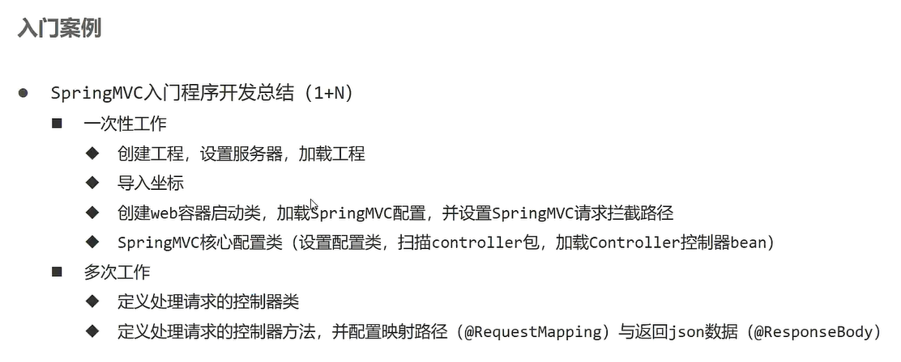

### 快速入门的流程分析
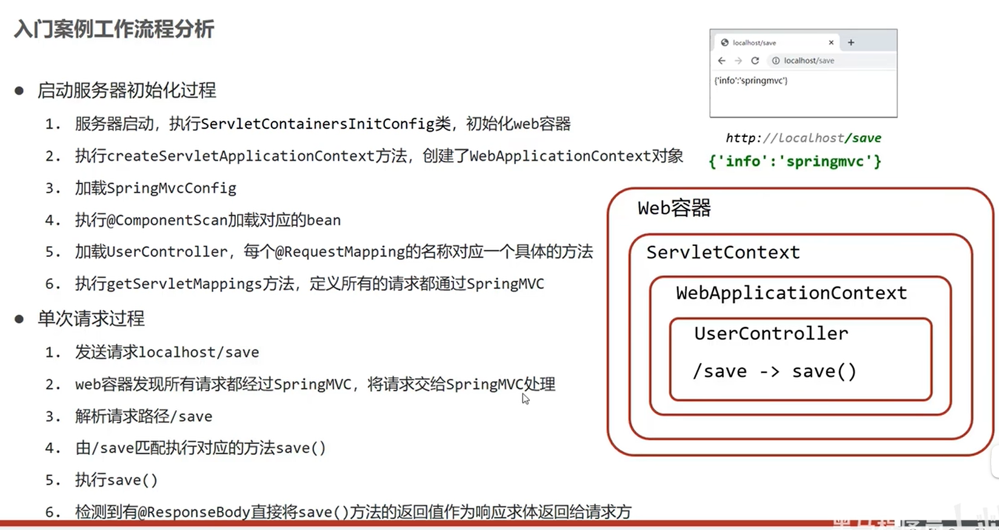

## Bean的管理
SpringMVC是 Spring的子技术，它们两个**都有Bean管理**，所以要避免 Spring的Bean加载 MVC管理的 Bean；

注解可以定义过滤的配置，具体解释一下，因为使用没有那么傻瓜式

`@ComponetScan`里面可以传入多个值，有一个就是 **排除过滤器的配置**，类型为 `@ComponetScan.Filter`， 指定过滤的类型和规则即可，贴一个代码就可以理解：
```java
@Configuration
//@ComponentScan("com.runninginsilence.controller")
@ComponentScan(value = "com", excludeFilters = @ComponentScan.Filter(
        // 表示过滤注解类型
        type = FilterType.ANNOTATION,
        // 结合上一个：什么注解？
        classes = Controller.class
))
...
```

**并且注意！这里很有可能忽略！**
标注了 `@Configuration`的类也会被其他的扫描到，并 **一并加载里面的bean**，所以过滤的**排查要做的彻底一点**

同时加载 Spring容器的那个对象也可以简化，**简化为只需要输入类名即可**。这里不写，因为是简化操作。

## 基于SSM的Web知识回顾：请求
### 请求路径的管理
就是 Request的来源；因为每个 Controller的功能可能相似，要用同一个路径名方便管理，但是同名又会冲突，所以: 
**RequestMapping也可以表示在 Controller上表示路径前缀**

### GET和POST请求发送参数
在原生的 Servlet里面读取参数特别麻烦， MVC直接通过**函数的形参**来解决这个问题。
没有必要写示例代码

**注意**使用POST请求的时候， 测试工具的 Request的头部**要设置数据类型**

而且传输中文数据的时候仍然有**乱码的问题**存在...
记录一个小疑惑：为什么**这里是用过滤器**做的，而我学普通 Web的确实直接设置编码？

不过需要**用过滤器解决这个问题的话**，需要在**初始化容器**的代码位置 初始化过滤器；
直接贴代码和注释笔记：
```java
@Override
    protected Filter[] getServletFilters() {
        // MVC默认帮你实现一些 常见的过滤器，直接使用他们
        CharacterEncodingFilter encodingFilter = new CharacterEncodingFilter();
        encodingFilter.setEncoding("UTF-8");
        return new Filter[]{encodingFilter};
    }
```
总结就是：Spring-Web中提供了专门的字符过滤器；

### SSM的参数传递
对于 后端而言，如果不是json的话，一般有**五种类型的参数形式**
1. 普通类型（包括String）
1. POJO
1. 内部包含嵌套POJO的对象
1. 数组
1. 集合

框架一般默认可以帮你实现**名称匹配的类型自动装配**
如果**名称不一样**，需要注解`@RequestParams`来绑定；
**再次强调**：这个注解用来处理**非json**数据的请求；
并且如果你要实现自动装配对象（直接在参数列表里面写成员的kv），**不要加 这个注解，会告诉你类型不匹配**，道理~~应该是加上的话会把它当成真的参数并在形参列表中找类型，而不是自动装配了。


POJO可以实现**根据名字自动装配**，嵌套的话前端传参的时候要**用点连缀**, 比如 addr.position

集合的话和数组不一样，需要使用注解 `@RequestParams`，虽然我不懂原理...

### 传递JSON数据（这是个重要的内容，不过内容确实有点少）
现在流行前后端分离，所以**使用JSON数据传输数据更为流行**
MVC默认不带处理 JSON的库，所以需要手动导入：
```xml
<!-- 用于 JSON数据绑定的库 -->
        <dependency>
            <groupId>com.fasterxml.jackson.core</groupId>
            <artifactId>jackson-databind</artifactId>
            <version>2.9.0</version>
        </dependency>
```

**注意！**虽然 MVC不带这个库，但是 Boot带！如果再次导入这个包会导致**Tomcat 服务器无法启动**

从这里我知道一个事情： 不能完全等同 mvc和boot，并非直接简化；小心半天运行不了！

MVC默认不能处理 JSON数据，但是可以通过开启一个注解完成这个功能：
`@EnableWebMvc` 可以开启一系列增强 mvc的功能，这里暂时只是开启json
然后在 Controller的形参前面加入：
`@RequestBody` 注意区分和前面的 `@RequestParams`，这次表示数据在**请求体里面**

还可以传递日期型的参数，不过暂时就不写
wait editing...

## 基于SSM的Web知识回顾：响应（可能是我一直想知道的内容）
在后端处理完数据后，就考虑往前端发送数据了，一般两种：
- 相应页面；
- 异步请求的话就是返回数据了。

之前我一直不知道 Controller怎么响应对应对应的静态资源，现在我知道了：
**返回的 String就是静态资源的路径**，这是mvc处理的；
如果加 `@ResponseBody` 才是返回响应体；
这个注解的作用是：
控制器会**自动把返回值的值解析成资源路径**，而这个注解就是设置成不要解析。

这是怎么会是呢？Servlet是底层原理；
MVC是框架，他在**底层自动会解析返回值**，通过 接口`HttpMessageConverter`来转换成 Web相应的信息；
一个常见的实现类就是： Jackson这个库的实现类：他可以实现 POJO 与 JSON的互相转换。

## RESTful风格
RESTful风格是一种 用Http原生请求类型**直接表示对资源的访问行为**的开发风格。

个人认为他有三种好处：
1. 安全，隐藏细节
2. 简化url路径，更加短
3. 格式风格统一，好看

RESTful风格本质就是 前端像后端提交请求的时候直接标明自己是CRUD的哪一种。

### 入门案例
具体要在MVC实现这种风格：
原本通过 注解 `@RequestMapping`指定URLPattern，现在需要显示在里面指定 请求的 method；名称要规范（但是具体我不管）；参数的提交摈弃原先的 K-V的那种，直接换成Val，隐藏key的细节。

参数提交的话，在函数的形参前面加上 `@PathVariable`，表示这是路径参数；然后在路径后面添加占位符（一堆花括号），与形参绑定。
大概就是这么一个流程。
**所以再强调一次，这种限定的提交方式也更加安全**

**三种形参注解的区别**
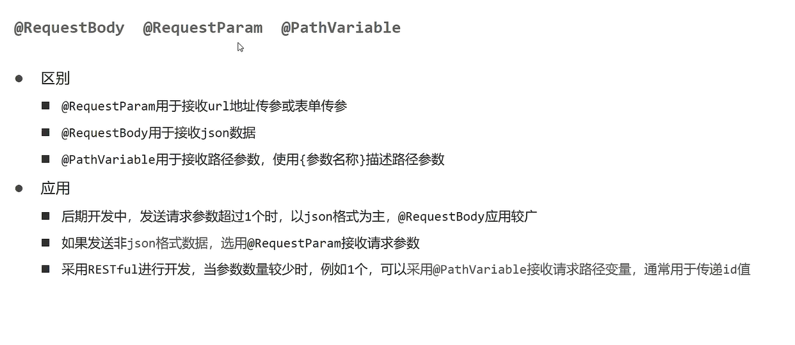

不过主要是json的应用范围更广。

### 快速开发
针对入门案例的简化开发：主要是**注解的简化和重复路径的简化**
入门案例的繁琐主要体现在：
- 尽管是对同一个路径编写代码，但是每个方法上都要写相同的路径；
- 大量的 `@ResponseBody` 注解

这两个问题可以通过 **直接在控制器类上**加注解解决。

此外，上面这两个注解简化成了：`@RestController`，表示两个注解的合体
针对请求方式，也简化成了 类似 `@PostMapping`这样的注解

### 还是前后端数据传输的问题
**还是再提醒一下**，和上面的知识无关：传递JSON数据的时候记得形参那里写 `@RequestBody`的注解

一个小知识：**还是关于静态资源访问的问题**：
Tomcat默认是直接放在webapp文件夹里面的静态资源就可以直接访问的；
但是如果搭配mvc的话直接访问会报错：没有映射；这是因为静态资源被MVC拦截走，而在mvc里面静态资源也是要做映射的，这也能解释为什么 SpringBoot的应用里面它的静态资源放那么深也能直接访问到，是需要配置的。

MVC要解决这个问题的话：
一个是笨方法，不让mvc管理，放过去，也就是那个初始化mvc的类里面不加全路径单斜杠；
提示一下那个让 tomcat管理spring的类是 继承的 `abstract class AbstractDispatcherServletInitializer`
第二个就是要学的方法：通过扩展 SpringMVC的支持类，来对对应的资源路径实施“放行操作”
这里贴代码和注释：
```java

// 通过一个功能类实施放行，尽管，仍然是MVC在对其进行管理
@Component
public class SpringMVCSupport extends WebMvcConfigurationSupport {
    // 重写这个方法，可以对对应的资源重新映射到指定的文件夹中去
    @Override
    protected void addResourceHandlers(ResourceHandlerRegistry registry) {
        // 这里的意思就是如果url里面的访问路径是 /pages/*这个urlPattern这个规则的话，就去访问资源根下面的这个目录
        registry.addResourceHandler("/pages/*").addResourceLocations("/pages");
        // 有多个需求就要写多个这个语句
    }
}
```

感觉非常麻烦，如果是在 Boot里面的话不知道有没有方法可以简化这个操作。

## 表现层的数据封装
结论：用来解决我在别人项目里面看不懂 VO文件夹的问题
VO就是 ValueObject（模型类）, 约定好后端向前端发送数据的时候**统一好数据格式**；
本质是前后端分离；

统一数据返回的结果类一般定义成 Result; 
```java
public class Result {
    private Object data;
    private Integer code;
    private String msg;
}
```

这就是一个最基本的**用于向前端返回的模型类**；

约定 code状态码 1代表成功，0代表失败；

总之是**又加了一层封装**，能理解这个应该就没问题。

## 统一异常处理
Web的服务端出异常的时候前端是没办法处理的；
所以在后端一般会进行统一的异常处理：

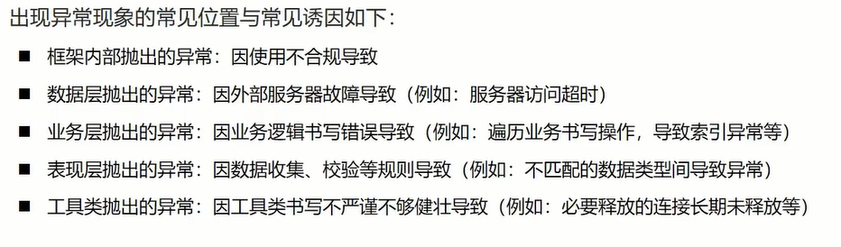

那么关于对异常的处理有两个：
在哪处理，怎么处理；

Java的异常一般是：
- 通过在 try catch 直接在代码里面进行处理；
- 通过throw将异常向上传递给函数的调用者去处理（一般俗称为向上抛异常）

异常的类型太多，使用 第一个肯定不行；用第二个，那么就在几乎最顶层的表现层（Controller）里面去处理

怎么处理呢？单独一个异常不可能单独一个方法，因为处理异常的逻辑大多数相同 -> AOP技术；

MVC有**现成的注解直接给你使用**：应该就是AOP技术；
只需要两步即可：一是给你的通知类加上`@RestControllerAdvice`, 这个rest是指**rest风格**；第二步就是在里面具体处理的函数那里加`@@ExceptionHandler(Exception.class)`
```java
@RestControllerAdvice
public class ProjectExceptionAdvice {
    @ExceptionHandler(Exception.class)
    public void catchEx (Exception exception) {
        System.out.println("我调用了异常的方法");
    }
}
```

异常处理器的命名一般是 `xxxAdvice` 或者`xxxHa`

### 具体的异常处理方案
其实就两步：
1. 统一异常的类型，方便进行统一处理；
1. 包装运行中可能出现的各种异常，并进行对应的处理

处理的话，可以用AOP进行简化开发

具体的细节到时候去看别人的项目去了解吧
**生鲜项目**那里统一了解；

## SpringMVC的拦截器
直接说结论： 拦截器和过滤器的**定位很类似**，他们的区别是：
前者只属于mvc， 而后者属于servlet，两者的技术层次不同；

拦截器的功能：
1. 在 Controller执行前后可以做**统一的代码的执行**；
1. 第二就是可以**阻止对原始方法的执行**：这也是它叫做拦截器的原因；

# 【临时】Vue简单入门
补充一个 vue的快速入门：
我有去看专门讲解vue的视频，这里稍微写一下快速入门的东西
Vue 是一个简化 dom操作的js框架，让开发者把重点放在**数据本身**上去。
通过 MVVM 的思想，Vue可以实现**模型和视图的双向绑定**。
MVVM在安卓里面已经有一些基本的了解，不在这里详细解释。

## 快速入门
三步，不怎么详细，虽然我已经忘光了，但是我之前是已经做过一遍了的；这里的快速入门案例其实是实现了一个最基本的 双向绑定数据的展示而已。

大致步骤：
1. vue.js
2. vue的实例对象：el表示vue实例管理的范围，用css选择器标识；data表示vue管理的数据变量；
3. 在html中使用vue模板

这里不写具体命令了，如果有需要我再直接去查；这里主要是让我回忆起 vue的基本语法。

## Vue实例的生命周期
这里我vue的笔记还没写，所以记这里一个快速入门：
vue的生命周期的设计很**类似安卓**，安卓也有类似于（可能就是）钩子函数的回调机制；

这个图超详细我趣！
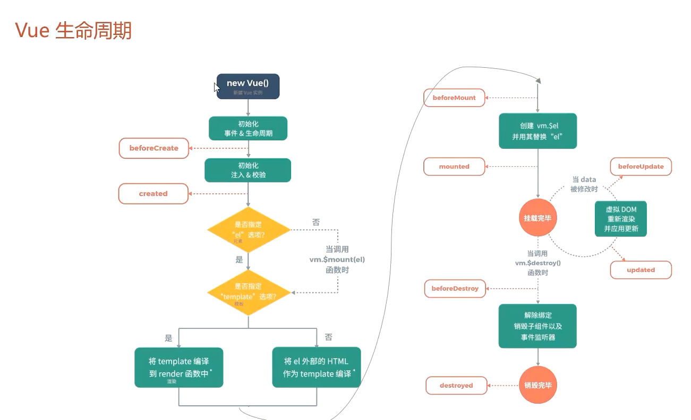

对于后端的程序员来说，重要的是这个 mounted的时刻：
**它代表Vue初始化成功，html渲染成功**
它的生命周期方法里面就可以**发送异步请求以及加载数据**

强调一次，这是**Vue实例的生命周期**，所以可以看到mounted方法实际上和el平级；
在里面写业务逻辑。

#【临时】Element：常用的前端UI组件
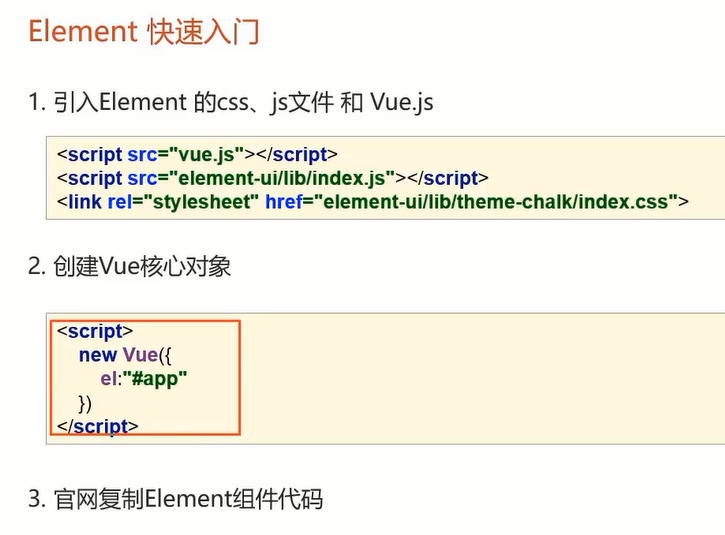  

# SSM整合
这里就是 整个web的核心了。我看黑马应该是实际快速的开发一个SSM应用出来；
所以下面的内容应该是：快速入门：快捷的创建一个可以启动的SSM项目
## 环境与架构的搭建
wait updating...
这里重新回顾一下建立一个SSM项目的过程；是一些旧知识，重新进行整理方便查阅：
不过这个过程是在是有太多的东西要回顾了，而且有很多部分是我以前已经写过的东西，所以我现在暂时先不写； **实际的代码我写在项目里面了**
1. 创建maven的web工程，对应的文件最好是完整的；
2. 在maven里面导入所有需要的web的坐标；
3. 配置Spring的配置类：扫描bean
4. MyBatis的配置类：定义jdbc（数据源）和 MyBatis的两个配置类（一个管工厂一个管sql映射）获取，并让它由spring管理
5. mvc和spring整合，tomcat整合以及springmvc的配置类，要开启增强和扫描Controller的包；

重新回顾一下 MyBatis的别名机制：给某个包添加别名机制后，内部所有的包可以省略全类名，以及类名可以不用区分大小写；

总之这个新建一个项目的东西巨多，东西也巨杂，所以这里是先写个大概，后面的东西应该也只是过一遍
### 功能模块新建
就是表，三层架构这些东西把它搭建好，也是前面的知识：表的设计，spring的自动装配，Controller的注解功能等等...

### 接口测试
因为是快速开发，前面只有一个增删改查的功能；这里就是做接口测试的；
一般是对两个地方做测试；service的业务功能做**代码测试**；Controller的视图表现做 postman的测试；
提一嘴正规的测试需要**要在测试方法里面做断言测试**

**提一嘴**后面的内容估计就都是 SSM过程的具体开发过程了，那么**应该是可以有需求的时候再去看的**


# Maven高级
wait edit...

# SpringBoot
现在做Web项目就都是 直接使用 Boot进行快速开发了；
Spring是用来解决 JavaEE的痛点的， Boot是用来解决 Spring痛点的。

**按照黑马的说法**，学习 boot就是：
1. 掌握SpringBoot框架的**开发步骤**；
1. 可以**熟练的修改服务器的配置**
1. 基于 SpringBoot**完成SSM项目的开发**。
## 快速入门
SpringBoot 旨在简化 Spring应用的开发。
创建 Spring程序最麻烦的就是 坐标和依赖配置的问题（其实原生EE也一样）
对于MVC应用，它通过**maven提供的parent继承的功能**继承配置，还有一个**启动容器用于集成启动**，这就是他可以快速开发的原理：牺牲自由性，通过**约定大于配置**的思想实现快速开发。
一般而言，如果想快速创建一个boot程序，只需要用 Spring Boot Initializr 建立一个项目，然后编写一个控制器即可运行。

SpringBoot它真的很快。
首先boot程序可以直接打成jar包直接运行；

贴一个：路径的问题
默认的boot项目启动都是：
`http://localhost:8080`

如果你想让你的项目像以前的tomcat一样带一个项目名字的话：
在 配置文件里面配置一个：
```yaml
servlet:
    context-path: /FromZerotoExpert
```


## 快速开发的秘诀
起步依赖： Boot提供最佳的版本实践，直接使用，无需再次指定版本；
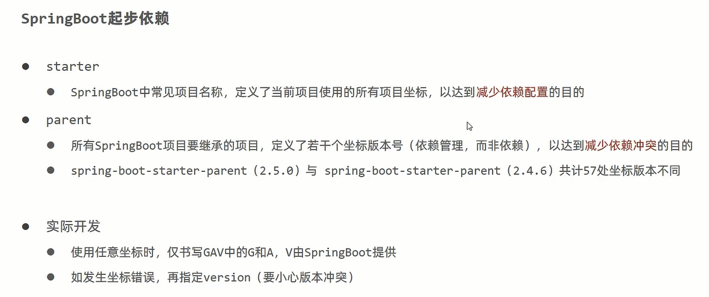

**引导类**
（未证实）引导类会根据起步依赖的不同而**执行不同的启动逻辑**，比如你可以替换 Tomcat服务器为 Jetty服务器；
这里我没仔细看，所以贴一张图片在这里
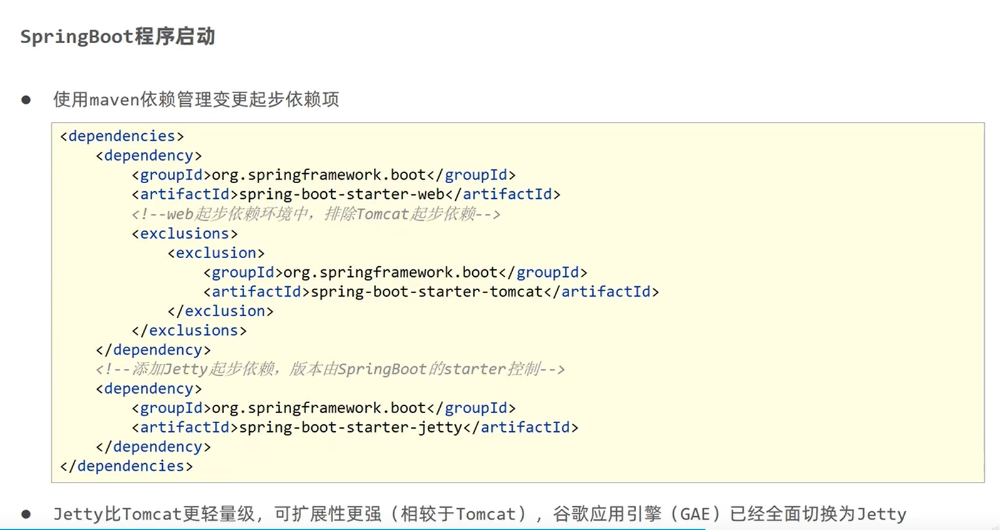

## 配置文件
这里应该和前面内容的关系不大
boot用简单的配置文件就可以进行配置，摆脱了恶心的xml
支持三种： properties, yml, yaml；三种都是通过简单的 K-V 完成配置；**好像是推荐写yml**
配置文件的命名统一为: application
如果三种配置文件同时存在，那么生效的顺序依次是： properties, yml, yaml

### 现在的主流：YAML
应该是参考了 Python的风格，重阅读轻格式。不过这个轻格式可**不是写起来轻松的意思**，是格式对于阅读而言不繁琐的意思。因为没有那么多标签控制了所以对于空格和缩进的要求更加严格。
和 Python以及Markdown的风格思想比较接近。
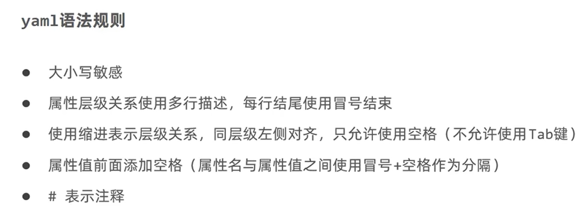

### 读取YAML数据的三种方式
一般来说有三种方式：
1. 直接通过`@Value`注解加占位符来读取；
1. 将整个yaml文件加载成一个对象 `Environment`，然后通过`getProperty()`来读取值；这种框架里面用的多；
1. 自定义一个类，通过注解`@ConfigurationProperties` 加载配置并赋给同名的变量，然后通过自动装配得到实例对象，此时就可以拿到数据了。这种格式用来做**配置对象特别方便**，比如MyBatis的配置

### 配置文件中配置多个生产环境
开发中**不同的生产环境一般使用不同的配置文件**...
配置文件里面可以做不同的区分：
yaml中：
1. 通过`---` 可以**分割不同的生产环境**
1. 价格profile就可以指定该环境的名称

还有**配置文件启动的问题**和**配置文件分类的问题**
具体不写了，需要的时候再来看就是

## SpringBoot整合相关
### JUnit
对比 Spring的使用，boot的对juint的整合ez了许多，开箱即用，本质上也是以前的旧知识。
基于 约定大于配置。一般不随便乱改就不会出问题。

### SSM整合
重要。我学了这么久的基础知识就是为了这个。
回顾：
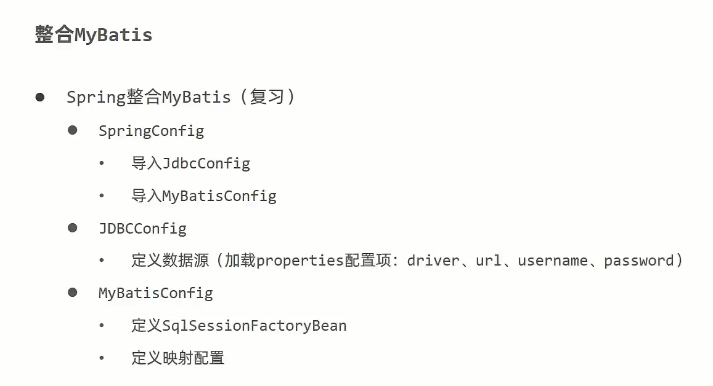

SpringBoot省了很多的东西。

使用 Initializr的时候勾选MyBatis和mysql就可以了。

重新看了一遍视频，Boot整合 MyBatis 确实挺简单。
但是有许多小坑容易踩。。。
如果有问题的话再去看黑马的最后一节的视频

为了怕我忘记，写一下由 SSM项目改造成 boot项目的步骤：
1. pom文件需要适当修改
1. MyBatis配置类全部删除，对应的接口上面采用注解开发，加上`@Mapper` 注解;
1. 采用yml文件配置数据信息

### 关于boot静态资源（主要是页面）
原本tomcat类的那种html文件是放在webapp里面的；
现在boot约定： 静态资源放在 res下面的 static里面，模板文件（前后端分离了为什么还有模板）放在 templates目录下

如果要实现主页功能的话，可以通过 js代码设置自动跳转
```javascript
document.location.href = "";
```

顺便我自己做的时候，**静态资源没有办法热部署**，应该是有办法解决的。


# 前端向后端异步提交数据


## 简历没办法，学历也没办法，至少先投一投试试
鹰角没有给我机会，那我也没办法
只能先找公司看看可不可以狗住了

java就是那些基础的部分，可以把SpringBoot写上去了
熟悉计算机网络和操作系统的
了解一部分innodb的底层原理


# 字节朝夕光年的投递，试试
可以熟练使用Java语言和Go语言，对两门语言的底层原理均有一定的了解；
可以熟练使用MySQL，对innodb引擎的底层有一定的了解；
熟悉Linux的基本指令，熟悉计算机网络的基础知识和常见的网络协议，有搭建游戏服务器的经验；
了解基本的数据结构和算法。

热爱游戏，Steam游戏玩家。

# 米哈游的试一试吗？
Java和Go
和字节的大概一样

项目经历的话就写：


一个golang的开发工程师，已收藏
基本都知道

了解gin和gorm框架，开发过小型项目
