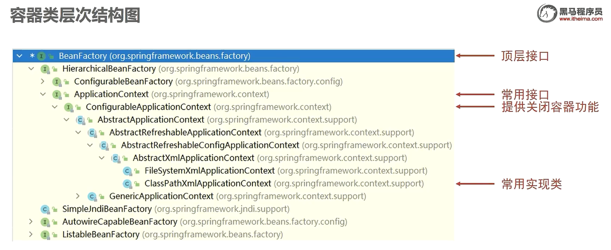

# 主流Spring技术学习 黑马
看的黑马的视频
# Spring的基本介绍
这部分的内容应该可以当做一个索引或者说目录来用：
1. Spring的架构
1. Spring的核心容器：IOC和DI
## Spring架构


Spring的核心思想就是IOC和AOP，这两个重点学习。
解释一下图中数据集成的意思：Spring自身操作数据库的能力尚可，并且它**对其他框架或者组件的整合也非常的优秀**。这就是集成的意思。


## 核心容器
### 传统 JavaEE的问题
IOC的核心理念是：接口的实现是一种硬编码，导致代码的耦合度高；但是不写实现的话程序优惠无法运行；

所以核心在于实例对象的来源上 -> 因此提出改进思路：对象的实例化**不再由程序员通过代码来进行控制**，而是转由 程序(Spring)来进行提供。
肯定用到了**反射**不用想。

相比于 重新编译的代价，反射增加的性能损耗几乎可以不计。

### IOC
直接贴个图片在这里好。


IOC是**解耦的实现**，DI是**对IOC的补全**。

### IOC的实际案例
大概就是这么一个流程：
1. 定义需要由Spring管理的类
1. IOC管理你的类
1. 在业务中获取IOC容器的实例
1. 通过IOC容器实例获得实例类

那么首先导包：
```xml
<!-- pom.xml中 -->
<dependency>
            <groupId>org.springframework</groupId>
            <artifactId>spring-context</artifactId>
            <version>5.2.15.RELEASE</version>
        </dependency>
```

在配置文件里面通过 bean标签配置类，直接写个实例即可。
重要的就两个属性：id表示到时候获取时候的名字，class表示类路径。

然后在代码里面过一下代码就行
```java
public class App {
    public static void main(String[] args) {
        ApplicationContext applicationContext = new ClassPathXmlApplicationContext("applicationContext.xml");
        User user = (User) applicationContext.getBean("user");
        System.out.println(user);
    }
}
```

正式的业务没有这么写的，因为这是个入门案例

### DI的快速入门（setter的引用类型注入）
两个类之间产生依赖关系（**最直接的就是一个实例中包含包含另一个实例的引用**），使用DI在代码方面进行解耦合。

在上一个 bean的标签里面 添加一个`property的标签`
里面的属性分别是：name 属性名，需要写类定义的属性（注意**区分bean 和 使用代码定义成的类**）；ref 绑定bean，值是 bean的id

## 关于Bean
Bean还可以两(?)个额外的基础配置：
- 设置别名
- 控制单例多例

通过 标签属性即可控制；name 和 scope，简单不说了

### Bean的实例化方式
三种，重要的是**广泛应用的工厂模式**
第一种，就是默认的，通过**反射获取构造器的构造器**； 具体后面应该细嗦
第二种，静态工厂配置，添加一个`factory-method`属性（里面写）让 spring知道这是一个 静态工厂；
第三种，实例工厂配置，和第二种不一样的就是需要先实例化工厂才能获取产品的实例：那么先用普通的bean配置工厂，然后使用额外使用`factory-bean`属性指定工厂bean获取对象。

第三种可以优化：
优化成一个步骤：
Spring提供一个接口，这样实现接口就可以**自动识别成一个工厂**，配置时就可以使用默认配置来简化配置文件的书写了。

接口本身比较简单，自己去看

### 生命周期
先贴图


可以配置生命周期的方法：
两种：一个在配置里面写，第二个是**代码实现接口**（相当于符合spring的规范），这样spring就会**有一个默认的处理机制**
比较简单，需要的时候去查


### DI具体
就是给bean的**成员变量赋值**。

setter和构造器两种；
setter：
property标签里面 value表示基本类型， ref加bean的标识 表示引用类型。

构造器：
换了个标签的名字： constructor-arg。这个就是所谓的标准写法；

不过这个标准方式要求**配置和代码的名称要一致**，所以耦合度较高；
有另外一种，根据类型，这种就要求**顺序一定**了。通过type属性确定；这种解决了**形参名称耦合的问题**

另外还有一种**使用参数位置的那种**，使用 index属性确定；

---
以上的方式都各有各的使用方式；那么该怎么选择？


我一直在想**多个构造器**的情况该怎么办...
以后应该可以**直接使用注解**，所以前面的xml的配置可以**适当了解**即可。

### DI自动装配（我叫自动DI，或者自动装配）
DI需要在bean里面去手动配置，不方便，所以 提供了一个**自动装配**的功能

添加属性`autowire`即可。
不过好像注入的属性**也需要用 IOC管理**


### DI集合注入
为什么不能一起讲完。。。
针对这几类的注入：数组、List、Set、Map、Properties

通过**子标签**来完成

具体的操作去查，现在不看🙈

### 一个小案例
第三方的包的实例使用 容器管理的时候，**推荐使用setter注入**。就酱。

### Spring加载 Properties的配置
呃讲了一个 Spring 名称空间的问题，虽然我也不知道为什么：到时候直接去看；
小知识：怎么给 Spring添加新的命名空间：需要的时候可以直接去看视频；


提了一个小知识点：上面的`location`写`classpath:*.properties`
意思是**只读当前项目的所有配置文件**。


## 容器本身
最后系统的学习一下容器本身。
容器加载和bean的获取不说。



顶层接口的容器的**所有bean都是延迟加载**

## 注解开发
主流方式。

Spring 2.5的时候好像是一个半注解的方式，如果有需要直接看视频；

`@Componet`就能标记一个类为 Bean。他还有其他的别名：为了方便**看懂分层**；

介绍纯注解开发的方式：
最大的改变：配置文件的xml已经**完全被 Java类代替；**
注解`@Configuration`配置；
注解`@ComponetScan`指定 Bean的扫描路径；

使用 Annotation...来加载配置类；

总结一下的话把**原来标签的属性名都换成注解了**

生命周期方法也改成 注解了，在方法上面加上即可。

注入也一样了，不过好像**没有 setter注入和构造器注入了**
全部使用注入装配，**底层原理是 暴力反射**
在成员变量上写上`@Autowired`注解即可。
默认不写就是**按类型装配**
如果有多个实现类就使用注解`@Qualifier`来指定名称。

`@Value`对基本类型进行注入
使用它的好处在于**可以使用 Spring的配置占位符**

`@PropertiesSource`注解加载配置文件，但是**不再允许使用通配符**

### 第三方Bean
怎么一管理三方bean就又回到最原始的代码方面去了？？？
不过还是比最开始的那种强，这个主要是**自己重写第三方组件的实例获取方式**
然后 添加`@Bean`注解

介绍了加载配置类的方法： 使用`@Import`注解

第三方 bean也有DI的需求，怎么搞？
简单类型：通过**配置类的成员变量**打`@Value`注解，简单粗暴

引用类型：直接在函数的形参添加， Spring会扫描为自动装配（按类型扫描）；

## Spring 整合 MyBatis
### 回顾 MyBatis的快速入门
首先回顾 MyBatis的使用过程：
1. 配置文件
1. 映射文件（可以通过注解代替）
1. 模板代码： SqlSessionFactory
1. 执行业务

### 具体步骤（采用注解开发）
这是一个具体并且模块化的动作....
说实话我记得我原本是要做web来着，现在却变成一个劲的学框架了...
以上是吐槽。

大概步骤：
1. **整合所需要的**坐标
1. Spring的Bean管理 SQLSessionFactory以及进行对应的 DI，并提供**对应的配置信息**
1. 核心是 MyBatis的两个配置类： (待补充)

## 整合 JUnit
因为我之前其实没有怎么学过 JUnit，而我又是投了测试的岗位，所以这里的笔记**会写得稍微详细一点**

导包的话一样的： JUnit本身的，以及 Spring 整合 JUnit的包；
```xml
        <!-- JUnit 的坐标 -->
        <dependency>
            <groupId>junit</groupId>
            <artifactId>junit</artifactId>
            <version>4.12</version>
            <scope>test</scope>
        </dependency>
        
        <!-- Spring 整合 JUnit 的坐标 -->
        <dependency>
            <groupId>org.springframework</groupId>
            <artifactId>spring-test</artifactId>
            <version>5.2.10.RELEASE</version>
        </dependency>
```

然后在**测试包里面添加测试方法**，这个我以前没做过，都是直接用的注解；

配置`@RunWith(SpringJUnit4ClassRunner.class)`注解，表示这是测试类；
配置 Spring的配置类：`@ContextConfiguration(classes = SpringConfig.class)`

剩下完成自动装配，然后就是我熟悉的部分了...

一句话解释：要使用**Spring专用的类加载器**


# AOP
一种**编程思想**。
面向切面编程 **指导开发者如何组织程序的结构**
最大的特点（或者说作用）： 不改动原有的代码， 做功能增强
说实话第一次看的的时候挺震撼...

## AOP的核心概念
我要把 AOP 的作用贴到这里： **不改动原有的代码， 做功能增强**
连接点：你AOP不是要增加功能吗？ 在哪些地方你**可以增加**，这些地方就叫连接点；
切入点：增强了之后，这些**已经被增强的方法**， 就叫切入点；
通知：需要添加的**新功能**就称之为通知
切面：一个通知与一个切入点对应之后，管**它们的绑定关系**叫切面
通知在代码中的本质是一个方法(Kotlin中函数是一等公民, 不知道这个会不会发生变化)，方法需要**依附于一个类**, 这个类叫做 通知类


# AOP快速入门
**注意!** 注解算源代码的一部分, 所以如果**配置类的东西 还是用 XML比较好**

大概的步骤是: 导包, 连接点, 通知类和通知定义, 切入点, 定义切面. 完成.

第一步: 导包: context包如果导入的话不再需要 aop, 两者有依赖关系; 只需要导入 ASpectJ的包
```xml
    <dependency>
            <groupId>org.aspectj</groupId>
            <artifactId>aspectjweaver</artifactId>
            <version>1.9.4</version>
        </dependency>
```

我在你已经知道 AOP核心概念的基础上来直接说这个代码的实现: 

第二步: 连接点: 
**Spring里面一般把 函数(方法)作为连接点**

第三步: 定义通知类:
好像现在 Spring框架可以直接定义 一个 aspect, 不过暂时不管

通知(公共方法)定义, 上面加上你需要执行时机注解:`@Componet` 和`@Aspect`;

第四步: 定义切入点
通过注解`@PointCut`定义一个**私有方法**, 里面有各种切入点定义的格式; 
比如 `@Pointcut("execution(void com.dao.UserDao.update())")`

第五步: 创造切面
第三步完善, 添加注解(应该是时机),需要把第四步定义的切入点作为注解的值;

并且 Spring的aop需要用 作为 Bean被 Spring 管理才行. 在Spring的配置类里面, 添加`@EnableAspectJAutoProxy` 注解, 表示开启注解配置的 aop


以上所有的内容, 整理成代码就是: 
通知类
```java
/**
 * AOP 通知
 */
@Repository
@Aspect
public class MyAdvice {
    // 定义切点: 指定执行哪个方法的时候进行 发送通知(应该是)
    @Pointcut("execution(void com.dao.UserDao.update())")
    private void pt(){}

    @Before("pt()")
    public void method () {
        System.out.println(System.currentTimeMillis());
    }
}

```
Spring的配置类: 
```java

```

这里弄出了一个莫名其妙的错误不知道怎么搞的


# SSM部分
首先说结论: SpringMVC是用来替换 Servlet复杂的开发流程的.


## 快速入门
坐标: Servlet 和 springwebmvc

```xml
        <!-- Servlet的坐标, 可能是因为 MVC 的底层就是 Servlet-->
        <dependency>
            <groupId>javax.servlet</groupId>
            <artifactId>javax.servlet-api</artifactId>
            <version>3.1.0</version>
            <scope>provided</scope>
        </dependency>
        <!-- SpringMVC 必备的坐标-->
        <dependency>
            <groupId>org.springframework</groupId>
            <artifactId>spring-webmvc</artifactId>
            <version>5.2.10.RELEASE</version>
        </dependency>
```

定义控制器: 
现在 Servlet 相当于有了一个新名字: Controller
细节

因为是 Spring技术, 当然需要定义 Spring的配置类;

**现在还没有SpringBoot**, 你的服务器依然是使用 Tomcat 启动的,**要让 Tomcat识别**,
到这里...