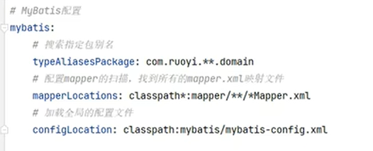
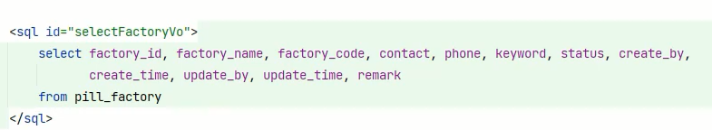
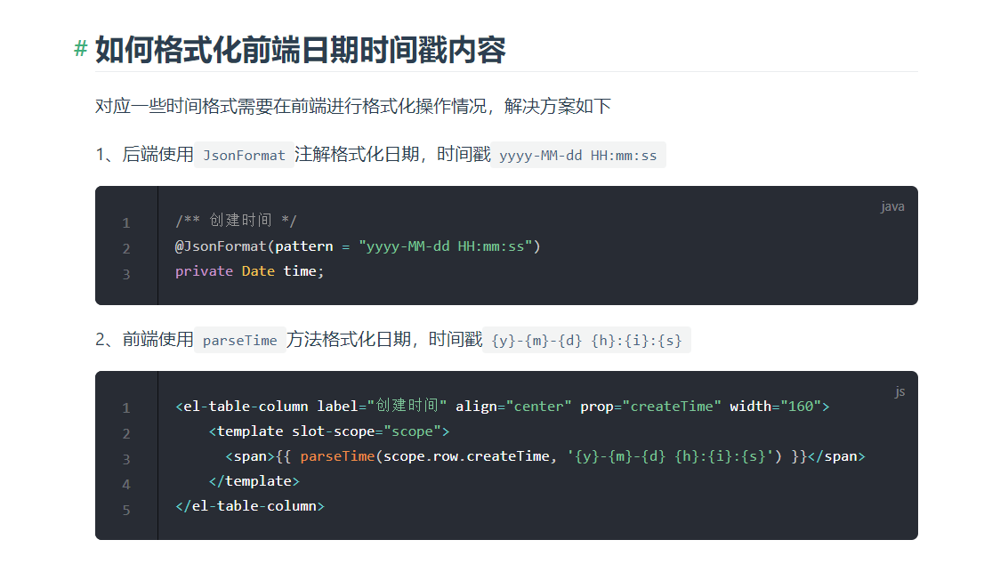
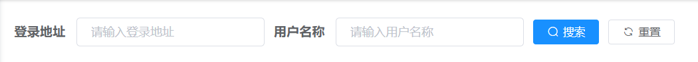

# 使用ruoyi若依进行快速开发
# 主要是通过搜索来使用。
两个表：quartz这个东西是用若依进行快速开发的。

似乎只要这个windows上面运行一个适用于win的redis的项目好像就差不多了。


不要在原有的若依的模块上面搭建内容，而是需要建立新的子模块。直接使用普通的maven项目就可以。

并且在ruoyi里面，它对mybatis做了默认配置，所有的实体需要在domain目录下，然后mapper也需要。


这个文件在admin那个模块里面。

然后因为分了模块的关系，所以，你的实体如果需要继承BaseEntity，需要通过maven的pom来引入一下。
这个 BaseEntity提供了一些公共的字段，例如创建时间之类的。

Java中常见的一个Serializerversion什么的就是序列化的版本号。

使用Mybatis进行开发的时候可以直接参考AI来大幅提高生产力。


分析一下以下代码的含义


```xml
<sql id="selectFactoryVo">
    select factory_id, factory_name
    from pill_factory
</sql>
```

以上代码段是 MyBatis 中定义 SQL 片段的语法，使用 <sql> 标签来定义一个查询工厂信息的 SQL 片段，id 为 selectFactoryVo。

SQL 片段中包含了一个简单的 SELECT 语句，用于查询 pill_factory 表中的工厂编号和工厂名称。在 MyBatis 中，我们可以通过 <include> 标签将该 SQL 片段引入到其他 XML 文件中，并在其中使用。

例如，在 XML 映射文件中可以这样使用：

```xml
<select id="getFactoryList" resultMap="factoryResultMap">
    <include refid="selectFactoryVo"/>
    where factory_id = #{factoryId}
</select>
```
在以上代码中，我们使用select标签定义了一个 SQL 查询语句，其中使用了 id 属性指定查询语句的 ID，resultMap 属性指定了结果集映射规则。同时，我们使用 <include> 标签引入了之前定义的 SQL 片段，然后在 SQL 语句中添加了一个 WHERE 子句进行条件过滤。

因此，当调用 getFactoryList 方法时，MyBatis 会将 SQL 片段和方法中定义的查询条件合并为一个完整的 SQL 语句，并发送到数据库执行。最终，返回查询结果并使用 resultMap 进行结果映射，得到 Java 对象。

类似于dll。可以和其他的sql来进行组合。

呃简单的来说mybatis的这种写法也类似于一种模板引擎。
我就不浪费时间来重点看这个玩意了。

# 前端部分
先是制造组件的问题；如果只是普通的那种列表的话，我就只需要 **直接拷贝ruoyi的样式即可。一般在component文件夹里面。**

dialog就是ele里面的对话框。


## 怎么搞好前端和后端的时间问题


主要是文档中可以直接搜索时间来怎么处理；

在mybatis里面进行时间的比较的时候，需要注意：
使用 `SELECT DATE_FORMAT('2023-06-01 09:30:00', '%Y-%m-%d %H:%i:%s');`

然后在比较时间的时候，要使用
在比较日期类型时应该使用`>=、<=或BETWEEN ... AND ...`等语法。

然后前端的组件那里，反正代码是这个样子：
```vue
<!--      这里来选择时间-->
<!--      他们的这些时间格式好多坑-->
      <el-form-item label="选择时间">
        <el-date-picker
          v-model="dateRange"
          type="datetimerange"
          range-separator="-"
          start-placeholder="开始时间"
          end-placeholder="结束时间"
          value-format="yyyy-MM-dd HH:mm:ss"
        ></el-date-picker>
```


如果要在右侧的地方新加一个菜单，可以直接实现新增路由。
然后可以往若依里面添加自定义的图标。
只需要放到目录 `assets/icons`里面；
需要图标直接去阿里巴巴矢量库里面找。
然后在前端就可以找到那个图标了。


菜单操作的那一部分，就是如果 **已经分配了权限的情况下**，就不可以直接删除菜单了。小要点。


添加菜单的用法还是很简单的。涉及到一部分权限管理的内容，这里的话不知道应该怎么说。暂时可以不用管权限相关的内容。


ruoyi拥有生成代码的功能，以此拥有基础的CRUD。但是基本上不可能符合你的需求的。
所以还是需要有基础知识，这样才可以进行改进。或者说改动。


重新看了一个视频，这种视频才是我需要的，才是真正对人们有价值的。

然后主要是vue结合ECharts的方式。
首先要因为vue是数据驱动渲染，而ECharts每次重新渲染表格的时候都是需要使用self.setOptions()这个方法的，所以不能这样做。
不过有结合vue和ECharts的封装。
安装之后就可以使用了。

主要是ECharts的option的数据来源于vue的响应式数据，至少在vue2中需要使用到响应类型。

然后通过定时器和设置random函数可以模拟一个实时人流量变化的效果。

这个教程真心不错，实操、demo、讲解都真心不错。

若依因为开箱即用的特性，我在main.js里面的代码出现错误的时候，并不知道他出现了错误。


在ruoyi里面还有Security相关的注解：
表现在Controller里面就是如果没有权限，便不能访问指定的Controller。

搭载了日志框架，注解应该是 `@Log`，ruoyi里面进行增删改的时候会记录日志。

具体讲解怎么编写一个Controller的代码在 `05:33`。

写一个Controller其实要花费不少的时间。
不过幸好他有自动生成的相关的功能。

# 后端自动生成代码
“给他一个数据库表，他就可以给你生成所有的前后端代码，它就是著名的若依框架，若将军。”
在generator里面可以修改生成的代码的配置。

# 前端的自动生成只能生成那种列表的页面
那就多生成几个学生的那种页面之类的就差不多了。


工作室表，我使用ai建立的建表语句。
```sql
CREATE TABLE studio (
studio_id bigint(20) NOT NULL AUTO_INCREMENT COMMENT '工作室ID',
studio_name varchar(50) NOT NULL COMMENT '工作室名称',
leader varchar(20) NOT NULL COMMENT '负责人姓名',
location varchar(100) NOT NULL COMMENT '工作室所在地',
status char(1) NOT NULL COMMENT '状态（0正常 1停用）',
-- common fields
create_by varchar(64) DEFAULT '' COMMENT '创建者',
create_time datetime DEFAULT NULL COMMENT '创建时间',
update_by varchar(64) DEFAULT '' COMMENT '更新者',
update_time datetime DEFAULT NULL COMMENT '更新时间',
remark varchar(500) DEFAULT NULL COMMENT '备注',
PRIMARY KEY (studio_id)
) ENGINE=InnoDB AUTO_INCREMENT=1 DEFAULT CHARSET=utf8 COMMENT='工作室信息表';
```


关于我对前端主页的设想：


elementui中的基础布局
栅格布局
通过指定span属性就可以分配几个基本单位的空间。就是这个意思。
`<el-col :span="24">`就是全部占满的意思


在指定菜单里面的路由的时候，似乎只有设置路由路径（反正是左边那个）才能正确的指到vue的组件。


vue2的 elementui的timepicker有一大堆的问题，不知道是什么情况。


# 添加Service来实现三个数据分析的需求，并调用对应的mapper。
工作室高峰期之类的可以直接通过解析一个时间段内的sql表格数据然后反馈到前端：
Input: 工作室编号
Proc：select timestamp from table_name order by desc count limit

Output： 前端输出一句话：当前工作室的人流量峰值是： max(data)， 低谷期同理。
需要处理一下噪声数据。


将数据分析的三个相关的方法定义在一个接口里面；
而impl的命名再是 `class DefaultImpl`


现在推测一个可能的404的原因：
我之前一股脑的把所有的模块包括Controller都复制到了自定义模块下，而若依的 **Controller很有可能是在admin模块下**，因此前端向后端发送请求时无法找到


# 若依里面的API的相关的流程
前端：
用户本质上是执行vue组件里面的methods；
为了解耦，会把像后台请求的api方法封装到url里面，格式例如：
```js
// 查询人流量记录详细
export function getRecord(recordId) {
  return request({
    url: '/peopleflow/record/' + recordId,
    method: 'get'
  })
}
```

总之参考的话就在api里面参考。

若依中，Controller在admin里面，Service在你的自定义模块里面。


Boot中，Service通常是一个接口，在使用 `@Autowired`的时候，如果只有一个impl，则可以自动注入；如果有多个实现，需要通过注解 `@Qualifier("具体哪个实现类")`

总之，人流量模块这里，我可以实现一个


# Spring Boot通用的测试
它在若依里面怎么做的我就怎么做；这样总行了吧。
针对Spring Boot的项目需要在Spring Boot项目里面进行测试（比如那个admin），普通的maven项目的话不太好适配。

在admin的src上右键新建一个test的目录，然后去pom里面添加boot的test相关的依赖；

这样一来你至少可以在test的java文件里面添加测试方法了。
Spring Boot这个等级的代码似乎像是在Controller的统一级别来测试代码，它会使用自动注入来获取Service的实例。

不管什么语言进行测试的时候基本都是通过断言。这是个规矩。而不是通过所谓的打印的方式，这样的话不能够进行自动化测试。使用断言可以。assert

# 从后端获取数据然后前端可视化的过程
模拟以下这个过程：
输入：时段（开始和结束，因为有组件所以不要做相应的处理；）哪个工作室。 本质来说是三个参数。

后端：作为中转。

实际的sql的语句是：
`select * from (前面这里用sql片段代替) where studio_id = ? and timestamp between ? and ? ;`

# 简单的介绍一下动态sql
就是根据条件来判断某些sql片段要不要生成。


# 前端页面


这个就是效果。


前端的表单的知识点：

```vue
<el-form :model="queryParams" ref="queryForm" size="small" :inline="true" v-show="showSearch" label-width="68px">
```
其中，:model属性表示绑定的数据对象，queryParams是该对象；ref属性表示表单的引用名称，可以在代码中通过`this.$refs.queryForm`来访问该表单对象；size属性表示表单的大小，设置为small表示小尺寸；:inline属性表示是否为行内表单，设置为true表示是行内表单；v-show属性表示是否显示表单，当showSearch为true时显示，否则不显示；label-width属性表示表单项的标签宽度，设置为68px。

除此之外，该组件还提供了验证、重置、提交等功能，可以根据实际需要进行配置和使用。


我终于找到这个params了：它在BaseEntity里面；总之如果携带了她就可以获得数据。


一个参考的mapper：

```xml
<select id="selectAllocatedList" parameterType="SysUser" resultMap="SysUserResult">
	    select distinct u.user_id, u.dept_id, u.user_name, u.nick_name, u.email, u.phonenumber, u.status, u.create_time
	    from sys_user u
			 left join sys_dept d on u.dept_id = d.dept_id
			 left join sys_user_role ur on u.user_id = ur.user_id
			 left join sys_role r on r.role_id = ur.role_id
	    where u.del_flag = '0' and r.role_id = #{roleId}
	    <if test="userName != null and userName != ''">
			AND u.user_name like concat('%', #{userName}, '%')
		</if>
		<if test="phonenumber != null and phonenumber != ''">
			AND u.phonenumber like concat('%', #{phonenumber}, '%')
		</if>
		<!-- 数据范围过滤 -->
		${params.dataScope}
	</select>
```


# used：前端发数据到后端，然后测试Mybatis的使用


然后sql语句就是我那个。基本的逻辑应该都生成好了。

从底层开始：左边一个右边一个。

接口和mapper的方法干脆就都叫pickDrawData好了。
`List<SysUser> selectUserList(SysUser user);`
参考这个方法名；
`List<Record> pickDrawData(Record record);`

mapper也叫这个名字。

在sql中，时间如果没有就去除；但是工作室id需要指定：所以这里要参考前端是怎么实现的。

关于为什么不能在data()渲染数据的问题：
这个ai已经分析的很清楚了。


# 人流量分析的功能
这个人流量分析的功能具体来说是怎么样的？
输入： 日期和工作室id -> 没有进行签到的学生。


## 前端
三个数据分析的功能：
一个功能一个vue模板来实现。

## 后端的逻辑
学生表的数据就出来了。

需要查询的数据：
哪个工作室在什么时间，谁没有进行签到。就这些数据就可以了。
数据分析我觉得就只有这一个功能了。
我觉得别的都没有什么意义说实话。

sql：

from record join appointment on record.studio_id = appointment.studio_id
join student on student.id = appointment.studio_id
...

这次取出来的是一个混血对象，需要重新封装？名字就叫：AbsentInfo，工作室名称、对应的时间段（两个）、然后是谁缺席。
select studio.name, beginTime, endTime, name,

where:
``

## 使用mybatis的时候驼峰命名和蛇形命名对应不上导致java bean的对象值为null
我在使用mybatis的时候遇到的，为什么没有发现
Java Bean和mysql中字段的对应关系必须要使用resultMap呢？


# 重新设计数据的信息
记录表：
记录id，工作室id，记录的时间，工作室的人流量，保存的图片的路径；

工作室信息；
工作室id， 工作室编号， 工作室名称， 工作室


# 平均人流量
mybatis需要的sql语句是：
```sql
select s.studio_name studio_name, avg(r.num) aver_num
from studio s join record r on s.studio_id = r.studio_id
where r.record_time >= 开始时间 and r.record_time <= 结束时间
group by s.studio_id
```

**思路**
前端指定时间，然后后端根据我上面的sql语句把结果弄出来；然后
返回两列：根据工作室id分组，所以得到一个工作室的名称；然后就是平均值； 我不知道得到的结果是不是跟ResultMap的那个对应的；
假设是对应的，那就需要新建一个Domain用于返回结果；然后前端就可以得到结果了。
`List<AverRecord> records`


这就是我要利用的SQL的语句。
```sql
USE `ry-vue`;
SELECT
	count(*) 
FROM
	appointment a
	JOIN record r ON a.studio_id = r.studio_id 
WHERE
	r.record_time >= a.begin_time 
	AND r.record_time <= a.end_time 
GROUP BY
	r.studio_id
```

