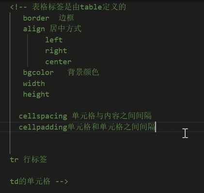
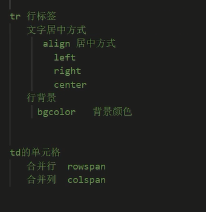

# 千锋教育相关的笔记（居然能用得上）

# 3. 表格标签和苹果官网
**表格相关的标签**：
table 建立一个表格结果（应该是块元素）
tr 表示一个行
td 表示一个单元格，并且特殊的，头部的标签元素会用th，自带强调和居中效果

我个人理解的为什么不用类似行和列的那种方式是因为**标签式语言固有的只能嵌套的特性所决定的，这种表现方式我觉得也好理解。**
就是一开始有点想不到。



caption可以定义表格的标题，属于table的直接子标签。



# CSS相关的
z-index可以设置元素的层级关系，**不过好像要搭配父元素设置相对定位的样子**

transform 属性**允许你旋转（rotate），缩放（scale），倾斜或平移**给定元素。这是通过修改 CSS 视觉格式化模型的坐标空间来实现的。
[transform](https://developer.mozilla.org/zh-CN/docs/web/css/transform)

其中： scale可以设置元素缩放

transition属性可以设置过渡效果，使得渲染有一定的过渡效果，而不是立即生效

animation 可以设置**动画效果**
keyframe设置关键帧


CSS三个高级特性： FlexBox（浮动盒子）、Animation（动画）、Transition（过渡效果）
## 仿照苹果官网


# JavaScript 部分
JS部分用于给框架部分打好基础。就现在而言，框架是为了更好的操作DOM。

**给html文档引入js代码**
核心是在 script标签中引入js代码（不管是内部还是外部的形式）

**undefined和null的现在看来在使用方面没有什么区别**
尽管他们在底层上是有区别，不过实际情况是没有必要去考虑他们的区别

**文档对象的write方法会直接在已渲染文档的最下方写入元素。**

typeof()可以判断某一个变量的类型的字符串，它会返回一个字符串
判断null的时候返回的是object

js中也有变量遮蔽（rust是从动态语言里面吸收的这一点应该）

**js支持闭包**

js的函数内部内置一个参数arguments（似乎是数组），内部的元素为调用该函数时传入的参数

## js中的数组对象
js中的数组（对象本身是可变的）
可以访问索引外的元素，它的值将会是undefined

Array对象包含push方法和join方法：前者用于追加元素；而后者用于取代间隔元素时的默认**间隔符**。

## 日期对象
日期对象主要用于输出和给数据加上**时间戳用于验证**。
主要是 toLocoleString方法和getDate方法。
一个用于格式化输出，一个用于输入距离1970时候的毫秒数

## Math对象可以直接使用

## 正则表达式对象
用于验证字符串规则：
一个正则对象的test方法可以返回参数字符串是否符合要求；

```javascript
    let reg1 = new RegExp("\w");
    let str1 = "asdfasd";

    if (reg1.test(str1)) {
        alert(true)
    } else {
        alert(false)
    }    
```

另外reg好像类似字符串字面值一样可以直接通过特定符号（类似string是通过双引号）来初始化一个；

# DOM
js通过dom模型来修改html的元素：
通过`document.getElementById()`函数，通过制定id获取元素在js代码中的实例

然后通过实例对应的属性可以达到对元素的内容进行修改的目的；
src属性可以修改源；
innerHTML可以修改元素（HTML标签）内部的value。

## 事件监听
以元素点击事件为例（其他的监听事件就是对应的事件的名称不同）

1. 可以在标签名指定js代码
1. 可以在标签名里面指定js函数
1. 可以在获取元素后指定属性（监听事件）来指定对应的函数。

# BOM
DOM是和文档有关的各种模型；BOM是和浏览器有关的各种对象；

和alert类似的方法：
confirm: 确定和取消按钮，前者true或者false
prompt：返回你输入的内容

window的open可以打开一个新的标签页（Chrome会自动拦截）和关闭它的调用者；

# 定时器
算个比较重要并且有用的东西：

set或clearTimeout：设置或清除一次性计时器
set或clearInterval：设置或清除循环定时器

里面的参数最好写一个匿名函数；第二个参数是时间间隔，单位是ms

清除定时器的逻辑（应该是）立即执行，所以一般搭配时间监听使用。

入门案例一般都是轮播图；

```javascript
// img counter
let img_index = 0;

// get elem
let img_span = document.getElementById("img");

// define change fn
function changeImg() {
    num++;
    if (num > 4) {
        num = 0
    }

    img_span.src = "img" + num + ".jpg";
};

setInterval(changeImg(), 3000);

```

## location对象
通过location对象的reload方法和href属性可以刷新当前网页和跳转到指定的url地址

## history 对象
负责当前网页的历史记录似乎

forward(), 前进一个网页
back(), 后退一个网页
go(), 参数为前进或者后退几个网页

## DOM对象的crud操作
dom也有几个相关的核心对象：
document: 文档对象
element： 元素对象
text： 文本对象
attribute： 属性对象
comment： 注释对象

几乎所有有关文档的都封装好了对应的对象；

node是结点对象，似乎是上面五个的**父级对象**

document 文档对象
  1，创建 不需要创建直接使用即可
  2.方法：
   document.getElementById() 根据id获取唯一元素对象
   document.getElementsByClassName() 根据class属性值 返回对象集合
   document.getElementsByName() 根据name属性值 返回对象集合
   document.getElementsByTagName() 根据元素名称 返回对象集合
  属性 length  获取元素集合长度

element对象：
它来源于document。
通过setAttribute和remove...可以对应的设置属性和设置值以及移除对应的属性；

Node对象，是上面几种元素的的父元素，具有方法：
appendChild（） 为元素追加元素一个新的子元素
removechild（） 为元素删除一个子元素
replacechild（） 替换一个子元素

parentNode(方法还是属性来着？)可以获取父节点的位置

crud确实算得上核心操作了

## js可以控制css样式
不过好像不是直接控制css，而是控制style的属性（内联的style）
跟我一开始想象的画像有点不一样

window.onload属性可以保证在html和css加载完毕之后再执行onload函数中的代码；


单选框元素的checked属性设置true就表示勾上。

# jQuery相关
## jQuery快速入门
js简化了获取elem对象的代码：`$("CSS选择器")` -> 获取到jq对象；

js对象和jq对象可以相互转换：
前者到后者：`$("js对象")`
后者到前者：通过jq对象的get方法或者索引获取js对象。

原生js获取标签内内容通过innerHtml属性；jq对象通过html方法：

事件回调：jq对象通过click方法，里面传入一个函数对象即可。

**关于函数入口**
原生js的函数入口是：`window.onload()`, 只能有一个，如果定义多个，后面的会覆盖前面的（就是变量覆盖了一样。）

而jq的函数入口可以有多个，按照顺序正常加载，彼此间不冲突。

jq代码中也可以控制dom的css样式：通过css方法即可。
```javascript
$(".container").css("color", "red");
```

# CSS选择器相关
id选择器：#
class选择器：.
元素选择器：元素名
并集选择器：多个元素

**属性选择器**

感觉可以跳过，有需要的时候再来看就行；

# jQuery的dom操作
val() = innerHTML
html() = html
text() = text

注意你在使用的时候才会注意到 innerHTML和text的区别！
因为标签里面实际还能包含子标签，所以前者会把 innerHTML的内容包括进来；而后者仅仅包括文本的内容。

方法 attr和prop可以获取标签指定的**属性值**
推荐自定义属性用前者，原生属性用后者；
（不过实际上两个方法都能正常的获取属性的值，推测这样做的原因是增加**代码的可读性**）

这部分继续跳过，学起来总觉得...

# Vue
## 概述部分
有一部分重要的内容：
前后端分离；路由分发；node作后端时的架构；MVVM和mvc

## 快速入门
Vue的核心是mvvm架构：
想要使用vue，需要先实例化一个vue对象，一般命名为vm（即view和model的调度者）
data属性中，用来存储对应数据模型；

Vue的快速入门是通过vue指令来控制视图；
而不是像原生js一样通过操作dom结点的方式来控制视图了。

```javascript
    var vm = new Vue({
        el:"#app",
        data() {
            return {
                
            }
        },
    })
```

**控制html在网速慢的时候也不会加载未渲染的vue区域**
在html代码的位置的标签里面加入：`v-cloak`, 然后在style标签中设置css样式：`[v-cloak]{display: none;}`

也可以通过vue指令： v-text与v-html，也不会产生差值表达式的**闪烁问题。**（因为已经没有差值表达式了）
不过这两个指令只适用于完全使用vue表达式作为tag的text的情况（**就是说会覆盖标签内原本的文字**）；做字符串拼接的时候就用上面那种方法即可。

v-bind可以绑定vue数据到html中；可以简写成一个冒号；

v-on/off:事件名称 可以绑定对应事件，简写一个at符号
函数需要预先在method里面声明，因为使用vue指令绑定的时间会自动使用vue的作用域。

## 事件修饰符
来源于我以前学习的知识，只不过我这次把它记录在这里了。


修饰符就是
Vue中的事件修饰符：
1. prevent：阻止默认事件；
1. stop：阻止事件冒泡；
1. once：事件只执行一次；
1. capture：使用事件的捕获模式：事件在**捕获阶段就开始执行**。
1. self：只有当event.target 是当前操作的元素的时候才执行。
1. passive：事件的默认行为立即执行，无需等待事件回调执行完毕。

js中的事件执行有**捕获阶段**和**冒泡阶段**
事件的捕获是由外往内的，事件的冒泡阶段是由内往外的。
默认事件的处理是在**冒泡阶段**

vue可以通过修饰符 v-on:click.capture 使得js在捕获阶段就处理事件。

事件scroll和wheel：
前者监听滚动条，后者监听鼠标本身的动作；
区别就是scroll只有在滚动条有变化的时候才会执行，wheel只要鼠标滚动就会执行，无关滚动条的情况。

```html
<!-- 就是类似这样的形式 -->
<div @click.stop><  /div>
```

## Vue通过内联的方式修改html的样式
Vue可以通过指令`:class=['classname1', '2']`这样来个标签添加class，并受vue管理（应该）

不过内联的缺点已经说过了，并且这里语法怪异，因此。。。

可以通过在vue实例中定义对象，然后在标签中引用的方式来直接使用，这样更加方便。
有需要去笔记那里直接看吧

## Vue的v-for以及相关
v-for的语法：

```html
<p v-for="(item,i) in cusList">
    index is : {{i}}, {{item}}
</p>
```

特点是会循环渲染标签根据list，以及对应的有index和value的数据；
采用就地复用的策略： 不是根据dom元素进行匹配，而是复用每个元素（这里是视频的原话，不管）

key属性：
跟上面的这个策略是息息相关的；
是相当于每个元素的**唯一表示**

同时也可用于对象的遍历；
顺序是： value, key, index 会按照json定义的顺序把成员一次遍历出来。

**迭代数字**也是可以的；

回忆： v-model是用于双向绑定，常用于input标签；

我现在知道 vue的复用是什么意思了： vue默认是根据元素的排序位置进行渲染，如果插入了dom元素的话，渲染效果不会跟dom绑定的；
vue提供了key属性（没写很清楚是怎么用的，所以这里只是随便写写；）
通过`:key可以绑定`，冒号就是v-bind的简写形式；

实际上是通过v-bind绑定对应vue中的number和string类型的数据（因为这两种具有 equals trait）
vue通过这个属性可以识别指定的dom

## v-if & v-show
v-if and show会通过bool的值来显示或者隐藏元素；
v-if 特点： 每次都会重新创建和删除元素
v-show特点： 每次不会重新创建和删除dom元素 而是给元素添加行内样式display

（根据Rust的经验推测）v-if因为销毁和再分配的特性（在堆上）因此会有较高的切换消耗。
而 show会有较高的**渲染消耗**，意思是即使不显示，也要花成本去渲染；

所以这两种应该是各有使用场景的。

## v-for结合表格来实现一个具体的添加品牌的案例
视频的意思我清楚了，额外引入了一个bootstrap来做样式

核心是通过v-for来进行样式的渲染。

wait update: 搜索和删除应该差不多，所以需要的时候来看视频；
视频名称： 13品牌案例搜索和删除

## Vue的过滤器
一种是在插值表达式中，通过管道符，把前面的作为参数传递给后面的函数，最终展示fn的返回值；
过滤器可以脱离vue独立定义：Vue.filter("fn_name", func (){})

提一嘴： 正则的全局匹配：例如修改所有匹配到的字符串
```javascript
Vue.filter = ('msgFormat', function(msg, reg) {
    return msg.replace(/crazy/g, 'gentle')
})
```

实例是拿这个，进行了日期的格式化输出。

全局过滤器在非Vue实例管理的区域（不能使用v-的指令）也可以生效（所以叫做**全局**啊）

私有过滤器对应的就在Vue实例里面定义：在属性 filters位置，类似method

padStart函数是补足字符串达到指定长度的方法；args: len, str_pad

## Vue按键修饰符
按键行为（例如按下回车） ->  Vue会见厅按键的行为 -> 执行定义的回调的函数

他这里考虑是准备的文档或者什么其他的东西。

和正式的开发应该关系不大，所以

wait editing: 

## 自定义的Vue指令
类似于 v-bind，v-model之类的指令，也是可以由用户自定义的：
```javascript
    // 注册全局的自定义指令
    Vue.directives('focus',  {
        // 当被绑定的元素插入到 DOM 中时：
        inserted: function (elem) {
            el.focus()
        }
    })

```

需要可以直接且是看vue的文档，即使是现在vue的官网应该也是可用的。

[Vue主页](https://vuejs.org/tutorial/#step-1)


## Vue的生命周期
生命周期方法通常用于在实例的特定的生命周期用来执行对应的回调函数：
beforeCreate 就是指在Vue实例创建之前，会先执行这个方法；会无法调用method里面的方法和data里面的属性。

created: Vue实例创建后立即执行

beforeMount: 在模板加载完成，但是数据尚未渲染的时刻；

mounted: 对应 beforeMount

下面的就是一些在运行期间的生命周期了：
beforeUpdate：页面数据发生变化前，会执行此方法

updated: 同

Vue对应的还有destroy方法，不过不过不重要了。

# jsonp实现原理
首先这里提到了一个**跨域**，我之前听我的同学和 nginx有关还是别的什么；

不过这里讲得跨域是浏览器不能访问不同链接的JavaScript的问题（处于一种安全策略，不执行不明来源的js代码）

> 解决跨域使用node书写（后端代码？） 由于浏览器安全性限制，不允许ajax访问不同协议 域名不同 端口号不同的数据接口，浏览器会认为这是访问不安全。

不过，通过**动态地创建Script标签**可以实现自由访问不同的数据接口，因此不存在跨域问题（那这不还是不安全，封了个几把）
**只支持get请求**

JSONP这里就实操了一段代码： 通过node搭建一个简单的后端服务器，然后给前端发送了一段JavaScript的代码

... 他到底是想干什么呢...


# Vue创建一个类似标签栏切换的效果
通过vue实现的一个类似标签切换的效果。
在后面构建那个什么时候可能会有用。

总有种食之无味弃之可惜的感觉...
视频进度： 17：15


# Vue的一些常用的特性
控制单选框的时候，通过 v-model进行双向绑定data中的数据，
html便会默认选中data的初始值。

多选框同理，只不过你可以提供一个数组，让多个选项默认同时被选中。

同理的下拉框，默认的文字框都可以这样来通过Vue来设置默认值；

在实际写代码的时候如果不懂再来看代码好了。

# Vue的表单修饰符
就是v-model可以加上类似修复的东西，形成连缀的修饰作用;

常用的有： 
number  转换为数值
  注意点  当开始输入非数字得字符串时 因为vue无法将字符串转换成数值
  所以属性值将实时更新城相同的字符串 即使后面输入数字 也将被视作为字符串
.trim 自动 过滤用户输入得首位字符串空白字符
     注意点 只能过滤和删除首位空白字符
.lazy  将ipput事件切换城change事件
.lazy 修饰符延迟了同步更新更新值得时机  将原本上绑定input事件得同步逻辑转变为绑在change事件上


例如 v-model.number 这样用。


这里提一下lazy，因为是我以前没有实际接触到的：（trim在java和go里面都接触过）

lazy是在数据发生变化的时候（视图中）vue中的实例延迟不更新（v-model是双向绑定），改成change事件。

# Vue的计算属性computed Property
这个我之前是接触过的，所以对应的看 《Vue教程》对应的部分即可。


# 开始了，Vue的一个开发实战
## 项目初始化：hello world
首先是通过node来安装vue，然后通过vue的ui界面来初始化一个vue项目。
接下来就用vscode进行开发了。

通过node安装vue：
`npm i @vue/cli -g`

测试vue是否安装成功：
`vue -V`

在终端中输入 vue ui 会出现一个vue的web界面。

然后对着千峰的那个笔记，选择指定的初始化的配置（其实能看懂的话也可以不用去管那个东西）
一个vue项目就初始化完成。

然后通过vscode打开。

**整个前端好像使用一个 node的后端项目来进行测试的，所以这里介绍一下**
下载，执行`npm install`安装依赖。 如果报错找不到模块， 用`npm install 模块名来直接安装`

然后 node ./app.js启动服务器，查看控制台输出，判断是否成功。

## 通常的登录流程
1. 前端： 输入用户名和密码
1. 后端： 后台调用业务进行验证
1. 后端： 通过验证，向前端发送相应的数据
1. 前端： 接收到相应信息，前端进行对应的显示。

登录业务用到的技术：
http本身是**无状态协议**
通过cookie在客户端存储用户信息（不安全）
通过session在服务器端存储用户信息
服务器端向客户端返回token（相当于server向client发送的凭证），这样后面就可以免除登录的操作了。


现在通用的vue似乎是用element-ui 的组件来创建ui，非常的常规。 如果我有时间可能再到这个上面去下功夫。

如果要用，引入框架（应该说库才对），并且对应的html标签的class设置为：
el-form
el-form-item
el-input
el-button
字体图标

## 前端项目的启动
前端项目的入口是 main.js

一个启动的流程是： main.js是入口（相当于其他组件的**胶水**），然后这个胶水会调用App.vue（这是vue项目的根组件，相当于vue的main.js）

想要启动前端项目，可以通过 package.json里面的script里面，右键serve可以启动前端的项目。
（我测试过，这个应该是通过yarn serve这个命令启动的，yarn serve命令可以启动前端的服务器。）

## 前端项目的初始化
eslint是js提供（或者说vue初始化自带还是通过配置文件可选安装的）的一个**代码检查工具**

他这里讲了怎么关闭它（其实无所谓）
eslint本质是一段js的代码，如果有需要可以去对应的js文件里面把它注释掉。（我觉得**算某种配置文件的样子**）


10：53位置，视频： 前端项目初始化

## Vue中的export、import和 export default
一个vue文件中的数据，通常外部是无法直接访问的（类似于public）
那么通过export可以将变量和函数等**导出**，让其他的组件可以通过 import来使用；

算一个简单的小知识点，具体看这个[Link](https://blog.csdn.net/qq_40891322/article/details/110043496)

export需要指定模块名称，default这个提供默认导入的功能，适合快速开发。。


## vue安装额外的第三方组件
视频里面是通过vue ui来进行安装的，可能我以后会整理一下 terminal的指令

视频里集成了：
搜索element, 应该就是 element-ui
axios

loadjs好像是，它现在没有下载。

在router/index.js里面需要删除默认的路由：常量 routes里面的路由，
这样eslint就不会报对应的错误了。（因为如果没删的话vue就找不到）

## 完成登录的vue组件
再强调一次，**vue强调组件化**，所以下面的部分最终实现是通过
login.vue 渲染到 app.vue里面的。

login.vue里面的模板代码：
```html
<template>
    <div>登录页面</div>
</template>
<script>
export default {
    
}
</script>
// Need extra dependecy
<style lang="less" scoped>

</style>
```

然后在router里面导入: 添加import; 然后在const router里面添加路由规则；
```js
const routes = [
  {
    path: '/login',
    component: Login,
  },
  {
    path: '/',
    name: 'home',
    component: HomeView
  },
  {
    path: '/about',
    name: 'about',
    // route level code-splitting
    // this generates a separate chunk (about.[hash].js) for this route
    // which is lazy-loaded when the route is visited.
    component: () => import(/* webpackChunkName: "about" */ '../views/AboutView.vue')
  }
```


去除eslint的命令规则检查：
在defineConfig下设置：
lintOnSave关闭即可；    