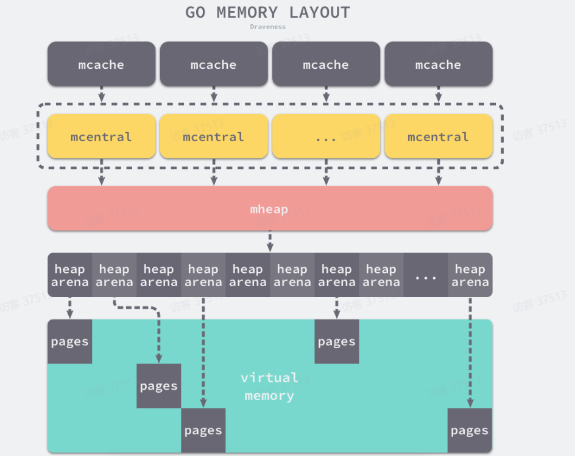

# 可视化的 Go的内存管理
小摸一下 Go的内存管理。

# Go本身的语言特性(对比Java)
和C/C++、Rust等一样，Go是一种静态类型的**编译型语言**。 Java的运行是 编译型和解释性的一种折中, 本质上是一种**解释性语言**.
因此，Go不需要VM.
Go应用程序二进制文件中嵌入了一个小型运行时(Go runtime)，可以处理诸如垃圾收集(GC)，调度和并发之类的语言功能。
我的解释: Go的一些类似于其他 VM语言的功能是通过 Go runtime 实现的.

# Go语言的内存特性
[Golang 内存分配原理](https://www.bilibili.com/video/BV16B4y1m7PC)

程序**在运行的时候所使用的的内存都是虚拟内存**, 虚拟内存是由操作系统进行映射到物理内存的.

内存区通常分为 栈(Stack) 和 堆(Heap).
函数调用的**参数**和**返回值**, 函数使用的**临时变量**, 一般会被存储在 栈中.

堆中的内容, 使用内存分配器分配, 并由gc回收. 

栈的进栈和出栈是硬件级别的实现, 因此速度很快.

Golang 的内存分配借用了 tcmalloc的思想. tcmalloc的核心思想是: **尽量减少在多线程模型下，锁的竞争开销，来提高内存分配的效率。**

同一进程内部的线程**共享这个进程内部所有的内存空间**.

换句话说, 为什么在内存申请里面有锁? 因为内部的线程的分配区域是同一块, 不加锁的话会导致有**可能分配**两个线程分配到**同一个内存空间**. 
## TCMalloc

文档中关于 TCMalloc的介绍
> tcmalloc，其实就是 thread cache malloc 的缩写。首先，看一下下图也大概了解一下tcmalloc
> - tcmalloc 内存分配分为ThreadCache、CentralCache、PageHeap 三个层次。
> - ThreadCache 是每一个线程的缓存，分配时不需要加锁，速度比较快。ThreadCache中对于每一个size class维护一个单独的FreeList，缓存还没有分配的空闲对象。
> - 8Bytes 16Bytes 32Bytes 。。。32KB
> - CentralCache 也同样为每一个size class维护一个FreeList，但是是所有线程公用的，分配时需要加锁。
> - 8Bytes 16Bytes 32Bytes 。。。32KB
> - CentralCache 中内存不够时，会从PageHeap中申请。CentralCache 从PageHeap 中申请的内存，可能来自于PageHeap 的缓存，也可能是PageHeap 从操作系统中申请的新的内存。PageHeap 内部，对于128个Page 以内的span，会都用一个链表来缓存，超过了128个Page的span，则存储于一个有序的set。
> 1. 减少锁的争用
> 2. 减少了系统调用，上下文的切换:

我的理解是, 内存实现分层次管理: ThreadCache <- CentralCache <- HeapPage
每个线程独立管理一堆的 size class, 他们由各自的 FreeList 维护, 如果有申请内存的请求, 那么就根据大小查找 size class, 然后根据 FreeList 去寻址. 
每个线程独立管理自己的内存区域, 当内存不足时, 去找他们的上级申请; 
中央缓存和那个其实一样, 不过是所有内存共享的, 因此和 线程缓存的最大的区别就是向他申请内存的时候**有一个上锁的操作**.

1. 减少锁的争用, 是的, 因为你花了代价的, 本质上跟 又把线程细分成协程差不多我个人感觉.
1. ...一样是协程的特征

本质上是程序层面的一个自动管理, 相当于核心态减少了操作, 而用户态增加了操作; 
把os层面的管理变成了 程序层面的管理.

这是 tcmalloc的思想, 而 Golang 借鉴了 它的管理思想.

## Golang 的内存管理组件

Golang的内部其实是一样的, 里面最基本的内存单元是 mspan, 大小总是 8kb的整数倍, 因为这是一个内存内存页面的大小. 
然后每个缓存的级别都会管理一定的数量的 mspan, 如果不够用就去像上级去要. 

维护 mspan 的数据结构是一个**双向链表**.

# 谷歌强制使得浏览器是夜间模式
地址栏输入chrome://flags/
搜索 enable-force-dark, 让他的选项为 enabled即可.