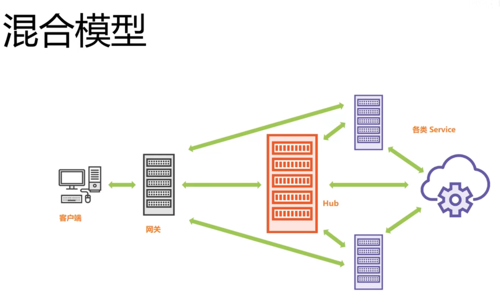

# 基于Go语言构建的分布式系统
# 使用混合结构构建


# 创建日志服务
实质上是将请求接收到的 requestbody的写入到文件系统中, 具体看代码
```go
package log

// alias stl log package
// 因为自定义的包名也叫 log, 所以给标准库的包名设置了一个别名, 意思为 standard log
import (
	"io/ioutil"
	stlog "log"
	"net/http"
	"os"
)

// Declare a global logger
var log *stlog.Logger

// Type fileLog as string, so that post info can be saved to file system
type fileLog string

// Write will call method of type file
func (fl fileLog) Write(data []byte) (dataNum int, err error) {
	// Define your file path and your file mode into this file:
	// It is said 0600 is used to run on different devices not only windows but also Linux
	file, err := os.OpenFile(string(fl), os.O_CREATE|os.O_WRONLY|os.O_APPEND, 0600)
	if err != nil {
		return 0, err
	}
	defer file.Close()
	return file.Write(data)
}

// Run the Logger.
// In this case, logger will write into file system.
func Run(destination string) {
	// The argument "flag" is the init of stlog, means the blog files will contain "Date" and "Time".
	log = stlog.New(fileLog(destination), "DDD ", stlog.LstdFlags)
}

// RegistersHandlers contains "/log" handler.
func RegistersHandlers() {
	// Handler of requests from path "log".
	http.HandleFunc("/log", func(w http.ResponseWriter, r *http.Request) {
		// Just take "MethodPOST" into consideration
		switch r.Method {
		case http.MethodPost:
			msg, err := ioutil.ReadAll(r.Body)
			if err != nil || len(msg) == 0 {
				w.WriteHeader(http.StatusBadRequest)
				return
			}
			// By write function to invoke log file.
			write(string(msg))
			// Other requests aren't allowed.
		default:
			w.WriteHeader(http.StatusMethodNotAllowed)
			return
		}
		// A comment said r.Body need to be shut down...
		// 一个弹幕说这个body需要被关闭
		defer r.Body.Close()
	})
}

func write(msg string) {
	log.Printf("%v\n", msg)
}

```
我来解释一下: 这个日志代码是以 log 标准库里面的Logger为基准来实现日志功能的. 
自定义了一个 fileLog类, 实现了 io.Write接口的方法, 这样Logger的输出功能就由我自定义的类型承接, 本质上是写入内容到文件中.
定义 "/log" 请求路径的handler, 如果响应有效就把body的内容交给 Logger来处理. 

以上就是日志功能. 

# 将服务(比如日志) 集中化管理, 方便初始化
说实话老师说的那个 service.go里面可以注册也可以干什么别的东西我没有听懂...

 

# 服务注册的逻辑
