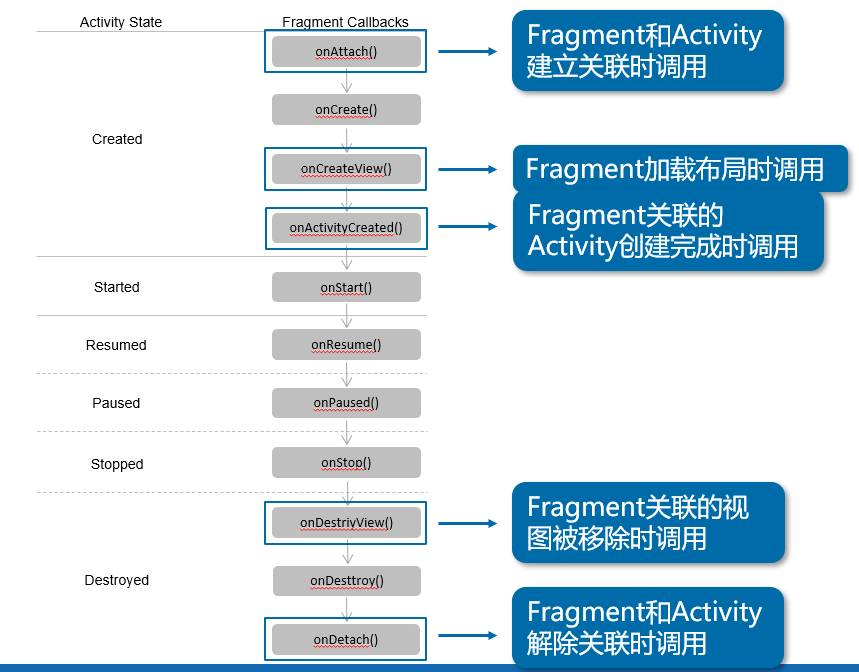
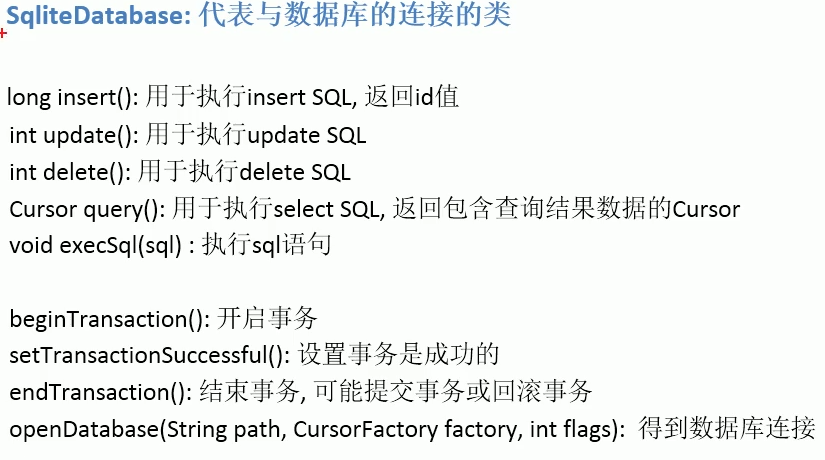

# 安卓开发
[toc]{type: "ol", level: [2,3]}

## 基本入门
### 环境搭建    
环境搭建只说一个：
你的Android Studio需要能够访问网站：dl.google.com，不然你的AS一定会在哪个环节出问题，毫无例外。
修改Host。
203.208.50.33	dl.google.com

后期补充：Android Studio可以通过adb shell连接国产模拟器
终端输入：

```sh
# 夜神模拟器
adb connect 127.0.0.1:62001

# 逍遥安卓模拟器
adb connect 127.0.0.1:21503

# 天天模拟器
adb connect 127.0.0.1:6555 

# 海马玩模拟器
adb connect 127.0.0.1:53001

# 网易MUMU模拟器
adb connect 127.0.0.1:7555

# 原生模拟器
adb connect (你的IP地址)：5555
```

### 安卓应用资源文件
资源是指代码使用的附加文件和静态内容，例如位图（Bitmap）、布局定义（Layout）、界面字符串（Strings）、动画说明等。
这也是一种**解耦合**，代码与外部资源分开维护。
在代码中，通过R类生成的ID来引用对应的资源。
安卓可以引用的资源非常多，包括动画、图像、图标、布局等等...
理论上也可以引用任意格式的文件，通常会放在res/raw中。如要使用原始 InputStream 打开这些资源，请使用资源 ID（即 R.raw.filename）调用 Resources.openRawResource()。
**注意**！切勿将资源文件直接保存在 res/ 目录内，因为这样会造成编译错误。

#### 尺寸资源
尺寸资源一般定义在/res/values/dimens.xml中。
### 程序调试
#### 单元测试
因为安卓比较特殊，因此Test分为两种类型：Android单元测试和原生的JUnit测试。
- 安卓单元测试适用于需要调用安卓API的代码；
- JUnit只测试Java代码部分。
#### 
#### 打包、签名、发布
当程序完成后，就需要打包部署项目了...
选择Build..Generate Signed APK来打包成可以安装的APK文件。
版本的相关信息因为被gradle管理所以写到gradle中。
## 布局与控件
### ConstraintLayout
最新的内容，功能最为强大的布局。

特点：
- 是现版本的首选布局
- 可以将原来LinearLayout之类需要嵌套多层的布局改为一层
- 能够自适应屏幕


### ListView
ListView是最重要的控件之一，是一种**负责多个可滑动项(item)列表**的ViewGroup。
ListView需要借助适配器(Adapter)才能完成初始化。也就是说你不能在ListView的标签中去添加子布局。
适配器(Adapter)负责将集合数据与布局动态适配到ListView中去显示。


### Dimens资源的使用

记住以下：

- 文字单位一律用sp
- 非文字一律用dp
- 偶尔会使用px

### Inflater

作用：将xml布局转换为View的示例对象需要使用这个类。也就是说可以动态地加载xml的布局到Java中。

可以通过三种方式得到LayoutInflater的示例对象

```java
mLayoutInflater = getLayoutInflater();
mLayoutInflater = getSystemService(Layout)
mLayoutInflater = 
```


## Activity

### 概述

Android中的四大组件分别是活动(Activity)、服务(Service)、内容提供者(ContentProvider)和广播接受者(BroadcastReceiver)，其中，Activity是一个负责与用户交互的组件，也就是说**用户只会和Activity打交道**，每个Android应用中都会用Activity来显示界面以及处理界面上一些控件的事件。

### 安卓的生命周期
生命周期决定了你的回调方法中的处理逻辑，所以理解好它。

### Fragment：Activity的碎片化控件
#### 概述
Fragment（碎片）是一种嵌入在Activity中的UI片段，它可以用来描述Activity中的一部分布局。
#### 生命周期
因为Fragment是嵌入在Activity中的，所以其生命周期直接受Activity影响。
- 当在Activity中创建Fragment时，Fragment处于启动状态；
- 当Activity被暂停时，其中的所有Fragment也被暂停；
- 当Activity被销毁时，所有在该Activity中的Fragment也被销毁。
- 当一个Activity处于运行状态时，可以单独地对每一个Fragment进行操作，如添加或删除，当添加时，Fragment处于启动状态。当删除时，Fragment处于销毁状态。



特点在于Activity的创建和销毁时Fragment有多种状态。

#### Fragment的使用
与Activity类似，创建Fragment时必须创建一个类继承Fragment。
例如
```Java
public class NewsListFragment extends Fragment{
        @Override
        public View onCreateView(LayoutInflater inflater, ViewGroup container,
			                             Bundle savedInstanceState) {
               View v = inflater.inflate(R.layout.fragment, container, false);
               return v;
       }
}
```
Android系统中提供了2个Fragment类，这两个类分别是android.app.Fragment和android.support.v4.app.Fragment。
（1）如果NewsListFragment类继承的是android.app.Fragment类，则程序只能兼容3.0版本以上的Android系统。
（2）如果NewsListFragment类继承的是android.support.v4.app.Fragment类，则程序可以兼容1.6版本以上的Android系统。

可以将Fragment**当成一种布局来对待**。


## 安卓内部的数据存储

一共四种方式

- SP存储方式
- 内部文件Inner File存储方式
- SQLite 数据库存储方式
- SD卡（外部文件的存储方式）


### SP存储（SharedPreference）

#### 特性

1. 用来存储应用程序自己要用的数据，你在手机**应用管理页面的清除数据**清除的就是这个东西。

2. 他的应用和Java的Properties类应该非常类似；存储配置数据（小）

3. SP存储专门用来存储一些小数据。

4. SP的数据是其内部的配置用数据（一般），只提供给应用本身使用。

5. SP内部为双列存储，即**键值对**的形式。

   

#### API相关

- SharedPreferences：对应sp文件的接口
  - context.getSharedPreferences(String name, int mode): 得到Sp对象
    - name：文件名（不带xml）
    - mode：生成的文件模式（是否私有或者其他之类的）
  - Editor sp.edit()：得到Editor对象
- Editor：更新SP文件的接口，好比画笔和画板的关系。
  - Edit put(name, value): 保存键值对数据到**对象**中，并**没有**真正存储到文件中。
  - remove：移除
  - commit(): 提交到文件中，类似 JDBC中的事务。

#### 实践：SP保存一次数据到文件中的流程

1. 初始化SP对象，使用 this.getSharedPreferences(xml文件的名称, Context.MODE_PRIVATE); 方法获取。
2. 获得Editor对象，sp.getEdit()
3. 使用 Editor edit.put()方法存入数据到SP对象中；
4. 使用commit()方法保存；

### 内部的File存储

#### 特性

- 已经具有**一定大小**的，应用运行过程中**需要使用的文件**需要保存到手机的内部。
- 文件类型可以使任意的，因为是文件嘛。
- 路径是在： /data/data/项目的包名/files
- 可以设置数据对应的权限。取决于需不需要让数据暴露给外部应用。


#### API相关

- 读取文件：FileInputStream fis = openFileInput("logo.png");
- 保存文件：FileOutputStream fos = openFileOutput("logo.png", MODE_PRIVATE);
- 得到文件夹对象：File filesDir = getFilesDir();


#### 实践：略

### 保存到外部文件存储

SP好比内存，内部存储好比C盘，外部存储则为D盘E盘

#### 特性

此时文件的性质已经从应用文件变成外部文件了。

其他说明和内部文件存储差不多，略

#### 相关API

- Environment：操作SD卡的工具类
  - 得到SD卡的状态：Environment.getExternalStorageStage();


### SQLite 数据库
#### 特点
- 安装文件极小，兼容多种移动设备上
- 处理小数据量时性能非常好
- SQL支持SQL语句
- 本质上是一个本地数据库，当需要服务器的数据文件是依旧是从大型数据库（Oracle、Mysql、SQLServer等）获取数据。
- 数据库的数据是存储在db文件中的。
#### SQLite的连接
##### 使用客户端连接(实际开发中不推荐这么使用，故略)
##### 使用adb shell连接
基本流程：
 1. 使用adb shell命令进入页面
 2. 找到数据库文件对应的目录
 3. 使用sqlite3 文件名 连接数据库，这样就会自动进入SQLite的命令行界面

#### SQL的语法
- 大部分语法为通用SQL语句
- 创建表时可以不用指定字段的类型，SQLite会进行适时转换，**但是**，你最好还是指定，这是为了维护的方便。
- SQLite的主键建议命名为_id。

+ [ ] 果然还是不推荐用Base64的方式来存储图片，使用仓库来引用好了。

#### 在Java中的相关API
Cursor对象类似JDBC中的ResultSet对象：


#### SQLite实践
##### 数据库的创建
 1. 需要工具类SQLiteOpenHelper的实现类对象才能初始化数据库，所有需要先创建它。
    - 工具类SQLiteOpenHelper是一个抽象类，你需要定义他的实现子类。
    - 默认构造方法public SQLiteOpenHelper的参数中，你的实现子类直接将factory写成null就行。
    - 然后在onCreate方法中建表。可以一起插入一些初始数据。

### 远程服务器存储
网络编程最重要的一种实现。
核心是客户端与服务端进行交互。

#### 安卓的网络交互方式
- JDK内置的API
    - HttpUrlConnection
- Android内置的包装API
    - HTTPClient 浏览器
- 异步网络请求框架
    - Volley
    - Xutils
- 注意
   - 因为网络请求在手机端是一个需要向用户声明的行为，因此访问网络需要声明权限：android.permission.INTERNET；
   - 访问网络的进程必须要在分线程进行。安卓的低版本可以在主线程请求网络，但是这样的话用户的体验极差。

#### 实践：通过tomcat来进行数据存储


### 临时插入：HTTP协议的相关的相关复习 以后我可能需要放到其他什么文档里面去的。
一次Http请求的过程
- 建议连接 -> Request 和 Response 循环交流-> 关闭连接

- Http请求的常用方式

  - Get请求
  - Post请求

  两者的区别是：Post的请求参数是放在请求体里面的。Get的参数则是直接放在地址栏里面的，因此Get请求没有请求体。Servlet处理他们的时候分别调用doGet()和doPost()方法。

- Http请求的格式

  - 请求行

  描述客户端的相关信息。相当于身份证似的

  - 请求头

  客户端请求的数据，例如客户端请求的是哪台主机等等。

  - 请求体

- 相应 和请求一样的。

## 安卓多线程
### Handler
Handler是一种用来处理线程之间通信的工具类。
- 定时执行Message和MessageQueue
- 在不同线程中执行


## 一个小功能：不用使用复杂的代码实现图片是否被选中的切换

drawable选择器selector

## Android Studio相关
### Android Studio使用令牌(token)绑定

