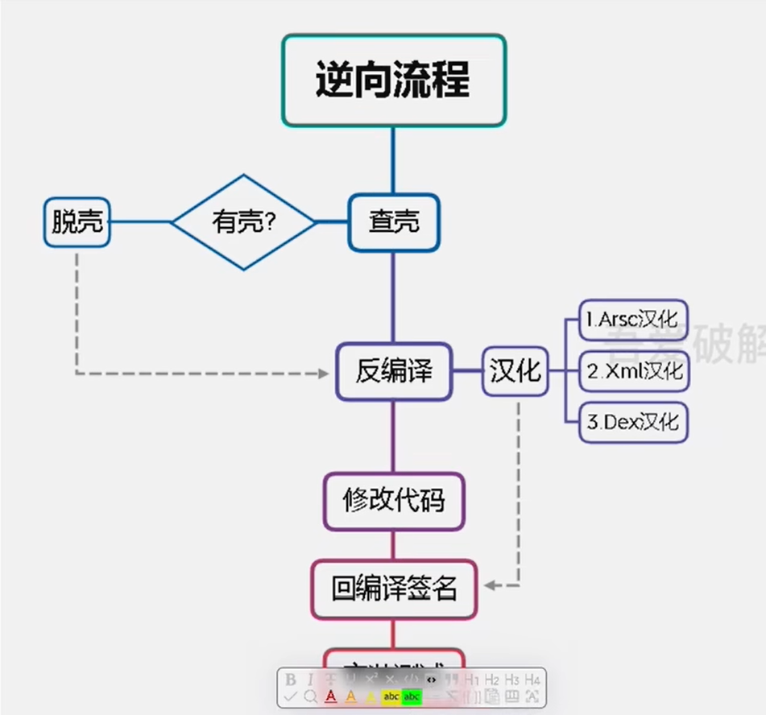
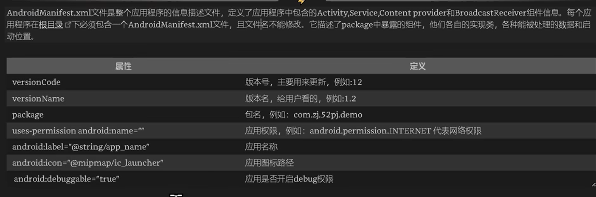
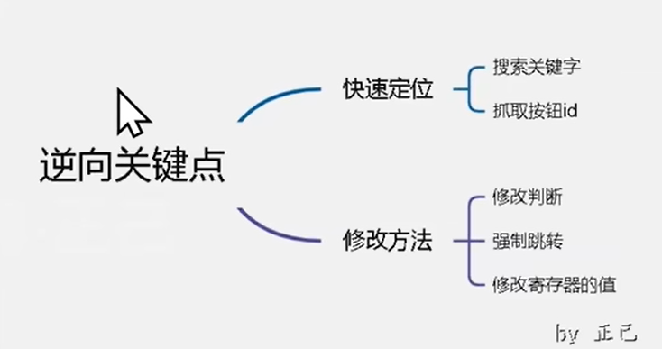

# 安卓逆向
作为兴趣来学习

# 第一课：环境搭建
如果使用雷电9的话很简单：
安装雷电9，开启root，安装magisk、给予magisk的root权限；开启模拟器的磁盘共享功能：
![[Pasted image 20230608173249.png]]

重启模拟器；打开magisk，点击安装，选择安装进系统分区；如果前面的设置没有问题最终日志会显示all done。继续重启模拟器；然后安装模块 `LSPosed-v1.8.3-6552-zygisk-release`； 然后在设置里面打开z什么的开头的。

上面这些就是整个文件安装的步骤。

# 第二课：APK文件结构，多开原理以及汉化
首先需要了解apk的文件结构。
这里到时候放一个截图上去；

多开一般来说有四种原理：贴p2的一个图片上去；

双开有一个最简单的方式： 修改应用程序的包名， 使得系统认为这是两个程序；
两个应用运行时互不干扰

## MT管理器
用来破解会员的东西需要使用会员...你他妈改个名字叫做赞助都行啊？？

MT可以用来提取安装包，可以查看安装包的一些信息；
不过MT需要会员才能用APK共存的功能，所以可以使用NP管理器的APK共存功能。
总之生成了新的安装包之后，就可以安装两个软件了。 

	不过通过这种方式生成的新的安装包，会**破坏应用原本有的签名**，如果这个软件的原作者用了开发者校验的话，此时应用就会出现闪退崩溃的情况，总之就是不能正常使用。所以这种做法基本没用。

## 进行简单的汉化
汉化的话也有多种方式。
进行汉化的流程图。

对上面的一些概念进行一下科普：
壳就是对原版应用的一种保护，使得它不能被轻易的修改。所以做逆向的话，脱壳是必须要会的。
汉化的三种方式，我推测一下：
第一个arsc是资源文件的二进制文件资源，它实际上是一个映射表，kv信息，所以有可能文本信息存在这个v中，所以需要修改这个v。
xml就是原本的资源文件，这个资源就是毕节被引用的了，所以如果修改了之后，应该就可以直接生效。
dex是源码编译后的字节码，用于解释执行，所以如果存在硬编码进源码的文本的话，可能就要考虑对dex进行处理了。

以提供的demo app为例， 对于普通的字符串，可以通过MT的搜索功能，找出指定字符串的位置，然后选择反编译，修改后保存即可。 
具体的操作是：
使用MT打开安装包，
![[Pasted image 20230608212544.png]]

选择搜索 -> 高级搜索（就相当于全局搜索） -> 直接搜索你要修改的字符串就可以了。
这么直接修改后，会跟原本的app签名不一致。

## 修改包之后，应用签名的问题
后面会提供解决方法：**核心破解**，一个XP模块可以解决这个问题。
现在不写。

## 不能直接打出来的文字
除了搜索之外，例如一个你压根不知道什么意思的字符串，而且你也不知道怎么打（比如一串俄语），那么
可以用一个叫做**开发者工具**的东西， 通过root权限， 他强大到可以获取到当前的app的架构信息，非常强大。
总之可以通过这个东西复制字符串， 这样就没有问题了。
点击页面资源分析就可以分析当前页面的资源。

![[Pasted image 20230610183704.png]]

这个可以发现目标字符串的位置在arsc里面。这个也是一个汉化的大头。
arsc的那个文件， 视频中演示的是**翻译模式**， 选择Default，然后去找你要找的那个字符串。
我都不知道有没有更加具体的资源的定位的方式。

问题在于这个翻译模式。这个应该是安卓内置的一种机制，把string这个文件的形式转换成多种国家语言的一种机制。所以衍生出了这种翻译模式。因此MT管理器也通过翻译提供商，提供了自动翻译的功能。不过这种显然就不是我需要的效果了。

dex（jvm字节码）通过dex++编辑器可以查看；
也是可以直接搜索得到

关于 AndroidMainfest

这个文件的作用很大，可以慢慢学习。
这个文件也是可以反编译来修改的。
MT管理器需要会员才能反编译这个清单文件。
所以这个时候使用np管理器来反编译。

可以直接反编译得到清单文件，非常方便。
然后np管理器集成了一些常用的功能：比如可以直接替换应用名和图标：
选中安装包 -> 功能 -> 通用编辑

# 第三课：初识smali、vip终结者

首先它介绍了一些关于JVM、Dalvik和art的概念。不重要。

## smali基础介绍
dex的字节码文件经过反编译之后是一种叫做 smali的中间语言； 想要修改逻辑**似乎只能修改这个代码。**
不能通过直接修改java源代码来达到修改程序逻辑的目的。

用jadx进行反编译； 这是一个绿色版软件，直接解压就可以使用。
我的话就用everything搜索一下就可以得到结果了。

## 核心破解xpose模块
然后在雷电模拟里面，安装核心破解apk， 接着会提示**请启动模块**，然后点进去这个通知 **启动系统模块**， 重启模拟器之后， 之后似乎不同签名的app就能覆盖安装了。
在反编译后可以通过**搜索来定位文件的位置**

当通过字符串定位功能定位不到的时候，有可能字符串被编码成了unicode编码，所以需要用转码工具来定位。

随便用一个转换工具。

然后尝试去反编译后的代码中定位到指定代码的位置：
比如说这里要查找一个“大会员”的位置，它的Unicode编码是 `\u5927\u4f1a\u5458`，
然后用jadx去查找，
![[Pasted image 20230610200255.png]]

上面这个就是结果。
常用的**定位代码的位置**的方法有：
搜索弹窗的关键字；抓取按钮的id等方法。

转到对应的位置之后，就可以看到它反编译的一个方法的名字； `m507onCreate$lambda2`
因为反编译时会开启一个反混淆操作，就是会把各种变量重命名方式别人逆向，这里会尝试给你还原。 总之这里的m507就是加上的一段随机string，可以发现后面的onCreate才是重点。

然后对应的在下方点击smali，找到对应的smali代码。

所以过程可以是：
先通过反编译后的java代码来分析过程和算法；
然后通过smali代码去修改具体的逻辑，实现自己想要的功能；

根据上方的这个思维导图来实战，实现教程demo里面一键三连的功能：

结合这次视频来看，这个jadx是用来定位代码的（专业名词叫做静态分析），因为mt管理器需要会员才能将其反编译成Java代码；
不过**修改代码并使其生效**仍然需要使用mt管理器。
jadx只能用来分析代码，因为mt分析要钱；
但是最终还是要用mt来逆向的。

他演示了根据代码逻辑来实际修改smali代码的实例；

1. 根据jadx反编译出来的java代码推测算法；
1. 在jadx中找到Java对应的smali代码；
1. 在MT中实际修改代码，并保存。

除了上面介绍的，修改判断的逻辑，还有一种是修改寄存器的值，类似于修改变量的值。

mt管理器中，选中方法，然后长按，可以出现一个跳转的选项，可以跳转到对应的方法，类似于idea里面的ctrl加点击。

此外定位资源的方法，还可以用**开发者助手**里面的定位ID的功能来实现。

# 第四课：广告和静默弹窗

了解安卓的四大组件。

