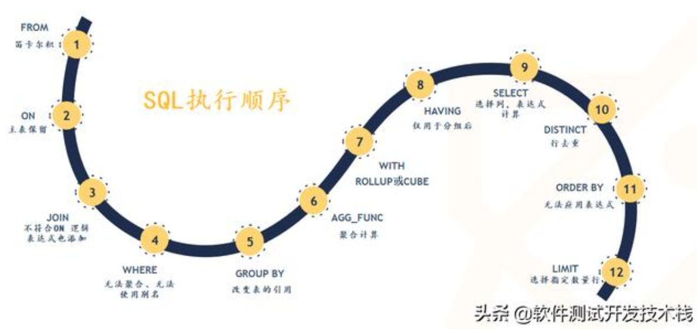
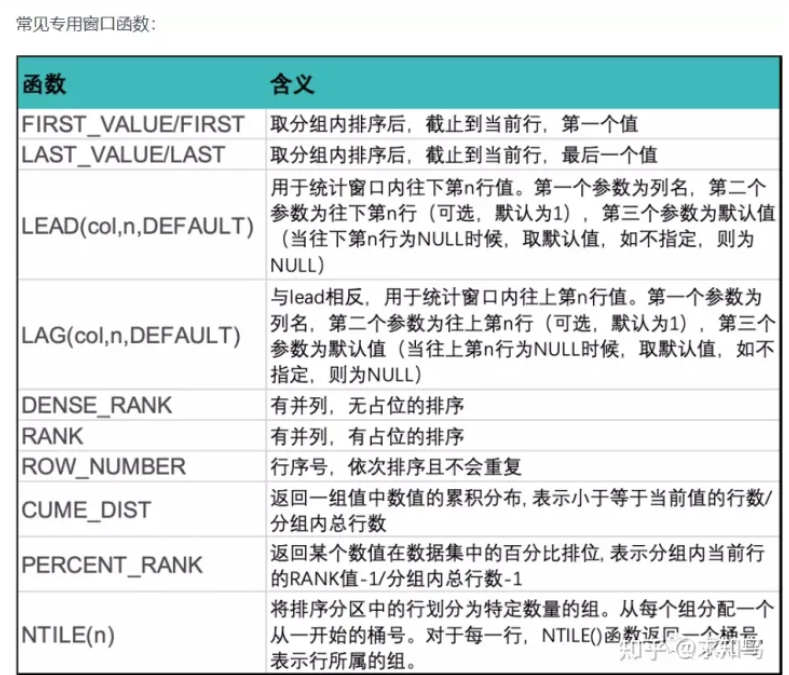

# 安德生实习相关
他们用的c#和.net平台，数据库软件使用的是SQL Server。
我准备把我的笔记都记录在这里。

两个相关的github的链接：
[应该是路线图](https://github.com/kamranahmedse/developer-roadmap)
[AspNetCore的路线图](https://github.com/MoienTajik/AspNetCore-Developer-Roadmap)

看完第一节视频，我只觉得要学习的东西有好多...


# CSharp基础


首先对他做一个简单的介绍
它是一种通用型的语言，就和其他通用型的语言一样，啥都能做
他是类型安全的
和Java一样，他完全支持面向对象特性

它的目标是生产力，所以它的简洁性表达力和高性能都不错

c sharp这门语言本身是与平台独立的， Dot net只是它的一个运行时，他也可以脱离他。

C#的面向对象的特性
它具有统一的类型系统，跟Java类似
并且它的类型也包括函数

跟Java一样，它的基类也是object，这里弹幕有提到C#中指针不继承自，Object
一句话总结，他跟Java是很类似的，不过在Java中包含有基本的数据类型，这一点跟C#应该有点不一样

它有类和接口，跟Java一样接口是为了避免，直接的多重继承而出现的，他只描述对象的行为，而不提供具体的实现

C#中，类它包括属性方法和事件前两个我知道，事件的话它也是方法的一种，它简化了对对象状态更改的操作，我的理解就是set或get等

C#借用了不少函数式编程的特性。
函数可以当做值来传递，C#通过一种叫做委托，英文名是delegate，来把函数传递进其他

并且还支持一种叫做purity的模式，它的特点是一个变量的值，一旦确定之后就不再发生改变，类似于rust中的不可变类型

C#能方便的支持响应式编程

关于类型安全
一般来说它是静态类型
不过他支持通过dynamic关键字来添加动态类型，这使得他拥有了一部分动态语言的特性
不过总体来说，他还是静态语言
这一个以后再说

关于它的内存管理
它依赖运行时来执行自动内存管理，和现在流行的高级语言一样。
CLR英文全称common language runtime，公共语言运行时，它包含有垃圾收集器，可以回收已经不再使用的内存资源。

C#有指针，但通常不需要用

关于跨平台
C#现在是跨平台的。

介绍一下CLR
他与具体的语言无关
C#是一种托管语言，它会被编译成托管代码，英文简称是IL，不知道这是不是类似于Java的class字节码。
然后CRL会把ll转为可以直接运行的机器码

C#前景不错。

基础知识
首先需要安装对应的环境，
类似于Java的jdk，你需要下载Dot net core SDK，在谷歌上搜索，然后下载
然后就是你需要一个ide选择vs code就可以

关于帮助你可以输入dotnet --help来查看帮助

要建立一个控制台应用的话，console可以

创建一个最常见的控制台程序，可以通过
`dotnet new console --name hello-world`

其中console表示创建一个控制台程序，name是指定待会要输出到目录的名字，如果不填，那默认为当前的目录；

另外这里弹幕提到了framework，默认主要支持windows平台，而核心则是跨平台的，但它不完全包含framework的特性

关于核心
它包含一个公共语言运行时也就是CLR，还有一个标准库，应该说是叫标准库，它的全称是framework class library，

如果你要运行一个刚刚创建好的C sharp控制台程序，在项目的根目录里面，通过view（这里应该是build，我用语音输入的时候搞错了）的命令就可以编译。构建成功之后呢，使用donut run就可以运行。
要运行，这个控制台项目呢，你使用让秘密的位置，它必须有那个CS project文件

那么跟其他编程语言不一样的是seashell他飞得特别一点，它的入口文件他不是叫main，他是叫program

似乎在C#里面操作符也就是说加号乘号这些，它也是函数方法的一种

嗯C#有名称空间的概念。现在暂时把它理解成组名是可以的，以后会细讲

using关键字就是使用，另外一个命名空间里面的内容

Donate使用的第三方库，他那里名字叫做nuget，我以前好像在哪下过，相当于一个仓库，类似于 rust的crates.io，GO语言使用的github或者是Java用的maven

如果你的项目中引用了这些第三方库的文件，那么为了运行这个程序，肯定是需要把这些三方库的代码或者说内容先下载下来的。他有一个restore命令来重新下载这些文件

所以一般一个程序或者说项目源代码，它的过程就是restore build，最后run，嗯，测试的环节应该是放在build之后

关于编译这个过程呢，C#会首先把CS结尾的源码文件把它编译成assembly，它是核心里面包装和部署的单元，它可以是应用程序，也可以是库分别对应的后缀名是exe和dll
其实一般只有后者，前者几乎没有

编译后那个对应的文件，它在并也就是二进制文件夹里面的，反正就在那个里面也对了，现在没有必要把这个目录结构分析的很清楚

还有一个OB J文件夹里面存放的是临时文件，可以帮助我们构建应用程序


标识符就是俗称的名字，这个我知道
一些保留的关键字不可以用来作为标识符，如果你真想用他们的话，意思虽然不推荐，你可以在他们里面前面加一个at的符号
例如class @class这就是命名了一个类，它的类名叫做class

C#还提供了一种叫做上下文关键字的东西，他们在不同的上下文中有不同的含义，但他们又不是保留字，这个以后再说

字面值，这种在rust和Python里面提到得比较多。
就是字面意思，比如说数字，比如说加减符号这些，这都是字面量，你一看一眼就知道他们的含义

下面来讲一下C#的类型
类型代表一个词的蓝本，比如说一个数字类型，它就代表是一个数字，一个字符串类型，代表的就是一个字符串

变量是一个存储位置，它在不同的时期可能表示不同的值。而常量永远表示相同的值

加一个const的关键字就表示定义了一个常量

C#里面包含有字符类型，也就是char

Class里面的方法通常被叫做函数成员

关于构造函数与实例化，如果是预定义的类型，他支持直接通过写字面值就，实例化

而自定义的类型需要通过new操作服务，再调用对应的构造函数来创建实例，这一个跟Java是一样的

构造函数的话，是用来构造实例的，所以他不需要写返回值，而实际上它的返回值就是实例

static表示静态成员，跟Java是一样的

并且与Java不同的是，C#可以有独立的静态类，它里面所有的成员都是静态的，比如说system包里面的console类

某种程度上，静态类可以被单作为单例模式的一种实现。

关于访问权限，使用public可以把成员暴露给外部

很多的基础知识。。。和其他编程语言是一样的。。。

琦玉老师的位置是：p4位置

## 杂项
**Define: using语句**
using这个关键字除了可以定义名称空间和别名（未确认）之外，
还有一种类似于Rust中控制资源释放的方式：定义一个范围，然后申请的资源会在离开这个范围之后自动释放。

**Define: internal访问修饰符**
相当于Java的默认访问属性，只能由当前的cs文件内的单元进行访问。

**Define: static class静态类**
类似于单例模式，Java中没有外部的静态类，但是csharp有静态类。
并且可以实现只有单一实例的非静态类。

# CSharp创建类型
创建类型

嗯，不知道是不是我前面错过了什么东西，他这里提到了class是一种最常见的，引用类型
它前面可以加上不同的关键字来修饰

这里表示负类跟接口的符号好像是冒号

Class里面的字段，英文是field，它可以添加一个read only修饰符，它是为了防止字段在构造之后被改变，直接翻译就是只读的，他只能在声明的时候被赋值或者在构造函数里被赋值

弹幕这里提到了有一个动态指读和静态指读的概念，暂时记录在这里

关于字段的初始化
字段可以可选的初始化，如果没有被初始化的话，他会有一个默认值，

先后顺序，字段的初始化在构造函数之前运行

C#里面可以通过逗号来同时声明多个字段

同时要求类型类的方法签名必须唯一
啥叫方法签名？它就是指方法名和参数类型，包括它的顺序，但是与参数的名称和返回类型无关。

比如说你定义一个叫做get age的方法，那他的名字和参数顺序，在这个类里面它就是唯一的了，不能再出现同一个方法跟大家同一个名字，并且参数的类型和顺序和它一样。

cs6终引入了一种叫做expression body的方法。他似乎是某种单语句函数的语法糖

C#里面支持方法重载，也就是方法名不一致

并且和Java不同，C#钟可以指定，在给方法进行传参的时候，是传递的值还是引用
传递引用的话，需要在参数前面加一个ref修饰符，他也是方法签名的一部分。

也就是说C sharp里面默认是按值传递的了

out关键字，似乎也是引用，但不知道，区别是啥

C#7里面，似乎新增了一种叫做本地方法的特性，就是嵌套定义，在函数里面另外定义一个函数，有点脱离本质的意味，嗯，这个不具体关心

C#里面的，类似Java注解一样的东西，在里面叫做“特性（Attribute）”，知道这个概念就可以了。

# 关于类型的部分
## Define: params这个关键字
来自微软的官方文档：
这个玩意类似于Java的可变参数： String... args;
在函数签名中会声明一个 params然后后面带一个数组；
然后在调用这个参数的时候传入数量可以发生改变的参数；


依旧是关于类型的内容
首先是类型转换
C#中互相兼容的类型可以互相转换。
在底层他总是从现有的一个值创造出一个新的值，换句话说，两个东西是不一样的了

C#存在隐式转换和显示转换的区别：
隐式转换是自动发生的，而显示转换需要手动进行

显式转换跟Java是一样的

范围小的可以自动被转换成范围大的

注意即使是强制转换，它也是有条件的，如果编译器判断你的这个转换肯定会失败，那么它会绝对禁止你进行这种转换

## CSharp类型分类
一般来说它分为4种类型
值类型，引用类型，泛型类型参数，指针类型

值类型包含内置类型数值字符布尔值，以及自定义的struct和枚举

引用类型则包括所有的class，数组，委托，接口，也包括字符串。

它们的根本区别在于处理内存的方式。

值类型它就是一个值，是一个固定的量
通过关键字struct可以创建一个自定义的值类型

很明显可以感受到的，一个是，值类型，在进行赋值的时候会复制一份副本。

关于空值，它是一个字面量，表示不指向任何引用

调用空对象的任何属性都会抛出一个空引用一场

**值类型的可空性**
值类型它一般不可以为null
但是除了string的之外的值类型（这个在不同的dotnet版本里也不一样，总之尽量不要让string与null产生关系），可以通过在类型关键字后面加一个问号来表示它可以空；这在数据库那方面极为有用。 对于这种数据，可以用一个成员变量HasValue来判断这个可空类型的值是否为null
```cs
int? a = null;
WriteLine(a.HasValue); // echo False

string? str = null; // Build failed
```

关于这些类型的内存开销
对于值类型而言，它实际所需要的内存就是他所有字段所需要的内存的总和
不过公共语言类型时，会把字段大小设置为实际大小的整数，这一部分是因为有内存对齐的，需要比较难，以后再说
比如说一个结构体大a，它有两个字段，一个是布尔类型，一个是长整形，第1个字段需要一个自己，第2个字段需要8个字节，而他实际上所占的大小将会是16个，自己而不是9个，自己因为对于布尔类型来说，他只使用了一个字节，而他，对应会占用8个字节，这样另外7个字节就被浪费了

引用类型的开销
引用类型涉及到数据和对应的引用，需要把它们单独分配内存
一个对象所占的内存需要，对应字段所占的内存和以及额外的管理开销最少是8个字节
然后他们的引用根据对应平台的不同，32位和64位，他们还需要额外的4个字节或者8个字节

弹幕这里有提到关于这部分额外的开销是什么
类型对象的指针，同步块索引，前者用来处理真实类型的对象，后者用来处理线程同步以及GC的回收标志

在使用时只需要明白字符串和一般对象，他们都是引用类型即可。

这有一部分底层的内容，就是内置类型，它们都位于system命名空间内，除了demical也就是广义的实数类型之外的内置类型被叫做原始类型，他们在底层被直接支持，可以直接应用利于处理器， System明明空间中还包含有intP TR和，无符号的Ptr他们也是原始类型，个人推测，这里可能是C语言的缘故

构造函数和析构函数
参考Java的构造函数

并且前面提到过，由于C#7中引入了，箭头，使得单语句的方法可以直接用一个右向箭头表示，在构造函数中也一样，比如说
public class Panda {
        string name;
        public Panda(string n) => name = n;
    }

并且如果要在构造函数中调用另外一个构造函数的话，你可以使用this，比如说
```cs
public class Panda {
        string name;
        uint age;
        public Panda(string n) => name = n;
        public Panda(string n, uint m): this(n) => age = m;
    }
```


# 委托
如果要类比，它的**作用**是类似于CPP的函数指针（但是它是类型安全的）或者Java中的单方法接口。

委托（Delegate）是对一系列函数签名相同的方法的引用。
在CSharp中，Lambda的底层就是委托类型。


委托的实例其实就是调用者的委托调用者调用委托，而委托调用目标方法，委托是个中间人，相当于中介

这样可以把调用者和目标方法解耦合

委托适合用来编写插件式方法，方法是在运行时才赋值给委托变量的

这里用数组的平方来，举例了一个具体的委托是怎么工作的？厄我觉得代码比较简单，就没把它记在这里了，下面来看其他东西

多播委托
简单来说就是用加号可以，合并委托的实例，比如说你定义一个委托实例，它有方法一，然后它的值可以加上一个方法二，这样再调用这个委托实例的时候，它就会按定义时的顺序先后执行方法一和方法二，

委托可以合并，当然也可以移除，减号操作符就可以
并且空值可以参与到委托变量的计算之中，很容易理解

多播委托的特性，它可以实现设计模式中的职责链模式

关于使用多播委托时，返回值的问题，一般来说调用者只会收到最后一个，方法的返回值，前面的都会被丢弃

委托在底层是有父类的，以和解加号减号操作符也是有对应的方法的，这些编译器都给你做了优化

继续讲委托
首先前面是提到过的，由于面向对象的特性，这个方法它可能有对应的实例成员，也有可能是静态方法，这就，产生了区别，实例方法目标和静态方法目标。

涉及到委托就是，当一个实例方法被赋值给委托对象的时候，这个委托对象不仅要保留对方法的引用，还要保留这个方法所属实例的引用。 我理解的话，就是这么做的原因上，本质上还是通过对这用这个实力去调用这个方法。

委托是一个对象实例，应该是这样的。他在系统的system包里面，他的target属性就代表这个实例。

如果是委托的静态方法，那么这个属性对应的值就是空

委托类型是可以声明泛型参数的。
C#中泛型的使用比较友好，当可以自动推断类型的时候，是不需要额外写声明的泛型参数的。

泛型委托的用法
使用泛型委托可以写出这样一组委托类型：他们可调用的方法可以拥有任意的返回类型和任意合理的参数。

在底层它们分别叫做func和action
这里有一部分泛型协逆变的内容，不知道我需不需要去补充完
todo

弹幕这里提示到上面说的这两个东西相当于官方给你提供的委托，不需要自己去做实例化，直接拿来用就可以了

委托vs接口
首先终极的结论是，委托可以解决的问题，接口都可以解决。

那么一定就有一种更适合使用委托的情况：
比如说当接口只能定一个方法，或者需要多拨能力，或者订阅者需要多次实现接口的时候，更适合使用委托。这应该是函数式编程的体现接口，属于面向对象范式的概念。

另外关于多次实现该接口是一个什么样的概念呢？
比如说两个类，一个实现平方方法，一个实现立方方法，这个时候其实就是多次实现委托功能的时候。

另外委托类型之间彼此独立，也就是说他们，互不兼容，即使他们代表的方法签名一样。

不过委托实例是可以的，毕竟他们本质上就是一个类型嘛。并且如果他们拥有相同的方法目标，那么就可以认为它们是相等的，可以用双等号判断，结果为真

另外，委托在参数上也有一定的兼容性，也叫做协变或者逆变，这个，到时候说

另外和泛型的类型参数一样，委托的这个仅支持引用转化，这个variance是啥意思啊
也就是说如果是值类型的话，他们如果不支持互转，那是会编译失败的

弹幕里，总结核心原则是严进宽出

# 事件
事件
之前我在安卓里也接触过，它是有广播机制的，不过只是大概看了一下，这次来学习C#中的事件。

在使用委托的时候通常会出现两个角色，一个广播者，一个订阅者

再次重复一下委托，在底层上是一个类，他具有类的一切特质

广播者这个类型会包含一个委托字段，也就是说它的成员变量中有一个类型，这个类型它是一个委托类，广播者通过调用委托来决定什么时候进行广播。

而订阅者呢，就是这个方法目标的接收者，订阅者可以决定何时开始或者结束监听方式，是通过在委托上调用加号和减号。

订阅者之间彼此互不干扰。
以上强调的是委托以及广播，和订阅之间的关系或者说概念，并没有提到事件那事件是什么呢？

事件就是把上述模式正式化的一个语言特性，它是一种语言特性。
事件是一种结构，它为了实现广播订阅者模型，它只暴露所需委托特性的部分子集，也就是说事件算是一种委托在某一个方面的特殊用法。

事件的主要目的就是为了防止订阅者之间相互干扰。

定义一个事件比较简单，只需要加上一个关键字就可以了。
你可以直接看这个代码。

```cs
namespace MyDelegate
{
    // Delegate defination
    public delegate void PriceChangedHandler(decimal oldPrice, decimal newPrice);

    public class BroadCaster {
        // Event declaration
        public event PriceChangedHandler PriceChanged;
    }
}
```

并且最重要的特性就是，在定义这个事件内内部和外部，比如说是一个类class定义的这个事件，对它的访问权限是不一致的：
在内部，可以完全把它当做一个委托来使用；
而在外部，你就只能把它对它进行+=和-=操作，并且弹幕这里提到了，这两个操作相当于关注和取关，很符合起得订阅者这个名字。

事件在内部是如何工作的呢？
它底层的实现似乎是一个私有字段加上对外开放add和remove两个方法。这里琦玉老师没有讲很清楚，所以不管了。

为了使用方便，net还在底层预制了一个专门用于处理事件的基类，System.EventArgs, 是一个预定义的框架类，除了静态的Empty属性外，它没有其他的成员。

他这里准备了一个实际的代码，用于事件进行消息传递的，不过具体是什么意思我是一点都没看懂啊。位置是视频的05:52

这后面就开始看不懂了卧槽...

# 泛型
和Java不一样的是，CSharp的泛型算是真 泛型。这里以后在解释，总之因为语言的诞生年代不同，观念也有些不同。

在C#里面跨类型来复用代码有两种方式。
一种就是继承，第2种就是泛型

第1个是通过定义一个基类的方式。来表达代码的可复用性。

而泛型相当于一个带有，占位符的模板。

而泛型的消费者在使用泛型的时候需要提供占位符所需要的类型。

go语言就没有泛型。
如果没有泛型，想要实现之前不同类型代码的复用，要么就是不同的类型分别实现这样代码量会，成倍的增长。而如果通过使用object的方式，一是会损耗性能，二是转换在编译期间无法进行检查，因为这个只有在运行时候才能出现。

是否是泛型方法和方法是否使用泛型参数有关，和是否为泛型类里面的方法无关。

放行中还可以使用type of关键字。他多和反射的API一起使用。

可以有默认值，通过default关键字来获取泛型的默认值。

默认的泛型可以任何类型的参数，不过，如果你对泛型参数有特定的要求的话，可以加上对应的约束条件。


```cs
where T: base-class  // 要求这个泛型继承指定的父类
where T: interface  // 要求实现对应接口
where T: class // 是引用类型，不知道跟第一个有什么区别
where T: struct // 要求是值类型，并且不包含值可为null的那种类型
where T: new()  // Parameterless constructor constraint 要求无参构造器
where U: T // 这里应该是指定两个泛型参数的关系
```

并且，看起来一个泛型参数好像是对应一个泛型参数来着一样。
```csharp
class GenericClass <T, U> where T: SomeClass, Interface1 where U: new() {...}
```

并且这个约束也可以用在泛型方法中。

关于泛型class的子类：
它可以有子类，在子类里面，可以让父类的类型参数继续保持类型开放的状态（就是不把泛型定死为具体的类型）

也可以在子类里面填充具体的类型，来封闭父类的类型参数；

子类里面也可以引入新的类型参数；

```csharp
class List<T> {...}
class KeyedList<T, TKey> : List<T> {...}
```

至于底层，可以认为子类所持有的父类的泛型是全新的。 可以认为子类把父类的泛型参数关闭了，然后又打开了，就是这样。

泛型类可以进行自引用；
就是泛型占位符的实际类型可以是这个类本身

并且这里还讲了一种有趣的写法，你可以看看他是什么：
```csharp
class Foo<T> where T: IComparable<T> {...}
class Bar<T> where T: Bar<T> {...}
```

弹幕有提到这里的这个，bar的意思是需要实现的子类，似乎是这个意思

静态数据：
如果一个泛型类中声明了一个静态变量，针对每一个封闭类型，静态数据是唯一的。换句话说，静态类型和封闭类型相绑定。

类型转换这里有点没听懂，所以看看要不要，在泛型约束这里，视频快结束的地方。

# 协变，逆变，不变

这里弹幕给的提示我觉得算是非常不错的东西了。


由于一个T既输入又输出，只能让它不变，不然在转换的时候编译器会懵逼；
输出也就是返回值只能向上转换（子 -> 父），返回苹果也可以返回一个水果，反过来不行
而输入也就是函数参数值，只能向下转换（父 -> 子），参数要一个水果，你可以给一个苹果，反过来不行


如果一个泛型参数只是作为参数，那它就用in进行修饰；这被称为 Convariance；协变
如果一个泛型参数只是作为返回值，那它就用out进行修饰； Contravariance；逆变
两者兼具，就不能这样做了。这被称为不变。

这么已解释我觉得很好理解了。

弹幕提到：
协变 逆变 不变 是对泛型参数T的转换约束。防止在实际运行的时候发生不安全的转换。

前面那三种东西统称为 variance，它只能出现在接口或者委托里面。

为什么会这样呢？

当发生前面这些类型的类型转换的时候，我们就可以认为发生了 variance转换。它是引用转换的一个例子。引用转换是指，你无法改变底层的值，只能改变编译时的类型，编译器对它的认知。它的本质是不会变得。

还有一种叫 identity conversion的说法，是在CLR层面，从一个类型转换到一个相同的类型。换句话，就是底层类型一致，就叫这个名字。

并且， CSharp中似乎子类转换成父类，都叫做隐式的引用转换；

装箱操作并非引用转换（值类型到引用类型）

注意，生产类型（例如List\<T\>）可以被编译到dll中，因为他们是主要行为是发生在运行时的。

# Lambda表达式
Lambda表达式是一种用来代替委托的匿名方法（类似于Java流行函数式编程前的匿名内部类）
可以理解为委托的语法糖；
而对于编译器来说，它会被转换成可能两种形式：
第一，它是委托的语法糖，所以当然有可能是一个委托的实例了；
第二，第二个是一个表达式树（是CSharp底层的其他类型），它的特点是允许表达式被延迟到运行时再被解释运行，相当于懒加载

它的格式是：和其他编程语言一样，如果类型可推断，可以省略类型；如果单参数，可以省略括号；
```cs
// (args...) => expression-or-statement-block
(int i, string str) => {
    i = 5;
    Console.WriteLine(str)
}


```

暂时就看这么多，视频；0329
# SQL SERVER
这种做管理系统的就是跟业务打交道。

## 变量
在curd的语句中可以在最开始可以用DECLARE关键字来定义变量以供使用。 尽管分为局部变量和全局变量，但是几乎只用得上全局变量。
定义局部变量的标识符前面要加at符号。
变量可以当成正常的表达式来使用。
赋值则用SET关键字赋值或者用select的查询结果来对其赋值。

第一种用法：
```sql
DECLARE @const_name
SET @const_name='John Smith'
select ... where name=@const_name
...
```

第二种用法：
```sql
DECLARE @const_name
select @const_name=name where id=1
...
```

反正就是用的时候，在select前面用declare来定义就可以了。
## 业务相关
如果业务

## SQL语句的执行顺序


1. 首先就是FROM子句，执行笛卡尔积连接两个表。要注意的就是**执行顺序是从最后一个表开始作为驱动表**，所以在做查询的性能优化的时候，可以把**数据量最少的表在最后**，换句话说就是数据降序。
1. 然后ON筛选合理的数据，生成虚拟表2。
1. 然后看join是否是外连接，把on不符合的行添加到表2，生成虚拟表3，被过滤掉的字段生成null值；
1. 然后筛选WHERE子句的条件，这里的易错点是： 聚合函数要在groupby之后运行，所以不能在这里使用聚合函数；然后**列的筛选是在select的时候**才进行，所以不能使用别名；
1. 然后根据字段，执行group by进行分组；
1. 执行完后，如果包含聚合函数，那么就计算它；
1. 有一个with关键字，我不知道
1. 然后在聚合函数后，用having过滤
1. 然后开始用select筛选指定的列；
1. 紧接着执行distinct去重；
1. 后order by 排序
1. 最后一步通过limit处理最后的结果集

## 关系型数据库的一些基本概念
Define: SQL基本概念

关于Define: ER图
ER图就是上数据库实体的图形： 把实体名称、字段、和其他实体的关系画出来。 这个应该就是一个最基本的ER图。


一行数据如果有这些属性，那就称为关系模式，就是这样：
实体(属性1，属性2...)

主键：用来唯一标识一行（某一个实例的）东西，就是说本质是一个属性。（因为要用来唯一表示所以他是：非空，唯一，很好理解其实。）
联合主键： 多个属性才能作为主键，就这个。

外键： 多个表的某些属性之间建立了联系，比如A表如果引用了B表的某个属性，那么可以说B的这个属性是A的外键，算A的伪成员。主键常常作为外键。

还是以上面这个为例，那这里B就是主表，然后A就是从表。

还是先搞清楚ER是什么“人”吧。

关系型也算是伴随面向对象分析一起发展起来的吧。

实体具有属性，然后属性和其他实体的属性又有联系，这样的。
这里有点歧义的样子：应该不是实体的属性，而是实体和实体之间的关系。。。 这里我要仔细看看：

实体就是一整张表，而属性就可以表里面第一行的字段。只是知道这些有什么难的？

然后就是这种11，1n，nn这种东西之间对应的关系，怎么像数据库表的方向去转换：

1n：比如学生与专业： 学生是n，专业是1，那就在n的这方面添加1方面的一个主键就可以了。 这样两个表之间就可以建立联系。 

nn：那此时一个主键显然就不够用了，所以需要用额外一个关系表就来存储两个表之间的关系。

11：同1n，都可以。

然后这些1n和nn或者11之间最好理清是一种什么关系，然后 实体之间用一个菱形表示：菱形：学习，这个就可以代表学生和课程之间的关系。


**范式**
现在回顾这些东西感觉其实轻松的，如果需要的话，现在头脑停不下来咯！

范式就是对应的设计某种东西的规范，比如面向对象就是一种范式，面向过程也是一种范式，函数式编程也是一种范式。

对应数据库这方面来说，统一称为第一、第二、第三范式，一般的数据库设计需要满足这三个范式；

第一范式就是：字段不可再分割，原子性。 具体情况以后再说。

第二范式就是：一个实体对应一张表，然后有主键，可以标注每一个实例。 这个特性可能叫做唯一性...

第三范式： 外键只能是其他表的主键。 这个应该是保持实体与实体之间关系的纯洁，哈哈我在说什么呢。

一般来说满足第三范式就足够了。

## 关于sql语言本身
Transact-SQL，如果看书上的理解是，就是ms sql server所使用的的sql语言的方言；
尽管我学习过mysql，不过还是不同方言之间的差异可不小，所以需要来再次回顾一下。

回顾：sql语言，根据他们的具体功能，可以分为四种（名字不用去，虽然也不难记。）
ddl：用于管理数据库或者数据库对象，比如表的创建，表结构的修改，表的删除；

创建表的话，一般需要考虑表名，字段相关的，

首先用create database 数据库名称，这样的格式来创建一个数据库。

```sql
create database SchoolDB; -- 就是用这个创建数据库的
use SchoolDB  -- 切换到这个数据库
Go -- 这个go真是显得有点莫名其妙的

create table Tstudent (
    字段的相关信息...
)
```

修改表的结构，如果有这个需求，通过alter修改表的结构；
```sql
alter table 表的名字 你要对表的结构做什么修改，后面接上类似创建表的时候字段的格式
```

一些其他的东西方面的，有需要就接着来这里查询，应该查ddl就可以了。


dcl语句，我好像没接触过。
类似于面向对象的权限管理，主要是适用在权限控制：
有三种： GRANT(允许权限) DENY（拒绝权限，比grant权限高，相当于grant之后如果有deny，那么实际上是后者会生效。） REVOKE（移除前面的两种权限。）

过程是： 授权者 在 哪个容器上（table; view; index）上给予权限给被授权者。

根据这里的例子：允许（或拒绝） 谁（例如public）对 哪个表（table）的 什么（alter或delete）权限。

例如：
grant alter on Tstudent to public
这句话的意思就是允许 public 对 Tstudent 的 alter权限。
deny同理。

使用revoke可以回收权限。暂时用不到，就不写了。

dml语句：就是crud了。
这里记住，前面的ddl是对表结构操作，对比oop，就是修改类；
dml这里就是修改具体的某个实例。

插入语句：
给哪个表的哪个字段，插入哪些数据： 
insert into 表面(字段...) values (具体的数据)

以上是定义的sql标准；
T_sql这个省略了into，并且在values这里可以用逗号分隔多个括号，这样就可以用一个语句插入多行的数据；


update语句：
更新过程是：修改哪个表的，哪行数据的，哪个字段值
update Tstudent set 字段= 然后 where一般是用来执行主键。

通过where来指定行；如果不写where的话，就对所有的行的对应字段进行修改。

select 查询的知识点多
select * from table_name;
从哪个表里面查询哪个数据；

select指定字段，然后通过as加载表中的字段的后面，可以为查询结果（一个表）起一个别名，更加方便。

delete就是删除某一行数据了：
类似的原理。

以上的内容是标准的sql标准，然后下面的一些是 T_sql的特有要素：

批处理符号go
这个关键字可以通知sql执行器把一个批处理里面所有的sql语句一次运行。 现在的问题是，这玩意是事务吗？

现在暂时把他当成mysql的事务符号来进行处理。

这个go符号感觉还挺绕：
首先用go分割的语句，只要有一句失败，那么其他的语句的执行也不会成功。

第二：用go分割的sql语句是才能成功运行先建库后使用的操作。

这里最好去看ms官方的文档，或者说自己测试，得到结论。

exec关键字：用于执行某个函数或者存储过程，我觉得也类似于批处理的的样子。

在某些情况下可以省略exec关键字。
如果是在第一行调用某个函数或者说存储过程的话， 就“可以省略”这个关键字。 我觉得最好不要省略。

而且在sql中 **函数和存储过程是有区别的**。 这个以后再说， 我可不想深入研究这种细微的语法差别， 又不是去当相声演员。去在里面找笑点这种事情。 

关于Define: 标识符，也可以说是变量：
就是所谓的变量名之类的东西。 T_sql中某些符号具有特殊的含义：
例如@符号开头表示全局变量；单#符号开头表示本地临时表和存储过程；## 表示全局临时表。

他们有不同的特性，有需要时再去查询。

还有分隔符，类似于编程语言中双引号，就是用来表示语义的；
比如这里可以是： 中括号和双引号。 
`[database name] or "database name"` 


数据类型可以回顾一下，不过现在暂时没有必要看。
其实主要就是整型浮点型这两个，还有varchar这些东西。


基础算是过了一遍了。。。不过这个内容可不少，现在我已经暂时不想去看了。 

Define: **T_sql里面常用的函数：**
聚合函数
count()，计数函数
Avg（）平均数；
sum（）汇总；...
并且除了count之外，这些函数都对null做忽略处理；这很好理解。


精度处理相关的函数：
round（value，n）；四舍五入处理
floor（）小于的最大；
ceiling（）同上，这个单词就是天花板的意思

并且关于这个round函数，就是四舍五入对n对应的位置，不过不会实际“丢失”精度，因为这个值被处理了。

round(125.45, 2) -> 125.45
round(125.45, 1) -> 125.50
round(125.45, 0) -> 126.00
round(125.45, -1) -> 130.00

其实只要看懂这个-1的意思那就好说了。

另外常用的还有一个取随机数的函数。
rand()他提供的原始功能是： 每次取0~1之间的，不包括0和1的随机值； 并且每次的取值可以保证和上一次的不相同；
如果要扩大范围，那么只要将范围一并的扩大就差不多，比如 乘以100之后，范围就会变成0~100，很好理解。

如果想要取到单边边界的整数值，配合上面的地板和天花板函数即可。

而如果是双边界，那就考虑拓宽边界，例如 0~101 -> 就可以取到0到100之间的数了。

关于字符串相关的函数： 这个以后用到的时候再考虑，毕竟函数名就可以解释函数的作用了。
实在要的话就在书的29页里面。

这些函数的话。。。虽然常用，但是毕竟不是核心的功能。

关于null的处理，我以前没有接触过这个，来看看他的作用：
nullif(a, b)：
if a == b return null;
else if a == null throw NullRefException;
else return a;

coalesce()，我不会读，没办法，意思是合并，作用是：
coalesce(v1, v2, v3...)
打印第一个非空值，如果全空就报错；

isnull（），吐槽这三个函数都不是字面意思
这个的作用是：
isnull(v1, v2) 等价于 v1 == null? v2:v1;

然后是sql内置的流程控制语句...
暂时也不想看，如果有需要转到书33


## 杂项
小知识点：
Define: SET ANSI_NULLS ON 这个东西开启的意思是null必须通过isnull函数才能判断； （应该是）
Define: SET QUOTED_IDENTIFIER ON 这个玩意的意思允许通过标记双引号的方式来使用系统保留的关键字。

Define: 并且关于begin，end和go的区别...
首先go它不是sql的关键字，而是 sql_server这个软件的。
begin和end为一个逻辑块部分的开始和结束。 而go更多是用于 sql_server在执行SQL语句的的时候来根据go判断是否一起执行还是分开执行。 大概就是这么个意思。 我也不想深挖， 因为浪费时间。

Define: 在sql中对varchar类型赋值的时候，N'这个是定义了字符串的底层数据类型是双字节，默认是单字节。

Define: 内置函数charindex：返回子串在主串中的位置（从1开始，第一个字符的位置就是1），第三个参数可选的选定开始的位置`CHARINDEX(substring, string [, start_location])`


# 查询
查询是个重点，这里可不能随便跳过了。
首页对于查询来说，并非简单的所见即所得，你的sql语句会经过sql_server的优化，大概是这么个意思。 所以到时候需要debug的时候这个过程你也是需要清楚细节的。

首先一个sql语句中涉及到多个处理过程的时候，没完成一个阶段的计算，都会产生一个对应的虚拟表，这个就是所谓的中间代码，代入编译原理的知识去理解即可。

一个sql语句的执行顺序；
对于一个基本的查询语句来说（这里不写书上实例的sql语句），它的执行顺序是：
第一阶段： 通过FROM来确定是查询的哪个表。
二： 确定where来筛选数据。
三： 给数据分组，group by。对了，关于这个分组，是根据by指定的这个属性值，值相同的就分在一起，大概是这么个逻辑。
四：就是select的逻辑了；至于为什么select在最前面嘛，这个就相当于编程语言里面的函数嵌套调用；
芜~~~~~：这个部分就是 order的那个了，给数据排序。

并且这里有having，它的顺序在group后面select之前。

是的，并且理解具体的执行顺序有个很大的作用：就是可以帮你快速定位到错误。

比如这里有一个经典的：
select data as 我是别名！ from temp_table where 我是别名！=多少多少，这里就会报错；
因为别名是在 select阶段定义的，而where阶段在 select前面，他此时还没有被定义。


数据库对象的引用规则：
先回忆一下：数据库对象可以理解为某个数据库里面的某个具体的表；
完整的引用格式为： database_name.schema_name.object_name; 
即数据名点架构名点对象名； 这个我暂时用不上。

select用于筛选列；
where用于筛选行；
between...and...用于检索范围里面的值； 同义的还有 大于小于号以及NOT关键字。
In可以用于将条件限定在一个枚举类型里面：比如 sex IN （'男','女'）

like则用于模糊匹配，类似于通配符或者正则表达式的匹配：
知道这些：%代表任意字符串： 郑% -> 郑子康，郑说的道理；
\_代表任意字符串： 郑\_ -> 郑子，郑说；
中括号为指定范围的，里面加个^的话就是不在这个指定范围了，我推测是不是跟 NOT \[\]类似？ 哦是的，not like就可以；

在遇到与控制有关的运算时尽量使用null函数，而不是自己造的轮子，因为要保证性能。

保证查询性能的要点：
不要用求反，因为相当于拆开成两步；f
不要用like，因为模糊查询会降低性能；

格式化结果集
结果集就是查询结果，就是一个给用户看的表。
查询结果里面可以添加常量、函数和表达式。
常量： 比如说 select ..., '我是常量' as 常量列
函数不用说；
表达式：
Define: case, when, then, else
表达式的话要用一个case关键字，相当于通常搭配条件判断来使用。。里面写的表达式，表达式可以计算出结果。
用法：
```sql
select employee_id,case when employee_id%2=1 and name not like 'M%' then salary else 0 end as bonus from Employees order by employee_id
```

case when then 用在select从句中， 用于对select出来的结果进行条件判断：
case when 条件 then 符合条件则为这个值 else 否则就为这个值 end


别名可以使得过程变得更加友好
表（table_name）列（select后面的内容）计算列（表达式或者函数返回值）表达式（呃，这个我就不清楚了）都可以定义别名。

有三种方式定义别名： as、空格、使用赋值符号等于“=”号

赋值符号的类似： date=getDate()这样的；

在使用别名的时候主要有两个要注意的地方：
一个是，如果给表定义了别名，那么后面使用这个表的时候，它的标识符都要是别名，不能是原来的表名了。 知道吗。

第二个，其实之前已经提到过了，就是说你必须要先定义后使用，这个就要求你搞清sql的执行顺序了；

关于排序：
Define: order by可以用于排序，默认为升序：asc；也可以按降序排列desc。
排序是在select之后进行排序的，所以他可以引用select设置的别名。

外连接（外联接）
多表的本质的是通过笛卡尔积来联立数据，内连接是通过where（应该）筛选条件，如果不包含条件则不返回。所以当某一行数据都不满足两个表的筛选条件的时候，该行数据就会被忽略。 现在需求是不忽略这个数据，这就是外联结需求的由来。

外联接会保留from关键字里至少一个表的所有行。 这个表被称为保留表。

虽然我不知道为什么要特地因为保留表跟join关键字的位置的相对关系来区分啥叫左连接和右连接... 还有一种全连接，就是全部保留。

这里还是慢慢从联接看起：多表联接。 它最开始的内容是内连接。

联接的关键字是join和on，他们 通常在 from的部分，那就是说有特殊情况了。
语法就是 
from 表1 join的类型 表2 on 后面接条件，也就是说这个on是可选的。

这个的join的类型由三种： 交叉、内、外，如果不写 on，默认是交叉。

这一下就来了： 除了from（从哪个表里面）where里面也是可以写联接的； 比如说 Tstudent.StudentID=Score.StudentID

区别在于， where它只支持交叉和内连接。 实际上这个是早期的写法，现在统一规范用join关键字。 记住就可以。

交叉联接就是所谓的笛卡尔积...我觉得我一直以来的理解有问题。

而内连接就是经典的条件筛选： 先获得笛卡尔积，然后经过条件筛选得到结果。 用on关键字来制定条件。

并且在使用内连接的时候，通常推荐设置别名增强可读性。

这里我插两句嘴： 就是原来我认为的内连接是这样的：
select * from table_1 join table_2 where table_1.ID=table_2.ID AND table_1.depart='xxx'，我以为是这样的；

现在看来是吧连接条件写在on那里，在where的前面，这个算规范写法。

并且， T_sql这里，的优化器，它会吧on和where的部分一视同仁（不难理解，本来就是一个逻辑），不过在外联接中，因为保留表不同的缘故，此时这两个就有先后顺序了，这个还是挺好理解的。

感觉挺容易的。 现在来看外联接：
内连接中，如果不符合条件的数据将会被排除。 现在有需要，需要保留某个表的数据，即使是它不符合条件。 这个我前面写了一些笔记。

外部行这个名词就是来描述不符合条件，但是又在保留表里面的数据；
很符合外部这个名称。

这个左右他妈的就是一个意思，那我不管了。

这个完全查询也是字面意思。 肯定还有我不知道的东西，不过我现在暂时不管了。

外连接这里需要关注的主要是 on和where的执行顺序的问题。 需要先筛选where的条件，在关注保留表是哪一个。

上面讲的这些内容仅仅是两张表进行联接时候的情况。 在复杂的业务中，需要大量的表来进行查询。 此时基本的逻辑是两张表的查询结果作为虚拟表来与下一张表进行查询。
根据这里的联立的顺序的不同分为顺序和类似于函数调用的那种嵌套。
这里可以看书的64页面；
总之记住： join表示联接哪两个表， on表示筛选东西的条件，他们如果不在一块，那就是嵌套连接。 记住这个就差不多了。

关于union关键字：
首先最简单的一个总结： union可以认为是对结果集（查询结果，真姬八拗口，我后面还是用查询结果来描述好了）的追加，是对行的追加。

比如两个 select就可以通过union连接在一起： select id, name from table_1 union select id, name from table_2;

这里插一句嘴，好多都是一些细节，不代入到具体的实践里面去学习的时候真的好无聊。 所以看完这一部分我就去看代码;

联接是相当于横向相加，而合并相当于纵向相加。


Define: 使用top（ms里面没有limit子句）来限制结果集。
把全部的内容总结完。
作用： 可以用来返回指定数量的结果集， 或者返回指定百分比的结果集。 作用类似于 MySQL的limit子句。

关于执行顺序： order by在前， top在后。 因为要对排序后的东西限制数量。

重复： 默认是相邻的按下一列的数据按照降序排列。 不相邻就正常排列。

没有看很懂， 不过大概的意思我是清楚了。
要解决这个降序的问题， 一是可以用 多一个列也使用order的方式来变成正常顺序； 
不过这里提到了一个 with_ties的关键字
哎呀不知道讲的什么几把， 书也讲不清楚。 那暂时就不管了。

# 函数
我把函数弄在存储过程的上面。


# 存储过程(procedure)
所以这里我直接开始看Define: 存储过程了。
调用存储过程： exec
```sql
--（1）
use student 
go
if exists (select name from sysobjects 
where name='pr_StudentCourseScore' and type = 'P')
drop procedure pr_StudentCourseScore
go
create procedure pr_StudentCourseScore
as
select 课程.课程名称,课程.学分, 学生成绩.分数
from 学生成绩,课程
where 学生成绩.课程号 = 课程.课程号
go
exec pr_StudentCourseScore
go
```

存储过程的分类：
他有三类。 最后一个就是用户自定义的存储过程。 它最重要。 

关于系统内置的存储过程，这个知道： sp_ ，这个玩意开头； 然后它存储在sys架构中，因此所有的数据库都可以用到它。 

关于扩展存储过程： 我说说我的理解吧。 简单地说就是当系统内置的功能不够用的时候， 可以用编程语言额外的编写， 这类就叫做扩展存储过程。  你可以认为它就是其他编程语言编写的库。 随着sql server自身存储过程的功能越来越强大， 这个会在未来被淘汰。它是用xp_开头的。

用户自定义的存储过程： 这个是重点。 它还可以细分为两类： 
sql和clr。 前者就是sql语句的集合，保存在db服务器中，重要。

下面就来细讲：
用 `CREATE PROCEDURE`或者 PROC简写就可以创建存储过程。
虽然它是SQL语句的集合，但是有一部分语句不能包含， 我觉得这是某种规范。 具体是哪些语句在书的218页。

并且上面这些命令都有一些关键点...似乎和创建与修改有关。

下面来具体来说它的语法：
首先根据 proc是否有参数可以分为有参和无参的。

无参的创建和视图的创建很类似，用as关键字。
比如：
```sql
create proc dbo.getNetwork
as
select * from Tstudent where Class='网络班'
```

以上就是一共最简单的存储过程，调用它就相当于执行它定义的那条sql。

要调用存储过程可以使用exec关键字。 并且如果他在整个文件的第一行，可以省略。（属于无意义的省略。）

存储过程的命名不要用sp_开头。会冲突。

想要修改存储过程的话用alter proc。 类似于视图。
删除的话也是用drop proc。

并且因为存储过程可以调用的关系（类似函数），如果直接删除会造成引用它的对象间接出现问题。 可以通过系统proc： sp_depends来查看当前对象的引用信息。


然后是创建带参数的proc。
如果需要指定参数，那么要在定义关键字的后面，as的前面加上对应的关键字：

```sql
create proc dbo.usp_getStudent
@SumMark int,
@Class varchar(20)
AS
...
```

在提供参数的时候，类似于python传参： 如果提供params，那么可以不按顺序；如果没有那就必须提供参数。 
类似的，也可以在定义proc的时候提供默认值，和 Python一样。

存储过程的进度暂时先到这里。


# 流程控制
Define: IF ELSE 嘛。 然后通常搭配 BEGIN END来使用。这玩意就相当于花括号一样。

case这个关键字用于返回一个expression。 是的搞清楚，它是一个表达式，而不是语句。 case可以和Define: when...then...一起搭配使用；类似于 switch case 语句。

Define: no和id的区别
表dbo.Acc_Invoice
这个 Invoice也就是发票的意思；
首先他这里有两个字段： 一个是no和id；
他们其实都起到一个唯一标识符的作用；但是我推测： no一般对非开发人员暴露，而id是暴露给开发人员和机器的，用于调试和识别；这是我的理解。 所以这里实际上id才是主键。

主要是光看这些东西也没啥用啊。 这些都不难理解，但是要把他们联系起来建立er模型就难了。 现在不能光看字段，是的得先看sql语句才行。 

document_summary，来看这个存储过程：它直译就是 文档总结
这个看起来其实才像一个完整的存储过程。 
```sql
USE [Hrp07]
GO
/****** Object:  StoredProcedure [dbo].[document_summary]    Script Date: 2023/2/17 15:47:11 ******/
SET ANSI_NULLS ON -- 提高安全性， 对null进行规范
GO
SET QUOTED_IDENTIFIER ON -- 扩大标识符的范围，命名更加的方便
GO

ALTER PROC [dbo].[document_summary]
(
		@StartTime datetime='2019-01-01 00:00:00',--开始时间
		@endtime   datetime='2023-01-30 23:59:59',--结束时间
		@StockIDList varchar(8000)='00001,00002',--仓库ID
		@StockMethodFlag int=-1, --0：医院库存，1：供应商库存 -1：全部
		@InOutFlag int=-2		--出入库方向 -1：出库 1：入库
)
	
AS
BEGIN
            -- 这个object_id是一个内置函数，似乎是类似于 hash()这个java方法。
			IF object_id('tempdb..#table1') is not null 
            DROP TABLE  #table1
			select 
				AA.BillID, AA.BillNo, AA.BillTypeID, AA.BillDate, AA.PeriodID, AA.StockID, AA.StockName
				, AA.RefObjectTB, AA.RefObjectValueID, AA.RefObjectValueName
				, AA.RefAssistType1, AA.RefAssistValueID1, AA.RefAssistValueName1
				, AA.Remark, AA.LockFlag
                -- 这里把状态码通过case，把输出结果处理成文字了。 
				, InOutFlag=case when aa.InOutFlag=1 then '入库' when aa.InOutFlag=-1 then '出库'  else '' end
			    , AA.BillStatusFlag
				, AA.CreateID, AA.CreateName, AA.CreateDate
				, AA.AuditID, AA.AuditName, AA.AuditDate, AA.AuditRemark
				, AA.UpdatedID, AA.UpdatedName, AA.UpdatedDate
					--当变量@InOutFlag为1时求入库物资数量的和
					--当变量@InOutFlag为-1时求出库物资数量的和
					--当变量@InOutFlag为-2时求所有物资数量的和
				, Quantity=(case when @InOutFlag=1 then SUM(BB.Quantity)--入库
								 when @InOutFlag=-1 then SUM(BB.Quantity*AA.InOutFlag*-1)--出库
								 when @InOutFlag=-2 then SUM(BB.Quantity*AA.InOutFlag)--全部
								 else SUM(BB.Quantity*AA.InOutFlag)end)
					--同上求金额
				,Amount=(case when @InOutFlag=1 then SUM(BB.Amount)--入库
								 when @InOutFlag=-1 then SUM(BB.Amount*AA.InOutFlag*-1)--出库
								 when @InOutFlag=-2 then SUM(BB.Amount*AA.InOutFlag)--全部
								 else SUM(BB.Amount*AA.InOutFlag)end)
				,DD.BillTypeName
				into #table1
			from stk_Movement AA		
			 left join stk_MovementDt BB     on  AA.billid=BB.billid	
			 left join dic_Material CC        on  BB.materialid=CC.materialid	--物资字典
			 left join Dic_BillType DD       on  AA.BillTypeID=DD.BillTypeID	--单据类型
			 
			 where BB.CreateBarcodeFlag in (0,3)
			   --筛选库存条件 
		       and (@StockMethodFlag=-1 or (@StockMethodFlag=0 And BB.StockMethodFlag=0) or (@StockMethodFlag=1 And BB.StockMethodFlag>0))
		       --多库查询，函数作用：拆解逗号
			   and AA.StockID in (select * from dbo.fun_ColumnListToTable(@StockIDList,','))
			   --筛选出入库条件
			   and (AA.InOutFlag=@InOutFlag or(@InOutFlag=-2 and AA.InOutFlag<>0))
			   --筛选时间条件
			   and (AA.AuditDate>= @StartTime  and AA.AuditDate<= @EndTime)
			 group by 
				AA.BillID, AA.BillNo, AA.BillTypeID, AA.BillDate, AA.PeriodID, AA.StockID, AA.StockName
				, AA.RefObjectTB, AA.RefObjectValueID, AA.RefObjectValueName
				, AA.RefAssistType1, AA.RefAssistValueID1, AA.RefAssistValueName1
				, AA.Remark, AA.LockFlag, AA.InOutFlag, AA.BillStatusFlag
				, AA.CreateID, AA.CreateName, AA.CreateDate
				, AA.AuditID, AA.AuditName, AA.AuditDate, AA.AuditRemark
				, AA.UpdatedID, AA.UpdatedName, AA.UpdatedDate
				,DD.BillTypeName
			 order by AA.BillNo
			 select * from #table1 
	
END

```

关于语法的话， 现在最主要的就是一个熟练度的问题， 也许我可以看懂这些关键字， 但是我还无法很好的用他们去造一个句子。 所以需要这方面的训练。

Start -> 用于查表的英语翻译字典
    Invoice 【商业】发票；发货单
    Project...
    Material
    MaterialType
    Quota 定额，限额，配额； 意思似乎是某个具体的、限制的数量
    Stock 股票；库存；储备；
    AttachFile： 附加文件，附件；
    Barcode 条形码
    Bill： 这里应该就是账单的意思
    Class 结合他这里的医院管理系统， 可以考虑是“科”这个意思
    ... 先大概就看这么些。

-> End

Define: 我找的第二个示例的sql：
```sql
USE [Hrp07]
GO
/****** Object:  StoredProcedure [dbo].[P_Import_Dic_Stock]    Script Date: 2023/2/20 8:33:41 ******/
SET ANSI_NULLS ON
GO
SET QUOTED_IDENTIFIER ON
GO
ALTER proc [dbo].[P_Import_Dic_Stock]

-- =============================================
-- Author:		yx
-- Create date: 20160704
-- Description:	从trasen_wzsb导入仓库清单，未清除仓库清单历史数据
-- MyOwnDescription: 这里应该是指创建一个新表的意思吧。
-- exec P_Import_Dic_Stock
-- 创星表多出的字段：机构编码SZJGBM
-- 本表添加的字段：PurchaseFlag
-- 导入的科室编号加10000
--20160825杨新修改

-- =============================================
as  
begin

--1、创建临时表
	create table #TbStock
	(
		[StockID] [varchar](50) NOT NULL,				--仓库编号
		[PStockID] [varchar](50) NULL,					--父级仓库编号 1n， 这个是n
		[StockName] [varchar](500) NULL,				--仓库名称
		[StockTypeID] [varchar](50) NULL,				--仓库类型 11 有一个type表
		[StopFlag] [bit] NULL,							--是否停用
		[Contacts] [varchar](100) NULL,					--联系方式
		[Remark] [varchar](500) NULL,					--备注说明
		[v_Order] [int] NULL,							--显示顺序 
		[WB] [varchar](500) NULL,						--五笔助记码
		[PY] [varchar](500) NULL,						--拼音助记码
		[StockLevel] [int] NULL,						--仓库层级
		[PurchaseFlag] [bit] NULL,						--允许对外采购标志
		[TIAutoPostFlag] [bit] NULL,
		[StockBalanceFlag] [bit] NULL,					--启用库存标志
		[StockBalanceDate] [datetime] NULL,				--启用库存时间
		[ManageDeptID] [varchar](50) NULL,				--财务科室编号
		[ManageDeptName] [varchar](500) NULL,			--财务科室名称
		[DeptTypeID] [varchar](50) NULL,				--科室分类编号
		[DeptTypeName] [varchar](500) NULL,				--科室分类名称
		[UpdatedUserID] [varchar](50) NULL,				--更新人编号
		[UpdatedUserName] [varchar](500) NULL,			--更新人姓名
		[UpdatedDate] [datetime] NULL,					--更新时间
		[SZJGBM] [varchar](50)null,						--所在机构编码，（创星数据）
		[HRP07ID] [varchar](50)null,				--科室新编码对应创星的老编码
	)
	
	--查询仓库清单数据到临时表，未查询所在机构编码SZJGBM
	--仓库编码与科室编码在创星系统中有重复，将科室编码加10000以区别
--2、从创星中导入仓库数据到临时表
	insert into #TbStock
	select
        -- 这个应该就是一个格式化的函数
		dbo.fun_formatNum(AA.ID,5) AS StockID, --仓库ID
		cast('' as varchar(50)) as PStockID, --父级仓库编号
		AA.KSMC AS StockName, --仓库名称
		'仓库' as StockTypeID, --仓库清单类型，是仓库还是科室
        -- 下面 这个就是一个取反操作， 并做了一个格式转换
		CASE WHEN AA.BQYBZ = 0 THEN '1' ELSE '0' END AS StopFlag,	--是否停用（ 0 否 1 是）
		Contacts='',	--联系方式
		'' as Remark, --备注， 手动添加一列其实是
		AA.PXXH as v_Order,	--明细顺序
		dbo.fun_getWB(AA.KSMC) as WB,	--五笔助记码（通过函数实现的）
		dbo.fun_getPY(AA.KSMC) as PY,	--拼音助记码
		1 as StockLevel, --仓库层级 全部打印成1
		case when AA.DEPTID='609' then 0 else 1 end as PurchaseFlag,	--允许对外采购标志,供应室为二级库房
		0 as TIAutoPostFlag,	--转入时自动过帐 这些纯数字都属于默认值， 真有意思
		1 as StockBalanceFlag,	--启用库存标志
		AA.QYSJ as StockBalanceDate,	--启用库存时间
		CC.DEPT_ID+10000 as ManageDeptID,	--财务科室编号
		CC.NAME AS ManageDeptName,	--财务科室名称
		isnull(DD.code,'') as DeptTypeID,	--科室分类编号
		isnull(DD.Name,'') as DeptTypeName,	--科室分类名称
		'接口导入' as UpdatedUserID,	--更新人
		'接口导入' as UpdatedUserName,	--更新人姓名
		GETDATE() as UpdatedDate,	--更新时间
		AA.SZJGBM AS SZJGBM,
		'' as CxRelationID
        -- 上面这些都是临时表的字段
	FROM [trasen_wzsb].[dbo].[wz_x_WZCK] AS AA 
		INNER JOIN [trasen_wzsb].[dbo].[wz_x_WZCK_GX] AS BB 
		ON AA.DEPTID = BB.DEPTID 
		INNER JOIN [trasen_wzsb].[dbo].[JC_DEPT_PROPERTY] AS CC 
		ON AA.DEPTID = CC.DEPT_ID
		left JOIN [trasen_wzsb].[dbo].[JC_DEPT_TYPE] AS DD 
		ON CC.TYPE_CODE=DD.Code
		
--3、从创星中导入科室数据到临时表    
    --没有确定科室表中哪个是停用字段，默认在用
    insert into #TbStock
    select 
		dbo.fun_formatNum(AA.DEPT_ID+10000,5)  AS StockID, --仓库ID
		dbo.fun_formatNum(AA.P_DEPT_ID+10000 ,5) as PStockID, --父级仓库编号 
		AA.NAME AS StockName, --仓库名称
		'科室' as StockTypeID, --仓库清单类型，是仓库还是科室
		'0' AS StopFlag,	--是否停用（ 0 否 1 是）
		Contacts='',	--联系方式
		'' as Remark, --备注
		'' as v_Order,	--明细顺序
		AA.WB_CODE as WB,	--五笔助记码
		AA.PY_CODE as PY,	--拼音助记码
		1 as StockLevel, --仓库层级
		0 as PurchaseFlag,	--允许对外采购标志
		0 as TIAutoPostFlag,	--转入时自动过帐
		0 as StockBalanceFlag,	--启用库存标志
		'' as StockBalanceDate,	--启用库存时间
		AA.DEPT_ID+10000 as ManageDeptID,	--财务科室编号
		AA.NAME AS ManageDeptName,	--财务科室名称
		isnull(BB.code,'') DeptTypeID,	--科室分类编号
		isnull(BB.name,'') DeptTypeName,	--科室分类名称
		'接口导入' as UpdatedUserID,	--更新人
		'接口导入' as UpdatedUserName,	--更新人姓名
		GETDATE() as UpdatedDate,	--更新时间
		AA.JGBM AS SZJGBM,
		AA.DEPT_ID AS HRP07ID
	from [trasen_wzsb].[dbo].[JC_DEPT_PROPERTY] AA left join [trasen_wzsb].[dbo].[JC_DEPT_type] BB
    on AA.TYPE_CODE=BB.code
    where AA.NAME not in (select distinct StockName from #TbStock)

--6、 将不在仓库表的数据从中间表中导入到仓库表    
    insert into Dic_Stock
    (
		[StockID]
		,[PStockID]
		,[StockName]
		,[StockTypeID]
		,[StopFlag]
		,[Contacts]
		,[Remark]
		,[v_Order]
		,[WB]
		,[PY]
		,[StockLevel]
		,PurchaseFlag
		,TIAutoPostFlag
		,StockBalanceFlag
		,StockBalanceDate
		,[ManageDeptID]
		,[ManageDeptName]
		,DeptTypeID
		,DeptTypeName
		,[UpdatedUserID]
		,[UpdatedUserName]
		,[UpdatedDate]
    )
    select 
		[StockID]
		,[PStockID]
		,[StockName]
		,[StockTypeID]
		,[StopFlag]
		,[Contacts]
		,[Remark]
		,[v_Order]
		,[WB]
		,[PY]
		,[StockLevel]
		,PurchaseFlag
		,TIAutoPostFlag
		,StockBalanceFlag
		,dbo.fun_CutDate(StockBalanceDate)
		,[ManageDeptID]
		,[ManageDeptName]
		,DeptTypeID
		,DeptTypeName
		,[UpdatedUserID]
		,[UpdatedUserName]
		,dbo.fun_CutDate([UpdatedDate])
    from #TbStock BB
    where BB.StockID not in (select StockID from Dic_Stock)


end
```


# 看软件： 实际的物资系统
以其中一个功能为例： 采购入库查询。
反射的窗口的，是一个存储过程。 
```sql
USE [Hrp07]
GO
/****** Object:  StoredProcedure [dbo].[P_Rpt_SupplierStockInDt]    Script Date: 2023/2/21 14:00:14 ******/
SET ANSI_NULLS ON
GO
SET QUOTED_IDENTIFIER ON
GO
ALTER proc [dbo].[P_Rpt_SupplierStockInDt]
(
	@strStockList varchar(200)='00003,00005,00002,00004,20015,00001',			--仓库ListID，就是代表哪几个仓库
	@BeginDate datetime='2017-07-01 00:00:00',						--开始时间
	@EndDate datetime='2017-07-13 23:59:59',						--结束时间
	@HighValueFlag int ='1',	         --('1',所有;'2',高值;'3',其它)	
	@MaterialTypeID varchar(50)=''
)
AS
-- 采购入库查询
-- P_Rpt_SupplierStockInDt '00003,00005,00002,00004,20015,00001','2017-07-01 00:00:00','2017-07-13 23:59:59',-1,''
BEGIN
	--declare
	--	@strStockList varchar(200)='00003,00005,00002,00004,20015,00001',
	--	@BeginDate datetime='2017-07-01 00:00:00',
	--	@EndDate datetime='2017-07-13 23:59:59',
	--	@StockMethodFlag int =0
 

 --基础数据
	Select 
		AA.BillNo,AA.CreateName,AA.AuditName,AA.AuditDate, 
		AA.StockName, 
		AA.RefObjectValueID as SupplierID,AA.RefObjectValueName as SupplierName, 
		BB.MaterialID,BB.MaterialName,BB.MaterialSpec,BB.LotNo,BB.BarCode,BB.ManufacturerName,BB.UnitPrice, 
		(BB.Quantity*BB.InOutFlag) AS Quantity,BB.Unit,(BB.Amount*BB.InOutFlag) AS Amount,BB.InDate, 
		BB.EffectiveDate, 
		DD.BillTypeName, 
		EE.MaterialTypeName, 
		CC.WB,CC.PY, 
		YY.WB as SupplierWB,YY.PY as SupplierPY
	into #Detail
	from Stk_Movement AA		--采购入库单头
	inner join Stk_MovementDt  BB          on  AA.BillID=BB.BillID	--采购入库单明细
    --  Stk_Movement AA 相当多的字段，然后有几个字段都是状态量
    --  Stk_MovementDt BB 联合id
	left join Dic_Material CC              on  BB.MaterialID=CC.MaterialID	--物资字典 
	inner join Dic_BillType DD             on  AA.BillTypeID=DD.BillTypeID	--单据类型 
	left join Dic_MaterialType EE          on  BB.MaterialTypeID=EE.MaterialTypeID --物资类型  
	left join Dic_Company YY               on  YY.CompanyID=BB.SupplierID  
	where AA.RefObjectTB = N'Dic_Company'
	and AA.StockID in (select * from dbo.fun_ColumnListToTable(@strStockList,',')) 
	and AA.AuditDate>= @BeginDate  and AA.AuditDate<= @EndDate
	and BB.InOutFlag in (1,-1)
	and BB.CreateBarcodeFlag in (0,3)
	and (BB.MaterialTypeID in (select * from dbo.fun_GetMaterialTypeIDTable(@MaterialTypeID))or @MaterialTypeID='') 
    and (
				@HighValueFlag ='1'                           --all
				or  (@HighValueFlag='2' and  CC.AHVFlag=0 )   --其它
				or  (@HighValueFlag='3' and  CC.AHVFlag=1)    --高值
				)


--返回三个Tables
--供应商  加全部
 SELECT MA.*,isnull(CA.CompanyName,'全部供应商') as SupplierName,CA.PY,CA.WB  
 FROM ( 
	Select 'AllSupplier' as SupplierID,sum(AA.Amount) as countRow,'' as PSupplierID,CAST(0 as int) V_order
 	from #Detail AA  
	union 
 	Select AA.SupplierID as SupplierID,sum(AA.Amount) as countRow,'AllSupplier' as PSupplierID ,CAST(1 as int) V_order
 	from #Detail AA	Group By AA.SupplierID 
 )MA  
 LEFT JOIN Dic_Company CA on ma.SupplierID = CA.companyID    
 Order by MA.V_order ,MA.SupplierID 
 
--明细表
 select * from #Detail
  
 --物资分类	内部编码	中标码	物资名称	物资规格	单位进价	单位	厂家	条码转换率	收费编号	收费名称	收费单价	TTL2017总数量	TTL2017总金额
--电生理类	25236	12415	除颤电极导线	电极材料为激素释放，...6935	12505.00	根	美国Medtronic Inc	1.00	13580	除颤电极导线6935	12605.00	1.00	12505.00

 --汇总
  SELECT DT.* ,MM.MaterialCode,MM.MaterialNo,
  ISNULL(MM.HisItemID,'')  as HisItemID,
  ISNULL(His.ItemName,'')  as HisItemName,
  ISNULL(His.HisPrice,0)  as HisPrice,
  @BeginDate  as StartTime,
		@EndDate as EndTime,
		dbo.fun_GetHospitalName() as HospitalName
  From
  (
  Select 
		AA.MaterialTypeName,
		AA.MaterialName,AA.MaterialSpec,
		AA.SupplierID,AA.SupplierName,
		AA.MaterialID,AA.ManufacturerName,AA.SupplierWB,AA.SupplierPY,AA.WB,AA.PY,
		AA.UnitPrice,sum(AA.Quantity) as Quantity,Unit,sum(AA.Amount) as Amount
  from  #Detail AA
  group by AA.MaterialTypeName,
		AA.MaterialName,AA.MaterialSpec,
		AA.SupplierID,AA.SupplierName,
		AA.MaterialID,AA.ManufacturerName,AA.SupplierWB,AA.SupplierPY,AA.WB,AA.PY,
		AA.UnitPrice,AA.Unit
  ) DT
  LEFT JOIN Dic_Material MM ON DT.MaterialID=  MM.MaterialID 
  LEFT JOIN Dic_HISItem  HIS ON MM.HisItemID = HIS.ItemID 
  Order by DT.MaterialTypeName,DT.MaterialName,DT.MaterialID,DT.SupplierID

end
```

上面这个， 我觉得可以认为一个下拉窗口就是一个 where的条件； 
物资仓库： 可以认为这里一个个的筛选条件

这里的模糊查询可以看看是什么效果；

这里的查询和导出就是实际功能。 

是的， 这里可以认为就是一个复杂的select语句， 那么我来实际看看

地方我应该是找到了。（就是对应的存储过程。）

现在的话应该要深入到细节了。
物资仓库， 看看它对应的是那个表； 这个是有主键的；
日期就是对应的那个字段
物资类型的话应该就有一个物资表；
物资分类、固定资产， 这个可能就是某个类型是枚举的标志位； 跟我想的应该差不多；


# 文章：SQL Server表分区
[链接](https://blog.csdn.net/u011966339/article/details/120756936)
大的表数据进行分区好处： 1、解耦；2、并发操作，可以提高性能；
小的表这么做就没意义了。


# 开窗函数与行列转换
先理解**聚合函数**的意义。 就是对一组（多条行数据）运算之后返回一个总结性的数据（标量）。
这是我从一个题目： 返回第N大的行数据引申出来的。 借用开窗函数可以快速的解决这个问题。 所以我就来看这个了。 

窗口的标准化定义我不懂。 我说说我自己的理解： 一个表里面不同行的数据可能有不同的规则。 窗口就是可以将这些数据通过窗口这个东西来把他们分割开来。 **如果没有窗口，又想实现类似的效果** 那么sql语句会复杂许多。 

> 什么是开窗函数，其实可以理解为是聚合函数的一个加强版。因为使用聚合函数的话（不包括子查询的情况），整个查询都只能是聚合列返回值，而不能有基础行的返回值。那么对于需要基础行的返回值的话，就需要使用复杂的子查询或者是存储过程等才可以解决。

~~这里跟那个书里的内容是不是有点不一样？~~

**作用**： 它能够在同一行中**同时返回**基础行的列和聚合列， 而单独使用聚合函数则不行。 

聚合函数的作用范围就是一组集合：例如count(*)就是以所有的行，为一个集合；

开窗函数的作用。 一堆，行的集合，就可以认为是一个 窗口。
开窗函数的调用格式为：函数名(列) OVER(选项)

开窗函数被分为两大类

> 开窗函数COUNT(*) OVER()对于查询结果的每一行都返回所有符合条件的行的条数。OVER关键字后的括号中还经常添加选项用以改变进行聚合运算的窗口范围。如果OVER关键字后的括号中的选项为空，则开窗函数会对结果集中的所有行进行聚合运算。

PARTITION BY 子句
```sql
<窗口函数> over (partition by <用于分组的列名>
               order by <用于排序的列名>)
```

窗口函数里面可以放入 **经典的聚合函数**， 也可以放入专用的窗口函数比如包括rank, dense_rank, row_number等专用窗口函数。
rank和 dense_rank用于返回排名（排名号不连续和连续）， row_number用于为select出来的数据重新为其连续编号。


partition by ：分组子句，表示窗口函数的计算范围，不同的组互不相干；

order by： 排序子句，表示分组后，组内的排序方式，默认是按照升序（asc）排列；

特点是： 都是 **分组后**的对组内的元素进行了某种规范。
其他他们的作用就类似于 group by和order by。 但是非窗口函数的版本会会改变行的数量。 而窗口函数里面的只用于运算， 不会实际发生改变。

我觉得知乎这个就讲的清晰多了。 

窗口函数的括号内还有进阶的用法： 

但是我不知道要不要继续看。 

**总结**：需要做聚合查询的时候， 就要考虑聚合和开窗了。 

# 
首先聚集函数： count, avg, sum..等等这些都是聚集函数： 他们的作用就是： 某个字段进行汇总，然后返回一个单个的值。 

在 select里面使用这些函数的时候， 不能在跟其他的字段， 不然就会报错。 如果这样做会影响分组结果。 我现在知道了。  

然后group by的作用就是分组， 分组之后， 每个操作都围绕着组进行。 组就变成了操作的基本对象。 这个是最重要的。 

要记住一个重要的：  当你决定要在查询里面分组的时候， 那么组就变成基本单位了。 这个组本身才是最重要的。 就像基本查询是以行作为基本单位一样。 

having的作用类似于where， 也是用来对行数据进行进行筛选的。 不过，它是为 group服务的。 记住核心的这点应该就差不多了。 

嗯，暂时就先看到这里就差不多了。 


# Define: SQL算法解题法汇总
## 一对多关系的多表查询的时候， 如何返回符合指定数量的的列；
例如力扣596题

先聚合函数统计数量（搭配group by和having）， 然后过滤返回符合条件的结果。 

## 不同的条件的时候，不同的值有不同的状态
例如力扣1873题
在select从句里面用case when语句对结果进行转换：
```sql
select employee_id,case when employee_id%2=1 and name not like 'M%' then salary else 0 end as bonus from Employees order by employee_id
```

力扣的评论中还展示了其他的有趣的思路：
通过union来合并结果集： 比如上面这一题用两个查询分别查找不同的条件然后合并；


# Define: 子查询
父查询可以用**集合关键字**来使用子查询的结果

简单的说，子查询就是另外一个查询的中间集， 它的作用就是提供给其他的查询语句的输入。
子查询有多种分类。

## Define: 独立子查询
一句话： 这个子查询不依赖外部查询，可以单独执行。 

Define: 标量子查询
查询结果只有一个值的查询，例如一个聚合函数的查询结果就是一个标量查询。 标量子查询的结果就相当于一个值。 两者等价。

Define: 多值查询
与之对应的。 此时应用于单个值的运算符将会报错； 需要使用IN EXISTS ALL ANY 或者some等关键字；

例如： 3 gt; ALL(1, 2, 3)，这句话的意思就是需要 3 大于1 同时大于2 同时大于3

all和any的本质就是and和or， 所以null的相关运算将不返回任何结果（待验证）

## Define: 相关子查询
和独立子查询相反， 它需要引用外部查询的结果；
> 子查询的执行依赖于父查询，多数情况下是因为子查询的where 子句引用了父查询的表
**它会为每个外部行单独计算一次。** 也就是每个子查询会重复查询很多次。
因此当数据量大的时候， 性能严重低下。

尽量避免使用。 

IN就是那个字面的意思。 在某些值范围内的。

EXISTS：就是存在的意思。 

object_id这个方法用于将对应的数据库对象返回id； 一般用这个来判断表是否存在；


# SQL基础语法
来自[博客园](https://www.cnblogs.com/bianchengyuan/p/14495103.html#111_76)
SQLSever可以在创建数据库的时候可以指定诸多的参数：
```sql
create database student	--创建数据库
on
primary	--主文件建立
(
		name=pstudentPQL,	--定义主文件逻辑名
		filename='E:\pstudentPQL.mdf',	--定义主文件物理名
		size=10MB,	--主文件的初始容量
		maxsize=20Mb,	--主文件的最大容量
		filegrowth=10%	--增量大小
		)
log on	--日志文件建立
(
		name=lstudentPQL,	--定义日志文件逻辑名
		filename='E:\lstudentPQL.mdf',	--定义日志文件物理名
		size=2MB,	--日志文件的初始容量
		maxsize=unlimited,	--日志文件的最大容量
		filegrowth=2MB	--增量大小
		)
go
```

用自带的存储过程可以查看数据库的详细信息：
```sql
sp_helpdb crm;
```

## SQLServer的外键
> 外键约束: foreign key （外键表引用的id） references 主表名(主表主键)
SQLServer中可用；
MySQL中同样的语法可用；

## 联合查询
并集：union
交集： intersect
差集（前减后）：except

## 格式化查询的结果集
top n表示输出结果集的前n个；
top n percent表示输出结果集的前百分之n个；
into关键字可以把结果插入到一个新表中；**不是临时表**

## 常用的函数（类似于编程语言里面的标准库）
### SQLServer日期函数


### 字符串处理函数
这些是MySQL的，SQLserver的我没有找到好的教程：
```sql
select 
-- 替换法 replace(string, '被替换部分','替换后的结果')
-- device_id, replace(blog_url,'http:/url/','') as user_name

-- 截取法 substr(string, start_point, length*可选参数*)
-- device_id, substr(blog_url,11,length(blog_url)-10) as user_nam

-- 删除法 trim('被删除字段' from 列名)
-- device_id, trim('http:/url/' from blog_url) as user_name

-- 字段切割法 substring_index(string, '切割标志', 位置数（负号：从后面开始）)
device_id, substring_index(blog_url,'/',-1) as user_name

from user_submit;

```

# Dotnet 流行的ORM框架：SQLSuagr
## 从零开始
### 快速入门
首先是安装，照着文档来；

上下文的概念： 在异步和同步的不同情况，上下文情况不一样；应用于多线程。
有两个SQLHelper类，SqlSugarClient （非单例）或者 SqlSugarScope （单例）；前者性能略优，但是并发情况下管理和调试困难；优先使用后者；
后者的话有：这是文档里面它的特性；

SqlSugarClient的demo
```cs
using System;
using System.Collections.Generic;
using System.Data.SqlClient;
using System.Linq;
using System.Text;
using System.Threading.Tasks;
using SqlSugar;


namespace SQLSugarDemo
{
    class Program
    {
        // Inner class: "Student"
        public class Student
        {
            //数据是自增需要加上IsIdentity 
            //数据库是主键需要加上IsPrimaryKey 
            //注意：要完全和数据库一致2个属性
            [SugarColumn(IsPrimaryKey = true, IsIdentity = true)]
            public int Id { get; set; }
            public int? SchoolId { get; set; }
            public string Name { get; set; }
        }

        public class Addr
        {
            [SugarColumn(IsPrimaryKey = true, IsIdentity = true)]
            public int id { get; set; }
            public string addrName { get; set; }
            
        }
        static void Main(string[] args)
        {
            int? a = null;
            Console.WriteLine(a.HasValue);

            Demo();

            
        }

        public static void Demo()
        {
            // 这里有点像lambda表达式赋值（类似于Kotlin）
            SqlSugarClient conn = new SqlSugarClient(new ConnectionConfig()
            {
                ConnectionString =  "server=localhost; uid = RPS; pwd = RPS; database = crm",
            DbType = DbType.SqlServer,
                IsAutoCloseConnection = true
            }, 
            // 这里应该是用匿名函数执行一个初始化前的逻辑
            db =>
            {
                db.Aop.OnLogExecuting = (sql, pars) =>
                {
                    Console.WriteLine(sql);//输出sql,查看执行sql 性能无影响

                    //5.0.8.2 获取无参数化SQL 对性能有影响，特别大的SQL参数多的，调试使用
                    //UtilMethods.GetSqlString(DbType.SqlServer,sql,pars)
                };
            }
            );

            //var list = conn.Queryable<Student>().ToList();
            var list = conn.Queryable<Addr>().ToList();
            conn.Insertable(new Addr() {  addrName = "Berlin, Germany" }).ExecuteCommand();

            //更新
            conn.Updateable(new Addr() { id = 1, addrName = "Doomfist" }).ExecuteCommand();

            //删除
            //conn.Deleteable<Student>().Where(it => it.Id == 1).ExecuteCommand();
        }

        static void TestOriginalConnection()
        {
            string connStr = "server=localhost; uid = RPS; pwd = RPS; database = crm";

            SqlConnection conn = new SqlConnection(connStr);
            conn.Open();
            Console.WriteLine("Success");

            conn.Close();
}


    }
}

```

SqlSugarClient会有多个实例，并且是线程不安全的。
在并发的情况下偶尔会出现错误，可以将其替换成Scope进行测试；

**AddScope IOC**
待补充

SqlSugarScope除了代码要处理成单例模式之外，其他部分和Client部分基本一样。

**Define: 配置实体类**
类似于其他语言的相关框架，通过注解来配置实体类；
配置一个实体类：class Student
```cs
[SugarTable("dbstudent")]//当和数据库名称不一样可以设置表别名 指定表明
public class Student
{
    [SugarColumn(IsPrimaryKey = true, IsIdentity = true)]//数据库是自增才配自增 
    public int Id { get; set; }
    public int? SchoolId { get; set; }
    [SugarColumn(ColumnName ="StudentName")]//数据库与实体不一样设置列名 
    public string Name { get; set; }
}
```

在有主键的表里面，删改都是根据主键的，如果没有主键就需要用where来指定条件了。
关于具体的注解：看文档的特性明细。
建表的地方去看表的迁移的部分；

实体使用自定义的特性，代码的复用程度高；
```cs
static void TestEntityTraits()
        {
            new SqlSugarClient(new ConnectionConfig()
            {
                ConnectionString = connString,
                DbType = DbType.SqlServer,
                IsAutoCloseConnection = true,
                ConfigureExternalServices = new ConfigureExternalServices()
                {
                    // Lambda expression, but a variable for func
                    EntityService = (property, column) =>
                    {
                        var attributes = property.GetCustomAttributes(true);//get all attributes, is "object[]" arr not a List<>
                        // Any is like Java foreach -> Any(Action act)
                        // 这里的keyAttribute是什么啊
                        if (attributes.Any(it => true))// by attribute set primarykey
                        {
                            column.IsPrimarykey = true; //有哪些特性可以看 1.2 特性明细
                        }
                        if (attributes.Any(it => false))
                        {
                            column.IsIgnore = false;
                        }

                    }
                }
            }); 
        }
```


如果按照上面那种方式去配置列的特性的话，那么会出现大量的if-else; 可以通过封装好的api，并通过它的链式调用来实现一种可读性不错的语法糖。

### 数据事务
这是一套try-catch的异常处理机制：
```cs
 try
    {
        db.Ado.BeginTran();
        db.Insertable(new Order() { .....}).ExecuteCommand();
        db.Ado.CommitTran();
    }
    catch (Exception ex)
    {
        db.Ado.RollbackTran();
        throw ex;
    }
```

以上的大概的逻辑就是针对一个db执行事务的过程。就是用一套环绕的通用的逻辑，然后之间执行业务；这里可以用一个委托。思路大概就是AOP那一套。
如果一个db就一个库，那么你也可以用**多租户事务节约代码**，因为2者在一个库的情况下作用一样。

+ [ ] 问题就是这个ado是什么意思。带ado就是单库，不带就是多库；

SqlSugarClient执行多库事务就是先获取实例化时获取的连接，然后根据连接的index来来对对应的数据库执行事务：
```cs
//禁止使用 db.Ado.BeginTran,多租户是db.BeginTran
 try
 {
     db.BeginTran();
      
     db.GetConnection("1").Insertable(new Order() { }).ExecuteCommand();
     db.GetConnection("0").Insertable(new Order() { }).ExecuteCommand();
      
     db.CommitTran();
 }
 catch (Exception)
 {
     db.RollbackTran();//数据回滚
     throw;
 }
```

还有一种**调试事务的需求**
主要就是db这个变量的作用域的位置；有属性contex可以打印；

SqlSugar有两个语法糖可以用来使用：
我觉得就像是两种代码实现，问题好像又不是很大。

可以设置事务的隔离级别，在beginTran()方法里面传入枚举值就可以了。

```cs
try
{
    db.Ado.BeginTran(IsolationLevel.ReadCommitted);
         
        //业务代码  
         
    db.Ado.CommitTran();
}
catch (Exception ex)
{
    db.RollbackTran();
    throw ex;
}
```

## 实体配置

## 

## 杂项
特性SugarColumn可以用来定义列的约束；


**然后就是CRUD**
**再接着就是对应的，其他的高级一些的部分，如果有的话**


