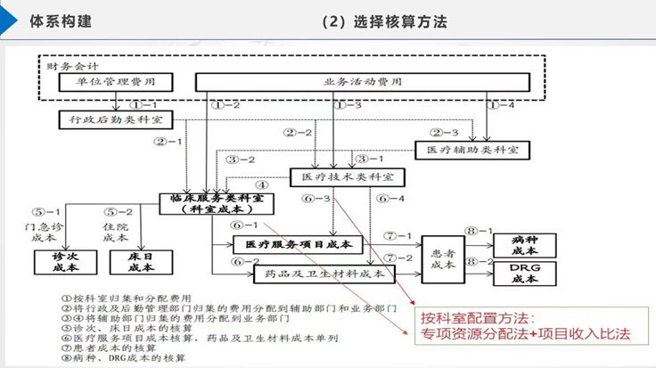
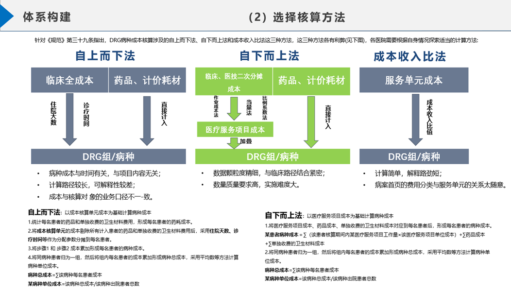
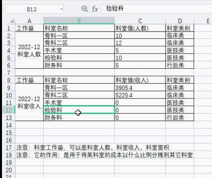

# 安德生成本分摊

# 视频索引
p1 -> 原理以及一级分摊（行后分摊）
p2 -> 其他的分摊

这个也是对我的考核的要求。这应该是我遇到的第一个难题。
也就是你自己要知道一个成本需要怎么分配。就是这样一个的问题。
成本分摊的核心就是三个：
**分摊来源、分摊依据、分摊的目标科室；**

# 分摊的目的
在医院中，除了临床科室外，其他部门（如财务科、医技科室等）通常都是作为支持和服务机构存在的，他们并不直接产生收入。然而，这些部门提供的服务和资源对医院的运营和治疗质量有着重要的影响。因此，医院会将这些部门的成本计算到医院整体的成本中，并采取一定的分摊方法将它们均摊给各个临床科室，以便更为准确地计算各个科室的成本和盈利情况。

**我的理解就是：**
实际就是为了计算 **每个科室的成本**。

# 分摊的原理
就是ysl放在excel里面的那几张图片。


下面这个表暂时先不管



三种核算方法：



## ai关于临床的解释
```
临床是指以患者为中心的医疗活动，主要包括疾病的临床诊断、治疗和预防等方面。临床涉及各种疾病、症状和体征，需要依据患者的实际情况进行个性化治疗。

而临床科室则是指专门从事临床工作的医疗科室，一般包括内科、外科、妇产科、儿科、眼科、耳鼻喉科、口腔科、皮肤病科等。临床科室是医院中最核心的部门之一，负责开展各项临床服务，为患者提供诊断、治疗、护理等服务，同时也是医院的收入来源之一。

不同的临床科室有着不同的特点和需求，比如内科和外科的医生分别负责的领域有所不同，临床科室之间也有着协作和交流的需求。医院在制定成本预算和分配时，需要根据不同的临床科室的特点和需求来确定资金和资源的分配比例，以保证医院的正常运转和患者的医疗需求得到满足。
```

它这里使用的分摊方法应该就是 **自下而上法**。
不过我要怎么来学习这个东西呢？


自下而上的项目叠加法的介绍：（这个应该主要是在讲病种的成本）


这个图我看懂了，就是它的每一项是怎么来的我知道。

下面还有一大串原理，原理不用看，反正我也看不懂。

# 根据具体的数据来推算出相关的演算逻辑


这个就是excel的截图，所有的计算结果都来自于直接的成本项。

所有的成本最终都要**分摊到临床科室**上面去。

所以医院下面就是各个科室。只不过最终成本是要分摊到临床科室上面去的。


上面几个重要的字段是：
开单科室、执行科室、收费金额；

只有开单科室能能够直接从患者那里获得收入；执行科室是分摊的受益者，要把成本分摊给拥有收入的开单科室；后者是收费项的来源。


分摊的依据：
科室工作量，可以是科室人数、科室收入、科室面积。
但是这里只有开单科室有收入，所以明显不行；任务是一级一级来分发的。

那就暂时根据科室的成本来进行分摊。

# 根据任务系统的文档来进行学习
1. 成本核算推演Excel讲解
1. 使用excel推演成本计算系统

并且对于开发来说，至少大概**要知道整个系统、业务的目的**，你才能对现有的系统进行维护或者进行拓展。

## 成本的概念
首先成本是什么？


上面的这种图片里面，这些都算成本。只不过可以对来源或者说其他的东西来进行细化。

一般来说，只有临床科室有收入；所以费用要分摊给临床科室，来计算他们的成本。

## 科室的分类
科室就分为三个：
**负责开单，有收入的临床科室**，它们主要进行开单，面诊，分配任务给医疗技术科室等。所有的成本都是要分摊给他们的。
**主要提供基金支持，统一规划预算的财政科室**。财政部。有成本。理论上可以不存在，所以要分摊给临床。
**提供技术支持的技术科室**。提供技术支持，同样有成本，所以要分摊给临床。

所以分摊是有一个方向的：核心就是这样一个概念： **A为B服务？那么A的成本就要分摊给B**。假如B是为C服务的，那么B的成本，包括他自己的，还有A上面分摊下来的成本，最终都要分摊给C。这个就是所谓的。这里就是所谓直接和间接成本的解释了。

这个分摊的方向，对于软件系统来说，也意味着数据流的方向，更具体一点就是，调用接口的方向。

**并且这里提到一点**
医技科室的不同科，可能会有一定的区别：
比如检验科，是从临床那里开单，然后就直接拿到单子去给病人做检验。 **并不需要临床的医生实际到那里去。**
然后是手术室： **这个就需要医生实际到那里去了。**
这里又是一个可以进行分摊的知识点。

上面就是科室成本的分摊的大致的思路。

关于这个分摊的方向的问题就是：
财务 -> 后勤 -> 医辅 -> 医技 -> 临床

有一个例外的，就是药品之类的，它是零增益的，也就是医院不靠这个赚钱。（现实情况的公立医院应该也是这样）

# 医疗项目成本分摊
mark
医疗项目成本是 **看待科室成本的另外一种方式。**
可以这么理解：
科室成本 -> 医疗项目 -> 病人

所以前面的那些东西都计算好之后，之后病人的收入和成本就都出来了。

和我猜测的一样，这个就是“自下而上法”。

至于DRG病组的话，就是最后，每个病人是因为什么病才来医院的，会把这个病人给分类到某个病组里面去，又算是另外的一个分类的依据。

所以这里根据病人的成本，根据DRG分组之后，把一个成本给计算出来。

## 不同的核算方法
提到了还有不同的核算的方法。自下而上只是其中一种。

成本核算的一个基础是核算的数据要准确。

# 分摊方式
前面就是讲的就是三个核心点中的第一个：分摊来源。
来源弄清楚了，那就是**怎么分摊**的问题了。
**首先弄清楚一点：分摊方式的学问应该是很多的，毕竟这个就是算法**，所以我暂时不管怎么分，我管不着。只需要知道现在系统里面，或者说培训期间是按照这么分的就可以了。

现在讲的，有三种分摊依据：人数、房间面积、收入。这个只是分摊的一种方式， **我不认可之间的任何一种，但是我还没有更好的。因为它只能根据一个系数来分。**

并且再强调一次，我的理解：分摊一级一级来分的，比如财务的话，就不用有别人把成本分摊给他。这样的。最终都会分摊到医疗科室中。
所以这里有一个可以注意的：需要 **定好分摊的等级。**比如说财务那就是第一级。没什么好说的。

**做个极端的例子**
具体的来进行分摊：
首先我还以为是开单的来源是来自哪里就把对应的成本分给谁呢？
结果是什么根据人数：
如果一个检验科进行10次尿常规，然后全部来自泌尿科室。
然后现在成本下来进行分摊，按道理说这些成本全部都是泌尿科室的；
但是如果还有两个科室，肠胃和肺，他们的人数是10，15；而泌尿科室只有5个人，难道就要把这十次的尿常规费用根据三分之一，二分之一，六分之一来分摊吗？

对，所以按照科室人数分摊只是依据的一种，真要遇到我这种情况那么肯定不是这么分摊的，它只是在用科室人数在进行举例对嘛？

## 分摊依据表
根据分摊依据表来决定到底使用哪一种方式来分摊成本。
我想我理解了。



## 分摊实践
比如说分摊的依据如果是人数的话，A科室15人，B科室10人，那么分摊就按照2比1来分摊。

然后因为计算机计算的浮点精度的问题，会导致除不尽，所以引入余数来保证除得尽，以及最后核算的总金额相等。

然后似乎并非我想的，是按照
财务 -> 后勤 -> 医辅 -> 医技 -> 临床
按照成本的来源这么分，而是
把第一级的分给所有的其他的科室，也就是说临床在第一级就会有成本被分摊给它。

公式就是： 总成本 × 分摊系数

**关于余数**
因为是按照占比来计算分配的，是除法运算，去掉多于小数位时，再去跟总成本相乘会导致少掉一点点的钱；所以最后跟总成本对比一下，出现，差值就是这个余数。


## 检验科根据项目来分摊
这个仍然是医技科室的，只不过是从财务的角度来看的。
项目，他这里是从 **收入比**来进行的分类。
财务科分摊的时候，要把财务的成本分给每个科室；
但是检验科，可以理解成**只为项目服务**，而项目来源于开单的科室，也就是临床，把检验科的成本，按照项目进行分类：
所以当医辅的项目成本计算清楚之后，直接算到医技或者临床的间接成本上去。

可以理解成 医技 -> 项目 -> 临床；这么理解。

## 临床
这里有点把开单和执行的概念搞复杂了。
简单理解就是：只有执行科室在项目上有成本，开单科室开完单就把这个事情丢给执行去做了，所以他自己能产生什么成本呢？

## 临床项目成本（就是项目）
因为临床的成本也来自项目，所以先把临床的项目成本算出来：
临床项目成本： 自己作为执行科室的项目产生的成本 + 医技的间接成本（医技的成本全部都是项目，相当与复制过来）

## 临床成本（项目+行政后勤成本）不就是总成本了。
把上面那些部分全部统计起来，就是临床的全成本了。
并且是从临床项目的角度来分析的。

### 这个是项目成本，还有其他的角度
如果从另外一个角度，比如病人来看病，根据病种来分类的话，这样子情况就又不一样了。

根据这个情况其实又可以总结出一个数据流：
临床项目 -> 病人
根据病人可以计算出病人的项目出来。

项目的成本倒是可以类似的分摊到病种中，但是类似于行政后勤的成本也许就不能这么分摊了。
所以问题是行政的成本要不要，怎么分摊到病种上面的问题。

暂时就不用考虑了，总之先这么计算就可以。


上面这个就是ysl总结的图，大概跟我想的差不多，就是这个意思。

如果确实只有这些内容的话，那我想这部分我就搞定的差不多了。

# 搜索用
一些概念，可以用于搜索的的就会放在这里。


**固定资产折旧**是指将医院购入的固定资产（如房屋、医疗设备、办公家具等）的价值分摊到它们使用期间的成本。 因为固定资产的价值不会在一年内归零，而是逐渐减少，折旧是为了反映其使用过程中的实际价值。 医院通常会根据资产的预计使用寿命和残值来计算每年的折旧额。 折旧额可以用来减少固定资产的账面价值，也可以作为成本支出列入财务报表。
这个。

就是 **固定资产通常是一口价**，所以可以根据他们的使用年限来分摊成本。

**风险基金**就相当于一个保险的钱，如果出现病人在医院出事，要求赔款的话，就用这个钱来赔款。

其他费用就相当于水电。这个相当于财务成本。
如果要记住的话，可以跟生活中的事情联系起来。

这里的直接成本和间接成本的概念容易搞错；
gpt给出的解释是这样的，从成本的用途上：
在医疗机构的成本核算中，可以将成本分为直接成本和间接成本。
直接成本是指直接与医疗服务提供相关的费用。例如，购置医疗设备的费用、药品、耗材等直接用于临床治疗的费用以及相关人力成本（如医生、护士的工资）等。
间接成本则是指与医疗服务提供不直接相关的费用，但也是医院运营所必需的费用。例如，医院的管理费用、后勤支出、买办品采购费用、设备维护费用、水电费用等。这些成本难以单独计算和核算，需要根据一定的分摊方法计算并分配到各个临床科室。
简单地说，直接成本是明确与临床服务的产生和执行过程有关的费用，而间接成本是在提供服务时不太容易分清其具体用途和归属科室的费用。对于医院管理者来说，把握直接成本和间接成本的概念有助于更精确地核算成本，评估医院效益，并优化成本结构和配置，提升整体管理水平。

而zt钟铁讲的是：
一个科室（临床、医技、财务）的直接成本就是它自己的成本，间接成本就是它承受的分摊的成本。


