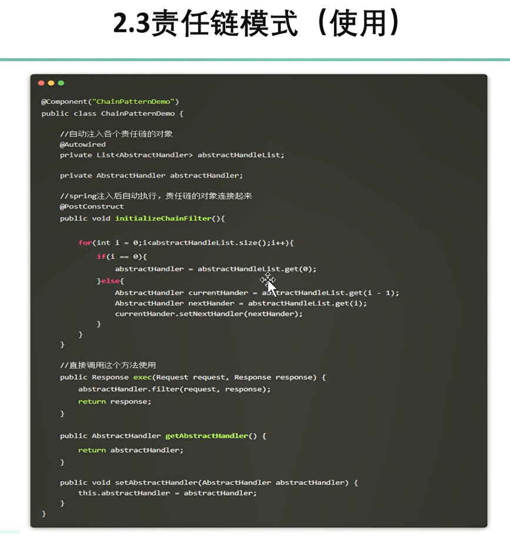

# 开发常用的设计模式
链接：[捡田螺的小男孩](https://www.bilibili.com/video/BV1DP4y1Z7mL)
归纳常用的业务场景，以及具体使用哪种设计模式比较好。

# 策略模式
## 情境
一个资源传入进来，你需要根据他的类型的不同进行多种不同的业务逻辑。

## 常规解决
使用if...else 分支

## 问题
代码臃肿，可读性低，维护的难度也大

专业的说，违反：
- 开闭原则（对于扩展开放，对于修改关闭）：这个要扩展逻辑**必须修改源代码**；
- 单一原则（一个类应该承担单一职责，规定**一个类应该只有一个发生改变的原因**）：不管是哪种哪种情况都**需要修改同一个类的代码**

简单地说：类似于 多个 if...else 的分支的代码，用策略模式优化；

## 设计模式解决
个人理解：接口定义两个方法：
- 一个定义 接口引用获得哪个实例；
- 然后使用实例执行对应的方法；

这样既可以解耦，也更好维护；**只需要添加新的实现类即可**

# 责任链模式
## 情境
比如一个常见的业务场景：下订单的时候**通过一系列校验**；
一旦中间的某一个部分出错就失败。

## 常规解决
其实我之前做编译原理的作业的时候也是很偷懒的就想到了**使用异常的方式解决**...
而且很多同学也是考虑用异常来实现的；

## 问题
问题在于：
    异常并不是用来解决业务逻辑的问题的，用异常来做逻辑判断的效率比普通的分支语句的**效率要低得多**，并且 后面业务越来越复杂的话，需要重新改动代码来**自定义一个异常类**
而且：
> 阿里的开发手册**禁止用异常来做逻辑判断**：
> 

总之记住，**任何时候都不要用异常来处理逻辑判断问题**

使用责任链模式解决

## 设计模式解决

好像**Filter**就是一个典型的责任链的设计模式。

从代码的设计上来说就是：
1. 需要有**指向下一个链结点的引用**；
1. 自己实现一个**对应的差异化的处理**；然后如果 **不是链条结尾的话，把对象传递给下一个结点**

# 模板方法模式
## 情境

我的理解就是：有多个请求去调用这个接口，但是他们之间**只有某一个流程中有细微的差别**，但是你要因为这些细微的差别的不同去写大量重复的代码；
> 一些通用的方法，却在每个子类中都重写了这个方法；

## 常规解决
这个不好想到，我也没想到。

## 问题
通用代码大量重复的问题；
## 设计模式解决

总之就是通过**抽象类定义共同的方法**，然后不确定的部分再交给具体的子类去实现。

# 观察者模式
## 情境
一个常见的用户注册的场景：

## 常规解决
如前面的图片展示的一样。

## 问题
我觉得就是代码的耦合性有点高，而且也**违反开闭原则**...
通过观察者模式优化。
事实上 Android里面观察者模式用的非常多，如果一个组件更新，那么观察它的组件也会收到对应的消息，也会更新。

## 设计模式解决

观察者模式的实现有一个对应的框架，EventBus.

# 工厂模式
这个是最常见常用的设计模式了，我大概也知道它的使用场景。。。

所以这个笔记暂时就先做到这里好了。。