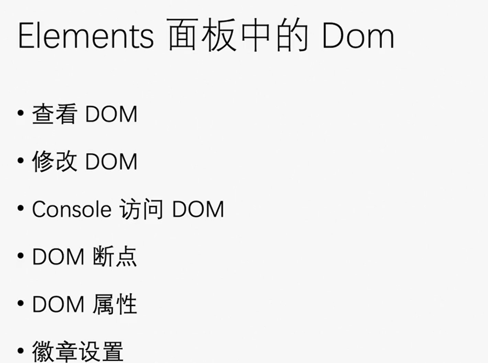

# 开发者工具devTool的使用

# Elements面板的使用

方向键的左右可以展开dom树的关闭和展开子节点。

## scoll into view
右键元素选择scoll into view：
用于快速定位网页中元素位置的功能。
浏览器会将你所选定的元素自动滚动到页面视图的中间或符合最佳阅读位置的位置上。这对于查看网页中某个元素的具体位置和样式等信息非常有帮助，并可以帮助开发者更快地调试和优化网页。

## Ruler
在元素面板里面使用`Ctrl+Shift+P`，这个可以搜索功能，就像quicker那个一样。然后搜索ruler可以打开标尺。
这个玩意的功能主要用于调整布局：
在Chrome中的开发者工具中Elements面板，"Show rulers on hover"是一种快速测量网页元素尺寸和位置的功能，可以帮助开发者更快速地查看和调整网页布局。

当你在Elements面板中将鼠标悬停在某个元素上时，会出现一个透明的矩形框，该框可以帮助你测量所选元素的宽度、高度、边距和内边距等信息。此外，在矩形框上方还会显示该元素相对于页面视口的位置和坐标，并且如果该元素有设置定位属性，会显示其相关CSS属性值。

使用"Show rulers on hover"功能可以方便地获取网页布局信息，尤其对于需要频繁调整网页元素大小和位置的前端开发者而言相当有用。此外，该功能还可以帮助你更好地了解网页布局的实现原理和相关CSS属性的作用，从而更加深入地理解网页设计和开发的原理和流程。

需要注意的是，为了使用"Show rulers on hover"功能，需要保证Elements面板已经打开，并在设置中启用了"Show rulers"选项。此外，该功能只能在鼠标悬停在某个元素时才会触发，如果你需要测量多个元素，可以轮流选择并测量。

## 元素搜索功能
xpath主要用于xml和html，它的用法感觉上更像文件路径。正则基本上可以用于所有的文本。

搜索功能可以区分三种模式：
一种是字符串搜索；一种是css选择器，对标js的querySelector()方法；一种是xpath路径匹配。
这个玩意搜索的范围是： 整个html文档。

## 隐藏元素和删除元素是有区别的，这个请注意

## Console访问元素
有三种方式：
第一个：`$0`直接就是你选中的元素。这里给你行了方便。

第二个：右键选择存储为全局变量，会将全局变量存储为temp加数字。

第三个： 右键复制js路径。

这三种方式都只适合临时调试，并不能用于来编写脚本。我需要可以用来编写脚本的方式。

## 添加DOM的断点
当某些东西（比如子节点、自身的属性或者其他）发生变化的时候，就跟设置断点一样。
效果：
反正也是用来进行调试的东西。

## 元素的属性 Properties
就是在element面板这里，跟style同级的面板，有一个 Properties面板，它会列出一个元素所有的属性。这个还是挺方便的。

## 徽章
这个其实不太好描述。
Badge settings。
比如说有一些布局是flex的，开启这个徽章选项中就有flex。
暂时不知道有什么用。

# Elements中的 CSS 的使用

然后在style那里可以看见一个 `.cls`，这个东西可以快捷的控制class是否生效和增加新的class。

## 通过box面板来快捷的修改有关盒子模型的属性

看上面这个图，它有一个类似于播放器按钮，这个可以把所有有关box的属性罗列出来，算是一个特化工具栏。

# Console面板的使用
