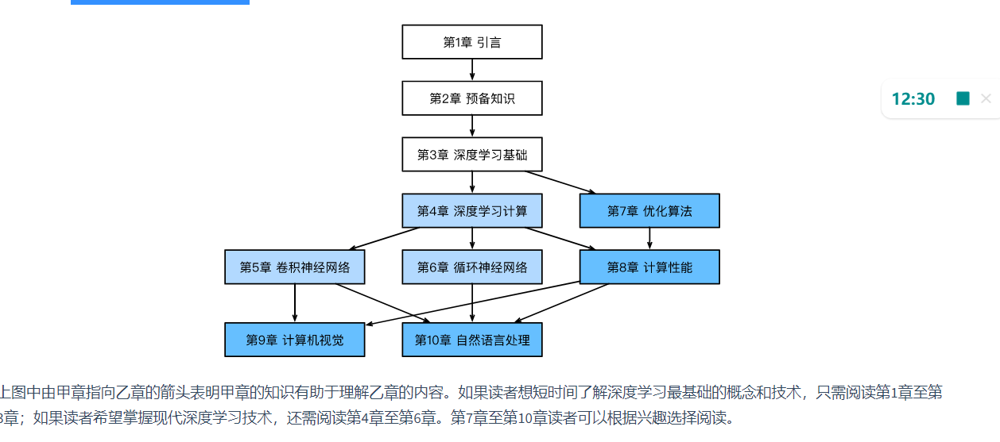

# 深度学习暨毕业设计资料
深度学习我准备按着这个攻略来学习。
[GitPages](https://tangshusen.me/Dive-into-DL-PyTorch/)

# 阅读指南
本书的阅读可以分为三个部分： 按需要，把三个部分都阅读完毕。
第一部分（第1章至第3章）涵盖预备工作和基础知识。
这部分是用于入门，扫清障碍。相当于大一。

第二部分（第4章至第6章）关注现代深度学习技术。
实用技术：类似于直接学习Java、Python等编程语言。

第三部分（第7章至第10章）讨论计算性能和应用。
性能优化和具体应用。 算法，或者说面试的高频考点。



# 第一章：深度学习简介
现在最广为人知的“人工智能”的概念，深度学习就是它的一种。

> 实际上，或者说幸运的是，大部分程序并不需要深度学习或者是更广义上的人工智能技术。例如，如果我们要为一台微波炉编写一个用户界面，只需要一点儿工夫我们便能设计出十几个按钮以及一系列能精确描述微波炉在各种情况下的表现的规则。再比如，假设我们要编写一个电子邮件客户端。这样的程序比微波炉要复杂一些，但我们还是可以沉下心来一步一步思考：客户端的用户界面将需要几个输入框来接受收件人、主题、邮件正文等，程序将监听键盘输入并写入一个缓冲区，然后将它们显示在相应的输入框中。当用户点击“发送”按钮时，我们需要检查收件人邮箱地址的格式是否正确，并检查邮件主题是否为空，或在主题为空时警告用户，而后用相应的协议传送邮件。

举了两个例子：大部分的编程，都不需要现实的真实数据；例如编写页面或者写一个发送Email的客户端；

但是若程序涉及到现实的具体规则，它就不是简单的这种“将大象装进冰箱这种”谬论了。
引用书中的内容：
> 与此同时，我们很容易就能找到一些连世界上最好的程序员也无法仅用编程技巧解决的简单问题。例如，假设我们想要编写一个判定一张图像中有没有猫的程序。这件事听起来好像很简单，对不对？程序只需要对每张输入图像输出“真”（表示有猫）或者“假”（表示无猫）即可。但令人惊讶的是，即使是世界上最优秀的计算机科学家和程序员也不懂如何编写这样的程序。我们该从哪里入手呢？我们先进一步简化这个问题：若假设所有图像的高和宽都是同样的400像素大小，一个像素由红绿蓝三个值构成，那么一张图像就由近50万个数值表示。那么哪些数值隐藏着我们需要的信息呢？是所有数值的平均数，还是四个角的数值，抑或是图像中的某一个特别的点？事实上，要想解读图像中的内容，需要寻找仅仅在结合成千上万的数值时才会出现的特征，如边缘、质地、形状、眼睛、鼻子等，最终才能判断图像中是否有猫。

此时， 之前的那种思考方式便不再有效。 解决上面这个问题的一个有效的思路就是“逆向思考”。 这个也是机器学习和深度学习的核心思想： 也就是从问题本身入手。 我们可以称其为“用数据编程”。
大概是什么意思？ 就是具体来解决这个问题，提供实际的数据，然后目标就转换成了怎么利用这个函数得到正确的数据。 

可能我描述的有问题，那可以去看原书。

> 通俗来说，机器学习是一门讨论各式各样的适用于不同问题的函数形式，以及如何使用数据来有效地获取函数参数具体值的学科。

他们的主要的表现形式为神经网络。

老实说，这就是计算机技术的核心应用： 工程师们建立模型，然后模型通过廉价的算力来解决人们觉得棘手的问题。

深度学习几百年前就有研究。
简单地说， 深度学习就是一种通过大数据来“预测未来”的行为。

深度学习的主要表现形式就是神经网络；绝大多数的神经网络都有以下的原则：
- 交替使用线性处理单元与非线性处理单元，它们经常被称为“层”。
- 使用链式法则（即反向传播）来更新网络的参数。

我现在看不懂。
但是，深度学习需要极强的算力，这是非常重要的。

硬件的发展趋势是导致各种人工智能技术发展拐点不同的核心原因。

总之，深度学习在近十几年的时间里得到了长足的发展。

## 区分机器学习和深度学习
机器学习重点是如果通过训练，让计算机更好的得出符合人们期望的输出；
而深度学习关注的则是如果通过训练，让计算机能够一步一步的把简单的数据抽象成高级的数据；使得数据越来越具有价值；

...
关于深度学习的发展历史：我个人是实用主义者（并非看待数据理论的哲学家或者科学家），短时间内不能挖掘这一章节的价值。 所以我决定暂时跳过这一部分，直接从环境搭建开始。 但是并不是说我认为这个部分不重要， 往往这个部分对于整个体系是最重要的，只是我暂时没办法挖掘它的价值。

# 预备知识
## 环境安装
一个主要的就是安装Python的一个最著名的发行版环境：Anaconda。
推荐先看两个指南。 然后安装Anaconda。

Jupyter是一个强大的记事本工具，它使得撰写与代码有关的文档变得相当容易，而不是苦逼的反复在PythonIDE和Word文档直接反复切换。
Note: 我没有看完。 如果以后有提到再来细看。

## 数据操作
在PyTorch中，`torch.Tensor`是存储和变换数据的主要工具。
Tensor和NumPy的多维数组非常类似。 不过 Tensor更加适合深度学习。

### 创建 Tensor
首先导入PyTorch：
```py
import torch
```

然后我们创建一个5x3的**未初始化**的Tensor：
```py
import torch

x = torch.empty(5, 3) # 相当于五行三列？
print(x)
```

随机初始化则调用rand方法：
```py
import torch

x = torch.empty(5, 3) # 相当于五行三列？
print(x)
```

创建一个5x3的long型全0的Tensor:
```py
import torch
# zeros就是表示默认为0值，然后 通过dtype参数指定数据类型：也要指定torch里面的；
x = torch.zeros(5, 3, dtype=torch.long)
print(x)
```

暂时就先写这么多。 如果有需要的话，直接去[教程的指定页面](https://tangshusen.me/Dive-into-DL-PyTorch/#/chapter02_prerequisite/2.2_tensor)去看。

可以通过shape或者size()来获取Tensor的形状:
```py
print(x.size()) # call its methods;
print(x.shape) # call its fields;
```

还有一些常用的数学工具也可以去上面的页面里去查。

### Tensor的常用操作
加法有多种方式来实现。 暂时不管。

Tensor中，索引操作也是非常常用的，并且**引用的是同一块内存**。

有着相当多的数学运算...

天哪...我根本不知道我怎么能学习的下去...这个数量和内容的深度...

