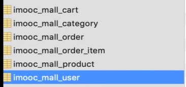
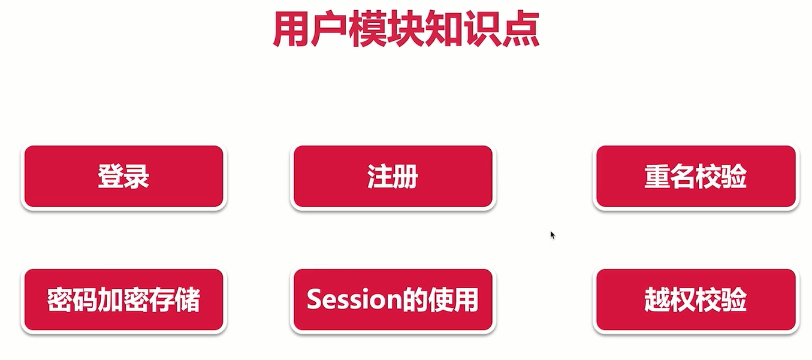

# 生鲜项目
项目亮点：
- 技术栈新：和SpringBoot有关的技术基本都用到了
- 代码结构清晰简洁，这是我要重点学习的；

因为是 从0到1那个项目里面抽取出来的一部分，所以最主要的不是这个项目我有没有它，而是把**详细的开发流程过一遍**

# 功能模块（田杰最看重的需求部分）
不过现在我的重点在技术栈的学习以及编码水平的提升，这个可以之后再谈；

# 下面就是一步一步的把这个项目实际的做出来了。

# 工具准备
就我知道的那些：编码，可视化，接口测试。没什么好写的
## 插件介绍
好的生产力工具是必不可少的。

1. maven helper
1. free mybatis plugin：mybatis的插件功能我基本都认识过，这个大概率不需要装，主要是mapper和接口的**快速跳转和一键生成**等。

亏我还做了这么大功夫你这就没了？

哦他这里使用的MySQL的版本是mysql 8.0

# 数据库层
这里也是视频里面做**项目初始化**的部分。
 
就是我所知道的db的设计；
不过这里的话，timestamp有一个自动更新的，MySQL内置的功能值得注意；还有所谓的**目录功能**也是用数据库维护的，这是我不知道的。

而且还有一个重要的点：你的数据库结构**不可能永远不发生变化**（业务肯定是要拓展的）；所以在设计表的时候一定要设计成**易于维护的**。

## 在进行业务开发的时候，如果选择技术？
- 熟悉的技术，这样速度快，稳定，你也好维护
- 拥有强大社区的支撑的开源技术，这样你的问题好找到，好解决
- 技术要一直发展，因为你以后可能要维护和做迭代的
- 因为后端主要是考虑业务，所以**思考问题最好从业务端考虑**

## mybatis的初始化： mybatis-generator的使用
主要就是一个mybatis gen的作用，我判断的是：通过提供**配置文件**， 来自动生成**mybatis的相关代码**
这个插件是个好东西，用来学习的快速开发的时候非常合适

逻辑就是：你告诉这个东西表的信息，他可以把**dao层相关的后端代码**（dao接口，mapper配置文件，pojo实体类等等）一键生成

wait coding...
这里可以实际的去学一下这个好用的三方库

## 初始化过程之一：编写接口代码并测试
前面gen生成的是dao层的代码；接下来的controller和Service都需要你自己去写；
我记得前面boot整合mybatis的时候好像上面是要**加mapper注解来生成接口的实现类**
如果没有的话那就需要在boot的启动类上 加一个包扫描的注解：`@MapperScan` 指定一下mapper在哪里。

不过spring的bean的注解版是 注解`@Componet`，我不知道这里和实际出现的异常有没有关系？
啊如果不在dao的接口上加 bean的注解的话确实好像也会在Service的自动装配那里报错

wait updating...

## 初始化过程之一：引入log4j2日志系统
虽然我没用过，但是我感觉现在不是时候，所以这里随便写一下：
一般日志系统的级别：
> ERROR - WARN - INFO - DEBUG - TRACE

常用的是error和info以及debug。

想要使用log4j2只需要排除boot原先使用的依赖然后引入它的依赖的坐标就可以了。
总之是不会具体写的样子

## 初始化过程之一：通过aop技术实现过滤器：打印每个请求和响应
这里其实是个重要的内容，但是本质上就是讲spring和mvc的两个重要内容：
一个是aop的用法（没有说原理，黑马的），一个就是过滤器

所以这里不写，仅仅记录一个坐标：
使用aop统一打印请求和响应信息。

至此，**项目的初始化应该已经完成**

# 功能模块开发
下面的内容就是各种功能模块的开发了；
根据需求指定出来的架构来进行代码的编写；
每完成一个模块的开发记得要**进行测试**

## 用户模块的开发
在这个项目的功能介绍部分有贴出来那个功能模块的图，如果需要可以去看

这里的每一个知识点都可以成为我的资本。

### 接口文档
就是用于前后端统一开发规范的纲领文件，相当于开发的白皮书
一般就是用 Markdown格式，把前后端需要统一好，通知好的东西写清楚就行；

而且看他这开发文档这里好像**没有用restful的风格**，这里注意一下；

### 编写统一返回的API对象
前后端分离时，后端向前端返回的都是一个固定类型的对象：包含状态码，消息，以及data数据；

common包里面是通用的对象，他这个例子里面的通用返回对象就是放在这个里面的； （不过好像别的里面也有专门建一个 vo包的那种）
然后expetion包里面就是处理异常用的，它用了一个**枚举类**，我自己的话对枚举类没什么印象；

