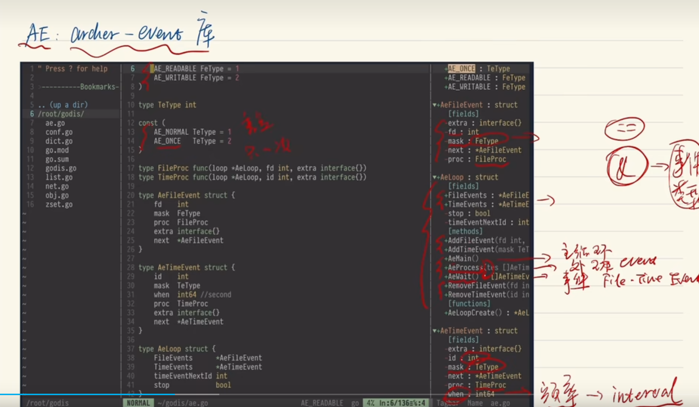

# 用Go撸一个Redis出来
这个up提示说不要过分的去关注细节，本身就应该是从整体到细节的过渡，这也是一个所谓的误区。

# Redis的核心概念
想要深入理解 Redis需要：
1. 理解Redis的核心概念
1. 熟悉核心的执行流程
1. 了解**原始的**核心数据结构

重点就是：
redis.c：核心代码
ae.c：事件库
dict.c：字典数据结构的库

而在 redis.c 这个c文件里面，有四个核心结构体：
直接贴图好了。。。
看了第一节的视频我主要是知道这些数据结构或者文件是redis软件的核心，但是我没有学到什么东西；

等等...我在考虑去用rust去写这个？

因为有现成的godis的代码，所以我准备用rust语言尝试实现一个性能更高的redis出来来锻炼我的编码能力试一试。

# 后面粘贴的内容
考虑用rust实现。
主要是能够学习Redis的架构。

首先是这个软件的整体架构。
看源代码的1.0版本可以方便的，了解整个软件的架构。
然后是2.0和3.0的版本的diff

4.0之后Redis就有部分理念上的升级，那就是另外一码事了。
要了解Redis的整体架构，你需要
0. Redis核心的概念
1. Redis核心的流程
2. 核心数据结构

首先来关注一下Redis的源码结构：
核心代码在Redis.c里面

然后它的主程序主要会调用三个重要的库：
ae.c事件库
anet.c网络库，做了一些网络API的封装
zmalloc.c调用内存用的库，一些内存函数的封装

之后剩余的就是主要的数据结构了，以及一些辅助代码。

介绍Redis核心概念
客户端主要是一个命令行工具，它和服务器的主逻辑是没有很大关系。 所以他这里不会重点去讲。

这里详细看Redis-Server的核心字段。
fd 文件句柄，没有这个东西不能去监听网络世界，虽然我也不知道为什么。 我自己个人的理解是，这玩意儿是文件的一个标识符。

db：这是一个指向底层数据结构的一个集合指针。 本质是一个指针，但是你可以把它当成list来用。 而且我之前学Redis说不是说默认有16个数据库吗？ 这个好像就是指用哪个数据库的那个指针，不过我觉得这个东西没什么用啊，默认不就只用了一个数据库吗？所以我大概知道那个是什么意思了。

client：用来维护与server连接的客户端的字段。

eventLoop：一个核心的字段。是一个指向Ae那个东西的一个指针。

Redis-Client文件的核心数据结构：
fd和server一样。这里是基本的网络概念，也是用于网络通信的。可能就是因为这是基本知识，所以他才没重要讲。

query：表示client目前的请求。它实际上是一个buffer，因为是会有很多请求的。

reply：这是针对客户端发出的请求，服务端返回的结果用reply字段表示。他是一个object的指针。就是结果的指针。

RedisDb：表示数据库本身，来看里面的字段。
dict，一个很大的字典。就是存储数据用的，本质就是一个hashtable

expires，表示kv数据的过期时间

然后是object。
这个就很明显啦，来一个指针指向实际的数据结。
然后用一个type标识类型。
以及它的引用次数。我想这个和Python的那个引用计数器很类似。他是用引用技术来管理内存的。当计数器为0的时候就会释放内存。

上面这四个就是Redis最核心的四个概念。

他最重要的核心流程就两个：
第一个是启动，入口函数具体做了一些什么事情？你好比Linux他的就是不断处理中断和中断的过程。第二个就是与ae库相关(再重复一下ae是事件库，不用在乎他为什么叫ae)的请求流程，像是request和reply(我或许该说response？)的部分。

他核心的数据结构就是object字典以及一些其他的一些细节的数据结构。

​​​​​

# Redis的核心流程的介绍
我觉得看代码应该一般也是从入口函数看起，毕竟这就跟玩一个游戏，就先开始从主线任务做起嘛，对吧？

主函数一般是两个事情，一是做初始化
二是做主循环，因为现在没有哪个软件是run一次，然后结果就结束了的
这个循环或许跟我所知道的事情循环是本质是差不多的，那主循环涉及到的就是核心流程了。

好，现在来看一下他main函数里面的主流程
第一是初始化它的config，一般大型软件都是先做这个，优化的话一般也可以从这里下手

第二是初始化他那个核心的server，

第三就是和事件循环相关的，是的，我想一个主要的软件基本也是这么运行的
aeMain就是这个主函数的主循环

然后来看一下他这个初始化服务器函数做了些什么事情？
一些我所知道的，客户端，slave的初始化
激活的fd可以用来处理各种事件，或者是说网络请求

ae库：（这玩意儿算一个核心的调用库存）
学习他之前首先需要弄清楚io多路复用

之前学习Linux的时候知道Linux操作系统中一切皆文件，所以操作系统对，不管是磁盘也好还是网络也好你都可以把它当成某种文件来处理。

简单来说，主线程在处理可能会存在阻塞风险的任务的时候，它不能就真的就阻塞在那不干别的事了，它是被阻塞，而不是在正在忙碌的状态，这就是io多路复用的核心。
只需要了解这么多就够了，具体的底层的原理暂时不重要，毕竟不是专门来介绍这个的

那ae库里面的两个结构体，TimeEvent和FileEvent这两个就是基于定时器和文件句柄就绪状态的回调。这个意思其实挺简单的，所以我不详细讲了，继续看

然后这个库的loop逻辑，就是这些结构体的链表，不断的查询看哪一个处于就绪状态

这个总结的非常到位啊：不考虑，IO多路复用本身的原理的话，整个ae库做的事情其实是非常简单的

现在回来来看这两个和ae相关的函数：
Create就是根据文件句柄和对应的事件呀，以及读写，来创建一个对应的事件，并用头插法插入到链表的队列中。

ae的main函数，就是一个循环，去不断的处理这些事件

迄今为止整个主函数的逻辑中，它是只有一个事件的，你看源代码可以知道，就是服务器的文件句柄以及一个可读的标志readable，他还注册了一个回调函数handler，换句话说这个handler，他就是核心流程的入口。

那下面来看他的逻辑：
里面的核心函数，就是accept的函数，学过网络编程，就知道它是用来监听网络连接的，那么这里如果监听到其他网络请求的话，他这里就，可以拿到客户端的网络句柄，随后，流程会尝试用拿到的这个句柄在服务端中抽象出一个客户端对象出来，handler里面就做了这么一件事

随后来看创建客户端对象的这个函数，它是怎么创建的：前面是一大堆的初始，非核心，
重要的是他在，这个函数里面他注册了一个FileEvent，传入的句柄参数就是他自己的句柄，为可读标志，意思是如果这个客户端有数据过来的话，他就会触发回调函数，这个回调函数是什么呢：这个函数是从客户端那里读取它的查询命令，换句话说，这就是客户端的命令到服务端的入口。

下面就是看这个函数，这个回调函数他做了什么事儿？ Read query from client
首先他用一个read函数把这个socket里面的东西给读出来（厄再次重复一下，因为所有东西接文件的概念，这里实质的文件其实是一个网络socket）

接下来这里的意思我不怎么懂，在这里不是继续read函数吗？Read进来后会把内容发到一个buff里面，然后后续他会把buf转化成args

他这里以一个最简单的命令做了例子，这个args似乎和URL很接近

好吧，暂时先不讨论这里的细节，

在处理完这个args之后呢，相当于服务端已经拿到了客户端发送过来的命令，现在就要开始处理它了，通过一个process command的函数，呃，并且这里有一个go to语句，如果这个buff还有内容，他就，继续执行这个again流程，

换句话说，客户端一次发过来的请求，他可能包含多个命令，所以他才会用这种方式来处理所有的命令

那接下来再来看一下这个process command函数它是怎么处理这些命令的：

这里up主提到了一些非核心的流程，比如主从模式，还有持久化的，也就是说这些逻辑的处理其实也在这个函数里面

一条Redis命令就是，由命令和参数构成
所以这里有一个，函数look up command会去查看命令的类型，然后Redis内部提供了，一个table用来对应，命令处理的主流程，这里的逻辑其实挺简单的，不过我语言不太好描述，所以就写在这里（其实就是对应的回调函数嘛）

比如说Redis客户端发过来的get请求，在table里面的，对应的就是get command，也就是一个函数实现一个功能

然后再继续往里面深入，来看一下这个， Get command本身

这个函数的第1步是首先去dict里面找到key，
如果没找到的话，就返回一个没找到的结果

如果找到了呢？并且是一个string类型，那就把它返回回去。

如果找到了，但是它不是一个string类型，那你就不应该用get命令来取，那就会返回一个类型错误

在get command的这个函数里面，大部分的工作都是通过一个函数addreply来实现的
所以来看看这个函数的逻辑

这里插一嘴，尽管它本身是单线程，但是非常多的工作都是通过回调函数来实现的，我感觉这种机制其实挺，不太好评价，说实话，毕竟后面可是有回调地狱这种称呼的，不过嘛，Redis是一个程序，并不是我写的代码，它的架构怎么样我并不是很关心

好继续上面那个函数的内容，它里面的核心其实还是注册了一个 file event事件，这次的文件标识是可写，注册的回调函数是send reply to client，就是在允许的情况下将数据写回到客户端中，应该就是这么一个逻辑

那继续来看注册的这个函数send reply to client的逻辑

因为他的工作就是把数据写回到客户端，所以它最核心的逻辑其实是一个write函数，把其他事情做完之后呢，通过ae库的deleteEVENT函数把它删了就可以了
顺便一提错误处理的代码相当的多，这挺正常的，不多说

这里要贴一个图片，名字就叫做 Redis核心流程介绍总结.png

我自己也来回忆一下这个流程：
首先是main函数里面有一个重要的事件：
文件处理事件，他初始化的时候里面有一个，入口的回调函数，负责的是网络请求的监听，监听到客户端的网络请求之后，就继续调用对应的回调函数去处理请求，然后这个函数，拿到请求之后呢，就把请求转换为一个args，然后再调用另外的函数，开始进行处理，总之后面的函数都是，跟那个处理有关的，我已经做了笔记了，这里就不详细回忆了。这玩意儿记不住的，就得靠东西记下来

总结一下，整个流程里面一共涉及到三次file event的注册，

Redis核心的数据结构
主要是三个，字典字符串和Redisobject

字符串涉及到一个SDS的数据结构，听作者说很简单

字典的话主要是两个：一个是过期（expire）是什么实现的，还有一个就是rehash的实现。这个会采用2.6的版本来讲解，因为1.0的版本没有实现渐进式rehash

关于RedisOBJ的话，主要就是，它的机制问题，比如说内存管理，引用计数，还有对应get和set命令的生命周期

先来看看字典的代码：
呃首先Redis本身就算一个大的KV数据库，对于字典质而言，它分为两种，一个是存储数据，过期时间有关的KTV叫做expires，还有一个就是存储数据本身的那个了，也就是所谓的dict。

关于这个dict的本身的struct，
厄它里面有三个重要的属性
第1个是一个类型，它标识这个数据的类型，算一个标准配置了。

第2个和第3个都是哈希表，有不同的作用
这里up讲的内容似乎和弹幕有点分歧，暂时先不管，总之他这里说的是这里的哈希table是一种比较传统的，类似于Java底层的那个，那种拉链式的链表，也就是底层Entry的一个实现原理，

顺便说一下他这里的两个哈希表，在struct里面的形式居然是一个只有两个元素的数组，这我是真没想到啊，我想的是，嗯，好吧，我也没想什么

好吧，这个entry就介绍到这

来看看这个dict type
刚刚不是说了这个字典里面需要记录它对应的数据类型是什么吗？它就是由这个结构及指定的

来看看他的数据结构里
他有一个哈希function来记录，对应的哈希算法

啊哈哈up主这里还说Redis的作者，他比较是喜欢，怎么说呢，就是喜欢写代码的那种，它的代码水平很高，它里面的源代码的数据结构啊，算法那些，就算是当成库文件给其他的程序使用也是没有问题的

不过换句话说，这些算法，是怎么实现的，那就不是核心了，没什么用

总之字典的核心流程大概是
先去过期的那个里面匹配，没有过期就再去字典的两个哈希表里分别遍历一遍，速度还是可以的，算是一个平平无奇的字典实现

关于expire的核心原理其实就是，一个字典，的value值来存储过期时间，之后其他的东西都可以计算机对应的计算出来

并且， 由于Redis是一个单线程架构的软件，他没有能力做到及时扫描过期的key并且执行删除的能力，所以他采取的是一种懒删除（也就是说空闲时期再去删除，过期了就过期了，但暂时不会动）的方式
总结一下，它实现expire的方式就是双字典和，设置懒删除

关于渐进式ReHash，他也是诞生于Redis是单线程的大背景下的。一些大而重的操作，如果用Redis的那种单线程去执行的话，那么很明显的它就会被卡住，渐进式ReHash似乎就是用来处理这个问题的。

来看一下他的具体操作是怎么做的
嗯，我还是没怎么弄懂渐进式哈希本身是什么意思？以大化小的意思我知道，但这个操作我就不清楚了，那就先看看

这个方法他会他接受一个字典参数，首先判断一下他是否处于ReHash的状态，如果值为促，那么他就会走一步，这里走一步带指的是这个ReHashStep这个函数，默认是走一步

然后来看看他这个一步是怎么走的

这里阿婆才想起来，他还没有解释为什么需要渐进式ReHash，首先所有的哈希表都涉及到一个扩容的问题，默认哈希表一般都不会做很大大小一般都是16啊，64，比如Java的默认就是16，到64之后会转换数据结构，但这是Java的，这里不详细说明，顺便这里补充一下复杂因子的概念，负载因子就是指哈希表，已经有的数据与，容量的比率，到达这个值的时候，说明哈希表内部已经空间不足了就需要扩容，所以简单的来说，负载因子和哈希表何时扩容有关。

因为前面有提到过，一个简单的哈希的实现方式，就是一个拉链式的列表，如果数据容量过大，那么此时会导致哈希表的查找效率从o1降低为on，这就是为什么需要进行扩容的核心原因。

而扩容的实际过程，我想我也清楚，就是把一个旧的容器中的数据放到一个已经扩大的新的容器中。所以如果当你的，数据量非常大的时候，那么这个过程将会变得十分的缓慢，会发生大量的ReHash的过程，甚至有可能卡死你的线程，

在解释清楚这个，原理之后，来看看ReHash这个函数

厄大概的过程其实就是H0转化到容量更大的H1的过程，然后把H1转化为h0

这里弹幕有提到桶排序和，HashFunc选用的问题，可以留个心眼

之前上面提到的h1h0的部分，他的逻辑是如果全部ReHash完毕了，再把h1变成h0
这里似乎有一个循环，如果没有ReHash完毕，那么就要看索引的位置在哪

还是没怎么听懂，那继续按他说的来
如果找到了，不是空的那个ReHash的索引，然后找到的这个东西它是一个列表，把这个链表编译一遍遍，历的时候对应的按照对应的算法把它的数据从零复制到一那边去，我也不知道是什么意思
这里的拷贝似乎和哈希散列函数有关

并且这里up主还提到，不仅仅是set命令，连get命令也会触发key的ReHash过程，因为你的这些key只要被人使用，那它的索引就一定会产生某种变化，听这里说的

下面开始讲RedisOBJ，这里有个小故事，这玩意儿曾一度是RedisOBJ架构的基石，注意这个词语，一度，也就是说现在不是了，看看他待会儿会怎么解释

这里应该还是以1.0版本讲解
这个create object方法里面，呃，核心的还是他会把它的引用计数初始化为1，
然后还对应有增加应用计数和减少引用计数的两个方法，增加没什么可说的，减少的话有一个判断，如果当引用计数的值为零时，那么就需要释放掉这部分内存了

题外话，引用计数，这种GC的方式，实现简单，不过他对于循环依赖，这个问题无从下手

不过这个场景在Redis下不会发生

不过刚刚说了这么多和内存管理有关的，但这个，引用计数，它实际上，最核心的功能是一个share，
具体解释就是一个key value从服务端读取出来的时候，涉及到copy操作，而发送到客户端的时候又涉及到copy操作，

算了，具体的就不管了
接下来通过set和get的过程来看一下RedisOBJ的生命周期

首先是set过程
首先比如，从客户端传过来一个普通的set命令，服务端首先会调用process command的方法来处理这个命令，之前已经提到了那个流程里面是就是这一段set命令它是query buffer，后面会转成args，

这里的key和value都是Redis中特有的， SDS字符串，它的全称是simple dynamic，string也就是所谓的动态字符串，和主流的编程语言不一样的，是主流的编程语言的字符串不能动态扩容，而Redis中这个数据结构它是可以的，动态扩容的

总之process command的方法会调用create object的方法在创建完毕RedisOBJ之后呢，这部分数据会存在Redis  client的之中的args之中，这里还提到了它的数据类型，不过我就没管了

根据set过程的那个图片啊，存储的那个分支就算结束了，然后process command的方法里面还有一个look up方法，它会查看命令的具体类型，然后去调用底层的逻辑去执行它，比如说这里因为是set过程嘛，所以就会判定它是一个set command命令，然后执行对应的逻辑，

这里插入一个图片，名字叫RedisObject生命周期的set过程.png

然后会调用generic command的，也就是通用的set命令方法，执行对应的逻辑，然后对应的这个key和value的计数器就会加一，原来是1，现在就是2啊，这个逻辑，有机会再考虑，总之把这里所有的过程完成之后呢，它就会向用户反馈ok了。

之后就会调用一个reset client的方法来释放客户端的资源

好，现在来看一下get过程
Get过程的启示和set的大概逻辑差不多差异主要取决于set和get的之间本质的区别

Get这里没仔细听，如果有需求的话就再慢慢考虑吧

以上的内容就是Redis设计的精髓，

并且Redis的作者antirez一直想实现一个lazy Redis，并且为之做了很多努力，可以去看看他的博客，嗯，这里提起这个的原因，主要是说RedisOBJ在后面版本的Redis慢慢开始边缘化了，为了更好的实现更高的吞吐和更低的阻塞，后面慢慢思路，逐渐转变成了异步io

终于要开始写代码喽
搞了这么几天的Redis了，依旧还只是模模糊糊摸了个大概，没事啊，只要能增长技术那就是好的

下面开始写代码，考虑用Rust的实现，因为它够源，这里反正有现成的，我也可以放心的把笔记一起写到这里

首先是他这个ae.go，尽管Redis源代码的ae的全称到底是什么意思？搞不清楚，不过这里自定义的这个ae作者他挑明了它的全称是Archer Event，这是一个库文件，epoll之类的函数也会放在这个库文件里面。

另外提一下，这个epoll算法是Linux平台特有的算法，因此，实际上写的这个项目是不能够跨平台的。

conf.go的话，则是对应的，配置库文件，不同于spring，用yml做配置文件， Go和rust似乎都是有对应的文件类型来表示配置文件的，这里先不管，并且配置文件通常不推荐用，编程语言的方式来进行配置，特别是静态编译的语言，因为这会影响编译，

另外就是5种基本数据类型的实现，Redis的5种基本数据类型

Redis的string（SDS）和GO语言的string的实现方式非常类似，所以这里不额外自己实现

obj.go里面就是对应的RedisOBJ的实现了

net.go是网络库，并且因为要还原Redis单线程的架构，所以不会使用GO语言，特有的携程和管道，而是使用大量的系统调用，例如socket except read write等等，这些方法在c语言中使用的非常多。

godis.go里面就是主代码了，用rust实现的话我会考虑直接命名成main，毕竟它是有对应的命名规范的

首先是ae库的代码：
里面最核心的结构体是AeLoop，他是ae库，的主循环的结构体，里面有两个最重要的成员，就是之前提到的， file event和time event

中途插一句嘴，可能比我想象的要难很多，要用rust重构的话，而且我已经不考虑写代码了，实际上。代码要考虑的细节太多了。

继续ae库的代码。
file event和time event中的文件事件是用对应的FEtype和TeType（两个单独再重新定义的结构体）表示的。

因为 TimeEvent没有文件嘛，所以通过字段id来进行区分，而 FileEvent涉及到文件，所以有fd的情况下就用不上id了。

这个 TeType底层就是1和2两个状态码，作者给他的定义是（因为这个是时间事件嘛）所以1代表普通的normal，而2为once，代表只执行一次。

虽说打字可以使得字符的准确率更加的精准，但是速度绝对是比不上手写的

对于 TimeEvent来说，里面还有一个字段为 when，意思就是到某个时间点（类似于unix计时法，是一个大数字）就执行对应的回调函数。是这么个逻辑。

另外这里up提到了为什么 TimeEvent中的字段名称为什么要叫mask：因为在redis中，原作者是通过位运算来判断属于哪个type的，所以对应的就用上了mask这个名字。属于是有典故的。不过在godis的这个代码之中，就直接用两个等号来判断类型了，就只是复用了名字。

然后 AeLoop的主代码里面呢，关于 FileEvent和 TimeEvent两个就主要是对应的add函数和remove函数。 AeMain呢就是主循环，AeWait里面就是包含事件的循环队列，反正常见的这种链式结构似乎在go里面都没有封装（或者说没Java封装的那么好），统一都是用一个切片来进行存储的。

以上，就是ae库里面最主要的逻辑的代码实现。
我觉得可以贴一段代码在这个地方，会很有帮助的。

网络库
这里作者为了1:1还原Redis，会使用大量的系统调用而go语言封装的太好，所以需要使用第三方库的系统调用代码

这里之前引入了一个三方的购物语言的库，它封装了不同于官方的Unix网络库的代码

网络编程这部分我不太熟悉，他讲的东西我也听不太懂

这里普及一个大端小端的概念，简单来说就是高位置可以存储低位置的，数据大端就是这么做的小段就是高位置，存高位置的数据，低位置存低位置的数据

这里不搞太复杂了，总之net库，就是用来，模仿Redis内部类C环境的那个过程，会把4个基础函数read，write，accept等实现一遍

基础数据结构Object
嗯，主要是往struct里面添加一个引用计数
然后方法里面有用于计数的命令，加1减1啊，这些操作

List的代码
他node里面的值，经过一番考量之后呢，最后还是使用了空接口，他这里没有用原先的Object，并且提到了使用双向链表，来释放的话，操作会变得简单很多，但我还是没听懂，
总之单单只看这一个node的节点的话，它就是一个最朴素的双向链表。尽管他大部分时候装的都是object的

而list的话，它里面就包含了节点和头节点尾节点的指针，也是比较朴素的实现

关于dict：
Up主只实现了两个方法，比原版Redis的要简单一点，原因是因为第1个是go自带GC，第二不想把它弄得太复杂，其中DictType这个struct就是用来存储 dict需要用到的相关的方法。

godis应该烂尾了...
我不知道到底怎么来学习它。。。