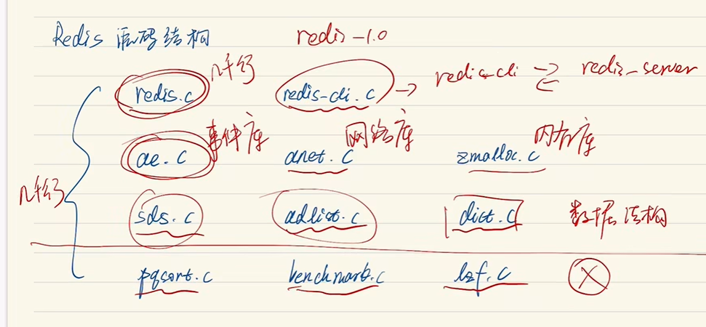
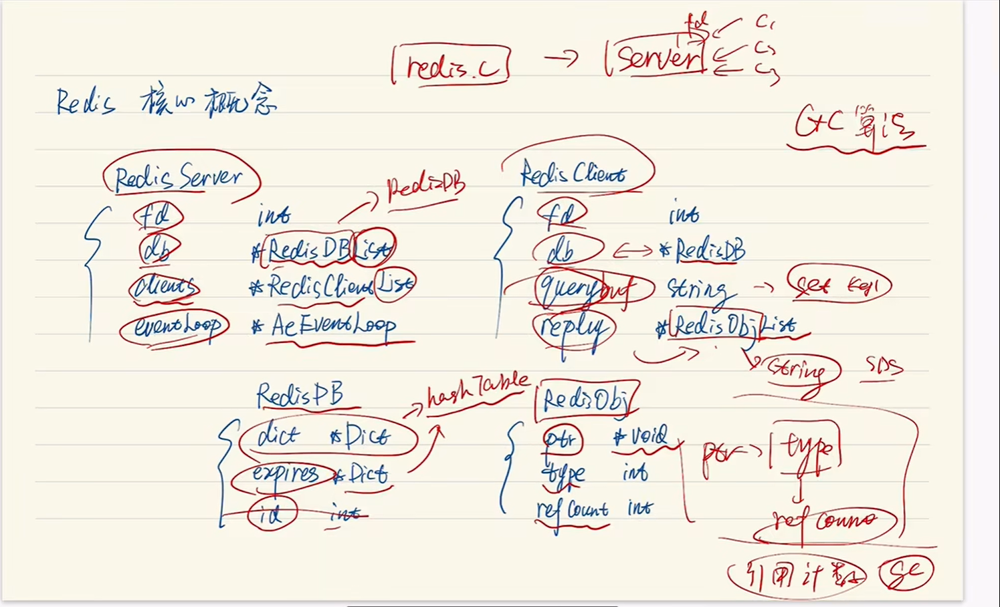

# 用Go撸一个Redis出来
这个up提示说不要过分的去关注细节，本身就应该是从整体到细节的过渡，这也是一个所谓的误区。

# Redis的核心概念
想要深入理解 Redis需要：
1. 理解Redis的核心概念
1. 熟悉核心的执行流程
1. 了解**原始的**核心数据结构

重点就是：
redis.c：核心代码
ae.c：事件库
dict.c：字典数据结构的库

而在 redis.c 这个c文件里面，有四个核心结构体：
直接贴图好了。。。
看了第一节的视频我主要是知道这些数据结构或者文件是redis软件的核心，但是我没有学到什么东西；

