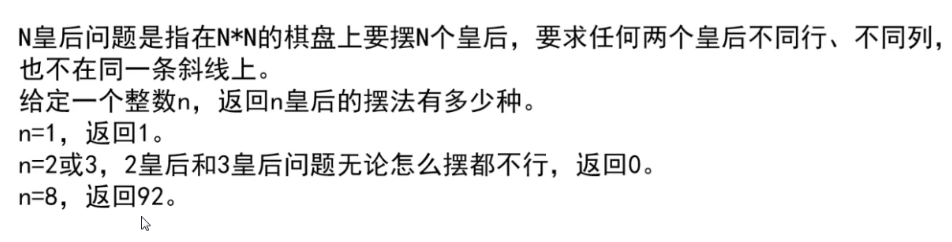

# 序言的基础知识

# 效率低下
我记录在手机上了。

# 首先锻炼编码能力和思维
Notice: 首先一个就是我的编码能力实在是太差了。 所以现在我是准备开始先训练这个内容。

**两数之和**这个题目：
主要是哈希表的使用； 很久没用go我都把这个东西忘记了。 暂时没有别的要注意的。

**罗马数字转整数**这个题目：
这个题目花了我很长的时间： 一个是涉及到arri和arri+1这种东西的时候越界总是处理不好： 那下次我就学习别人的用fori=1这种方式来处理；
剩余就是调试没弄好，对整个算法的流程不熟悉... 那下次最好画好程序框图

**删除有序数组中的重复项**这个题目
首先，这个是标准的链表的题目了。
第二： 程序框图是真几把好用啊啊啊啊啊啊啊啊啊啊啊！！！！！！！
不过程序框图只能理清写代码时候的思路，似乎并不能对算法本身产生帮助。

**将一维数组转变成二维数组**这个问题
程序框图好用的。
然后就是在数组相关的题目，使用切片的时候，要用到append，所以make的时候一定要记得设置len的值为0！！！

这个是在用递归的时候，函数需要可以访问到结果数组，Java因为有成员变量所以很好搞，但是go语言要么用闭包，但是代码会非常的丑；要么做成全局变量，但是每次需要重置这个全局变量；


# 链表
主要是要考虑这么几个点：
大部分的链表题，解法思路都相对简单，**双指针**占一半以上；
链表常见的失误就是： 
1. 没有考虑节点为 null 导致空指针异常。
1. 容易出现节点位置定位出错，比如往前多走了一步，或者少走了一步。

通常需要弄一个辅助的头结点，作为链表题的解题模板；
然后就是遍历链表的时候要注意是不是**多走了一步或者少走了一步这种**；

因为链表的题目都不能算难题，所以这种通常是用来**考查代码能力**的。（学习新语言的时候就拿链表练手，但是rust和cpp除外）

## 链表技巧：巧用双指针
双指针在做链表的题目的时候特别有用：“判断单链表是否有环”、“如何一次遍历就找到链表中间位置节点”、“单链表中倒数第 k 个节点”等问题。
个人觉得这些都是利用一个**双指针的距离之间的关系**。
对于第一个： 设置1倍速指针和2倍速指针，如果有环，则会重合；
对于第二个：快慢指针，快指针遍历完毕，慢指针找到中点。
对于第三个：先让快指针移动k个单位，这样她们之间的距离就是k，那么快指针遍历完毕的时候，慢指针就找到位置了。

四个例题，都不难；
但是做这种题目的时候每次都需要话不少的时间；

## 链表技巧：反向遍历链表的时候递归和栈的选择
也有不少的题目要反向遍历链表，此时使用递归或者栈是优雅的选择；

## 题目
**两个链表相交的第一个节点**这个题目
这个题目我居然没有想第一种思路来...第一种思路是： 得到两个链表的长度L1和L2，然后长的链表移动他们距离差值个位置，之后在同时遍历就可以找到那个结点。
第二种优雅的办法是： 双指针同时遍历，如果一个走完了就走另一个链表，这样他们总会相遇；然后这个相遇的值，思路应该就是上面这种（双方都走一遍对方的就相当于相等了）。

有程序框图的时候写起来代码确实舒服多了。

**删除链表结点**这个题目
不过流程框图虽然写代码方便了，但是画图的这个过程太麻烦了，做一个简单的题目要划掉我20分钟的时间...
设置虚拟头结点的时候需要弄成go语言的取地址符号&，不然会报错
然后思考代码的时候仍然会忽略许多的细节，所以考虑先整理大的思路，然后再慢慢写代码； 程序框图不要弄得非常好，只起到辅助作用，不然会浪费时间；


链表还有两个大厂的真题，不过我暂时没做...


# 动态规划
## Notice
这个应该放到二叉树的后面...

## 动态规划模板
动态规划就像是数学里面的数学归纳法。 时间复杂度因为有历史记录的原因所以不复杂。
核心就是挖掘dp这个参数的具体含义，还有找出初始值。 思路不是很难， 但是考的也比较杂，题目可能会相当的难。


## 题目
**最长不含重复字符的子字符串**
这个字符串的题目可以和dp联系在一起...
但是核心的是dp关系式： 用了一个哈希表来存储已经不重复的子串的序列，然后用于判断。


# 二叉树
高频题。考查一个最基本的抽象能力。
两个基本能力很重要： 递归和回溯。
重点学习回溯：

## 回溯
回溯的本质就**枚举**。 把一个个的枚举结果套进去，然后看是不是答案的解；如果不是**再去其他路径上看**；
倒不如说这个本质我是很清楚的，一直困扰我的是怎么移动到其他路径上去这个问题；这个代码能力不强；

**回溯的通用解题套路**
1. 把问题分解成多个阶段：每个阶段都对应着一个解；随机选择一个解，然后进入下一个阶段；下一个阶段同理；
2. 每个阶段选中的解都放入一个 「已选解集合」 中，并且要判断 「已选解集合」是否满足问题的条件（base case）,有两种情况：符合条件，则把结果放入到结果集中；不符合条件，回溯换个解再遍历； 对应的js的伪代码是这个样子：

```js
function backtrace(已选解集合,每个阶段可选解) {
    if (已选解集合满足条件) {
        结果集.add(已选解集合);
        return;
    }

    // 遍历每个阶段的可选解集合
    for (可选解 in 每个阶段的可选解) {

        // 选择此阶段其中一个解,将其加入到已选解集合中
        已选解集合.add(可选解)

        // 进入下一个阶段
        backtrace(已选解集合,下个阶段可选的空间解)

        // 「回溯」换个解再遍历
        已选解集合.remove(可选解)

    }
}

```


它的本质就是一种深度优先遍历；
它一般解决的是树形问题（问题分解成多个阶段，每个阶段有多个解，这样就构成了一颗树），所以判断问题是否可以用回溯算法的**关键在于它是否可以转成一个树形问题**。
并且回溯法一般可以优化：如果能缩小每个阶段的可选解，就能让问题的搜索规模都缩小，这种就叫「剪枝」；

**回溯的基本套路**
综上，我们可以得出回溯算法的基本套路如下：

1. 将问题分成多个阶段，每个阶段都有多个不同的解，这样就将问题转化成了树形问题，这一步是问题的关键！如果能将问题转成树形问题，其实就成功了一半，需要注意的是树形问题要明确终止条件，这样可以在 DFS 的过程中及时终止遍历，达到剪枝的效果
2. 套用上述回溯算法的解题模板，进行深度优先遍历，直到找到问题的解。

go语言的回溯题目模板
```go
// 设置结果集
result = []
// 回溯用的函数：
// 1. 判断当前的路径是否满足base case，满足退出，否则
func backtrack(路径，选择列表) {
	if 满足结束条件 {
		result.add(路径)
	}
	return

	for 选择 range 选择列表 {
		做选择
		backtrack(路径，选择列表)
		撤销选择
	}
}
```

```java
// 比如说一个全排列问题
public class Solution {
    /**
     * 结果集
     */
    private static List<String> RESULT = new ArrayList<>(10);

    /**
     * 参与全排列的数字
     */
    private static List<Integer> NUMS = Arrays.asList(1, 2, 3);

    /**
     * 遍历当前阶段的解
     * @param selectedNums   已选解集合
     * @param selectableNums 可选的解集合
     */
    public static void permutation(List<Integer> selectedNums, List<Integer> selectableNums {

        // 满足条件，加入结果集
        if (selectedNums.size() == NUMS.size()) {
            RESULT.add(Arrays.toString(selectedNums.toArray()));
            return;
        }

        // 遍历每个阶段的可选解集合
        for (int i = 0; i < selectableNums.size(); i++) {
            Integer num = selectableNums.get(i);

            // 去除不符合条件的解，减枝
            if (selectedNums.contains(num)) {
                continue;
            }

            // 选择当前阶段其中一个解
            selectedNums.add(num);

            // 选完之后再进入下个阶段遍历
            permutation(selectedNums, selectableNums);

            // 回溯,换一个解继续遍历
            selectedNums.remove(num);
        }
    }

    public static void main(String[] args) {
        List<Integer> selectedNums = new ArrayList<>();
        permutation(selectedNums, NUMS);
        System.out.println(Arrays.toString(RESULT.toArray()));
    }
}

```

## 二叉树

### 宽度优先遍历 

视频：5. 二叉树 01：46：11

### 判断完全二叉树

1. 核心思路：采用**宽度优先**遍历。两个判断标准，（1）树中有结点**左空右不空**，一定**不是**；（2）在条件（1）满足的情况下，如果某个节点的孩子**结点未满**（左不空右空、双空），那么他的**后序结点必须是*叶子结点***（这里应该要加一个标志位判断一下了），否则不是。
2. 过程：

   1. 宽度优先遍历。为了减少思考的复杂度还是用以前的入队列方法。
   2. 结点出队列时，分别检查条件一和条件二，直到队列为空。


### 搜索二叉树

- 所有的子树都是搜索二叉树，且左树的最大值小于结点的val，右树的最小值大于结点的val。


### 平衡二叉树

1. 所有的子树都是平衡二叉树，且左树与右树的高度差不超过1.
2. 很明显的递归可解。
3. 三个条件判断是否为平衡二叉树：一句话概括：结点的子树需要提供：是否平衡和高度两个信息。

    - 左树平衡二叉树

    - 右树平衡二叉树

    - 子树高度差不超过1


### 二叉树问题的解题技巧

- 递归和黑盒思想：向左树要信息和右树要信息的递归构思，然后再整体判断的问题，可以这样求解。


### 子节点最近的公共祖先

1. 思路
   1. 借助HashMap记录所有结点的父节点，方便回溯，根节点的father为自己。
   2. 使用让cur = o1，新建一个HashSet，记录孩子结点向上回溯直到根节点的情况，放入set中，结束条件cur = map.getKey(cur)。
   3. o2也这样，并检查o1的set，相等返回，总会到根节点的。
2. 方法二：

```java
class Solution {
    public TreeNode lowestCommonAncestor(TreeNode root, TreeNode p, TreeNode q) {
        if(root == null || p == root || q == root){
            return root;
        }
        TreeNode left = lowestCommonAncestor(root.left, p, q);
                TreeNode right = lowestCommonAncestor(root.right, p, q);

                if(left != null && right != null){
                    return root;
                }
                return left != null ? left : right;

    }
}
```

## 图相关

### 推荐的通用图的模板
图本质上就是**点集合**和**边集合**的组合。
因此图的构成就是两个集合：HashMap Nodes 和  HashSet edges。

点的定义应该为自身的值，入度数和出度数，以及相邻的点以及相对应的边。
边的定义则为权值以及记录的两端的点到底是谁。

类定义代码：
```java
public class Edge {
    public int weight;
    public Node from;
    public Node to;

    public Edge(int weight, Node from, Node to) {
        this.weight = weight;
        this.from = from;
        this.to = to;
    }
}

public class Node {
    public int value;
    public int in;
    public int out;

    public ArrayList<Node> nexts;
    public ArrayList<Edge> edges;

    public Node(int value) {
        this.value = value;
        in = 0;
        out = 0;
        nexts = new ArrayList<>();
        edges = new ArrayList<>();
    }
}
public class Graph {
    HashMap<Integer, Node> nodes;
    HashSet<Edge> edges;

    public Graph() {
        nodes = new HashMap<>();
        edges = new HashSet<>();
    }
}

```


### 宽度优先：加入了检查去重的机制，由Set保证

```java
/**
 * @author : [47140]
 */
public class BFSDemo {
    /**
     * 宽度优先遍历
     *
     * @param head 传入的头结点
     */
    public static void bfs(Node head) {
        if (head == null) {
            return;
        }
        HashSet<Node> set = new HashSet<>();
        Queue<Node> queue = new LinkedList<>();
        set.add(head);
        queue.add(head);

        while (!queue.isEmpty()) {
            Node cur = queue.poll();
            System.out.print(cur.value + " ");
            for (Node next :
                    cur.nexts) {
                if (!set.contains(next)) {
                    set.add(next);
                    queue.add(next);
                }
            }
        }
    }
}

```

### 广度优先：使用了栈，set未注册时需要把cur重新压入栈中；break的作用是：根据广度优先的准则，先去遍历next的邻居，停止内循环

```java
public static void dfs(Node head){
        if (head == null) {
            return;
        }
        HashSet<Node> set = new HashSet<>();
        Stack<Node> stack = new Stack<>();
        set.add(head);
        stack.add(head);
        System.out.print(head.value + " ");

        //遍历，入栈时进行业务，next未注册停止循环，深度优先
        while (!stack.isEmpty()){
            Node cur = stack.pop();
            for (Node next:
                 cur.nexts) {
                if (!set.contains(next)) {
                    stack.push(cur);
                    stack.push(next);
                    set.add(next);
                    System.out.println(next.value);
                    break;
                }
            }
        }
    }
```


### 拓扑排序

视频：前缀树和贪心算法 01：00：52

1. 概念：根据无环图来安排正确的结点顺序

2. 思路：

   1. 找到入度为0的结点，它是开始之点。随后去除该节点的影响。找到下一个入度为0的结点。
   2. 依次这样做，拓扑排序就算完成。 

3. 算法的过程：

   1. 新建集合Map和队列Queue，用来存储抽象的信息
   2. Map用来存储结点和它入度的信息，Queue特别地记录入度对应为0的结点的信息
   3. 将图中的点集进行遍历，在map中进行注册。特别地，如果in == 0，则额外将他加入到zeroInQueue中。
   4. 完成上面的步骤后，我们用数据结构记录了所有结点的入度信息，以及第一批入度为0的结点的信息。开始进行拓扑排序：
   5. 拓扑排序的核心思想是：擦除zeroIn结点的影响，并将它加入到结果集合result中，完成后将其返回。
   6. 擦除：使用循环遍历所有zeroIn的next，使其在map中的数值--，并且如果为0了，则将其加入到zeroIn结点集合中。需要进行下一次循环。知道zeroInQueue为空，结束。返回result。

   代码

   ```java
       /**
        * 拓扑排序
        * @param graph 传入的图
        * @return 拓扑排序序列
        */
       public static List<Node> sortedTopology(Graph graph){
           HashMap<Node, Integer> inMap = new HashMap<>();
           Queue<Node> zeroInQueue = new LinkedList<>();
   //所有的结点都在inMap中进行注册
           for (Node node:
                graph.nodes.values()) {
               inMap.put(node, node.in);
               // 第一批
               if (node.in == 0){
                   zeroInQueue.add(node);
               }
           }
           //开始拓扑排序
           List<Node> result = new ArrayList<>();
           while (!zeroInQueue.isEmpty()){
               Node cur = zeroInQueue.poll();
               result.add(cur);
               for (Node next:
                    cur.nexts) {
                   inMap.put(next, inMap.get(next) - 1);
                   if (inMap.get(next) == 0){
                       zeroInQueue.add(next);
                   }
               }
           }
           return result;
       }
   ```


### Kruskal算法和Prim算法：生成最小生成树

要求无向图

最小生成树：结点相互连通并且权值和是所有方案中最少的。


#### K算法：核心：从权值最小的边开始考虑，如果没有结点间不成环，加入结果集中；遍历完整个edges。

汗-_-|| 开始是之前离散数学学过的东西了...

如何看有没有环？

	1. 各个结点，独自组成一个集合。每次加入一条边，看看边的from和to在不在这个集合里面，不在则说明不成环。把边添加进结果集里，并合并结点的集合。
	2. 重复这个步骤。


#### P算法


核心：以点作为基点在图内进行扩散。已经扩散到的点的边中寻找权值最小且不重复的边。

过程：从一个点开始（任意一个点），将它相关的边都加入到小根堆中去，然后从


### 迪杰斯特拉算法（单元最短路径算法）
从指定结点出发，到达规定路径的最短路线。
用于计算权值非负数的图中最短路径的算法。
图中不能有累加和为负数的环（否则无意义）

#### 思路
#### 原版的遍历算法
#### 使用堆进行加速 
坐标：补充视频 00：02：30
为什么能加速？因为原版采用的是遍历的过程，而采用小根堆可以有效的降低时间复杂度。

改进后的dijkstra算法
从head出发，所有head能到达的结点，生成的最小路径记录返回。
##### 主方法思路：
1. 生成一个Hash Map的小根堆结构（自定义），存放head所有可到达的结点的最小路径信息。
2. 这里自定义了一个成员方法addOrUpdateOrIgnore来增加更新或者忽略结点的最小路径值，这里传入了head（开始结点自身）和固定数值0。
遍历小根堆中的所有数据。
3. 在循环中重复这样的步骤：弹出小根堆的堆顶，它的数据因为已经为最小路径所以**不再变化**；并且更新这个节点的邻接点的相关数据为**中间结点的最小路径**加上权值。并把cur（小根堆顶部元素）加入结果集中。
4. 循环结束后所有到结点的最小路径都已经放到了结果集中，返回结果集。


## 前缀树

关键词：题目中出现**前缀**


- 主讲的是一种最常见的前缀树，也就是俗称的**字典树**（nexts集合里面只有26个字母）。
- 树的结点包含两个重要的信息：
  1. pass表示该节点被几个字符串使用过；
  2. end表示该字符被几个字符串作为结尾。
- 结点的数据结构：pass、end和nexts集合。初始化pass和end为0，还有给nexts分配空间。

- 代码

```java
class TrieNode {
    int pass;
    int end;
    TrieNode[] nexts;

    public TrieNode() {
        pass = 0;
        end = 0;
        nexts = new TrieNode[26];
    }
}
```

- 前缀树Trie本身
  - 初始化根节点结点
  - **插入**一个新字符串时将其转换为字符数组，然后在树上遍历，不存在结点时创建一个，每次pass数值递增。
  - 遍历完成后end增加。
  - 搜索算法和插入很类似，直接返回即可。


## 贪心算法

### 分割金条问题

视频 暴力递归 01：55：28

- 哈弗曼编码的问题。

过程：将数组排列成小根堆（优先队列），每次弹出两个数的和重新插入小根堆。

代码

```java
public class 分金条 {
    public static int lessMoney(int[] quest){
        PriorityQueue<Integer> pQ = new PriorityQueue<>();
        for (int i = 0; i < quest.length; i++) {
            pQ.add(quest[i]);
        }
        int sum = 0;
        int cur = 0;
        while (pQ.size() > 1){
            cur = pQ.poll() + pQ.poll();
            sum += cur;
            pQ.add(cur);
        }
        return sum;
    }
}

```


### 项目利润问题


- 核心：堆

- 思路：你不是要利润最大吗？然后我还有初始资金。那么先把项目**按cost排进小根堆里**，那么先出来的就是花费小的，能够做的。这个小根堆就是待解锁的项目。你去里面找你能做得起的项目。然后把这些你能做的项目，**按照profit进一个大根堆**，此时你要找的就是利润最高的，就是这样一个弹性策略。

代码：

```java
public class 项目利润问题 {
    public static int fun(int k, int m, int[] costs, int[] profits) {
        PriorityQueue<Project> locked = new PriorityQueue<>(new minComparator());
        PriorityQueue<Project> unlock = new PriorityQueue<>(new maxComparator());
        //所有项目被扔到小根堆中
        for (int i = 0; i < profits.length; i++) {
            locked.add(new Project(costs[i], profits[i]));
        }
            //当还有未解锁的项目且能够执行
        for (int i = 0; i < k; i++) {
            while (!locked.isEmpty() && locked.peek().cost <= m) {
                //那就把他们加入大根堆中去
                unlock.add(locked.poll());
            }
            //当解锁项目为空时
            if (unlock.isEmpty()) {
                return m;
            }
            m += unlock.poll().profit;
        }
        return m;
    }

    public static class minComparator implements Comparator<Project> {
        @Override
        public int compare(Project o1, Project o2) {
            return o1.cost - o2.cost;
        }
    }

    public static class maxComparator implements Comparator<Project> {
        @Override
        public int compare(Project o1, Project o2) {
            return o2.profit - o1.profit;
        }
    }
}

class Project {
    int cost;
    int profit;

    public Project(int cost, int profit) {
        this.cost = cost;
        this.profit = profit;
    }
}

```

### 随时取得中位数

视频：暴力递归 02：16：45

- 和贪心无关，是一个堆的实际运用。
- 利用根堆的性质，维持整个数据规模的中位数由堆顶得到。
- Java中的集合类库自带根堆（优先队列），因此代码量很少。

### N皇后问题

视频：暴力递归 02：28：02




## 暴力递归
### 特点
暴力递归是一种算法思想。本质就是嗯试。
特征就是：
1.  把问题转换为规模缩小的，同类型的问题的子问题
1. 有明确的不需要继续递归的条件(base case)
1. 得到子问题的结果后的决策过程（怎么利用子问题的结果）
1. 不记录每一个子问题的解

这是**动态规划的基础**。


### 汉诺塔问题
**问题描述**

n个盘从起始塔from移动到目标塔to上，权重大的盘子不能放在权重小的盘子上。

求移动的过程。

**思路**

本质上是一个这样的过程，一共三步。

1. 1 ~ N-1的盘子要到other上。
2. N移动到to上。
3. 想办法将1 ~ N-1移动到to上。

那么如果用程序（伪代码）来模拟这个过程：

void p(index, from, to, other) 方法能够将1到index的盘子从from移动到to上去。

1. void p (n-1, from,other, to); 1 ~ N-1的盘子要到other上。
2. 将n移动到to上。 打印这个过程即可。
3. void p (n-1, other, to, from); 这实际上就成功把一个问题分解成子问题了。

 

p方法的代码：

```java
/**
     * 子问题分解的方法p
     * @param i 第几个移动盘的过程
     * @param from 起始盘
     * @param to 目标盘
     * @param other 另外一个盘
     */
    public static void func(int i, String from, String to, String other) {
        if (i == 1) { //base case 结束条件
            System.out.println("移动" + i + "从" + from + "到" + to + "去");
        } else{
            func(i-1, from, other, to);
            System.out.println("移动" + i + "从" + from + "到" + to + "去");
            func(i-1, other, to, from);
        }
    }

```

### 穷举字符串的子串
描述：给定一个字符串，求所有的子串（包括空）。
他妈的当我的脑袋是假的啊！

### 求字符串的所有排列


## 动态规划
...
### 01背包问题
没有接触过动态规划的话, 会习惯性地去用贪心算法去解决这个问题.
但是不行. 这就是01背包的一个核心要素: 因为只能将物品的整体放入背包, 物品的价值也跟背包的空间容量有关系.
CSDN:
```
    对于0-1背包问题，贪心选择不能得到最优解是因为：这种情况下，不能保证背包装满，部分闲置的背包空间使每kg背包空间的价值降低了。而实际上，考虑0-1背包问题时，应该比较选择该物品和不选择该物品所导致的最终方案，再做比较。由此会导出很多相互重叠的子问题，这正是用动态规划求解的一个重要特征。
```

求**最大最小**很有可能就是动态规划问题.


# 回溯
大部分暴力算法的类型都是回溯，所以掌握回溯可以帮你拿到一部分分数。

基于帅地的[漫画图解](https://mp.weixin.qq.com/s?__biz=MzIxMjE5MTE1Nw==&mid=2653197523&idx=1&sn=4edecca7392534177eef521511ff740b&chksm=8c99e609bbee6f1fdb736f1bc45da5f6b6765ce190db68eac5a65ca22cc2694dc151f8db828f&scene=21#wechat_redirect)
不管那些。 现在来看图的深度优先遍历和广度优先遍历。
这么理解： 如果树的遍历就是三种顺序的遍历和层次遍历的话；

那对于图来说就只有两种遍历：
一种只要找到结点就遍历到死，这种称谓深度优先； 其实二叉树的三种顺序的遍历本质上就是深度优先。
广度优先就是先把所有相邻的遍历完就差不多可以了。

实现深度优先的核心是 【回溯】； 
广度优先的则是【重放】； 

要想实现回溯，核心的数据结构是栈，递归也是基于栈实现的；

然后已经你需要知道已经遍历过的结点， 这样利用一个临时栈就可以遍历完毕所有的结点了。

重放就是，在一个结点的邻居全部遍历一遍之后，你就需要找邻居的邻居了，这样就是【重放】的具体含义。

这么一看重放可以说是和回溯相反的过程。 
利用队列可以实现重放。

一个结点所有的邻居都遍历完毕之后，就出队列，就是这样一个逻辑。

是的。 这个只是遍历方式的区别。 需要知道哪些结点是已经遍历过的。 一个容易理解的思路是使用一个额外的布尔数组来记录结点是否有访问过。

代码不好拷贝。 那就算了。 大概的思路我知道了。 不恋战。


