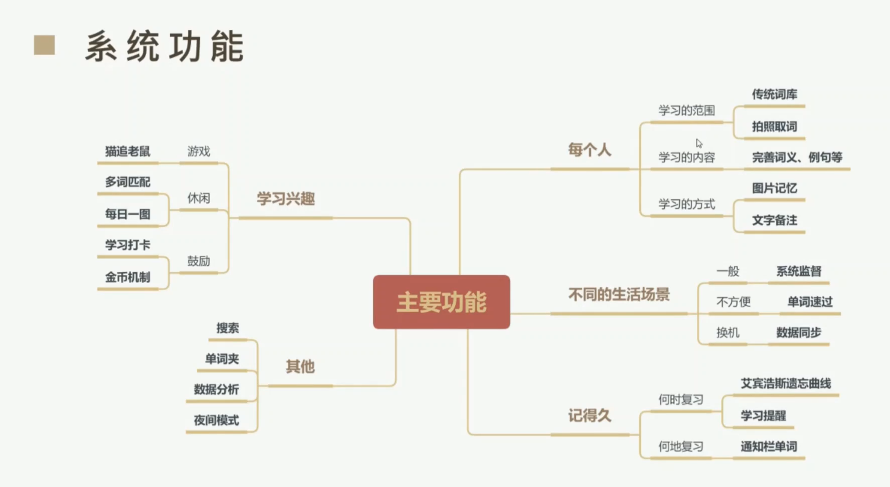

# 功能(需求)


# 源码分析
从类开始：
## BaseActivity：
这是一个抽象类，是用来提取公有功能的代码复用以及实现统一管理的。
继承了BaseActivity的A都拥有他的方法，并由一个集合进行统一管理。
欢迎页面的组成部分大概是背景图、中文、英文
中文是硬编码、英语用的api
里面还有很多工具方法，所以就不分析了。

## WelcomeActivity：
因为软件一开始会显示一个欢迎页面，因此这个软件的意图过滤器设置的WelcomeActivity为启动页面。别担心，MainActivity会出现的。
这个代码的分析我都写在代码里面了。
只需要明白这个A是干什么的并且它会怎么导航即可。
会根据你是否登录以及是否选择单词书来跳转到相关的页面。
用户完成这些后就会跳转到MainActivity中。

## MainActivity：
创建时：onCreate()流程：
执行init()进行初始化，
根据一个needFresh来判断是否执行一段动画。
最后初始化Fragment：initFragment()

三个封装方法的解析我都写在代码里面了。

Main就是APP三个主题功能Fragment的容器，里面只有一些初始化和处理Fragment切换的方法。
功能主要是靠Fragment实现的。

index包下面的三个就是三个用于切换的Fragment。
布局fragment_word.xml
整个就是如你所见的各种布局的组合。其实相当好看了。
总体的容器使用的是相对布局。

fragment内部的切换随记单词的方法setRandomWord()：
1. 传入书的ID，返回单词的个数int。
1. 通过random得到一个符合要求的wordId
1. 数据库查询得到 Word
1. 数据库查到 interpretation (解释)
1. 组合成字符串, 并更新UI.

fragment_word 中 的点击行为
一下复制于 我写在代码里面的注释
```java
            // 如果点击刷新按钮
            case R.id.img_refresh:
                // 刷新按钮的旋转动画
                // 这个跟我之前在B站上看的音乐播放的旋转特效是一样的。
                // 这只是个动画，不是核心功能

                // 也是一个刷新动画, 不清楚具体功能
                imgRefresh.startAnimation(animation);
                break;
                // 开始背单词的按钮, 点击会跳转到对应的页面去
            // 跳转到 LoadWordActivity(一个很美观的加载页面) 去
            case R.id.text_main_start:
                if (isOnClick) {
                    Intent mIntent = new Intent(getActivity(), LoadWordActivity.class);
                    // 以下的 flag的设置跟 android的启动机制有关, 暂时先不要花时间去弄这个
                    mIntent.setFlags(Intent.FLAG_ACTIVITY_NEW_TASK);
                    // 设置了一个转场的动画, 好吧我是没有看出来
                    startActivity(mIntent, ActivityOptions.makeSceneTransitionAnimation(getActivity()).toBundle());
                    // 原作者这样写的意思我还没搞清楚, 不过这里 将inOnClick 置为false 会导致如果 进入 背单词的A后用 back键立刻退出时,
                    // "开始背单词按钮会无法点击"
                    isOnClick = false;
                }

                // 这个按钮是 右上角的那个 flag一样的 显示当前日期的玩意
            // 实际点击的话是 类似欢迎页面的东西
            // 代码没有多长, 都是交给对应的 Activity来处理的
            case R.id.img_top_flag:
                // 单词的意思 区域, 设置的这个地方的点击事件啊
            case R.id.text_main_show_word_mean:
                // 引用传递给 WordDetailActivity的一个 static 成员.
                // 并准备跳转 对应的Activity
                WordDetailActivity.wordId = currentRandomId;

                // 右下角的搜索按钮, 挺明显的
            case R.id.card_main_search:
                // SearchActivity... 作者大大你是真的有心了 UI下的功夫很足
                // 和我前面写的注释差不多
                Intent intent2 = new Intent(getActivity(), SearchActivity.class);

              // 单词夹按钮
            // 同理
            case R.id.layout_main_words:
                Intent intent3 = new Intent(getActivity(), WordFolderActivity.class);

```

fragment_word 大概就结束了...

第二个Fragment: FragmentReview
UI的xml 我看了一下 design的标签, UI其实是死代码, 不过就是比死吗营销号的强上114514倍.

实际上 这个Fragment就是一个导航页面, 基本上所有的点击时间都是 Intent的跳转...

代码我过了一遍流程, 基本写成注释了

FragmentReview 大概就结束了...

FragmentMe的功能应该也差不多... 那么我暂时先不看了

现在回过头来... 大部分的Activity都是实际功能的代码了, 基本与架构无关

+ [ ] 我现在的问题大概是, 数据库的数据来源了...